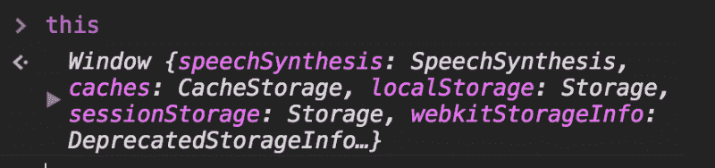
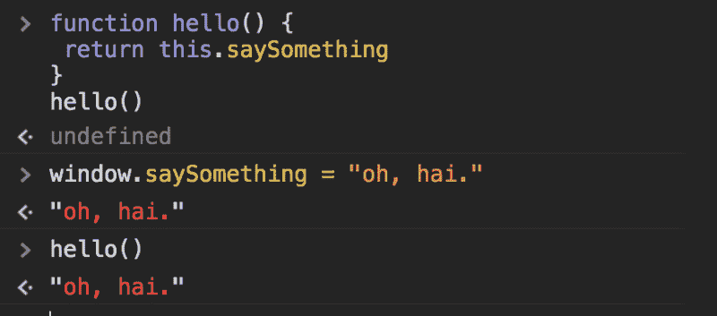
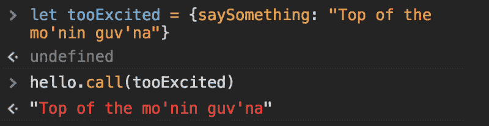
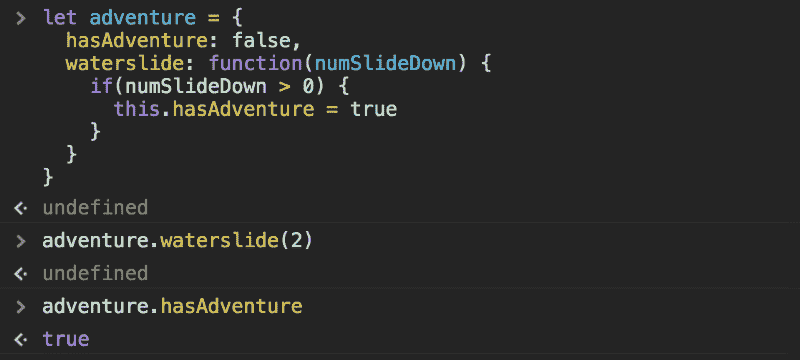
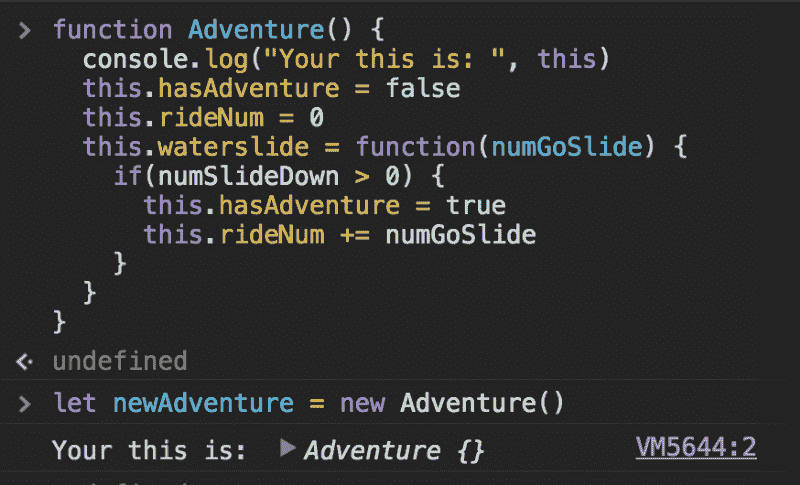
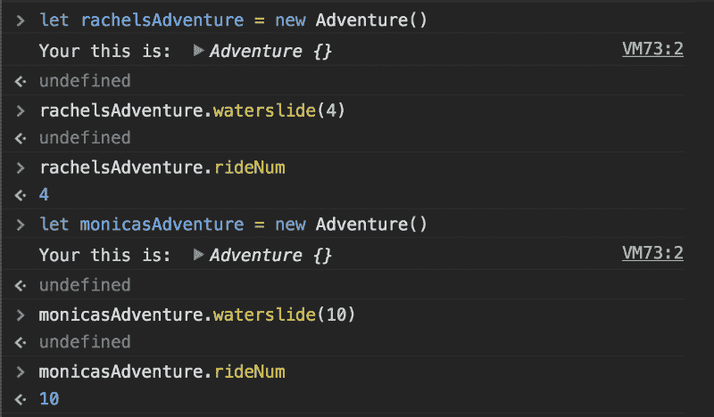
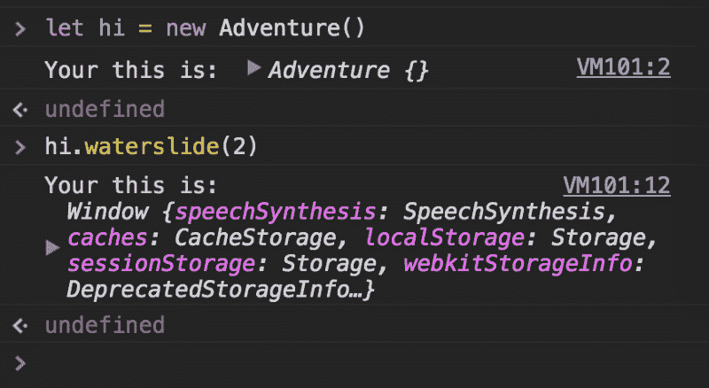
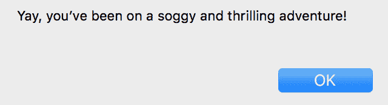

# Javascript 中的“this”关键字

> 原文:[https://dev.to/rachelralston/the-this-keyword-in-javascript](https://dev.to/rachelralston/the-this-keyword-in-javascript)

Javascript 中的关键字`this`一开始可能有点难以理解。

> TL；DR 当你在全局上下文中引用`this`时，指的是全局变量(在浏览器中是`Window`)。当你创建一个`new`对象时用`this`指代该对象的作用域。

### 这是做什么的？

当你在文档的根上调用它时，它指的是文档的根对象，在我们的浏览器中`this`指的是`Window`。

[T2】](https://res.cloudinary.com/practicaldev/image/fetch/s--Nv_Lw3Mt--/c_limit%2Cf_auto%2Cfl_progressive%2Cq_auto%2Cw_880/https://cdn-images-1.medium.com/max/800/1%2AkzOiTYdPaV7pWhw5Noiy0Q.png)

因此，如果我们创建一个函数并在全局范围内添加一个变量，那么我们可以使用`this`调用它

[T2】](https://res.cloudinary.com/practicaldev/image/fetch/s--NHcNDBU_--/c_limit%2Cf_auto%2Cfl_progressive%2Cq_auto%2Cw_880/https://cdn-images-1.medium.com/max/800/1%2A6LfsfamPpAvst0bC-EI8-Q.png)

起初`hello()`返回 undefined，因为`saySomething`在`window`上是未定义的，但是一旦`saySomething`被定义，我们就会得到一个合适的问候。

那么，如果我们希望它引用全局范围之外的内容，我们该怎么做呢？

我们的第一种方法是使用`call`或`apply`来指定范围。

[T2】](https://res.cloudinary.com/practicaldev/image/fetch/s--vnwv-K2y--/c_limit%2Cf_auto%2Cfl_progressive%2Cq_auto%2Cw_880/https://cdn-images-1.medium.com/max/800/1%2A0WowWN0ItvawtyVF2dq5ww.png)

### 此在物

现在让我们换一种方式试试。让我们看看当我们在一个被设置为对象属性的函数中使用`this`时会发生什么。在这种情况下，`this`将引用`adventure`对象的局部范围。

[T2】](https://res.cloudinary.com/practicaldev/image/fetch/s--3xUUuOn_--/c_limit%2Cf_auto%2Cfl_progressive%2Cq_auto%2Cw_880/https://cdn-images-1.medium.com/max/800/1%2AYdOlUzhOgCHzydwzyPX8tg.png)

在上面的例子中，我们用一个对象文字创建了这个例子，但是当我们用一个构造函数包装这个例子时会发生什么呢？当我们用关键字`new`实例化它时，会创建一个空对象，`this`将引用该上下文。

[T2】](https://res.cloudinary.com/practicaldev/image/fetch/s--TCqIqBhO--/c_limit%2Cf_auto%2Cfl_progressive%2Cq_auto%2Cw_880/https://cdn-images-1.medium.com/max/800/1%2AZMbSP6XlHFQiX8yiXeSAGQ.png)

你可以实例化我们的 Adventure 类的多个版本，这将涉及每个实例的本地范围。

[T2】](https://res.cloudinary.com/practicaldev/image/fetch/s--M2hWcMPa--/c_limit%2Cf_auto%2Cfl_progressive%2Cq_auto%2Cw_880/https://cdn-images-1.medium.com/max/800/1%2AMgD039CPKwYPVLoBneJLDw.png)

### 用“这个”变得棘手

到目前为止，跟随“this”的上下文已经足够简单了，但是这就是开始变得棘手的地方。举下面这个例子:

```
function Adventure() {
  console.log("Your this is: ", this)
  this.hasAdventure = false
  this.waterslide = function(numGoSlide) {
    if(numGoSlide > 0) {
    this.hasAdventure = true
    celebrate()
    }
  }
}
function celebrate() { 
  console.log("Your this is: ", this)
  if(this.hasAdventure) {
    alert("Yay, you've been on a soggy and thrilling adventure!")
  }
} 
```

<svg width="20px" height="20px" viewBox="0 0 24 24" class="highlight-action crayons-icon highlight-action--fullscreen-on"><title>Enter fullscreen mode</title></svg> <svg width="20px" height="20px" viewBox="0 0 24 24" class="highlight-action crayons-icon highlight-action--fullscreen-off"><title>Exit fullscreen mode</title></svg>

您可能认为我们会在这里得到警报，但是当运行时，我们什么也没有得到。原因是`celebrate()`是在全局范围上定义的，所以它的`this`指的是全局范围。我们可以看到，当我们在控制台中运行时，我们指的是全局范围，全局范围没有属性`hasAdventure`，所以我们没有得到警告。

[T2】](https://res.cloudinary.com/practicaldev/image/fetch/s--2tpA97GP--/c_limit%2Cf_auto%2Cfl_progressive%2Cq_auto%2Cw_880/https://cdn-images-1.medium.com/max/800/1%2AAGB6eFhaoX3wPrcmbx7iSw.png)

为了解决这个难题，我们可以将`Adventure`的本地`this`传递给`celebrate`，并修改`celebrate`来接受一个参数。当我们更新`celebrate`来接受一个论点时，你不能使用保留字`this`，所以选择另一个变量来保留那个位置。

```
function Adventure() {
  console.log("Your this is: ", this)
  this.hasAdventure = false
  this.waterslide = function(numGoSlide) {
    if(numGoSlide > 0) {
    this.hasAdventure = true
    celebrate(this)
    }
  }
}
function celebrate(you) { 
  if(you.hasAdventure) {
    alert("Yay, you've been on a soggy and thrilling adventure!")
  }
} 
```

<svg width="20px" height="20px" viewBox="0 0 24 24" class="highlight-action crayons-icon highlight-action--fullscreen-on"><title>Enter fullscreen mode</title></svg> <svg width="20px" height="20px" viewBox="0 0 24 24" class="highlight-action crayons-icon highlight-action--fullscreen-off"><title>Exit fullscreen mode</title></svg>

现在，当我们调用函数时，我们得到了警告！

[T2】](https://res.cloudinary.com/practicaldev/image/fetch/s--6yl2N7DS--/c_limit%2Cf_auto%2Cfl_progressive%2Cq_auto%2Cw_880/https://cdn-images-1.medium.com/max/800/1%2ARfmCy7eQXtTOCzemfUCotg.png)

总之，这是一个强大的工具，可以帮助开发人员轻松地在特定的上下文中引用属性，但当通过不同级别的范围时会变得棘手。

祝你好运和成功。