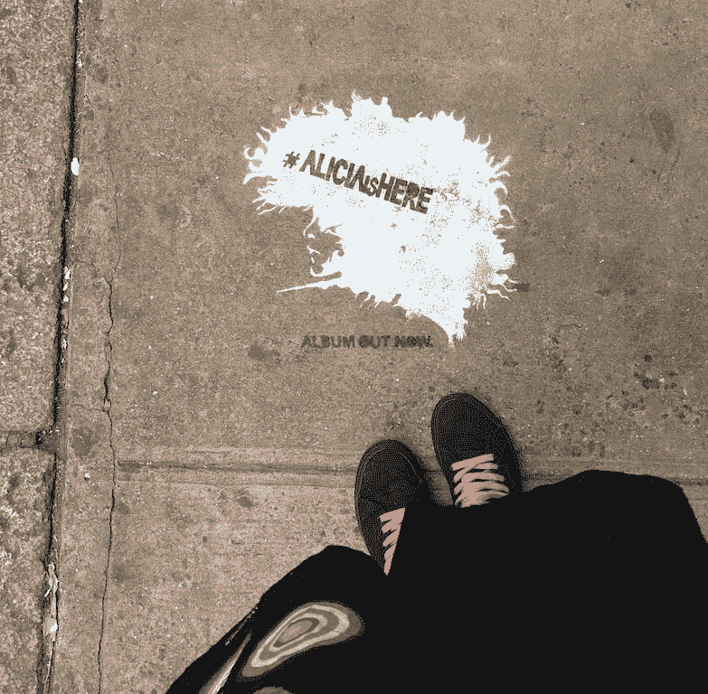

# 回归程序员；

> 原文：<https://dev.to/trueskawka/return-programmer>

*最初发布于 [trueskawka 的博客](https://trueskawka.github.io/blog/programming/rc/2017/01/31/return-programmer.html)。*

24 周前，我进入纽约的 Recurse 中心，不知道会发生什么。我只知道我能在网上找到的和我能从介绍性电子邮件中收集到的任何东西。我飞到了另一个大陆，因为我的直觉告诉我这是正确的，但我无法解释这个 T1 到底是什么。

## 期望

去年 3 月，当生活感觉不太像我希望的那样时，我心血来潮提交了我的 RC 申请。回答申请表上的两个核心问题非常简单:

### 两年后你想做什么？

> 我想和比我聪明的人一起工作，一起学习。我想拥有一份远程工作，这样我就可以旅行和工作了。
> 我想制造适合用户需求的产品。

### 为什么要参加 Recurse 中心？

> 我想开球，有一个新的开始。在过去的几年里，我一直是一名分析师/程序员/任何需要的人，我真的不知道自己想做什么。出国几个月，从零开始创造一些东西，听起来是一个好主意，最终开始成为一名全职程序员。

回想起来，我对自己被录取并不感到惊讶，尽管一个月后当我第一次收到录取邮件时，我感到震惊。(*我？那个连递归 FizzBuzz 都不会编码的人？上面的答案非常符合 RC 精神，尽管我不确定我能确定这是什么意思。*

## 人

递归中心主要是关于人的。这不仅仅是一个我们可以一直呆在一起(有时一呆就是几天)的地方，有 WiFi、豆袋和咖啡。一个共同工作的空间或一个新成立的办公室并不能很好地描述它。

想象一个地方，在那里你总能找到人聊天，问任何问题。当你花时间和某人在一起时，他们会完全投入到对话中，无论是帮助你在代码中找到一个相当简单的错别字，一起学习一个新的范例，深夜讨论，还是仅仅因为你需要而倾听。

在这个社区里，你几乎可以瞬间交到朋友。当然，并不是每个人都会成为你的闺蜜——毕竟，如果没有多样性，这将是一个非常无聊的社区。当你遇到和你有共鸣的人时，这就像是第一次约会——时间过得很快，因为你们最终会无话不谈。

每天检查和检查，以激发和讨论问题，共同建设项目和参加研讨会，早上冥想，团体观光和徒步旅行，街机游戏，饮料，卡拉 ok...这是一个大而活跃的社区，有适合每个人需求的东西。

## 空间

由于巨大的窗户和相当大的中央空间，光线充足。如果人们在讨论、吃午餐和享受彼此的陪伴时太吵，你可以躲在一些房间里。豆袋和咖啡杯随处可见，编程书籍也是如此。

RC 在同时容纳几十个人的空间和仍然温暖舒适之间有很好的平衡。有时候，人们不得不等待“完美”的地点来工作，或者确保他们足够早来拿大咖啡杯。有时，在社区活动期间，如演示或招聘会，它以一种友好的方式过度拥挤。

这始终是一个受欢迎的空间，尽管它在不断变化，并根据每一批新人的需求进行调整。它也总是开放的，所以它很容易适应每个人的时间表，无论是早起的鸟儿还是极端的夜猫子。

## 学习

作为一个成年人学习是困难的。此时此刻，一切似乎都比你的个人成长更重要。它不会给你立竿见影的效果，它需要大量的工作和奉献。很容易理解，有人想去旅行，或者只是想和朋友在外面度过一个美好的夜晚。但是，坐下来研究复杂的算法或学习德语语法并没有什么迷人或令人立即满足的地方。

RC 是自我激励和自定进度的。自由是压倒一切的。除了批次结束的模糊期限之外，没有任何限制。那里的每个人都想学习，这使学习变得更容易，但也极其困难——当别人在做更有趣的事情时，即使你每天都在工作，你怎么能感觉到自己成长了呢？

还有就是要对自己诚实。知道你什么时候迷路了，或者你选择的道路是错误的。告诉自己“我会努力的，尽管这可能会是一个错误”，并承认“我错了，因为我知道得不够多”。最重要的是，要让自己保持动力，并问自己“我能从中学到什么？”。毕竟，在你尝试之前，你通常不知道某件事是否是正确的。

去 RC，我想学所有的东西。我最终学到了我认为不需要的东西，这些东西通常不是我计划好的。

## 美国

这是我第一次来美国，我没想到会和欧洲有很大不同。毕竟我去过的地方，见过的东西。此外，每个人都知道美国文化——电影、音乐、无休止的美国广播。

然而，我可以看到我的方法发生了一些相当重大的变化，其中许多是由我的美国朋友引发或向他们学习的。

*   我不在乎别人怎么想，除非我在乎。在纽约漫步，你的长相或穿着并不重要，这是我一直以来都很在意的事情。我获得了关注重要关系的自由，而不是担心可能会发生什么。
*   我尝试过，失败过很多次。爬起来又失败了。感谢我最近从判断中获得的自由，我学会了在我相信有目的的时候去尝试。
*   我学会了更开放。微笑着上来和陌生人搭讪是新常态。对金钱开诚布公并期望自己的努力能得到合理的回报也是如此。
*   我挑战抱怨，尤其是我自己的散漫和消极。这种情况仍然比我希望的更经常发生，但每次我都变得更善于扭转局面，并专注于解决方案而不是问题。
*   我拥抱自己内心的内向和偏爱的工作时间。当我宁愿只是工作而不是与人交谈时，我不再为自己不是一个早起的人或过着不快乐的日子而感到内疚。

## 结论

在一个阳光明媚的周一早晨，我一进来，就因为搞混了一些组织上的小事而让自己陷入尴尬。然后我跑去买咖啡，试图藏起半个羊角面包和那种格格不入的强烈感觉。我害怕没人能听懂我的口音。我害怕我无法达到他们的编程水平，害怕在第一周结束时，有人会礼貌地请我回家，不再假装我属于他们。

我所有的缺点都受到了欢迎，并被鼓励去拥抱障碍，不管是真实的还是想象的。我倾向于谈论我在 RC 之前和之后的生活，因为这对我来说是一次变革性的经历。我知道如何根据我的需要来发展和调整它。我学到了一些东西，希望未来的我能记住。

*   时间和注意力是你能给予和接受的最有价值的资源。我们分享的越多，我们的世界就会越美好。
*   在一起有一个“哈哈”的时刻是最神奇的经历。只要有可能，试着成长或帮助成长。
*   尊重一切形式的进步。你的朋友完全做错了，学习 Python 而不是一头栽进 Haskell？你不认为没有计算机科学学位的人会成为优秀的程序员吗？让它去吧。
*   不要勉强自己。我强迫自己早上起床，适应别人的时间表。我强迫自己尝试我不喜欢做的事情。我强迫自己去做一些我公开说过会做的事情，尽管我很早就意识到这不会带来快乐。如果强迫自己，大概是时候改变什么了。
*   用自己的方式做事。我认为我需要做“适当的”结对编程，但我真正需要的是有人关心我做什么，并问我正确的问题。
*   不后悔。你会遇到很多人，会和他们一起工作，你不可能和他们所有人一起做一些事情。这没关系。

太累了，太棒了。纽约可能不是我想住的地方，但它绝对是我想不断回来的地方。

[T2】](https://res.cloudinary.com/practicaldev/image/fetch/s--MEihZD4z--/c_limit%2Cf_auto%2Cfl_progressive%2Cq_auto%2Cw_880/https://dl.dropboxusercontent.com/u/56085440/photos/return/nyc.jpg)