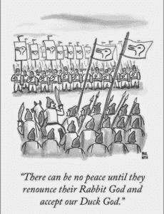

# ITWAMTSP:我想我们都在表达同一个观点

> 原文:[https://dev . to/code mouse 92/itwamtsp-I-think-are-all-making-the-same-point](https://dev.to/codemouse92/itwamtsp-i-think-were-all-making-the-same-point)

*原载于[不可磨灭的蓝色钢笔](http://www.indeliblebluepen.com/?p=832)T3】*

程序员对缩写词有一种奇怪的痴迷。我们和他们的对话变得尖酸刻薄，直到听起来像是在说外语，我不完全确定这是不是重点。

有两个相当讨厌的首字母缩写词，一旦在一般编程领域出现，将会引发一场激烈的辩论或一场全面的战争。

这些首字母缩略词是 *TMTOWTDI【有不止一种方法去做】*和 *TOOWTDI【只有一种方法去做】*。

多年来，我一直是 TMTOWTDI 的支持者，尽管我在 Perl 社区没有任何经验，这个缩写就是从 Perl 社区来的。这对我来说是合乎逻辑的，特别是考虑到我的立场，即[编程是一门艺术，而不是科学](http://www.indeliblebluepen.com/?p=763)。我只是顺便拿起这个首字母缩写词，发现它很好地诠释了我自己的短语:“完成一件事至少有一百种方法，大约有十种好方法。”

然而，我的第一门真正的编程语言是 Python，我们从那个社区学到了很多。它源自蒂姆·彼得斯的《Python 之禅》。

> 应该有一种——最好只有一种——显而易见的方法来做这件事。除非你是荷兰人，否则这种方式一开始可能并不明显。

不需要逻辑学家就能发现我们不在同一页上。部分原因是意料之中的——Perl 和 Python 是两种完全不同的语言，建立在两种完全不同的哲学之上！然而，随着时间的推移，我开始发现一些不对劲的地方……而且在两个阵营都是同样的问题。程序员写的是糟糕的代码，并引用他们最喜欢的缩写来证明它是正确的。

我们错过了重点吗？

# 悖论

生活在 C++世界中，我早就知道 TMTOWTDI 的优点和缺点。如果使用得当，我们会发现一些相当不错的创新。如果使用不当，我们会得到带有缩写的蹩脚代码。坦白地说，这种二分法开始让我发疯。

然后，最近的一个项目又促使我重新拾起了好的老 Python。当我开始重新沉浸在这种语言中时，我进入了#python，IRC 频道，多年前我在那里迈出了我作为程序员的第一步(向 nedbat 和 _habnabit 大喊，感谢他们在那时打断了我！)

我花了几天时间才想起来是 Python 给了我们 TOOWTDI，这似乎和我在编码界观察到的一切都是矛盾的。在过去几年里，我甚至在一本普通书呆子实地指南中讨论了误用这一观点的最幼稚和恶毒的支持者——Programmaticus Militaricus。然而，当我观看#python 中的对话时，我没有看到任何来自常客的废话，不管他们有多有经验。他们在某种程度上维护了 Python 的禅，而没有压制创新。

我和另一个程序员就这个话题进行了一次长谈，通过这次长谈，我开始探究 TOOWTDI 背后的思维模式。我的结论是，这个理论有两个截然不同(而且很大程度上不一致)的论点:

“我们总是这样做。”(也可称为“模式识别”)。众所周知，这种方式效果最好
我在野外见过这两种用法。在观点 2 下，我们发现了一些相当不错的创新。在视图#1 下，我们得到的是带有缩写的蹩脚代码。

等一下，这听起来很熟悉...

# 兔子还是鸭子？

[T2】](https://res.cloudinary.com/practicaldev/image/fetch/s--9Df2hqeY--/c_limit%2Cf_auto%2Cfl_progressive%2Cq_auto%2Cw_880/https://www.indeliblebluepen.com/wp-content/uploads/2016/05/rabbitduckwar-230x300.jpg)

这时候我突然想到:如果两个阵营都看到了正确使用的完全相同的好处，以及错误使用的完全相同的缺点，我们真的确定他们挥舞的是不同的旗帜吗？

这个问题看起来像是兔子或鸭子的错觉。“一种方式”阵营与“多种方式”阵营存在争议，因为它们的代码松散且杂乱无章。“多种方式”阵营不喜欢“一种方式”阵营，因为他们对创新的僵化和明显的盲目性。但是当你把头歪向右边，眯着眼睛的时候，你会意识到邋遢的程序员和刻板的程序员都对其他程序员的创新无动于衷。

换句话说，所有的笨蛋都在遭受另一种首字母缩写的疾病:NIH[不是这里发明的]。

当两个阵营只看到问题的一半时，问题就来了。“蒂姆·多迪”(我们如何发音 TMTOWTDI)阵营说“我们必须解决这个僵化的问题！”与此同时，TOOWTDI 阵营表示“我们必须将鼓励收养的有效方法标准化！”NIH 患者选择了任何一个能为他们天生的懒惰提供最好借口的阵营，双方都认为敌人一定是战场另一边的人——那些抵制标准化或反对灵活性的人。

当然，我在这里描绘的是一幅单词图，但是如果我了解我的编程历史，这两个动作确实是在同一时间开始的，而且他们只是在事后得出另一个是问题的结论。事实上，根据 Python 爱好者 BDFL 的说法，吉多·范·罗苏姆和拉里·沃尔相处得很好:

> 有趣的是，虽然下层有很多敌意，但自从五年前我们在汤姆组织的 VHLL 研讨会上相遇以来，我实际上一直与拉里·沃尔和汤姆·克里斯蒂安森非常友好。

总而言之，我认为我们忽略了这两个缩写词的意义。

# 两把锤子，一根钉子

当你去掉首字母缩略词，诚实地看看两个阵营的大师们是如何对待编码的，你会发现实际上并没有很大的区别。

例如，一个尽责的 TMTOWTDI 程序员不会用他的标语作为马虎和低效代码的借口。他尽可能合理地遵循社区接受的标准，使用通用算法，并避免已知会导致问题的设计模式。他会在一周的任何一天使用快速排序而不是冒泡排序，不是因为快速排序是“一种方法”，而是因为它被证明更快，因此是这项工作的正确工具。

他的这种通常不言而喻的一半编码风格被吸收到缩略词的加长版本中: **TMTOWTDIBSCINABTE** (发音为“Tim Toady 碳酸氢盐”)——有不止一种方法可以做到这一点，但有时一致性也不是一件坏事。(在这一领域，我们确实存在首字母缩写词的问题！)

与此同时，一个尽责的 TOOWTDI 程序员不会把她的横幅作为盲目坚持“我们总是做事情的方式”的借口。她总是在寻找使她的代码更快、更干净、更有效的方法。她知道实现任何目标的真正的 Pythonic 方法将是最快和最优雅的，她使用这种方法是因为它本身固有的优点，而不仅仅是因为“每个人都这样做”

正如 simpson 在#python 中指出的，“单向”应该带有最优性证明。“最好的方法应该是可证明的，更好的方法一直在被发现。我们应该为具体问题寻求客观的最佳解决方案，而真正的毕达哥尼亚正是这样做的。

如果我们重新审视 Python 的禅宗，我们会很快意识到，对于大多数单一的“显而易见的解决方案”，我们不是荷兰人。我们不了解这种语言，也不了解写这种语言的人，所以我们并不总是能找到到达目的地的最短和最有效的路径。一旦有人找到了更好的方法，我们其他人都会异口同声地面对 palm，因为我们错过了现在已经变得显而易见的东西。

当你从这个角度看待这个问题时，你会意识到两个阵营都在瞄准同一个目标:**找到最有效、最优雅的解决方案**。TMTOWTDI 提醒我们保持开放的新思想，而图沃迪则提醒我们瞄准最佳可行的解决方案。它们是同一枚硬币的两面。

当然，我们必须记住，每一个具体的编程问题都充满了微妙和相互联系。我们中没有人会知道所有的“当前最佳方法”,因为我们中没有人能够想象出所有可能的具体问题的百分之一。除此之外，那些“当前最好的方法”总是被更好的方法所取代，如此循环往复，直到我们在创新的跑步机上奔跑，努力跟上。也许这就是编码的美妙之处之一——总是有新的东西。

在我们取下 TMTOWTDI 和图沃迪的旗帜之前，我想说他们有他们的位置。Python 的禅定义了 Python 语言本身——应该有一种显而易见的做事方式。同时，“Tim Toady”定义了 Perl 语言本身，一种适合于实验的语言。一种语言不能取代另一种语言:Python 和 Perl 都有自己的位置，还有数百种其他独特的编程语言。

考虑到所有这些，也许我们需要一个新的解决问题的缩写词——一个不能屏蔽任何一种天生懒惰的编码的缩写词。我不是蒂姆·彼得斯，但我提议如下:

> 任何事情都有更好的解决方案！

虽然可能有一些罕见的情况不是这样，但我认为这是一个非常安全的旗帜。毕竟，即使是长期不受挑战的算法也在寻找新的意想不到的竞争对手！

你怎么想呢?我们能否在一个新的首字母缩写下团结起来，一起朝着越来越好的解决方案前进？我是否忽略了这个历史裂痕的另一部分？请留言评论！(态度好点就行。)

*图片鸣谢:Chiltepinster 的《嘲鸟论辩》在 [CC-BY-SA 3.0](https://creativecommons.org/licenses/by-sa/3.0/deed.en) 下获得授权。*