# 一个带有 Nancy 的文件上传 API。NET 核心，代码量少得惊人

> 原文:[https://dev . to/nandotechinc/a-file-upload-API-with-Nancy-net-core-in-a-shockly-小量代码](https://dev.to/nandotechinc/a-file-upload-api-with-nancy-net-core-in-a-shockingly-small-amount-of-code)

*帖子最初发布@[https://blog . nando tech . com/Post/2017-01-19-Nancy-dot net-core-file-upload/](https://blog.nandotech.com/post/2017-01-19-nancy-dotnet-core-file-upload/)*

## 祝大家新年快乐，并对帖子之间的长时间中断表示歉意！

随着帖子的继续，我肯定会保持它的规律性，所以我决定为这篇帖子编写一个完全工作的应用程序，它实际上解决了一个业务问题(你实际上可以自己使用这段代码！).

自从我上一次 [NancyFX](https://www.nancyfx.org) 发布关于[异步函数](https://blog.nandotech.com/post/2016-11-10-dot-net-core-nancy-async)的帖子以来，团队已经放弃了另一个更新！我们现在在`Nancy 2.0.0-clinteastwood`上，我们在这里的程序中使用那个版本。

我最终决定发表这篇文章的另一个原因只是为了展示在 Nancy 中编写一个 API 需要多么少的代码行，它允许你发布文件并将它们保存到 [Azure Storage](https://docs.microsoft.com/en-us/azure/storage/storage-introduction) 中，以及使用[Dapper.NET](https://github.com/StackExchange/dapper-dot-net)将关于那些文件的信息保存到数据库中(在我们的例子中是 [MS SQL](https://www.microsoft.com/en-cy/sql-server/sql-server-2016) ，但是你可以很容易地根据你的喜好进行调整)。

如果您正在阅读，我将假设您至少对我们正在做的事情有一点熟悉——我将完全从头开始，但是我们将很快得到最终结果，并且不会提供太多的解释，除非代码示例允许。

对于懒人来说，这里有到资源库的[链接:](https://github.com/nandotech/NancyAzureFileUpload)【https://github.com/nandotech/NancyAzureFileUpload】T2

当我写这篇文章的时候，我实际上正在构建这个应用程序(在我的笔记的帮助下)。

*那么，开始吧，我们创建新项目，如下所示:*

[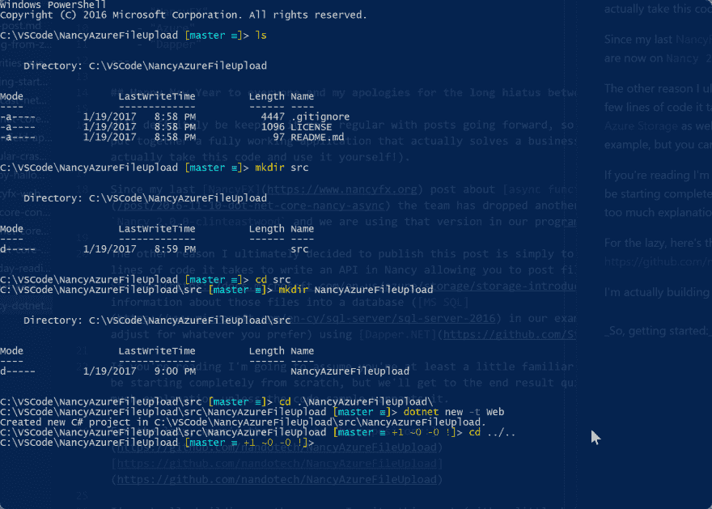T2】](https://res.cloudinary.com/practicaldev/image/fetch/s--3q-5E7pp--/c_limit%2Cf_auto%2Cfl_progressive%2Cq_auto%2Cw_880/http://i.imgur.com/jMMyxdN.png)

这里我在`dotnet new`中使用了`-t Web`参数，只是为了节省我们稍后创建和输入文件的额外时间，因为它将创建一个`Program.cs`、`Startup.cs`，然后还有我们的`web.config`。

我们将删除该模板创建的大多数其他文件夹。我们实际上跳过了一个步骤，这将导致我删除在我们的`\src\NancyAzureFileUpload\`文件夹中创建的文件。我们应该做的第一件事是在根目录下创建我们的`global.json`文件:

*global.json*

```
{  "projects":  [  "src"  ],  "sdk":  {  "version":  "1.0.0-preview2-1-003177"  }  } 
```

查看我们的文件内容等等，包括在我们的根目录中显示我们的`_global.json`:

[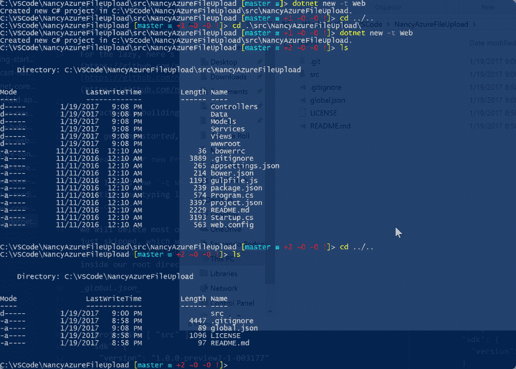T2】](https://res.cloudinary.com/practicaldev/image/fetch/s--_NVhklwp--/c_limit%2Cf_auto%2Cfl_progressive%2Cq_auto%2Cw_880/http://i.imgur.com/7kpaT0w.png)

我们也将只使用 [Visual Studio 代码](https://code.visualstudio.com/)并使用它进行调试。我还建议为 VS 代码获取 [Jonathan Channon](https://twitter.com/jchannon/) 的 [C# IDE 扩展](https://github.com/jchannon/csharpextensions)，让您的`Create Class`和`Create Interface`至少有自己的名称空间(而不是什么都没有)。 [Omnisharp C#](https://github.com/OmniSharp/omnisharp-vscode) 扩展不言而喻(而且我认为 VS 代码甚至会提示你输入)。

[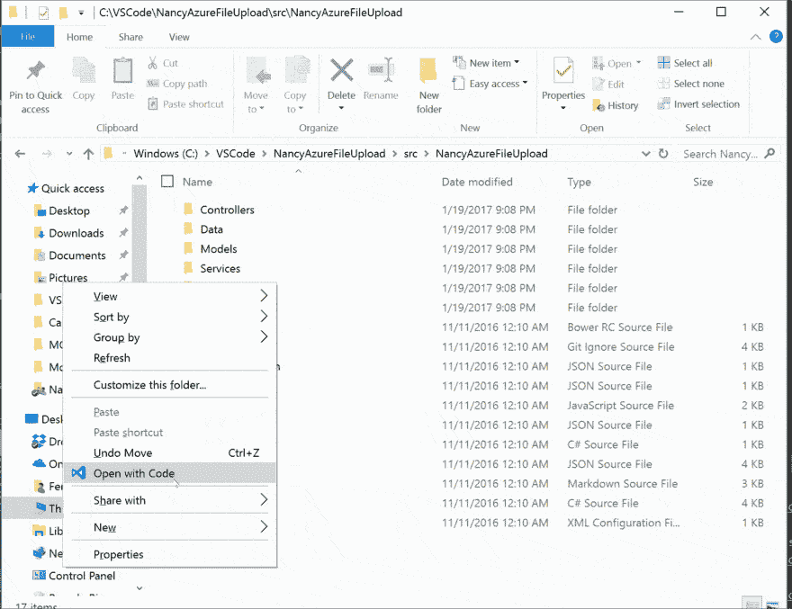T2】](https://res.cloudinary.com/practicaldev/image/fetch/s--9ZKF8EzD--/c_limit%2Cf_auto%2Cfl_progressive%2Cq_66%2Cw_880/http://i.imgur.com/6mPUMVH.gif)

在[代码](https://code.visualstudio.com)中打开我们的文件后，您应该会在屏幕顶部看到一个提示，告诉您为了允许调试，还缺少一些资产。

按照下面的 GIF(或者点击是)进行操作，注意它会添加一个带有`launch.json`和`tasks.json`文件的`.vscode`文件夹。除此之外，请注意我们为此进入了项目的*内部目录*。如果你从一个外部文件夹这样做，我发现我倾向于与调试器有问题。

[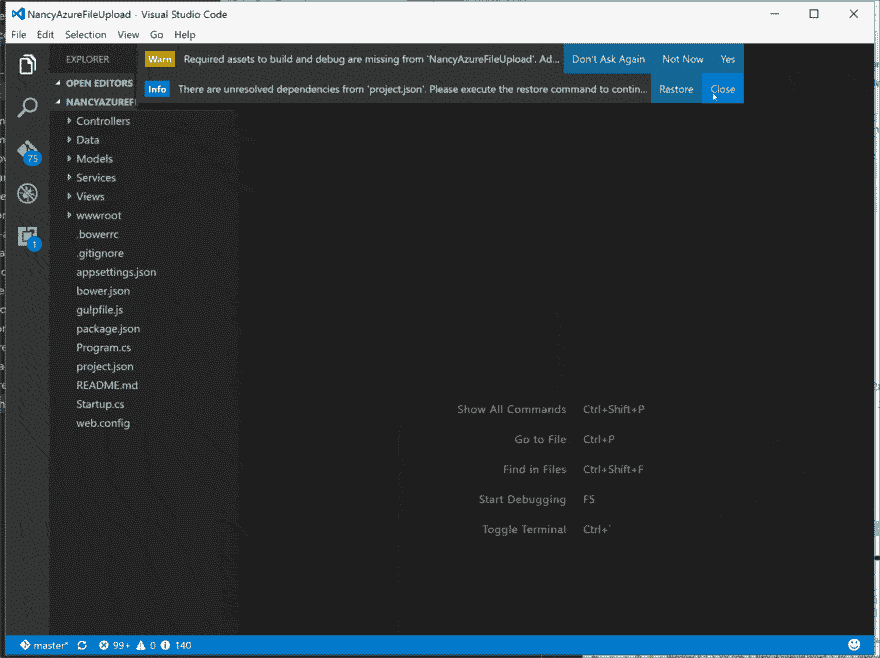T2】](https://res.cloudinary.com/practicaldev/image/fetch/s--_sVTO7zZ--/c_limit%2Cf_auto%2Cfl_progressive%2Cq_66%2Cw_880/http://i.imgur.com/WVkP6um.gif)

现在最完美的事情是下面的文件已经准备好了(除了`namespace`重命名，如果你愿意的话)。基本上，我将从目录中删除/删减其他所有内容，并在这里显示相关步骤。

`web.config`

```
<?xml version="1.0" encoding="utf-8"?>
<configuration>

  <!--
    Configure your application settings in appsettings.json. Learn more at https://go.microsoft.com/fwlink/?LinkId=786380
  -->

  <system.webServer>
    <handlers>
      <add name="aspNetCore" path="*" verb="*" modules="AspNetCoreModule" resourceType="Unspecified"/>
    </handlers>
    <aspNetCore processPath="%LAUNCHER_PATH%" arguments="%LAUNCHER_ARGS%" stdoutLogEnabled="false" stdoutLogFile=".\logs\stdout" forwardWindowsAuthToken="false"/>
  </system.webServer>
</configuration> 
```

*Program.cs*

```
 public static void Main(string[] args)
 {
    var host = new WebHostBuilder()
        .UseContentRoot(Directory.GetCurrentDirectory())
        .UseKestrel()
        .UseIISIntegration()
        .UseStartup<Startup>()
        .Build();

        host.Run();
  } 
```

*Startup.cs* (此文件根据我们的需要编辑)

```
 public class Startup
    {
        public void ConfigureServices(IServiceCollection services) 
        {
            // CustomBootstrapper.cs
        }
        public void Configure(IApplicationBuilder app) 
        {
            app.UseOwin(x=>x.UseNancy());
        }

    } 
```

这个`project.json`文件经过了大量的编辑——我主要针对我们需要的包进行了调整。我们还导入了其他框架元素，因为我们的`WindowsAzure.Storage`包的某些部分依赖于这些元素。

*project.json*

```
{  "name":  "NancyFileUpload",  "version":  "1.0.0-*",  "buildOptions":  {  "debugType":  "portable",  "emitEntryPoint":  true  },  "dependencies":  {  "Microsoft.AspNetCore.Diagnostics":  "1.1.0",  "Microsoft.AspNetCore.Server.IISIntegration":  "1.1.0",  "Microsoft.AspNetCore.Server.Kestrel":  "1.1.0",  "Microsoft.AspNetCore.StaticFiles":  "1.1.0",  "Microsoft.AspNetCore.Owin":  "1.1.0",  "Microsoft.Extensions.Configuration.Binder":  "1.1.0",  "Microsoft.Extensions.Logging.Console":  "1.1.0",  "Microsoft.Extensions.Configuration.FileExtensions":  "1.1.0",  "Microsoft.Extensions.Configuration.Json":  "1.1.0",  "WindowsAzure.Storage":  "8.0.1",  "Nancy":  "2.0.0-clinteastwood",  "Dapper":  "1.50.2"  },  "tools":  {  "Microsoft.AspNetCore.Server.IISIntegration.Tools":  {  "version":"1.1.0-preview4-final",  "imports":  "portable-net45+win8+dnxcore50"  }  },  "frameworks":  {  "netcoreapp1.1":  {  "imports":  [  "dotnet5.6",  "dnxcore50",  "portable-net45+win8"  ],  "dependencies":  {  "Microsoft.NETCore.App":  {  "type":  "platform",  "version":  "1.1.0"  }  }  }  },  "runtimeOptions":  {  "configProperties":  {  "System.GC.Server":  true  }  },  "publishOptions":  {  "include":  [  "wwwroot",  "web.config",  "appsettings.json",  "Content"  ]  },  "scripts":  {  "postpublish":  [  "dotnet publish-iis --publish-folder %publish:OutputPath% --framework %publish:FullTargetFramework%"  ]  }  } 
```

*appsettings.json*

```
{  "ConnectionStrings":  {  "DefaultConnection":  "Data Source=(localdb)\\MSSQLLocalDB;Initial Catalog=MoveCaptain;Integrated Security=True;Connect Timeout=30;Encrypt=False;TrustServerCertificate=True;ApplicationIntent=ReadWrite;MultiSubnetFailover=False"  },  "Logging":  {  "IncludeScopes":  false,  "LogLevel":  {  "Default":  "Debug",  "System":  "Information",  "Microsoft":  "Information"  }  },  "Greeting":  "Hello from Nancy .NET Core File Upload API",  "StorageAccount":  {  "User":"****",  "Key":  "****"  }  } 
```

在做了一些工作之后，让我们来看看我们的项目目录。

[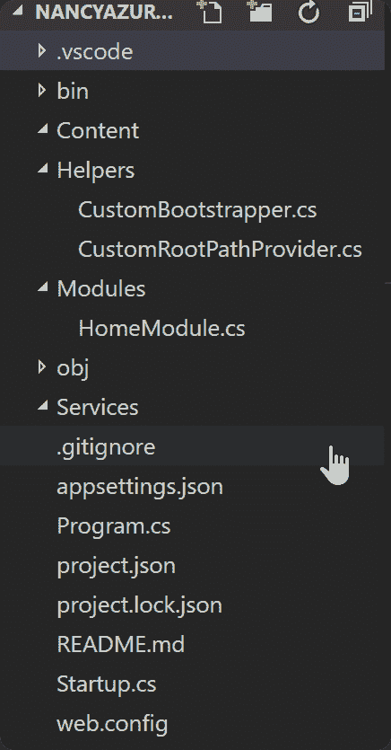T2】](https://res.cloudinary.com/practicaldev/image/fetch/s--40sRFhy_--/c_limit%2Cf_auto%2Cfl_progressive%2Cq_auto%2Cw_880/http://i.imgur.com/VZipxc0.png)

到目前为止，我们唯一没有检查的代码是`CustomBootstrapper.cs`和`CustomRootPathProvider.cs`，它们非常小，如果你愿意，你可以将它们一起放在一个文件中:

*CustomRootPathProvider.cs*

```
using Nancy;
using System.IO;

namespace NancyAzureFileUpload.Helpers
{
    public class CustomRootPathProvider : IRootPathProvider
    {
        public string GetRootPath() 
        {
            return Directory.GetCurrentDirectory();
        }
    }
} 
```

*CustomBootstrapper.cs*

```
using Microsoft.Extensions.Configuration;
using Nancy;
using Nancy.TinyIoc;

namespace NancyAzureFileUpload.Helpers
{
    public class CustomBootstrapper : DefaultNancyBootstrapper
    {
        public IConfigurationRoot Configuration;
        public CustomBootstrapper()
        {
            var builder = new ConfigurationBuilder()
                .SetBasePath(RootPathProvider.GetRootPath())
                .AddJsonFile("appsettings.json")
                .AddEnvironmentVariables();

                Configuration = builder.Build();
        }

        protected override void ConfigureApplicationContainer(TinyIoCContainer ctr)
        {
            ctr.Register<IConfiguration>(Configuration);
        }

    }
} 
```

目前，我也只写了我们最基本的`HomeModule.cs`——我们将创建我们的`UploadModule.cs`,暂时完成所有繁重的工作。

*HomeModule.cs*

```
using Microsoft.Extensions.Configuration;
using Nancy;

namespace NancyAzureFileUpload.Modules
{
    public class HomeModule : NancyModule
    {
        public HomeModule(IConfiguration _config)
        {
            Get("/", args =>
            {
                return _config["Greeting"];
            });
        }
    }
} 
```

在这里，您将在 Visual Studio 代码中进行调试，如果您遵循了(或克隆了 repo):

[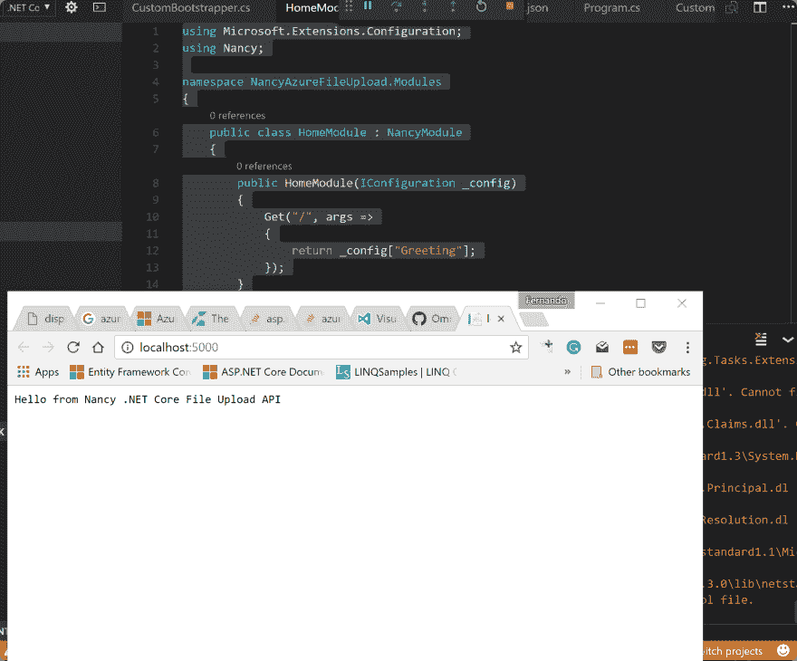T2】](https://res.cloudinary.com/practicaldev/image/fetch/s--TxXCFagG--/c_limit%2Cf_auto%2Cfl_progressive%2Cq_auto%2Cw_880/http://i.imgur.com/geINIvH.png)

所以现在，基本上，对于政变，我将粘贴在下面，并简要解释正在发生什么，它是如何工作的/为什么。我发现，与常规的[ASP.NET 核心](https://docs.asp.net)相比，使用 [NancyFX](https://github.com/nancyfx/nancy) 编写的这个特定任务非常简单快速。老实说，我原本打算使用标准的`ASP.NET`。

这就是——复制了`Post`方法(我们可以把它分解成一个函数，这样更简洁),仍然在 100 行代码*之下，包括*和`using`语句！：

*上传模块*

```
 public class UploadModule : NancyModule
    {
        public UploadModule(IDispatchFileService _fileService,
                            IConfiguration _config)
        {
            Post("/upload", async (args, ct)  =>
            {
                var postedFile = Request.Files.FirstOrDefault();
                var queryInfo = Request.Form;                            
                DispatchFile fileInfo;

                if(postedFile != null) 
                {
                    //Check file type
                    var url = $"https://{_config["StorageAccount:User"]}.blob.core.windows.net/{_config["StorageAccount:containerName"]}/{postedFile.Name}";
                    var secondary = $"https://{_config["StorageAccount:User"]}-secondary.blob.core.windows.net/{_config["StorageAccount:containerName"]}/{postedFile.Name}";

                     //Upload file to Azure Storage
                    var creds = new StorageCredentials(_config["StorageAccount:User"], _config["StorageAccount:Key"]);
                    var blob = new CloudBlockBlob(new Uri(url), creds);
                    await blob.UploadFromStreamAsync(postedFile.Value);

                    //Save file data to table 
                    fileInfo = new DispatchFile
                    {
                        DispatchId = Convert.ToInt32(queryInfo?.DispatchId?.Value ?? 0),
                        Filename = postedFile.Name,
                        Filetype = postedFile.ContentType,
                        PrimaryUrl = url,
                        SecondaryUrl = secondary,
                        ItemType = queryInfo?.ItemType?.Value
                    };

                    await _fileService.Add(fileInfo);

                }
                else 
                {
                    return "No files uploaded.";
                }

                return fileInfo;
            });

            Post("/upload/{dispatchId}/{itemType}", async (args, ct) =>
            {
                var postedFile = Request.Files.FirstOrDefault();
                var queryInfo = Request.Form;                            
                DispatchFile fileInfo;

                if(postedFile != null) 
                {
                  // Storage Account & Container Name are usually set statically
                  // When you create the Blob container in Azure you know these values
                  // For simplicity's sake, I'm going to search our appSettings.json for them 
                    //Check file type
                    var url = $"https://{_config["StorageAccount:User"]}.blob.core.windows.net/{_config["StorageAccount:containerName"]}/{postedFile.Name}";
                    var secondary = $"https://{_config["StorageAccount:User"]}-secondary.blob.core.windows.net/{_config["StorageAccount:containerName"]}/{postedFile.Name}";

                    //Upload file to Azure Storage
                    var creds = new StorageCredentials(_config["StorageAccount:User"], _config["StorageAccount:Key"]);
                    var blob = new CloudBlockBlob(new Uri(url), creds);
                    await blob.UploadFromStreamAsync(postedFile.Value);                    
                    //Save file data to table 
                    fileInfo = new DispatchFile
                    {
                        Filename = postedFile.Name,
                        Filetype = postedFile.ContentType,
                        PrimaryUrl = url,
                        SecondaryUrl = secondary,
                        ItemType = args?.ItemType?.Value
                    };

                    await _fileService.Add(fileInfo);

                }
                else 
                {
                    return "No files uploaded.";
                }

                return fileInfo;
            });

        }
    } 
```

只是为了澄清一些我们在这篇文章中没有提到的东西。`UploadModule`继承了一个`IDispatchFileService`和`IConfiguration`。我们真正需要的配置只是获取我们的 [Windows Azure](http://azure.com) 存储信息和密钥信息。

很明显，如果不进入 Azure，我们无法走得更远。我将假定您对这里有些熟悉，但将涵盖您需要的一切。首先，和 Azure 中的其他东西一样，前往[https://portal.azure.com](https://portal.azure.com)并登录您计划使用的帐户/订阅。

从这里开始，我们将想要创建一个`Storage Account`、`SQL Server`、&、`Database`，以及最后但同样重要的一个`Web App`，我们所经历的所有代码都将存在于其中。利用我们当前的项目结构，我们可以利用 Azure 的特性直接从我们的 https://github.com/nandotech/NancyAzureFileUpload 的 [Github](https://github.com) 仓库@ [构建&部署。](https://github.com/nandotech/NancyAzureFileUpload)

要从获取您需要的信息并创建您的存储帐户，请参见以下内容:

*存储账户的初始创建*

[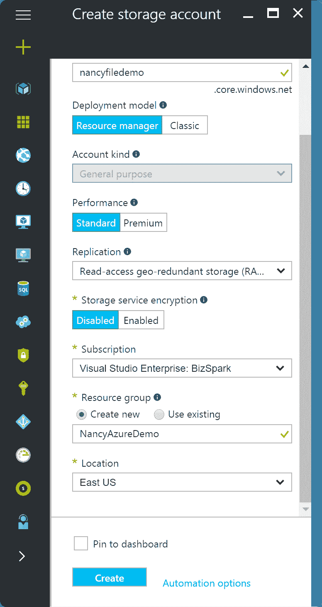T2】](https://res.cloudinary.com/practicaldev/image/fetch/s--pe4IcBQy--/c_limit%2Cf_auto%2Cfl_progressive%2Cq_auto%2Cw_880/http://i.imgur.com/U2QUHsT.png)

在这里你将创建你的容器，这里我将我的命名为`files`。

*抓住你的用户&两个访问键中的任何一个*

[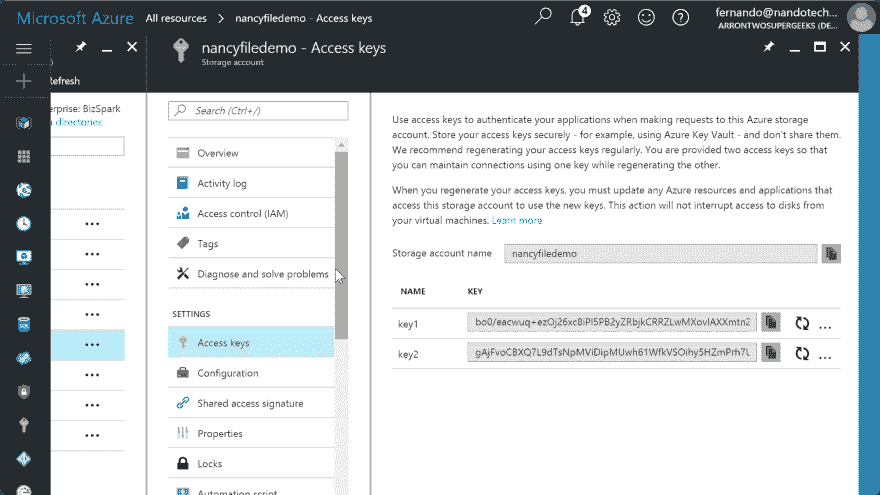T2】](https://res.cloudinary.com/practicaldev/image/fetch/s--WmDTPKbP--/c_limit%2Cf_auto%2Cfl_progressive%2Cq_auto%2Cw_880/http://i.imgur.com/jWRCd8M.png)

如果您注意到我们的`appsettings.json`，我们将数据库和存储帐户的值留空。我们将利用 [Azure Web Apps](https://azure.microsoft.com/en-us/services/app-service/) 中的一个特性，允许你为不同的`appsettings`值注入任何你想要的值。

接下来，我们将创建 SQL 服务器和数据库:

[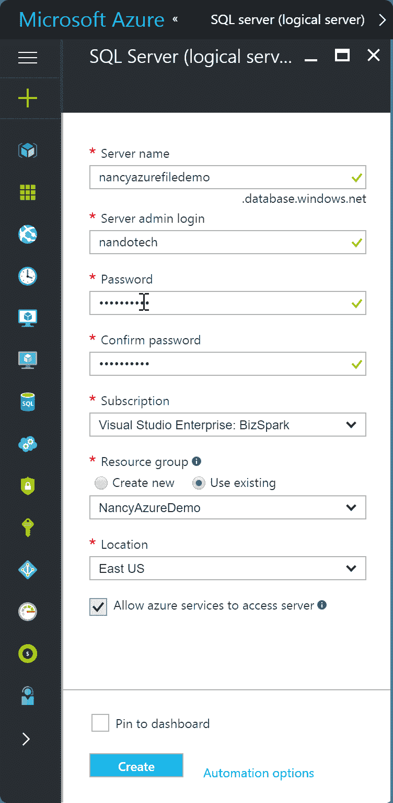T2】](https://res.cloudinary.com/practicaldev/image/fetch/s--WsqCCFlI--/c_limit%2Cf_auto%2Cfl_progressive%2Cq_auto%2Cw_880/http://i.imgur.com/dIdUkzl.png)

[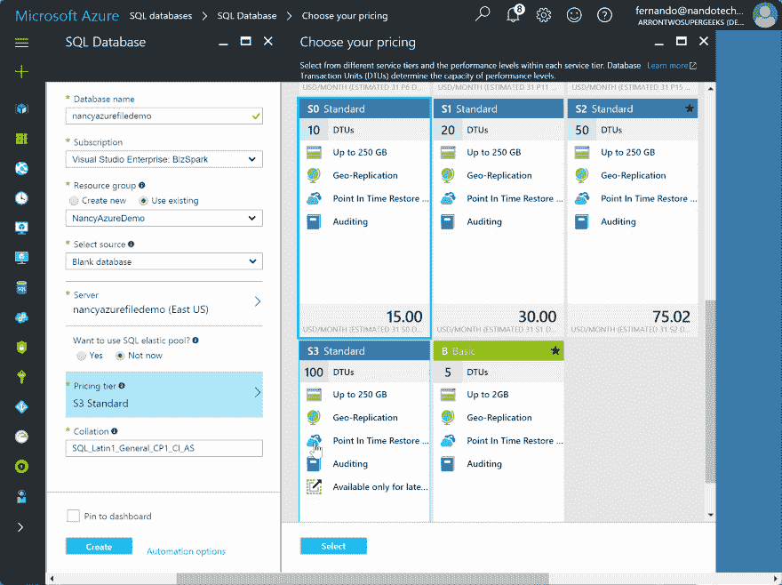T2】](https://res.cloudinary.com/practicaldev/image/fetch/s--08cMAPnc--/c_limit%2Cf_auto%2Cfl_progressive%2Cq_auto%2Cw_880/http://i.imgur.com/JDP4HYU.png)

跳过步骤:我们还需要创建数据库和保存上传信息的表格。存储库包括一个带有创建脚本的. SQL 文件。

最后但同样重要的是，我们创建我们的 web 应用程序并配置`Application Settings`。

*这是我们的应用程序设置，覆盖值已就位*

[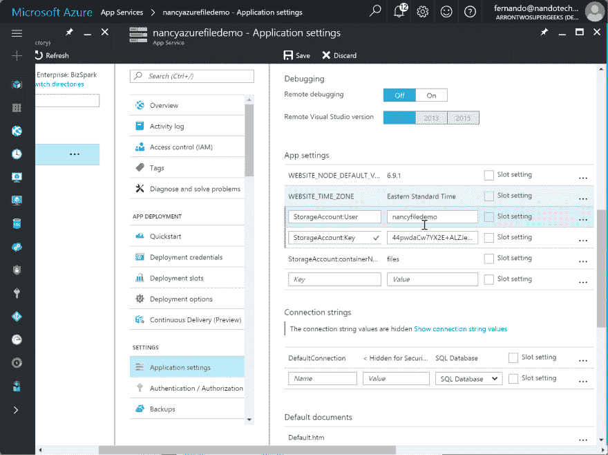T2】](https://res.cloudinary.com/practicaldev/image/fetch/s--lCmFrizh--/c_limit%2Cf_auto%2Cfl_progressive%2Cq_auto%2Cw_880/http://i.imgur.com/rbO1OCG.png)

部署到 Azure 的唯一步骤是点击`Deployment Options`并将 [Github 库](https://github.com/nandotech/NancyAzureFileUpload)连接到 Web 应用。

在这里，我们选择我们在 Azure 中设置的公共回购:

[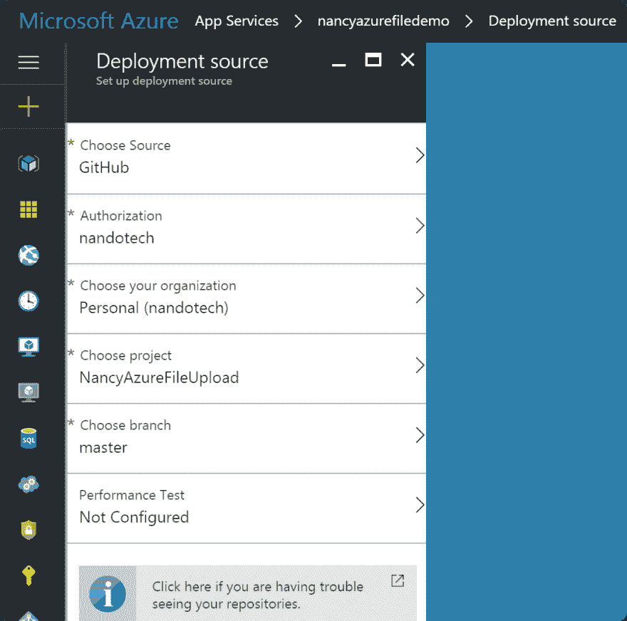T2】](https://res.cloudinary.com/practicaldev/image/fetch/s--pesAte-H--/c_limit%2Cf_auto%2Cfl_progressive%2Cq_auto%2Cw_880/http://i.imgur.com/WlN3z2x.png)

瞧啊。我们找到了。使用部署到 Azure 的全功能 API。NET Core，Dapper，NancyFX 2.0 和 Azure Storage + SQL 来保留我们文件的信息。

现场演示/如果你跟着我，我实际上创造了我展示的一切:[http://nancyazurefiledemo.azurewebsites.net](http://nancyazurefiledemo.azurewebsites.net)。如果您直接导航到它，您应该会得到我们在`HomeModule.cs`中设置的纯文本响应，欢迎您使用我们的 API。

为了使用实际的`UploadModule`，我们将不得不使用像[邮差](https://www.getpostman.com/)或[提琴手](http://www.telerik.com/fiddler)这样的工具，这两个令人敬畏的工具我都经常使用，以帮助 mmy 开发工作流。

请记住，我们配置了我们的路由来接受请求字符串或请求正文中的一些参数，以及您可能想要上传的任何文件，我们将其作为`multipart-form`传递给 API，Postman 做得非常简单。

我们可以在下面看到一个成功的测试，我上传了一个 PDF 文件:

[T2】](https://res.cloudinary.com/practicaldev/image/fetch/s--dnpEO92W--/c_limit%2Cf_auto%2Cfl_progressive%2Cq_auto%2Cw_880/http://i.imgur.com/ia7zLwh.png)

那就是所有的人！

这篇文章相当长，但我想非常彻底，并确保我涵盖了所有相关的步骤，在没有问题的情况下启动和运行。非常感谢你的阅读，我希望这真的能帮助一些人解决问题，甚至是第一次学习南希！

感谢您的阅读！

给懒人最后一次机会:

*   演示:[http://nancyazurefiledemo.azurewebsites.net](http://nancyazurefiledemo.azurewebsites.net)
*   回购:[https://github.com/nandotech/NancyAzureFileUpload](https://github.com/nandotech/NancyAzureFileUpload)

当我们有它的时候，请随意测试和使用演示站点。正如我之前提到的，因为我们的`UploadModule`正在等待一个`multipart-form`，所以那里的任何请求都必须通过像 Postman 或 Fiddler 这样的工具来完成。

祝大家黑客快乐！