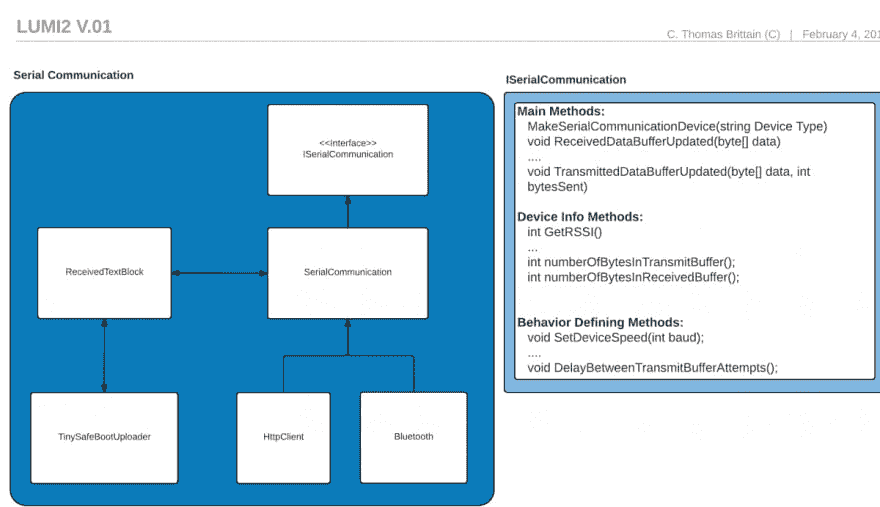

# ESPER - ESP8266 串行通信网络服务器

> 原文:[https://dev . to/lad vien/esper-esp8266-串行通信-web-server-214o](https://dev.to/ladvien/esper-esp8266-serial-communication-web-server-214o)

## Lumi3

这个项目是实现 Lumi2 的垫脚石。我一直在做的米露项目是将 Arduino / AVR 程序空中上传到 Atmega 和 Atiny 芯片，这些芯片是用 TinySafeBoot 引导程序编程的。目标是允许用户选择 WiFi 或蓝牙，创建到 ESP8266 或 HM-1X 设备的连接，并将任何程序上传到连接到无线接收设备的 AVR。

米露的最后一次迭代是在 Windows 通用应用软件开发工具包中编写的。不幸的是，代码库变成了意大利面条。我已经诊断出这些问题是由于上帝模块、对面向对象设计的理解不足以及仓促的编码造成的。激情超越了我的能力。以下是我迄今为止在这个项目上的经历:

1.  Vorpal Hoff -尝试使用 HM-11 和 LPC1114 组合进行无线上传。用 C / C++写的。
2.  HM-1X Aid -这个项目是 HM-1X 模块之上的一个 GUI，允许“容易”地编辑模块的行为。这是我第一次尝试 C#。(太糟糕了；尽管串行通信是异步的。)
3.  这是第一个成功的 TinySafeBoot 上传程序。它是用 C#编写的，使用。NET WinForms。不幸的是，它是同步的。在我意识到 WinForm 的. NET 中没有简单的 BLE 支持之前，我已经完成了 USB 到 UART 的上传
4.  这是事情开始好转的地方。这是 TSB 无线引导程序的最新版本。它工作，是异步的，并且有 BLE 支持。不幸的是，代码变成了意大利面条。这很大程度上是因为我对面向对象设计的理解很差。它有上帝模块，一个可怕的串行事件响应协议，糟糕的封装，没有多态性。就是一团乱。

现在，我要进行第三次尝试。我将尝试纠正上述错误*和*实现 WiFi 上传，接收设备为 ESP8266。

[Lumi3](https://github.com/Ladvien/Lumi3)

这是设计草图:

[T2】](https://res.cloudinary.com/practicaldev/image/fetch/s--phxZMi5H--/c_limit%2Cf_auto%2Cfl_progressive%2Cq_auto%2Cw_880/https://ladvien.cimg/Lumi2_rough_Sketch_v2.png)

## ESPER

ESPER 是一个迷你项目，用于解决 Lumi3 程序如何与远程设备交互的问题。

下面有两组代码，第一组是交互的 C#端。它设置了一个带有 POST 和 GET 调用的 HttpClient。使 C# ESPER 代码有点不同的一个真正的变体是异步轮询 POST 数据请求。这是为了模拟通过 WiFi 信号的串行通信 RX 线。

另一个代码是 Arduino C，它将 ESP8266 设备设置为 HTTP 服务器。然后，它可以从 UART 接收数据，并将其打印到服务器。这允许 C#轮询 POST 调用拾取数据。当然，以同样的方式，Arduino 代码被设置为从 HTTP 客户端接收数据，并通过 UART 发送数据。瞧吧！跨 WiFi 串行通信。现在我们所需要的是恼人的自动助听声，我们将坚定地回到 20 世纪 90 年代。

## 2016 年 2 月 7 日更新

[](https://res.cloudinary.com/practicaldev/image/fetch/s--te6PUUrY--/c_limit%2Cf_auto%2Cfl_progressive%2Cq_auto%2Cw_880/https://ladvien.cimg/ESPER_ui_1.png) 
我给 ESPER 类添加了一个搜索方法。基本上，它在一个范围内迭代，为 ESPER 发送一个名称请求。当 C#代码发现一个 ESPER 时，它会将其添加到一个数组中。我对此很满意。

我在尝试使用 Windows 时确实遇到了问题。HttpClient，因为似乎没有办法调整超时。默认是 3 秒，这太长了。因此，系统。因为它有一个超时属性，这个属性需要一个 Timespan。

C#

```
 public async Task<List<Uri>> SearchForESPER(int startingSub, int endingSub)
        {
            var httpClient = new System.Net.Http.HttpClient();
            httpClient.Timeout = new TimeSpan(0, 0, 0, 0, 300);
            var webService = WebServerUrl + "name";
            List<Uri> discoveredIPs = new List<Uri>();
            EsperProgressBar.Maximum = endingSub - startingSub;

            for (int i = startingSub; i < endingSub; i++)
            {
                try
                {
                    string ip = "http://192.168.1." + i.ToString() + "/";
                    var resourceUri = new Uri(ip);
                    var response = await httpClient.PostAsync(resourceUri, null);
                    if(response.IsSuccessStatusCode == true)
                    {
                        discoveredIPs.Add(resourceUri);
                    }
                    response.Dispose();
                }
                catch (Exception ex)
                {

                }
                EsperProgressBar.Value += 1;
            }
            EsperProgressBar.Value = 0;
            EsperProgressBar.IsEnabled = false;
            return discoveredIPs;
        }

.......

        private async void Search_Click(object sender, RoutedEventArgs e)
        {
            Esper esper = new Esper(ProgressBar);
            var discoveredIPs = await esper.SearchForESPER(98, 130);

            foreach(Uri ip in discoveredIPs) {
                IPComboBox.Items.Add(ip.Host);
            }
            IPComboBox.SelectedIndex = 0;
        } 
```

<svg width="20px" height="20px" viewBox="0 0 24 24" class="highlight-action crayons-icon highlight-action--fullscreen-on"><title>Enter fullscreen mode</title></svg> <svg width="20px" height="20px" viewBox="0 0 24 24" class="highlight-action crayons-icon highlight-action--fullscreen-off"><title>Exit fullscreen mode</title></svg>

c# esper
的缩写形式

```
 using System;
    using System.Collections.Generic;
    using System.Diagnostics;
    using System.Linq;
    using System.Runtime.InteropServices.WindowsRuntime;
    using System.Text;
    using System.Threading;
    using System.Threading.Tasks;
    using Windows.Storage.Streams;
    using Windows.Web.Http;

    namespace ESPER
    {
        class Esper
        {
            const int defaultPollingDelay = 50; 

            HttpClient httpClient = new HttpClient();
            CancellationTokenSource PollingForDataCancelToken = new CancellationTokenSource();

            private string WebServerUrl { get; set; }
            private int PollingDelay { get; set; } = defaultPollingDelay;
            private bool PollingActive { get; set; } = false;

            public Esper(string consumerUrl)
            {
                WebServerUrl = consumerUrl;
            }

            public async void PostByteArray(byte[] data)
            {

                var httpClient = new HttpClient();
                var webService = WebServerUrl + "data";
                var resourceUri = new Uri(WebServerUrl);
                try
                {
                    IBuffer buffer = data.AsBuffer();
                    using (HttpBufferContent content = new HttpBufferContent(buffer))
                    {
                        content.Headers.Add("Content-Type", "text/html; charset=utf-8");
                        content.Headers.ContentLength = buffer.Length;
                        var response = await httpClient.PostAsync(resourceUri, content);
                        Debug.WriteLine(response);
                    }
                }
                catch (TaskCanceledException ex)
                {
                    // Handle request being canceled due to timeout.
                }
            }

            public async void PostString(string str)
            {
                var httpClient = new HttpClient();
                var webService = WebServerUrl + "string";
                var resourceUri = new Uri(webService);
                try
                {
                    using (HttpStringContent content = new HttpStringContent(str, Windows.Storage.Streams.UnicodeEncoding.Utf8))
                    {
                        content.Headers.ContentLength = (ulong)str.Length;
                        using (var response = await httpClient.PostAsync(resourceUri, content)) { };
                    }
                }
                catch (TaskCanceledException ex)
                {
                    // Handle request being canceled due to timeout.
                }
            }

            public void Start()
            {
                if(false == PollingActive)
                {
                    PollingActive = true;
                    PollingForDataCancelToken = new CancellationTokenSource();
                    PollWebServerDataAvailability();
                }
            }

            public void End()
            {
                PollingActive = false;
                PollingForDataCancelToken.Cancel();
            }

            public void SetPollingDelay(int delayInMilliseconds) { PollingDelay = delayInMilliseconds; }

            private void PollWebServerDataAvailability()
            {   
                try
                {
                    Task.Run(async () =>
                    {
                        while (true)
                        {
                            if (PollingForDataCancelToken.IsCancellationRequested)
                            {
                                PollingForDataCancelToken.Token.ThrowIfCancellationRequested();
                            }
                            await GetData();
                            await Task.Delay(PollingDelay);
                        }
                    }, PollingForDataCancelToken.Token);
                } catch (TaskCanceledException)
                {
                    // TODO: Add cancelation callback here.
                }
            }

            public async Task<string> GetData()
            {
                var cts = new CancellationTokenSource();
                cts.CancelAfter(TimeSpan.FromSeconds(30));

                var webService = WebServerUrl + "buffer";
                var resourceUri = new Uri(webService);
                try
                {
                    HttpResponseMessage response = await httpClient.PostAsync(resourceUri, null);
                    var message = await response.Content.ReadAsStringAsync();
                    if (message != "") { Debug.WriteLine(message); }
                    response.Dispose();
                    cts.Dispose();
                    return message;
                }
                catch (TaskCanceledException ex)
                {
                    // Handle request being canceled due to timeout.
                    return "";
                }
                return "";
            }
        }
    } 
```

<svg width="20px" height="20px" viewBox="0 0 24 24" class="highlight-action crayons-icon highlight-action--fullscreen-on"><title>Enter fullscreen mode</title></svg> <svg width="20px" height="20px" viewBox="0 0 24 24" class="highlight-action crayons-icon highlight-action--fullscreen-off"><title>Exit fullscreen mode</title></svg>

```
Arduino ESPER​ WebServer

    /*
     * This code has been adapted from:
    *  "SDWebServer - Example WebServer with SD Card backend for esp8266
    *  Copyright (c) 2015 Hristo Gochkov. All rights reserved.
    *  This file is part of the ESP8266WebServer library for Arduino environment."
     * 
    */

    const char* ssid = "SSID";
    const char* password = "password";

    // Gross.  Global variables.  These are used for collecting Serial Data.
    String inputBuffer = "";         

    #include <ESP8266WiFi.h>     #include <WiFiClient.h>     #include <ESP8266WebServer.h>     #include <ESP8266mDNS.h>  
    const int ledPin = 2;
    const char* host = "esp8266sd";

    ESP8266WebServer server(80);

    void returnOK() {
      server.send(200, "text/plain", "");
    }

    void returnFail(String msg) {
      server.send(500, "text/plain", msg + "\r\n");
    }

    void debugWebRequest(){
      String message = "";
      message += "URI: ";
      message += server.uri();
      message += "\nMethod: ";
      message += (server.method() == HTTP_GET)?"GET":"POST";
      message += "\nArguments: ";
      message += server.args();
      message += "\n";
      for (uint8_t i=0; i<server.args(); i++){
        message += " NAME:"+server.argName(i) + "\n VALUE:" + server.arg(i) + "\n";
      }
      server.send(404, "text/plain", message);
      Serial.print(message);
    }

    void getSerialBuffer(){
      Serial.print("Sent data: ");
      Serial.println(inputBuffer);
      server.send(200, "text/plain", inputBuffer);
      inputBuffer = "";
    }

    void handleUnknownPost(){
      returnOK();
      //debugWebRequest(); 
      Serial.print("Unknown POST.");
    }

    void handleStringPost(){
      returnOK();
      //debugWebRequest();
      Serial.print("Got data: ");
      Serial.print(server.arg(0));
    }

    void handleDataPost(){
      returnOK();
      //debugWebRequest();
      Serial.print("Data POST.");
    }

    void handleNotFound(){
      returnOK();
      //debugWebRequest();
      Serial.print("Resource not found POST.");
    }

    void setup(void){
      pinMode(ledPin, OUTPUT);

      Serial.begin(115200);
      Serial.setDebugOutput(true);
      Serial.print("\n");
      WiFi.begin(ssid, password);
      Serial.print("Connecting to ");
      Serial.println(ssid);

      digitalWrite(ledPin, HIGH);
      bool isLedPinOn = true;

      // Wait for connection
      uint8_t i = 0;
      while (WiFi.status() != WL_CONNECTED && i++ < 20) {//wait 10 seconds
        delay(500);
        Serial.print(".");
        isLedPinOn = !isLedPinOn;  

      }
      Serial.println("");
      if(i == 21){
        digitalWrite(ledPin, HIGH);
        Serial.print("Could not connect to");
        Serial.println(ssid);
        while(1) { 
          digitalWrite(ledPin, isLedPinOn ? HIGH : LOW);
          delay(200); 
        }
      }

      digitalWrite(ledPin, LOW);  

      Serial.print("Connected! IP address: ");
      Serial.println(WiFi.localIP());

      if (MDNS.begin(host)) {
        MDNS.addService("http", "tcp", 80);
        Serial.println("MDNS responder started");
        Serial.print("You can now connect to http://");
        Serial.print(host);
        Serial.println(".local");
      }

      server.on("/", HTTP_POST, handleUnknownPost);
      server.on("/string", HTTP_POST, handleStringPost);
      server.on("/data", HTTP_POST, handleDataPost);
      server.on("/buffer", HTTP_POST, getSerialBuffer);
      server.onNotFound(handleNotFound);

      server.begin();
      Serial.println("HTTP server started");
    }

    void loop(void){
      server.handleClient();
      while (Serial.available()) {
        char inChar = (char)Serial.read();
        inputBuffer += inChar;
      }
    } 
```

<svg width="20px" height="20px" viewBox="0 0 24 24" class="highlight-action crayons-icon highlight-action--fullscreen-on"><title>Enter fullscreen mode</title></svg> <svg width="20px" height="20px" viewBox="0 0 24 24" class="highlight-action crayons-icon highlight-action--fullscreen-off"><title>Exit fullscreen mode</title></svg>