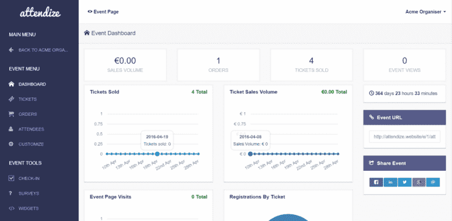

# 更新注意力

> 原文：<https://dev.to/clawfire/updating-attendize-4k7c>

[T2】](https://res.cloudinary.com/practicaldev/image/fetch/s--drOBss60--/c_limit%2Cf_auto%2Cfl_progressive%2Cq_auto%2Cw_880/https://cdn-images-1.medium.com/max/1024/1%2AUhmknOr5NgAgICKvrl-52Q.png)

我在一些活动中使用 super duper [Attendize](http://attendize.com) ，一个开源的票务系统。在经历了一段艰难的时间后，我找到了近 0 份关于如何更新它的文档。

幸运的是，由于它是一个开源软件，我能够打开一个问题，并询问该软件的开发人员社区如何做。

[更新程序问题#285 出勤/出勤](https://github.com/Attendize/Attendize/issues/285#issuecomment-272705469)

因此，为了更新您的安装，您必须:

1.  用新版本复制文件(通过 SFTP)
2.  使用`ssh`登录到您的服务器，并在根文件夹中输入`php artisan migrate`以启动数据库迁移。

好了🙌🏼。

我有点担心 2017 年的 FTP / SSH，所以我会寻找一种更好的方法来做这件事，用一些 CI 工具来自动化文件部署和命令运行以迁移数据库。保持联系😉

* * *