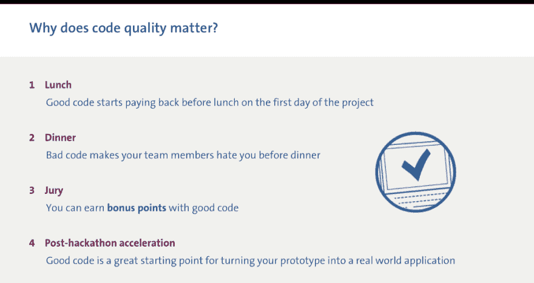
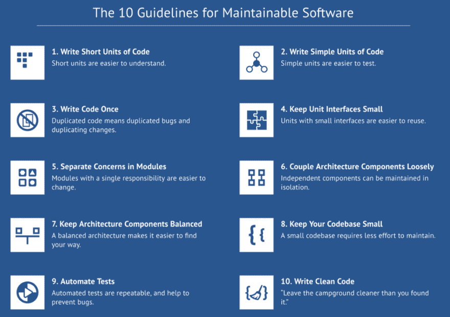

# 为什么区块链需要面向未来的代码

> 原文:[https://dev . to/jstvssr/why-区块链-需求-未来-证明-代码-2a6d](https://dev.to/jstvssr/why-blockchain-needs-future-proof-code-2a6d)

#### 因为我们的社会需要创新的*和*可持续的解决方案。

> 我不是一个伟大的程序员；我只是一个习惯很棒的好程序员。——Kent Beck >代码的质量可能不能保证项目的成功，但它肯定是失败的主要原因，尽管是看不见的。— [马里奥·富斯科](https://twitter.com/mariofusco/status/806456518434582528)

**区块链黑客马拉松**

在 2 月的第二个周末，50 个团队将参加[荷兰区块链黑客马拉松](https://blockchainhackathon.eu/)。在长达 54 小时的时间里，他们将释放自己的创造力，构建基于区块链的创新解决方案，从而塑造我们社会的未来。

这些团队将在 5 个主题赛道上展开竞争，争夺评审团的赞誉和认可，以及 50，000 欧元的奖金。

评审团将寻找质量，影响和对区块链生态系统的贡献。团队可以通过使用开放标准和通过开源许可共享他们的代码来获得加分。**通过生产高质量的代码。**

为什么代码质量很重要？

那么，为什么代码质量在这次黑客马拉松中如此重要呢？黑客马拉松的目的是不是在工作之前一起破解东西？不是为了生产精致的、经得起未来考验的东西？

这里有一些代码质量不是奢侈品的原因。

*   **区块链是基于信任的。**或者，正如 Ravish Gopal 解释的那样，利用区块链，“[传统的*可信第三方*机制正在被软件](https://medium.com/softwareimprovementgroup/blockchain-technology-do-we-trust-a-faceless-system-8cdafa7b32f3)所取代”。信任需要可审计性。更好的代码更容易审计。
*   创新的解决方案，无论是由初创公司还是成熟的组织建立的[，都必须具有适应性、可扩展性和可转让性。否则，这个解决方案不会比初创公司的创始人和/或第一个团队**活得更久。**](https://dev.to/jstvssr/autonomously-driving-code-quality-2n10-temp-slug-5262134)
*   一般来说，**更好的代码允许你构建更好的产品**。更确切地说，正如罗布·范·德·莱克所言，[伟大的产品不是由伟大的个人创造的，而是由伟大的团队创造的。好的代码既是一个伟大团队的标志，也是他们作为一个团队成功运作的必要前提。](https://medium.com/bettercode/lets-build-better-products-1acfba24108d)

嗯，你可能会说，这些原因只是在一段时间后才出现，而不是在我的黑客马拉松结束之前。所以，让我们把重点放在你团队项目的前 54 个小时。为什么代码质量是相关的？

*   **午饭**:好代码第一天午饭前开始还钱。到那时，您已经不在第一次迭代中了。您正在修改和增强早上编写的代码。如果它是杂乱的、难以阅读的、未经测试的、臃肿的等等，那么你将会慢下来，在没有注意到的情况下注入缺陷，并且迷失方向。
*   **晚餐**。糟糕的代码会让你的团队在晚餐前讨厌你。你写的代码看起来很奇怪，对你想在其上构建的队友来说很陌生。在添加之前，她需要重构。你不喜欢她对你的代码所做的事情。你进入了一场地盘之争，而不是相互补充。
*   **36 小时。你刚刚有了突破性的想法，这将使你在竞争中脱颖而出，给评审团留下难以置信的印象。除了改变你的代码来实现这个想法看起来像是跳下悬崖。你的代码是一个纸牌屋。你应该重构，重组，做出必要的改变吗？或者说重新开始。时间在流逝。**
***   **赢**。你成功了。你的解决方案奏效了，让评审团大吃一惊，你被邀请参加后黑客马拉松加速赛。但是等等！虽然它能工作，但你不知道为什么或如何工作。你的一些团队成员不会在黑客马拉松后逗留，但是他们的代码对其他人来说是一个谜。在某种程度上，你仍然空手而归。**

 **<figure> 

<figcaption>为什么代码质量在黑客马拉松中很重要</figcaption>

</figure>

代码质量可以衡量吗？

考虑到代码质量对于团队构建优秀产品的重要性，我们需要一个关于什么是代码质量以及如何度量代码质量的共享定义。

代码质量的抽象定义可以在 ISO 25010 软件产品质量标准提供的*可维护性*的概念中找到:

> 可维护性(maintenance)=产品或系统可由预期维护者修改的有效性和效率程度，其中修改可包括纠正、改进或适应——ISO 25010

我们已经在一组具体的测量中操作了这个抽象的定义，完成了阈值和汇总到一个简单的评级方案(见“测量可维护性的实用模型”，IEEE 计算机学会出版社，2007)。

反过来，这个度量模型已经成为工作程序员的 10 个指导原则的基础，发表在*“构建可维护的软件”* (O'Reilly，2016)。

<figure> 

<figcaption>《构建可维护的软件》中写未来代码的 10 条准则。</figcaption>

</figure>

在[软件改进小组](https://www.sig.eu/)，十多年来，我们一直在使用和改进我们的可维护性模型，以测量数十亿行代码，并为数百名高管客户提供关于如何管理他们的软件项目和应用程序组合的基于事实的建议。

所以，是的，代码质量是可以衡量的。

#### 你能自己衡量代码质量吗？

有很多工具可以用来测量代码质量。但是它们也有陷阱。默认情况下，它们经常测量错误的东西，并需要复杂的配置，它们用*误报*淹没开发人员，即没有揭示任何真正问题的警告(关于更详细的讨论，请参见我的[有效应用软件分析工具的成功标准](https://dev.to/jstvssr/govern-and-empower--using-static-analysis-tools-successfully-2ami-temp-slug-2767040))。

为了避免开发者陷入这些陷阱，我们开发了[更好的代码中枢](https://bettercodehub.com/)。它为开发人员提供了关于这 10 条准则的即时反馈。我们设计了更好的 Code Hub，使其非常易于使用，提供了一个清晰的 done 定义，并使团队能够改进重要的事情。

该准则设定了 crips 阈值，但也为偶尔出现的异常值提供了容忍度。因此，由 Better Code Hub 提供的 done 的定义是具有挑战性的，但却是可实现的和有趣的。

#### 荷兰区块链黑客马拉松的代码质量

参与荷兰区块链黑客马拉松的团队受到激励和支持，以高质量的代码进行创新。支持包括:

*   **书籍。**免费赠送*楼宇维护软件*给参与者。
*   **更好的代码中枢。**这些团队将获得 12 个月的 Better Code Hub 专业版使用权。
*   **援助。**在活动期间，SIG 顾问团队将帮助参与者使用该工具，并指导他们提高代码质量。
*   陪审团。Better Code Hub 的测量结果将提供给评审团，让他们为更高的质量奖励积分。

除了这次黑客马拉松，代码质量还有意义吗？

软件是我们数字社会的 DNA。所以是的，代码质量对我们所有人都很重要。竞争力和业务敏捷性取决于对软件的掌握。

如果您没有参加黑客马拉松，但是您对测量和管理代码质量感兴趣，这里有一些选项:

*   如果你是一家**初创企业**，我们也为你提供免费的 Pro 许可证，以获得更好的代码中心(条件适用)。
*   如果你是一名**开源**开发者，你可以在任何公共 GitHub 库上使用免费许可，在合理的大小限制内。
*   如果你是一名 **IT 主管、开发团队领导或类似的**，请让我知道你在代码质量、开发人员能力、团队授权、软件治理、应用组合管理等方面的挑战。在[软件改进小组](https://www.sig.eu/)，我们知道如何成功地授权自组织团队*和*对您的内部软件开发、供应商和 it 环境应用有效的治理。

[*约斯特·维瑟*](https://www.linkedin.com/in/jstvssr) *是软件改进小组的首席技术官，拉德布大学大规模软件系统教授，也是奥莱利著作《构建可维护软件》和《构建软件团队》的作者。*

*   [构建可维护的软件，Java 版](http://shop.oreilly.com/product/0636920049159.do)
*   [构建可维护的软件，C#版本](http://shop.oreilly.com/product/0636920049555.do)
*   [建立软件团队](http://shop.oreilly.com/product/0636920048565.do)
*   [BetterCode](https://medium.com/bettercode)
*   [荷兰区块链黑客马拉松社区](https://blockchainhackathon.eu/)

* * ***