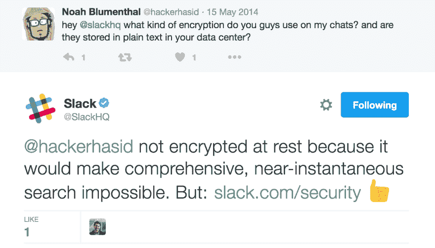

# 超越本地存储

> 原文：<https://dev.to/devtouser432/moving-beyond-localstorage>

很难相信，截至 2016 年，web 应用程序中离线存储的最佳方法是 localStorage，这是一种简单的仅包含字符串的键值存储，数据限制为 5mb。这些类型的存储通常意味着存储用户偏好和基本用户信息。因此，如果您想构建一个提供端到端加密和搜索功能的应用程序，那是不可能的。出于这个原因，我们不得不在隐私方面做出妥协，代价是每天都变得更加昂贵。

但是，当我们廉价出售我们的隐私，让公司肆意利用我们的数据时，少数勇敢的工程师一直在建设网络的未来，我们还没有充分注意到这一点。

搜索和加密是彼此的死敌。简单地说，你不能在加密数据的基础上提供方便的搜索。由于今天 web 应用程序中的大部分繁重工作和数据处理都是在服务器端进行的，因此服务器需要对所有数据进行读取访问。但是如果服务器可以读取你的数据，那么实际上公司的任何工程师都可以读取你的数据，如果一个工程师可以读取你的数据，那么你也可以知道是谁。

[T2】](https://res.cloudinary.com/practicaldev/image/fetch/s--R8rZ7tNQ--/c_limit%2Cf_auto%2Cfl_progressive%2Cq_auto%2Cw_880/https://i.imgur.com/0wRFuKo.png)

企业一直很悠闲地抓住这个借口不放，我们也屈服于它们看似合理的回应。然而，在我们今天所处的 2017 年这个又一个伟大的年份，这个答案不再成立。

输入 WebCrypto 和 IndexedDB。

WebCrypto 和 IndexedDB 是加密、离线和以隐私为中心的网络应用新时代的组合拳。

在 WebCrypto 出现之前，希望在浏览器中执行加密和加密方法的实际应用程序依赖于 CrpytoJS 这样的库，这是一个非常慢的库，无法访问适当的系统资源，并且缺少加密安全的随机数生成器。另一方面，用我能想到的最准确的描述来说，WebCrypto 是一头野兽。CryptoJS 中的 PBKDF2 等密钥派生函数的性能在 6 秒钟内达到了大约 5000 个哈希，而我的简单 WebCrypto 测试在不到一秒钟内运行 150 万个哈希没有问题。这是 web 应用程序世界一直在拼命等待的加密库。

另一端是 IndexedDB:一个完整的、结构化的、可查询的数据库，数据容量限制为用户磁盘空间的 50%，直接在浏览器中提供。截至 2016 年，各大浏览器均支持，包括手机浏览器。这意味着，像那些以私人用户数据为中心的应用程序现在可以轻松地在本地加密数据，将加密的数据发送到服务器，并将解密的数据存储在用户自己的数据库中。

不利用这些用户渴望已久的满足隐私的工具的借口不再是技术上的，而是哲学上的和经济上的。一些公司非常珍惜用户数据，以至于放弃了自己无法阅读这些数据的权利。你知道我指的是哪些公司。他们将继续忽视用户对隐私的需求，后果自负。

网络开发者:颠覆性的工具就在你的脚下。

* * *

*我们已经将 WebCrypto 和 IndexedDB 应用到我们自己的基于 web 的 notes 应用程序中， [Standard Notes](https://standardnotes.com) ，用于端到端加密和完全离线搜索，非常容易，几乎没有阻力。*

关于 [WebCrypto](https://developer.mozilla.org/en-US/docs/Web/API/Web_Crypto_API) 和 [IndexedDB](https://developer.mozilla.org/en-US/docs/Web/API/IndexedDB_API) 的更多信息。IndexedDB 的文档声称它“功能强大，但对于简单的案例来说可能太复杂了”，但对我们来说绝对不是这样。API 是令人高兴的高水平。