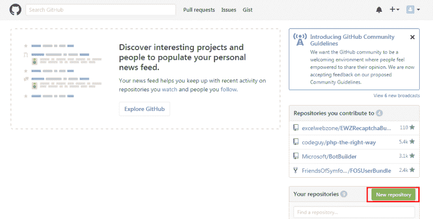
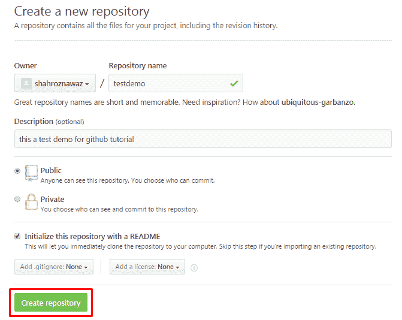
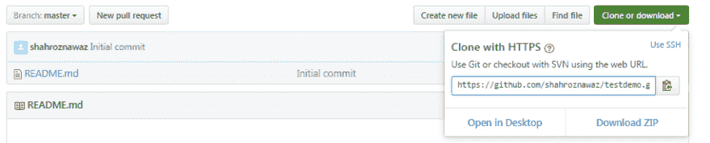
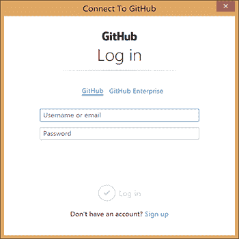
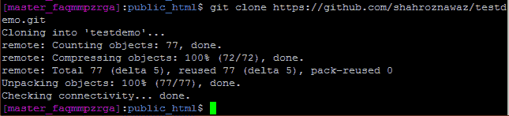
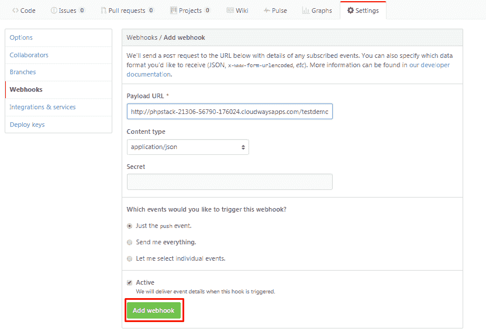
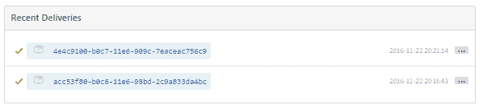

# 使用基本命令实现 Git 中的工作流自动化

> 原文:[https://dev . to/_ shahroznawaz/workflow-automation-in-git-with-basic-commands](https://dev.to/_shahroznawaz/workflow-automation-in-git-with-basic-commands)

Github 是应用程序开发领域新的开源游戏改变者。你可以在 GitHub 上托管你的代码，做一些令人惊奇的事情，包括分支、评论、公关、推和拉。Github 还提供了一套复杂的选项来托管和维护代码。

在这篇文章里，我会做一个从推送代码到自动部署到 live 网站或应用的完整工作流程。出于本教程的目的，我假设您已经制作了一个网站或 web 应用程序，并准备将其推送到 GitHub。

## 在本地机器上安装 Git

该过程的第一步是在本地机器上安装 git。Git 是一个众所周知的代码版本控制系统。Git 由著名的 Linus Torvald 开发，是一个开源项目，它确保代码开发的完整历史得到精心维护。下载 [git 安装程序](https://git-for-windows.github.io/)并将其安装在本地机器上。

## 创建 GitHub 资源库

注册，然后登录到您的 GitHub 帐户。
登录后，单击新建存储库按钮创建新的存储库。
[](https://res.cloudinary.com/practicaldev/image/fetch/s--7O3qZa3m--/c_limit%2Cf_auto%2Cfl_progressive%2Cq_auto%2Cw_880/https://cdn.scotch.io/4182/k51qm7v3Q56OJ0zybTVW_image02.png)

插入存储库的名称和描述，选择 Public，最后单击 Create Repository 按钮。
[T3】](https://res.cloudinary.com/practicaldev/image/fetch/s--QulWghXV--/c_limit%2Cf_auto%2Cfl_progressive%2Cq_auto%2Cw_880/https://cdn.scotch.io/4182/mgB5fyxIRUmraCuHQpeZ_image06.png)

该存储库现在可供进一步处理。

下一步是将代码放入这个存储库中。为此，导航到保存在本地系统中的项目，然后执行下一步。

## 将代码推送到 GitHub

出于本教程的目的，我创建了一个简单的网站。我将推动这个项目在测试演示资源库。以下命令用于将代码推送到 GitHub 存储库。我假设您已经在测试项目的目录中了。接下来，启动命令提示符。

### 去初始化

初始化一个空的。项目目录中的 git 文件夹

### 去添加

运行`git add .`命令将整个目录添加到索引中。如果你只想添加一个文件，那么运行这个命令`git add <filename>`

### 去委员会

此命令发送一条提交消息，其中包含代码中的新更改。
类型`git commit -m “my first commit”`

该命令将提交来自登台环境的所有更改，并创建一个具有唯一 hashcode 的新指针。所有提交都将由唯一的哈希代码标识。

要查看提交的完整历史，请运行以下命令。

`git log`

您将看到列表中的所有提交。

### git 远程添加原点

下一步是添加 GitHub 存储库的 URL，您希望将代码放入其中。因为我已经创建了 testdemo 存储库，所以我将使用相应的链接。

[T2】](https://res.cloudinary.com/practicaldev/image/fetch/s--ACuUSeCf--/c_limit%2Cf_auto%2Cfl_progressive%2Cq_auto%2Cw_880/https://cdn.scotch.io/4182/XnAgcN30QyGODzu9n2La_image07.png)

复制 URL 并运行以下命令
`git remote add origin https://github.com/shahroznawaz/testdemo.git`

这将把远程 URL 添加到 git 索引中，存储库就可以进行代码部署了。

### 去推

最后一步是将代码推送到 GitHub。您还应该指定要将代码推入其中的分支名称。运行以下命令:
`git push origin master`

GitHub 的登录表单将会打开。输入您的 GitHub 凭证，然后点击登录按钮。

[T2】](https://res.cloudinary.com/practicaldev/image/fetch/s--B42rFoLf--/c_limit%2Cf_auto%2Cfl_progressive%2Cq_auto%2Cw_880/http://www.cloudways.com/blog/wp-content/uploads/lkPHoW9aQyKlGnhFynur_image03.png)

一旦处理完成，代码就被成功地推送到 GitHub 存储库。打开 GitHub 并检查存储库。

## 在 Git 中使用分支

Git 以分支的形式提供了运动场，你可以在单独的分支中测试代码，最后将它合并到 master 中。Branch 是一个单独的工作目录，包含它自己的登台环境，您可以在其中提交更改和维护历史。让我们来看看分支的一些主要命令。

### 创建分公司

您可以通过在以下命令中传递名称来创建分支

`git branch demobranch`

现在输入`git branch`你会看到 demobranch 创建在列表中

您还可以通过以下命令在分支之间切换。

`git checkout <branch name>`即`git checkout demobranch`

您将看到头部(*)移动到 demobranch。

## 在任何主机上克隆你的应用

至此，应用程序已经被成功地推送到 GitHub，并且在本地机器上的初始配置已经完成。

现在，我需要在托管服务上托管网站，以便可以测试自动部署功能。。你可以使用任何托管平台进行测试。就个人而言，我更喜欢 [Cloudways](https://www.cloudways.com) ，因为它是一个托管的解决方案。我已经创建了一个帐户，一个 PHP 应用程序已经在我的服务器上运行。

从服务器设置中打开 SSH 终端，使用以下命令克隆应用程序

`git clone https://github.com/shahroznawaz/testdemo.git`

[T2】](https://res.cloudinary.com/practicaldev/image/fetch/s--UWUYOFA7--/c_limit%2Cf_auto%2Cfl_progressive%2Cq_auto%2Cw_880/http://www.cloudways.com/blog/wp-content/uploads/waxFGz3QTsmmqC9z3jOl_image01.png)

查看 staging URL，您将看到[网站](http://phpstack-21306-56790-176024.cloudwaysapps.com/testdemo/)正在运行。

## 创建并上传 github.php 文件

这是教程中令人兴奋的部分。

我现在将创建一个 github.php 文件，并将其上传到托管项目。基本上，我会在文件中添加一个命令，每次从本地机器推送代码时，该命令都会自动提取代码。虽然这看起来很神奇，但答案就在添加到 GitHub 存储库中的 webhook 中。

首先，在 github.php 文件中添加以下命令

```
<?php `git pull`?> 
```

这个简单的命令改变了游戏。要在 github.php 中添加 webhook，首先要在 Cloudways 服务器上找到文件的路径。在我的例子中，路径是:
[http://PHP stack-21306-56790-176024 . cloudwaysapps . com/test demo/github . PHP](http://phpstack-21306-56790-176024.cloudwaysapps.com/testdemo/github.php)

复制路径并粘贴到 GitHub webhook 设置中。

[T2】](https://res.cloudinary.com/practicaldev/image/fetch/s--LVxMUbH_--/c_limit%2Cf_auto%2Cfl_progressive%2Cq_auto%2Cw_880/http://www.cloudways.com/blog/wp-content/uploads/j4UrjyUiTfavrF75Z85Q_image11.png)

添加 webhook 并在本地机器上转到 index.html。对代码进行更改，然后使用以下命令推送代码:

`git add index.html`
`git commit -m “edit some code”`
T2】

检查 webhook，它将显示代码的成功部署是怎样的。

[T2】](https://res.cloudinary.com/practicaldev/image/fetch/s--MM5qwxjZ--/c_limit%2Cf_auto%2Cfl_progressive%2Cq_auto%2Cw_880/http://www.cloudways.com/blog/wp-content/uploads/uXsqsG2BRmCOb3Zd7g0I_image00.png)

## 快速汇总推码

对于不希望阅读上面冗长文章的人来说，下面是五个推送命令的简短总结:

`git init`
`git add .` //(。)是指挥
`git commit -m “my first commit”`
`git remote add origin https://github.com/shahroznawaz/testdemo.git`
`git push origin master`的部分

将代码推送到存储库时，需要输入您的 GitHub 凭证。

## 在 Git 中使用分支

Git 允许你通过为每个想法建立一个分支来测试不同的方法。完成后，您可以将分支与主分支合并。每个分支都是一个独立的工作目录；在这个环境中，您可以提交变更并维护分支的历史。以下是一些重要的分支命令。

您可以通过在以下命令中传递名称来创建分支

`git branch demobranch`

现在输入`git branch`你会看到 demobranch 创建在列表中

您还可以通过下面的命令在分支之间切换。

`git checkout <branch name>`

你会看到`Head(*)`被移动到 demobranch。

## 最后的话

虽然将代码从本地机器推送到实时网站的过程看起来非常诱人，但它经常会产生意想不到的后果。团队中总有可能有人会推出可能会破坏实时项目的代码。在这种情况下，您需要设置分支，然后将最终代码提交给主分支。您还可以使用 deploy 之类的部署库