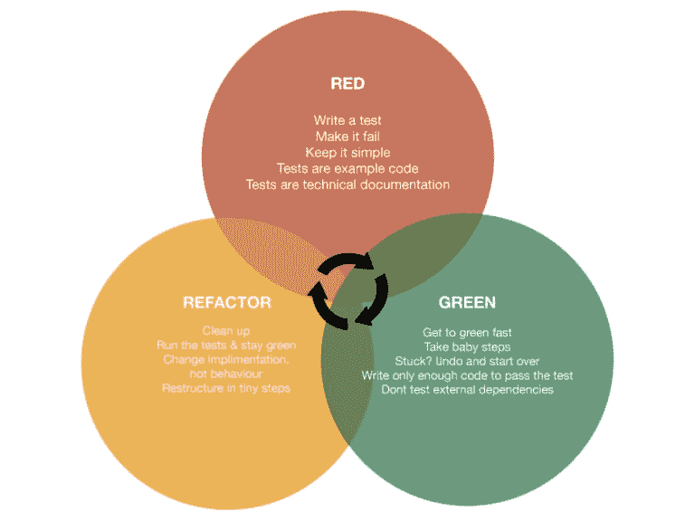

# TDD 过程如何工作

> 原文:[https://dev.to/samueleresca/how-tdd-process-works](https://dev.to/samueleresca/how-tdd-process-works)

*原贴于[samueleresca.net](https://samueleresca.net)T3】*

[T2】](https://res.cloudinary.com/practicaldev/image/fetch/s--iVpJa1jY--/c_limit%2Cf_auto%2Cfl_progressive%2Cq_auto%2Cw_880/http://i.imgur.com/PK1kbSS.png)

## 自动化测试

> 自动化测试为手工测试过程提供了一个解决方案。我们可以指示软件为我们执行这个测试，而不是再次填写表单并点击 submit 来查看客户端验证是否按预期触发。Johansen Christian 的测试驱动的 JavaScript 开发

优点是:

*   只需一次努力就能在众多浏览器中运行测试；
*   在任何后期阶段重新运行测试；
*   计划测试运行；

### 单元测试

单元测试是测试一段生产代码的一段代码。单元测试将应用程序对象设置为已知状态，然后运行代码进行测试，最后将结果与预期结果进行比较。单元测试遵循**隔离指南**:

*   任何测试都不应该依赖于另一个测试；
*   测试应该能够同时并以任何顺序运行；
*   为了维护隔离，有时有必要模拟或存根测试依赖关系；
*   一个测试应该只使用一个单元，但是它可以使用一个或多个断言；

#### 设置(测试夹具)

Setup，或 test fixture，是在单元测试执行之前运行的一段代码。它将应用程序的状态设置为“已知状态”。

#### 嘲讽

你开发的大多数软件是由各种类和组件组成的，模拟对象模仿真实组件的行为。“模仿”已经成为各种模仿的通称。马丁·福勒写了一篇文章，解释了模仿、存根、伪造、间谍和假人的区别。

#### 断言

断言是单元测试的主要部分，断言是检查应用程序状态的断言。当断言失败时，测试停止，系统通知失败。**单元测试示例**下面的 javascript 代码展示了一组简单的单元测试:【https://gist.github.com/samueleresca/e0b4a95e73e8259e0b82】T2

#### 单元测试的好处

测试您的应用程序需要时间，并且手动测试过程效率非常低。使用单元测试有很多好处:回归测试、重构和跨浏览器测试。Â

## TDD 流程

[T2】](https://res.cloudinary.com/practicaldev/image/fetch/s--bEIzTTqH--/c_limit%2Cf_auto%2Cfl_progressive%2Cq_auto%2Cw_880/http://samueleresca.net/wp-content/uploads/2016/02/Test-First-300x232.jpg)

测试驱动开发——是一种将单元测试移到最前面的编程技术。在测试驱动的开发中，在编写产品代码之前，测试被写成规格说明:我们必须描述我们试图解决的问题。——换句话说，TDD 要求我们在提供解决方案之前**考虑结果**。

### TDD 步骤

1.  编写单元测试对于你要实现的功能，单元测试应该简短，并集中在功能的单个行为上。测试描述了您正在实现的对象，除非对象本身改变，否则没有必要改变它们；
2.  **看着测试失败**而不写通过的代码——允许我们确认我们关于代码当前状态的理论；
3.  **通过提供可能有效的**最简单的解决方案**使测试通过**；
4.  **重构去除重复。**最后，我们需要“审查工作”并进行必要的调整，以消除重复并改进设计。在这个步骤中，只有一个规则需要遵守:测试应该保持绿色；

### TDD 的好处

TDD 最大的好处是它产生了能够工作的代码，并迫使我们在写代码之前对代码进行 T2 思考。TDD 过程描述了“孤立的专门化组件”,并且遵循了**单一责任原则**。

## 结论

测试驱动开发是一种技术，旨在帮助产生我们更有信心的干净代码，它很可能会降低压力水平，并帮助您更多地享受编码。关于 Javascript 中 TDD 的更多信息:使用 Mocha 和 Karma 的 TDD