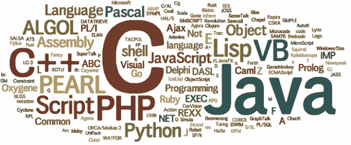

# 编程语言重要吗？

> 原文:[https://dev.to/pbeekums/do-programming-languages-matter](https://dev.to/pbeekums/do-programming-languages-matter)

对编程语言给予了很多关注。很多公司都会列出“PHP 开发人员”或者“Java 程序员”这样的职位。那些对学习如何编码感兴趣的人经常会问他们应该学习什么语言。开发人员自己也在争论各种语言的优点。

 

你懂什么编程语言真的重要吗？

越来越多的人，包括我自己，在招聘时不考虑已知的语言。面试候选人时，允许他们使用任何想要的语言(甚至伪代码)。这个想法是我们想要测试一个候选人是否很好的理解了软件开发的基础知识。一个对基础有很强理解的开发者将会很快学会一门新的语言。缺乏这些基本要素的人将需要更长的时间来掌握它们。

然而，并非所有的编程语言都是相同的。事实上，许多人强迫你以不同于你可能习惯的范式工作。有一段时间，我最常用的语言是 Java、Javascript 和 PHP。我非常依赖许多面向对象的编程模式，这些模式在 Golang 中是不可能的。Golang 删除了这些模式，认为开发人员应该尝试更好的模式。

起初我认为 Golang 是荒谬的，并不认为它的创造者做出了良好的决定。然而，在尝试之后，我意识到有一些真正有效的观点。我很容易地将我获得的**新观点**应用到我用其他编程语言完成的工作中。事实上，我没有用 Golang 写那么多代码，这是无关紧要的，因为从学习 Golang 中获得的知识是有价值的。

编程语言仍然是软件，我们可以用任何语言构建任何软件。这意味着除了少数例外，语言之间的差异主要在于个人偏好。不同的语言使一些事情变得简单，一些事情变得困难。他们都有自己的**取舍**。

 

我认为重要的是利用不同的范例。如果你已经了解 Java，那么学习 C#也没什么好处。除了一些迂腐的地方，这两种语言非常相似。虽然 PHP 和 Python 有许多明显的不同，但人们在用两者编写代码时倾向于使用相同的模式。与你所知的语言大相径庭的语言是知识的宝库。他们向您介绍的每个新概念都是您的开发人员工具箱中的另一个工具。像所有工具一样，它们不会适用于所有问题。但是拥有更多的工具会给你更多的选择来解决任何问题。

学习 Golang 无疑给我的工具箱增加了一些新工具。我从这门语言中获得的视角是我所有 Java/PHP 经验的无价之宝。对我来说，这当然比学习 C#更有用(尽管我确实喜欢 c#)。

我列表中的下一种语言是 Haskell 和 Erlang。我听说过关于他们的奇妙的事情，我期待看到他们使用的范例。即使我从未在我每天构建的软件中使用这些语言，这些语言向我介绍的概念将使我成为一名更好的开发人员。

*本帖最初发表于[blog.professorbeekums.com](https://blog.professorbeekums.com/2017/01/do-programming-languages-matter.html)T3】*