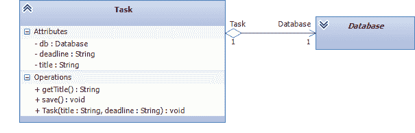
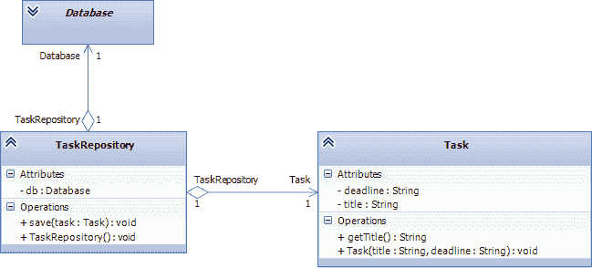
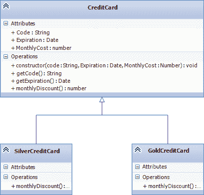
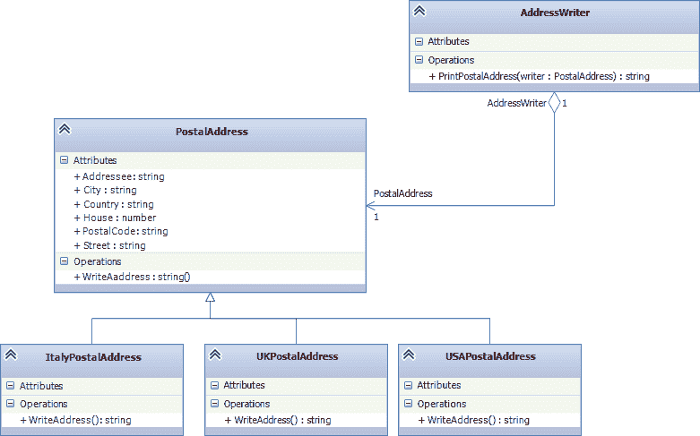
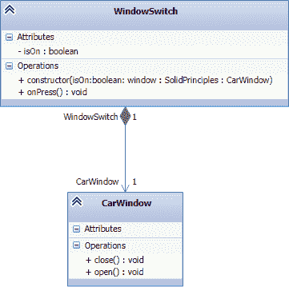
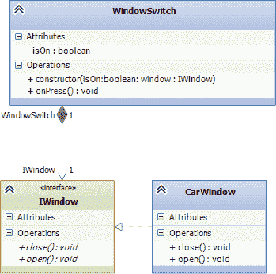

# 使用 Typescript 的坚实原则

> 原文：<https://dev.to/samueleresca/solid-principles-using-typescript>

SOLIDÂ * *是 Robert C. Martin 的* *前五个面向对象设计(OOD)原则的首字母缩写，通常被称为 [@UncleBob](https://twitter.com/unclebobmartin) 。五项坚实的原则是:

*   **单一责任原则:**一个类应该有且只有一个变更原因；
*   开-闭原则:应该可以扩展一个类的行为而不用修改它；
*   **利斯科夫替换原则:**子类应该可以替换其超类；
*   **接口分离原则:**许多小型的、客户端专用的接口比一个通用接口要好；
*   **依赖倒置原则:**依赖抽象而非具体化；

这些原则使得程序员开发易于维护和扩展的软件变得容易。它们还使开发人员容易避免代码味道，容易重构代码，并且也是敏捷或适应性软件开发的一部分。

## 单一责任原则(SRP)

SRP 要求一个类应该只有一个改变的理由。遵循这个原则的类只执行**几个相关的任务**。当考虑 SRP 时，你不需要将你的思维局限于类。Y* *你可以将该原则应用于方法或模块* *，确保它们只做一件事，因此只有* *个理由改变* *。Â

### 举例——错误的方式

类`Task`定义了与模型相关的**属性，但是它也定义了**数据访问方法来保存通用数据源上的实体**:**

#### UML

[](https://res.cloudinary.com/practicaldev/image/fetch/s--6pO9E5k9--/c_limit%2Cf_auto%2Cfl_progressive%2Cq_auto%2Cw_880/http://samueleresca.net/wp-content/uploads/2016/08/SRP_error.png) 

```
/*
* THE  CLASS DOESN'T FOLLOW THE SRP PRINCIPLE
*/
class Task {
    private db: Database;

    constructor(private title: string, private deadline: Date) {
        this.db = Database.connect("admin:password@fakedb", ["tasks"]);
    }

    getTitle() {
        return this.title + "(" + this.deadline + ")";
    }
    save() {
        this.db.tasks.save({ title: this.title, date: this.deadline });
    }
} 
```

Enter fullscreen mode Exit fullscreen mode

### 举例——正确的方式

—`Task`类可以分为负责模型描述的`Task`类和负责存储数据的`TaskRepository`类。

#### UML

[](https://res.cloudinary.com/practicaldev/image/fetch/s--IuP5jx8k--/c_limit%2Cf_auto%2Cfl_progressive%2Cq_auto%2Cw_880/http://samueleresca.net/wp-content/uploads/2016/08/srp-right.png) 

```
class Task {

    constructor(private title: string, private deadline: Date) {
    }

    getTitle() {
        return this.title + "(" + this.deadline + ")";
    }

}

class TaskRepository {
    private db: Database;

    constructor() {
        this.db = Database.connect("admin:password@fakedb", ["tasks"]);
    }

    save(task: Task) {
        this.db.tasks.save(JSON.stringify(task));
    }
} 
```

Enter fullscreen mode Exit fullscreen mode

## 开闭原则(OCP)

> 软件实体应该对扩展开放，但对修改关闭。

更改现有类的风险是您将引入行为上的意外变化。解决方案是创建另一个覆盖原始类行为的类。通过遵循 OCP，一个**组件更有可能包含可维护和可重用的代码**。

### 举例——正确的方式

`CreditCard`类描述了一种计算`monthlyDiscount()`的方法。`monthlyDiscount()` **取决于卡的种类**，可以是:**银的或者金的**。要更改月折扣计算，您应该创建另一个类来覆盖`monthlyDiscount()`方法。解决方案是创建两个新类:每种类型的卡一个。

#### UML

[](https://res.cloudinary.com/practicaldev/image/fetch/s--o02ZwuKv--/c_limit%2Cf_auto%2Cfl_progressive%2Cq_auto%2Cw_880/http://samueleresca.net/wp-content/uploads/2016/08/OCP_right.png)T3】

```
class CreditCard {
    private Code: String;
    private Expiration: Date;
    protected MonthlyCost: number;

    constructor(code: String, Expiration: Date, MonthlyCost: number) {
        this.Code = code;
        this.Expiration = Expiration;
        this.MonthlyCost = MonthlyCost;
    }

    getCode(): String {
        return this.Code;
    }

    getExpiration(): Date {
        return this.Expiration;
    }

    monthlyDiscount(): number {
        return this.MonthlyCost * 0.02;
    }

}

class GoldCreditCard extends CreditCard {

    monthlyDiscount(): number {
        return this.MonthlyCost * 0.05;
    }
}

class SilverCreditCard extends CreditCard {

    monthlyDiscount(): number {
        return this.MonthlyCost * 0.03;
    }
} 
```

Enter fullscreen mode Exit fullscreen mode

## 利斯科夫替代原理(LSP)

> 子类不应该破坏父类的类型定义。

这一原则的概念是由 Barbara Liskov 在 1987 年的会议主旨中提出的，后来在 1994 年与 Jannette Wing 一起发表在一篇论文中。就这么简单，子类应该覆盖父类方法，从客户的角度来看**不会破坏功能**。

### 举例

在下面的例子中，`ItalyPostalAddress`、`UKPostalAddress`和`USAPostalAddress`扩展了一个公共类:`PostalAddress`。`AddressWriter`类引用`PostalAddress`:`writer`**参数可以是三种不同的子类型**。

#### UML

[](https://res.cloudinary.com/practicaldev/image/fetch/s--1LYSVMc_--/c_limit%2Cf_auto%2Cfl_progressive%2Cq_auto%2Cw_880/http://samueleresca.net/wp-content/uploads/2016/08/lisp_right.png)T3】

```
abstract class PostalAddress {
    Addressee: string;
    Country: string
    PostalCode: string;
    City: string;
    Street: string
    House: number;

    /*
    * @returns Formatted full address
    */
    abstract WriteAddress(): string;
}

class ItalyPostalAddress extends PostalAddress {
    WriteAddress(): string {
        return "Formatted Address Italy" + this.City;
    }
}
class UKPostalAddress extends PostalAddress {
    WriteAddress(): string {
        return "Formatted Address UK" + this.City;
    }
}
class USAPostalAddress extends PostalAddress {
    WriteAddress(): string {
        return "Formatted Address USA" + this.City;
    }
}

class AddressWriter {
    PrintPostalAddress(writer: PostalAddress): string {
        return writer.WriteAddress();
    }
} 
```

Enter fullscreen mode Exit fullscreen mode

## 接口隔离原理(ISP)

发现接口本质上只是整个类的描述是很常见的。ISP 声明**我们应该编写一系列由类实现的更小更具体的接口**。**每个接口提供一个单独的行为**。Â

### 举例——错误的方式

下面的`Printer`接口使得无法实现可以打印和复印，但不能装订的打印机:

```
interface Printer {
    copyDocument();
    printDocument(document: Document);
    stapleDocument(document: Document, tray: Number);
}

class SimplePrinter implements Printer {

    public copyDocument() {
        //...
    }

    public printDocument(document: Document) {
        //...
    }

    public stapleDocument(document: Document, tray: Number) {
        //...
    }

} 
```

Enter fullscreen mode Exit fullscreen mode

### 举例——正确的方式

下面的示例展示了一种将方法分组到更具体的接口中的替代方法。它描述了可由简单打印机或简单复印机或超级打印机单独执行的多个合同:

```
interface Printer {
    printDocument(document: Document);
}

interface Stapler {
    stapleDocument(document: Document, tray: number);
}

interface Copier {
    copyDocument();
}

class SimplePrinter implements Printer {
    public printDocument(document: Document) {
        //...
    }
}

class SuperPrinter implements Printer, Stapler, Copier {
    public copyDocument() {
        //...
    }

    public printDocument(document: Document) {
        //...
    }

    public stapleDocument(document: Document, tray: number) {
        //...
    }
} 
```

Enter fullscreen mode Exit fullscreen mode

## 依存倒置原则(DIP)

DIP 简单地说明了高级类不应该依赖于低级组件，而是依赖于抽象。

### 举例——错误的方式

高级`WindowSwitch`依赖于低级`CarWindow`类:

#### UML

[](https://res.cloudinary.com/practicaldev/image/fetch/s--G03UDUnw--/c_limit%2Cf_auto%2Cfl_progressive%2Cq_auto%2Cw_880/http://samueleresca.net/wp-content/uploads/2016/08/dip_wrong.png)T3】

```
class CarWindow {
    open() {
        //... 
    }

    close() {
        //...
    }
}

class WindowSwitch {
    private isOn = false;

    constructor(private window: CarWindow) {

    }

    onPress() {
        if (this.isOn) {
            this.window.close();
            this.isOn = false;
        } else {
            this.window.open();
            this.isOn = true;
        }
    }
} 
```

Enter fullscreen mode Exit fullscreen mode

### 举例——正确的方式

为了跟随 DIP，类`WindowSwitch`应该引用由对象`CarWindow`实现的接口(`IWindow`):

#### UML 

```
interface IWindow {
    open();
    close();
}

class CarWindow implements IWindow {
    open() {
        //...
    }

    close() {
        //...
    }
}

class WindowSwitch {
    private isOn = false;

    constructor(private window: IWindow) {

    }

    onPress() {
        if (this.isOn) {
            this.window.close();
            this.isOn = false;
        } else {
            this.window.open();
            this.isOn = true;
        }
    }
} 
```

Enter fullscreen mode Exit fullscreen mode

## 最后的想法

Typescript 使得将 OOP 的所有原则和实践引入到您的软件中成为可能，使用可靠的原则来指导您的设计模式。这里是包含完整示例的 GitHub 库。