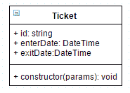
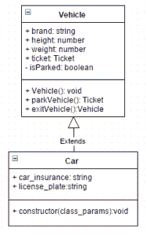
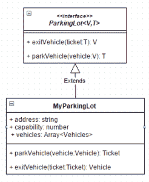

# Typescript 简介:语言特性

> 原文：<https://dev.to/samueleresca/introducing-typescript-language-features>

原贴于[https://samueleresca.net](https://samueleresca.net)

下面的帖子描述了一个使用 Typescript 和 OOP 模式的停车场，演示的范围是展示一些 Typescript 语言的特性。

### 介绍打字稿和设置项目

我已经写了[这篇关于 typescript 的文章](http://samueleresca.net/2015/11/introducing-typescript/)，让我们跟随它使用一个简单的编辑器和 [GruntJs](http://gruntjs.com/) 来设置项目。

## 问题

```
Design an OO parking lot using typescript language features
```

## 解

### 模型概述

我们将实现一个通用的停车场票务系统，使用下面的类和接口:

*   [车票](#ticket)
*   [车辆，汽车](#vehicle)
*   [停车场](#parkinglot)

#### 车票

[](http://samueleresca.net/wp-content/uploads/2015/11/typescript-langfeatures-ticket.png)**车票**类由**车辆**类使用:描述停放车辆与进入车票之间的关联。它定义了一个 id，进入和退出日期。使用当前时间和汽车牌照的组合来计算 id。

Lang 特性:[基本类型](http://www.typescriptlang.org/Handbook#basic-types)、[类](http://www.typescriptlang.org/Handbook#classes)、 [Getter/Setter](http://www.typescriptlang.org/Handbook#classes-accessors)

**源代码**【https://gist.github.com/589b0f440e1a84d0ba66 T2】

#### 车辆

[](http://samueleresca.net/wp-content/uploads/2015/11/blog-ts-langfeatures-Vehicle.png)**车辆**类包含一些关于车辆尺寸、品牌和牌照的属性。它还包含将车辆停入/驶出停车场的方法。**汽车**扩展了车辆类别，它增加了额外的信息:汽车保险。最终可以扩展 Vehicle 类来添加其他车辆类型。

Lang 特性:[基本类型](http://www.typescriptlang.org/Handbook#basic-types)、[类](http://www.typescriptlang.org/Handbook#classes)、[Getter/Setter；](http://www.typescriptlang.org/Handbook#classes-accessors)、[继承](http://www.typescriptlang.org/Handbook#classes-inheritance)

**源代码**【https://gist.github.com/3f48c0317ee86589e6d8 T2】

#### 停车场

[](http://samueleresca.net/wp-content/uploads/2015/11/typescript-langfeatures-parkinglot.png)**停车场**用一个接口和一个类的组合来描述:接口包含函数签名，具体的类包含一个用作车辆容器的数组。 **ParkingLot** 使用* *自定义查找方法** 在数组中查找对象。

Lang 特性:[基本类型](http://www.typescriptlang.org/Handbook#basic-types)、[类](http://www.typescriptlang.org/Handbook#classes)、[继承](http://www.typescriptlang.org/Handbook#classes-inheritance)、[泛型](http://www.typescriptlang.org/Handbook#generics)

**源代码**https://gist.github.com/cfb74ed2ca148154c0b0T4**T2[github](https://github.com/samueleresca/blog-typescript-langfeatures)T8】上有源代码**