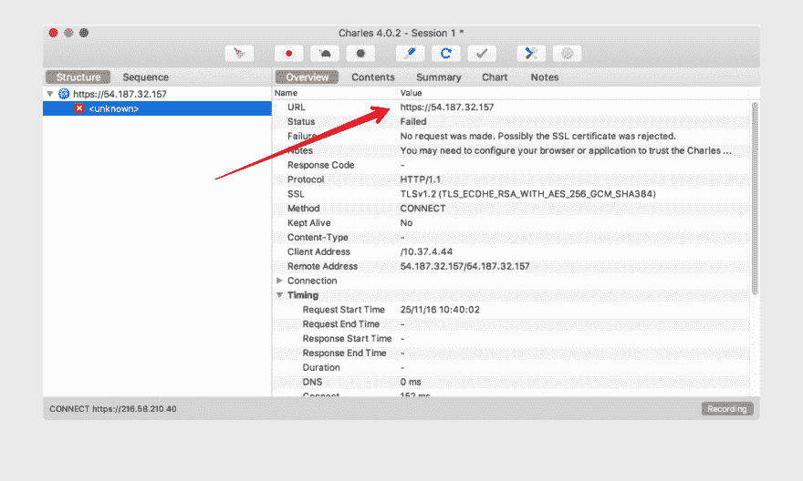

# Android 中的证书锁定

> 原文:[https://dev.to/mplacona/certificate-pinning-in-android](https://dev.to/mplacona/certificate-pinning-in-android)

证书锁定是一种安全机制，它允许使用 HTTPS 服务的 HTTPS 网站和应用程序抵御攻击者使用错误颁发的或其他欺诈性证书的假冒。

通过证书锁定，有可能减轻或严重降低通过假冒后端服务器的 SSL 证书实现的 [MiTM](https://en.wikipedia.org/wiki/Man-in-the-middle_attack) 攻击的有效性。

如果你已经在使用 API 或带有 [OkHTTP](http://square.github.io/okhttp/) 的服务或任何使用它的库，比如[翻新](https://square.github.io/retrofit/)或[毕加索](http://square.github.io/picasso/)，好消息是你已经成功了一半。

让我们看看下面这个来自[文档](https://github.com/square/okhttp/wiki/Recipes#synchronous-get)的例子:

```
private final OkHttpClient client = new OkHttpClient();
public void run(String url) throws Exception {
    Request request = new Request.Builder()
            .url(url)
            .build();

    client.newCall(request).enqueue(new Callback() {
        @Override
        public void onFailure(Call call, IOException e) {
            Log.e(TAG, "onFailure: " + e.getMessage());
        }

        @Override
        public void onResponse(Call call, okhttp3.Response response) throws IOException {
            Log.d(TAG, "onResponse: " + response.body().string());

        }
    });
} 
```

<svg width="20px" height="20px" viewBox="0 0 24 24" class="highlight-action crayons-icon highlight-action--fullscreen-on"><title>Enter fullscreen mode</title></svg> <svg width="20px" height="20px" viewBox="0 0 24 24" class="highlight-action crayons-icon highlight-action--fullscreen-off"><title>Exit fullscreen mode</title></svg>

你应该这样运行它:

```
run("https://publicobject.com/helloworld.txt"); 
```

<svg width="20px" height="20px" viewBox="0 0 24 24" class="highlight-action crayons-icon highlight-action--fullscreen-on"><title>Enter fullscreen mode</title></svg> <svg width="20px" height="20px" viewBox="0 0 24 24" class="highlight-action crayons-icon highlight-action--fullscreen-off"><title>Exit fullscreen mode</title></svg>

此时你会想:

> 太好了！我要经过 HTTPS，所以这一定很安全，对吗？

良好的...号码

有了足够的关于代理的知识(注意，我的知识刚刚够)，就可以拦截那个请求并查看每个传入和传出的包...作为纯文本！

[T2】](https://res.cloudinary.com/practicaldev/image/fetch/s--zaw-7C__--/c_limit%2Cf_auto%2Cfl_progressive%2Cq_auto%2Cw_880/https://www.androidsecurity.inimg/00.png)

现在，如果我们稍微改变我们的客户端，我们可以添加证书锁定，这将使别人更难假冒我们的证书，我们的应用程序将拒绝通过该证书发出请求。

```
private CertificatePinner certificatePinner = new CertificatePinner.Builder()
    .add("publicobject.com", "sha256/0jQVmOH3u5mnMGhGRUCmMKELXOtO9q8i3xfrgq3SfzI")
    .build();

private final OkHttpClient client = new OkHttpClient
    .Builder()
    .certificatePinner(certificatePinner)
    .build(); 
```

<svg width="20px" height="20px" viewBox="0 0 24 24" class="highlight-action crayons-icon highlight-action--fullscreen-on"><title>Enter fullscreen mode</title></svg> <svg width="20px" height="20px" viewBox="0 0 24 24" class="highlight-action crayons-icon highlight-action--fullscreen-off"><title>Exit fullscreen mode</title></svg>

您的代码将出错并记录一条类似这样的消息。

``sh
E/MainActivity: onFailure: Certificate pinning failure!
Peer certificate chain:
sha256/afwiKY3RxoMmLkuRW1l7QsPZTJPwDS2pdDROQjXw8ig=: CN=publicobject.com,OU=PositiveSSL,OU=Domain Control Validated
sha256/klO23nT2ehFDXCfx3eHTDRESMz3asj1muO+4aIdjiuY=: CN=COMODO RSA Domain Validation Secure Server CA,O=COMODO CA Limited,L=Salford,ST=Greater Manchester,C=GB
sha256/grX4Ta9HpZx6tSHkmCrvpApTQGo67CYDnvprLg5yRME=: CN=COMODO RSA Certification Authority,O=COMODO CA Limited,L=Salford,ST=Greater Manchester,C=GB
Pinned certificates for publicobject.com:
sha256/0jQVmOH3u5mnMGhGRUCmMKELXOtO9q8i3xfrgq3SfzI=`` 

 ``而这位就是**伟大的**！因为它告诉我们应该使用哪个[散列。因此，现在我们可以更改代码，使用错误中描述的键，如下所示:](https://en.wikipedia.org/wiki/Secure_Hash_Algorithm)

``java
private CertificatePinner certificatePinner = new CertificatePinner.Builder()
.add("publicobject.com", "sha256/afwiKY3RxoMmLkuRW1l7QsPZTJPwDS2pdDROQjXw8ig=")
.add("publicobject.com", "sha256/klO23nT2ehFDXCfx3eHTDRESMz3asj1muO+4aIdjiuY=")
.add("publicobject.com", "sha256/grX4Ta9HpZx6tSHkmCrvpApTQGo67CYDnvprLg5yRME=")
.build();`` 

 ``果不其然，如果你再次运行你的代码，一切都应该像预期的那样工作
,但是有一个额外的好处。我们的代码现在正在检查
主机的证书是否与我们期望的相匹配。如果没有，它将拒绝提出请求。

然后代理会返回一条消息说:`No request was made. Possibly the SSL certificate was rejected.`。

[T2】](https://res.cloudinary.com/practicaldev/image/fetch/s--nUQDK_i1--/c_limit%2Cf_auto%2Cfl_progressive%2Cq_auto%2Cw_880/https://www.androidsecurity.inimg/01.png)

现在，我们已经将证书与代码绑定在一起。````