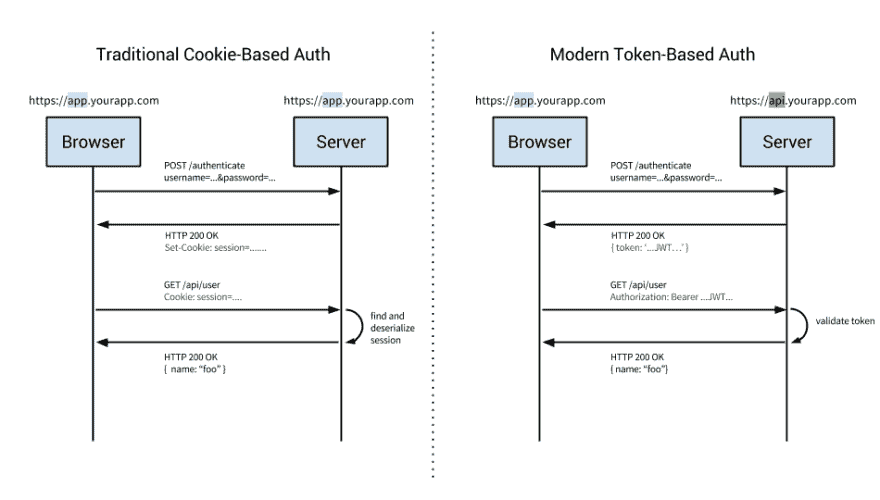
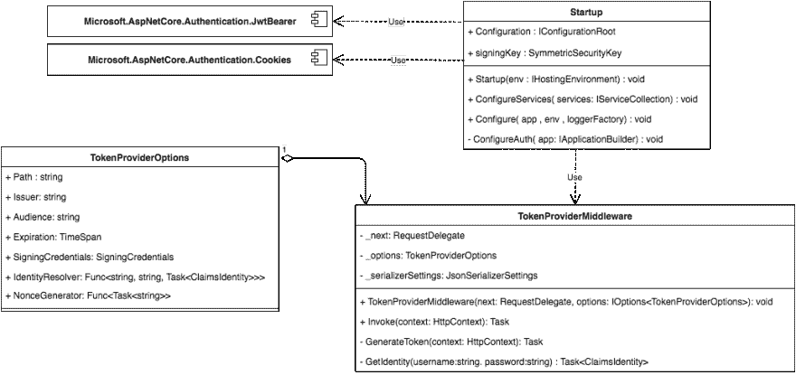

# 使用 ASP.NET 核心开发令牌认证

> 原文:[https://dev . to/samueleresca/developing-token-authentic ation-using-aspnet-core](https://dev.to/samueleresca/developing-token-authentication-using-aspnet-core)

原贴于[https://samueleresca.net](https://samueleresca.net)

# 使用 ASP.NET 核心开发令牌认证

[T2】](https://res.cloudinary.com/practicaldev/image/fetch/s--dTIZp4P6--/c_limit%2Cf_auto%2Cfl_progressive%2Cq_auto%2Cw_880/https://i2.wp.com/samueleresca.net/wp-content/uploads/2016/09/d84b2bbd-9efe-4bf0-9623-b93029987772-original.jpeg%3Fresize%3D300%252C169%26ssl%3D1)

## 介绍

下面的文章展示了如何使用 ASP.NET 核心开发令牌认证。

我已经在这里写了 ASP.NET 核心:

*   [ASP.NET 的未来是开源和跨平台](https://samueleresca.net/2016/01/future-of-aspnet-is-open-source-and-cross-platform/)；
*   [在 Ubuntu 上介绍 ASP.NET 5](https://samueleresca.net/2015/12/introducing-asp-net-5-on-ubuntu/)；
*   使用查询 MongoDB。网芯；

## 基于令牌的身份验证概述

如今，基于令牌的认证在 web 上非常普遍，任何主要的 API 或 web 应用程序都使用令牌。

令牌认证是**无状态的**，**安全的**，**被设计成可扩展的**。事实上，它正迅速成为现代单页面应用程序和移动应用程序的事实标准。

[T2】](https://samueleresca.net/wp-content/uploads/2016/12/cookie-token-auth.png)

### 基于服务器的认证的问题

身份验证是应用程序确认用户身份的过程。应用程序传统上通过会话 cookies 持久化身份，依赖于存储在服务器端的会话 id。这种技术引起的几个主要问题是:

*   **可伸缩性**:如果会话存储在内存中，这会带来可伸缩性的问题；
*   CORS:由于我们想扩展我们的应用程序，让我们的数据可以在多个移动设备上使用，我们不得不担心跨来源的资源共享(CORS)；
*   **CSRF** :我们还将有针对[跨站请求伪造](http://en.wikipedia.org/wiki/Cross-site_request_forgery) (CSRF)的保护；
*   **Sessions** :每次用户被认证，服务器都需要在我们的服务器上创建一个记录；

### 基于令牌的身份验证的工作原理

基于令牌的认证是无状态的。它不在服务器或会话中存储任何关于我们用户的信息。

以下是基于令牌的身份验证的**常见步骤**:

1.  用户使用用户名/密码请求访问；
2.  应用程序向客户端提供签名的令牌；
3.  客户端存储该令牌并随每个请求一起发送；
4.  服务器验证令牌并用数据响应；

每个请求都需要令牌。令牌应该在 HTTP 头中发送，以保持无状态 HTTP 请求的概念。

## 使用 ASP.Net 核心实现基于令牌的认证

这个例子展示了如何使用 ASP.NET 核心开发令牌认证，下面的 UML 模式展示了项目的架构:

[T2】](https://samueleresca.net/wp-content/uploads/2016/12/download.png)

### 设置项目

首先，有必要创建新的 ASP.NET 核心项目。我建议使用[ASP.NET Yeoman Generator](https://www.npmjs.com/package/generator-aspnet)生成使用 **Web 应用**模板和 [Visual Studio 代码](https://code.visualstudio.com/)编辑代码的项目。

成功创建项目后，将以下配置添加到您的`appsettings.json`:

[https://gist.github.com/978e16a046424d00e933eca778702d93](https://gist.github.com/978e16a046424d00e933eca778702d93)

`TokenAuthentication`部分配置一些关于令牌生成的公共信息，例如令牌使用的`SectionKey`。

### 令牌传输/验证

有两种方式来传输授权令牌:

1.  使用 HTTP 授权头(也称为载体认证)；
2.  使用浏览器 cookies 保存认证令牌；

#### 不记名令牌验证

`Microsoft.AspNetCore.Authentication.JwtBearer`包使您能够通过使用 JWT 令牌来保护路由。

要启用不记名令牌认证，请在 **project.json** 中导入以下 Nuget 包`Microsoft.AspNetCore.Authentication.JwtBearer`:

[https://gist . github . com/samueleresca/c4dd 98829 e7b 8 d3e 830255 cf 958 c 6333](https://gist.github.com/samueleresca/c4dd98829e7b8d3e830255cf958c6333)

要初始化载体认证，您需要分割您的`Startup.cs`文件并使用另一个分部类，例如`Startup.Auth.cs`:

[https://gist . github . com/samueleresca/66256d 739 CB 20 c0a 848 F8 c 43240 F12 b 4](https://gist.github.com/samueleresca/66256d739cb20c0a848f8c43240f12b4)

`Startup.Auth.cs`文件使用`appsettings.json` 文件中定义的配置初始化载体认证。Cookie 验证也将使用`tokenValidationParamaters`对象。

#### Cookies 验证

Cookie 验证支持浏览器 cookie 上的令牌传输，要支持 cookie 令牌认证，您需要在`project.json`中添加以下包:

`"Microsoft.AspNetCore.Authentication.Cookies": "1.0.0"`

并为输入令牌创建一个定制的验证器。

要创建新的验证器，添加下面的`CustomJwtDataFormat.cs`文件:

[https://gist . github . com/samueleresca/EC 310 b 096 a 8543 EB 170 D2 fdebcbef 8 b 7](https://gist.github.com/samueleresca/ec310b096a8543eb170d2fdebcbef8b7)

方法描述和验证由输入令牌提供的信息。调用`Startup.Auth.cs`文件中的以下方法，以使用 Cookie 认证:

[https://gist . github . com/samueleresca/424 b 2062 a 9 CEE 7 DAA 58672 e 5 fdec 0d 1d](https://gist.github.com/samueleresca/424b2062a9cee7daa58672e5fdec0d1d)

### 令牌生成

ASP.NET 核心中没有对令牌生成的本地支持，但是从头开始编写一个定制的令牌生成器中间件是可能的。

首先，您需要创建一个实现令牌选项的类:

[https://gist . github . com/samueleresca/c 475 Abd 4a 6831 a 23981 a 55d 76223757 b](https://gist.github.com/samueleresca/c475abd4a6831a23981a55d76223757b)

中间件类将使用`TokenProviderOptions.cs`来生成令牌:

[https://gist . github . com/samueleresca/e 4 e 7 f1 f 06 c 6 af 12 fb1 b 126 a 0479 e 0054](https://gist.github.com/samueleresca/e4e7f1f06c6af12fb1b126a0479e0054)

`TokenProviderMiddleware`类实现了`Invoke`方法，通过使用`TokenProviderOptions`来生成令牌。为了初始化中间件，需要修改`Startup.Auth.cs`文件并添加`ConfigureAuth`方法:

[https://gist . github . com/samueleresca/4c8 a 8844 a 944005 a 4086 fa 20 b 0 ebbfad](https://gist.github.com/samueleresca/4c8a8844a944005a4086fa20b0ebbfad)

`tokenProviderOptions`定义了令牌生成器的选项。`IdentityResolver`是检查用户身份的任务方法。出于演示的目的，`IdentityResolver`是通过一个叫做`GetIdentity.`的简单方法实现的

### 最后的步骤

现在可以调用`Startup.cs`文件中的`ConfigureAuth`方法:

[https://gist . github . com/samueleresca/765 a08 c 9681 f 8478074014 F2 c 910 a 0 f 3](https://gist.github.com/samueleresca/765a08c9681f8478074014f2c910a0f3)

#### 获取令牌

使用`POST`调用以下路由`/api/token/`，传递**用户名**和**密码**数据，即可获得 JWT 令牌:

`POST api/token
Content-Type: application/x-www-form-urlencoded
username=TEST&password=TEST123`

#### 授权控制器

所有由属性`[Authorize]`修饰的控制器都受到 JWT 认证的保护。
在每个 http 调用中，您需要传递`access_token`参数:

`[http://hostname/controller/route?access_token=MY_TOKEN](http://hostname/controller/route?access_token=MY_TOKEN)`

Github 上的[提供了演示代码。](https://github.com/samueleresca/Blog.TokenAuthGettingStarted)

干杯:)