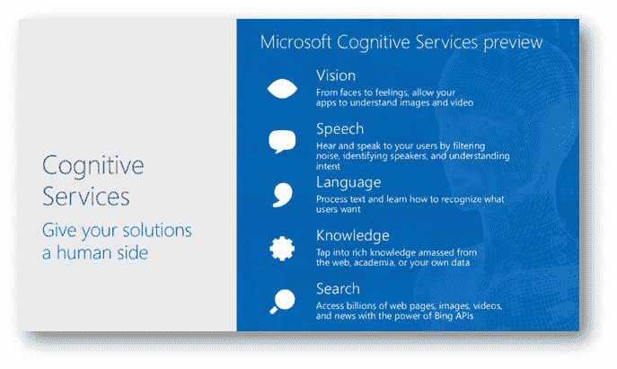
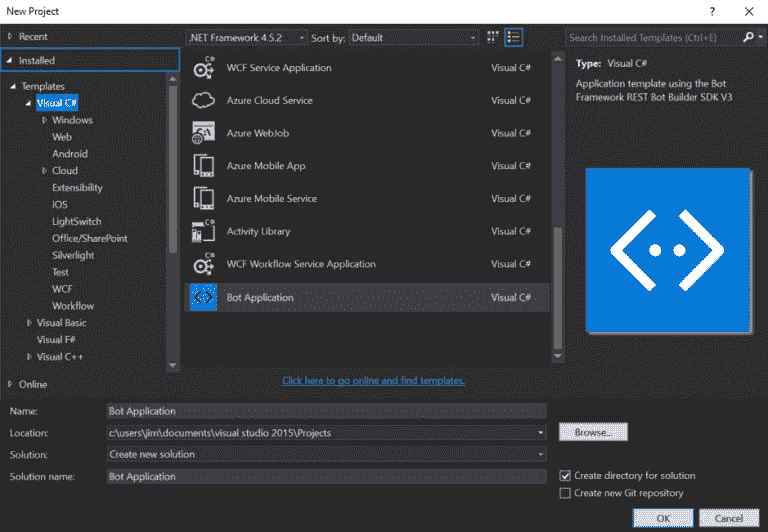
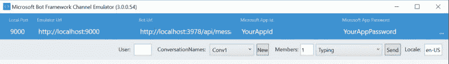
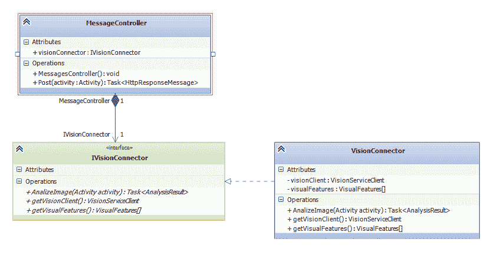
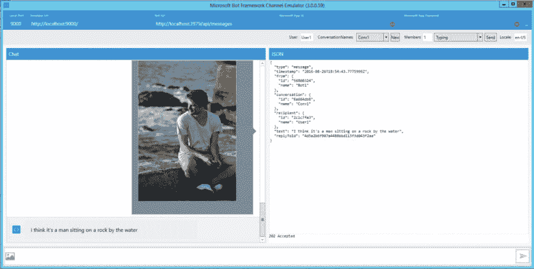

# 开发人工智能。网

> 原文:[https://dev . to/samueleresca/developing-artificial-intelligence-using-net](https://dev.to/samueleresca/developing-artificial-intelligence-using-net)

*原贴于[samueleresca.net](https://samueleresca.net)T3】*

[T2】](https://res.cloudinary.com/practicaldev/image/fetch/s--0slVmbJs--/c_limit%2Cf_auto%2Cfl_progressive%2Cq_auto%2Cw_880/http://samueleresca.net/wp-content/uploads/2016/08/033016_0449_FromAnalyti1.png)

微软最近发布了两项重要的人工智能服务:

*   [微软认知服务](https://www.microsoft.com/cognitive-services)是 API，它让你利用由计算机视觉、语音、自然语言处理、知识提取和网络搜索领域的专家开发的强大人工智能算法的不断增长的集合；
*   [Bot 框架](https://dev.botframework.com/)是一个非常有用的框架，可以构建和连接智能机器人，让你的用户无论在哪里都可以自然地与你互动，从 Telegram 到 Skype、Slack、脸书等流行服务；

本文发现了这种服务，并展示了如何使用. NET 开发人工智能。

## 演示

这个演示展示了如何构建一个能够自动为用户发送的照片添加标题的机器人。

### 要求

*   Visual studio 2015 社区版，[下载这里](https://www.visualstudio.com/it-it/downloads/download-visual-studio-vs.aspx)；
*   Bot 对话模拟器，[点击这里](https://download.botframework.com/bf-v3/tools/emulator/publish.htm)下载；
*   微软认知服务订阅，[在这里登录](https://www.microsoft.com/cognitive-services/en-us/sign-up)；
*   Visual studio Bot 框架。NET 模板，可以在这里下载[。要安装，请将 zip 文件保存到您的 Visual Studio 2015 模板目录中，该目录通常位于](http://aka.ms/bf-bc-vstemplate)

```
"%USERPROFILE%\Documents\Visual Studio 2015\Templates\ProjectTemplates\Visual C#\" 
```

### 设置 bot 项目

使用新的 Bot 应用程序模板创建一个新的 C#项目: [](https://res.cloudinary.com/practicaldev/image/fetch/s--Nin-cTSC--/c_limit%2Cf_auto%2Cfl_progressive%2Cq_auto%2Cw_880/http://samueleresca.net/wp-content/uploads/2016/08/connector-getstarted-create-project-768x532.png)

默认情况下，Visual studio 会生成一个名为`MessageController`的新控制器，这是 bot 的主入口点:

```
 using System;
using System.Linq;
using System.Net;
using System.Net.Http;
using System.Threading.Tasks;
using System.Web.Http;
using System.Web.Http.Description;
using Microsoft.Bot.Connector;
using Newtonsoft.Json;

namespace Bot_Application1
{
    [BotAuthentication]
    public class MessagesController : ApiController
    {
        /// <summary>
        /// POST: api/Messages
        /// Receive a message from a user and reply to it
        /// </summary>
        public async Task<HttpResponseMessage> Post([FromBody]Activity activity)
        {
            if (activity.Type == ActivityTypes.Message)
            {
                ConnectorClient connector = new ConnectorClient(new Uri(activity.ServiceUrl));
                // calculate something for us to return
                int length = (activity.Text ?? string.Empty).Length;

                // return our reply to the user
                Activity reply = activity.CreateReply($"You sent {activity.Text} which was {length} characters");
                await connector.Conversations.ReplyToActivityAsync(reply);
            }
            else
            {
                HandleSystemMessage(activity);
            }
            var response = Request.CreateResponse(HttpStatusCode.OK);
            return response;
        }

        private Activity HandleSystemMessage(Activity message)
        {
            if (message.Type == ActivityTypes.DeleteUserData)
            {
                // Implement user deletion here
                // If we handle user deletion, return a real message
            }
            else if (message.Type == ActivityTypes.ConversationUpdate)
            {
                // Handle conversation state changes, like members being added and removed
                // Use Activity.MembersAdded and Activity.MembersRemoved and Activity.Action for info
                // Not available in all channels
            }
            else if (message.Type == ActivityTypes.ContactRelationUpdate)
            {
                // Handle add/remove from contact lists
                // Activity.From + Activity.Action represent what happened
            }
            else if (message.Type == ActivityTypes.Typing)
            {
                // Handle knowing tha the user is typing
            }
            else if (message.Type == ActivityTypes.Ping)
            {
            }

            return null;
        }
    }
} 
```

### 设置 bot 模拟器

模拟器提供了在本地测试你的机器人的可能性。你可以在这里下载模拟器[。【T2](https://download.botframework.com/bf-v3/tools/emulator/publish.htm)

模拟器需要 3 个参数:

*   您的 bot 的 **Url** 设置了 localhost:从上一步中提取。使用 Bot 应用程序模板时，您需要将路径“/api/messages”添加到您的 URL 中；
*   **MicrosoftAppId** 字段是而不是本地测试机器人所必需的；
*   **MicrosoftAppPassword** 字段是而不是本地测试僵尸工具所必需的；

**重要提示:您需要在 Visual Studio 中运行您的 bot 项目，才能使用 bot 模拟器。T3】**

### 设置图像识别(Microsoft 认知服务:Vision)

微软认知服务 API 提供了在我们的应用中实现人工智能的可能性。有不同的服务:语音、语言、知识、视觉和搜索。该演示使用 **Vision 服务为用户发送的照片添加标题。**

### 类别模式

[T2】](https://res.cloudinary.com/practicaldev/image/fetch/s--42RUObxP--/c_limit%2Cf_auto%2Cfl_progressive%2Cq_auto%2Cw_880/http://samueleresca.net/wp-content/uploads/2016/08/Untitled.png)

### 密码

首先，将`IVisionConnector.cs`接口和`VisionConnector.cs`类添加到项目中:

```
using Microsoft.Bot.Connector;
using Microsoft.ProjectOxford.Vision;
using Microsoft.ProjectOxford.Vision.Contract;
using System.Threading.Tasks;

namespace Blog.BotApplicationSample.Vision
{
    public interface IVisionConnector
    {

        Task<AnalysisResult> AnalizeImage(Activity activity);

        VisualFeature[] getVisualFeatures();

        VisionServiceClient getVisionClient();
    }
} 
```

`IVisionConnector`接口由`MessagesController`引用，描述了`VisionConnector`使用的主要方法。`VisionServiceClient`需要 API 令牌来使用 API。你可以在这里得到 API 令牌。

```
using Microsoft.Bot.Connector;
using Microsoft.ProjectOxford.Vision;
using Microsoft.ProjectOxford.Vision.Contract;
using System;
using System.Collections.Generic;
using System.IO;
using System.Linq;
using System.Threading.Tasks;
using System.Web;

namespace Blog.BotApplicationSample.Vision
{
    public class VisionConnector : IVisionConnector
    {

        private   VisualFeature[] visualFeatures = new VisualFeature[] {
                                        VisualFeature.Adult, //recognize adult content
                                        VisualFeature.Categories, //recognize image features
                                        VisualFeature.Description //generate image caption
                                        };

        private VisionServiceClient visionClient = new VisionServiceClient("<YOUR API KEY HERE> https://www.microsoft.com/cognitive-services/en-us/sign-up");

        public async Task<AnalysisResult> AnalizeImage(Activity activity)  {
            //If the user uploaded an image, read it, and send it to the Vision API
            if (activity.Attachments.Any() && activity.Attachments.First().ContentType.Contains("image"))
            {
                //stores image url (parsed from attachment or message)
                string uploadedImageUrl = activity.Attachments.First().ContentUrl; ;
                uploadedImageUrl = HttpUtility.UrlDecode(uploadedImageUrl.Substring(uploadedImageUrl.IndexOf("file=") + 5));

                using (Stream imageFileStream = File.OpenRead(uploadedImageUrl))
                {
                    try
                    {
                        return  await this.visionClient.AnalyzeImageAsync(imageFileStream, visualFeatures);
                    }
                    catch (Exception e)
                    {
                           return null; //on error, reset analysis result to null
                    }
                }
            }
            //Else, if the user did not upload an image, determine if the message contains a url, and send it to the Vision API
            else
            {
                try
                {
                   return await visionClient.AnalyzeImageAsync(activity.Text, visualFeatures);
                }
                catch (Exception e)
                {
                   return null; //on error, reset analysis result to null
                }
            }
        }

        public VisualFeature[] getVisualFeatures() {
            return visualFeatures;
        }

        public VisionServiceClient getVisionClient()
        {
            return visionClient;
        }
    }
} 
```

`VisionConnector`实现与微软认知 API 通信的方法。接下来，转到`MessagesController.cs`类文件并替换以下代码:

```
 using System;
using System.Linq;
using System.Net;
using System.Net.Http;
using System.Threading.Tasks;
using System.Web.Http;
using System.Web.Http.Description;
using Microsoft.Bot.Connector;
using Newtonsoft.Json;
using Blog.BotApplicationSample.Vision;

namespace Blog.BotApplicationSample
{
    [BotAuthentication]
    public class MessagesController : ApiController
    {

        public IVisionConnector visionConnector;

        public MessagesController()  {
            visionConnector = new VisionConnector();
        }

        /// <summary>
        /// POST: api/Messages
        /// Receive a message from a user and reply to it
        /// </summary>
        public async Task<HttpResponseMessage> Post([FromBody]Activity activity)
        {

            ConnectorClient connector = new ConnectorClient(new Uri(activity.ServiceUrl));

            if (activity.Type == ActivityTypes.Message)
            {

                var analysisResult =await visionConnector.AnalizeImage(activity);
                Activity reply = activity.CreateReply("Did you upload an image? I'm more of a visual person. " +
                                      "Try sending me an image or an image url"); //default reply

                if (analysisResult != null)
                {
                    string imageCaption = analysisResult.Description.Captions[0].Text;
                    reply = activity.CreateReply("I think it's " + imageCaption);
                }
                await connector.Conversations.ReplyToActivityAsync(reply);
                return new HttpResponseMessage(HttpStatusCode.Accepted);
            }
            else
            {
                HandleSystemMessage(activity);
            }
            var response = Request.CreateResponse(HttpStatusCode.OK);
            return response;
        }

        private Activity HandleSystemMessage(Activity message)
        {

            if (message.Type == ActivityTypes.DeleteUserData)
            {
                // Implement user deletion here
                // If we handle user deletion, return a real message
            }
            else if (message.Type == ActivityTypes.ConversationUpdate)
            {
                // Handle conversation state changes, like members being added and removed
                // Use Activity.MembersAdded and Activity.MembersRemoved and Activity.Action for info
                // Not available in all channels
            }
            else if (message.Type == ActivityTypes.ContactRelationUpdate)
            {
                // Handle add/remove from contact lists
                // Activity.From + Activity.Action represent what happened
            }
            else if (message.Type == ActivityTypes.Typing)
            {
                // Handle knowing tha the user is typing
            }
            else if (message.Type == ActivityTypes.Ping)
            {
            }

            return null;
        }
    }
} 
```

类观察所有传入的图像并返回检测到的标题。

### 所有人现在在一起！

最后，运行您的 Visual studio 项目，并在 Bot emulator 上设置 bot URL:

[T2】](http://samueleresca.net/wp-content/uploads/2016/08/final-result.png)

## 最后的想法

开发人工智能很容易。NET、[微软认知服务](https://www.microsoft.com/cognitive-services)和 [Bot 框架](https://dev.botframework.com/)。它们让你只用几行代码就能构建具有强大算法的跨平台应用。 [Bot 框架](https://dev.botframework.com/)兼容最著名的聊天工具:脸书、Telegram、Skype 和 Whatsapp。例子是 GitHub 上的[。](https://github.com/samueleresca/Blog.BotApplicationSample)

干杯:)