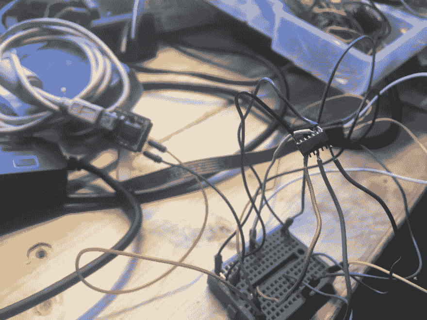
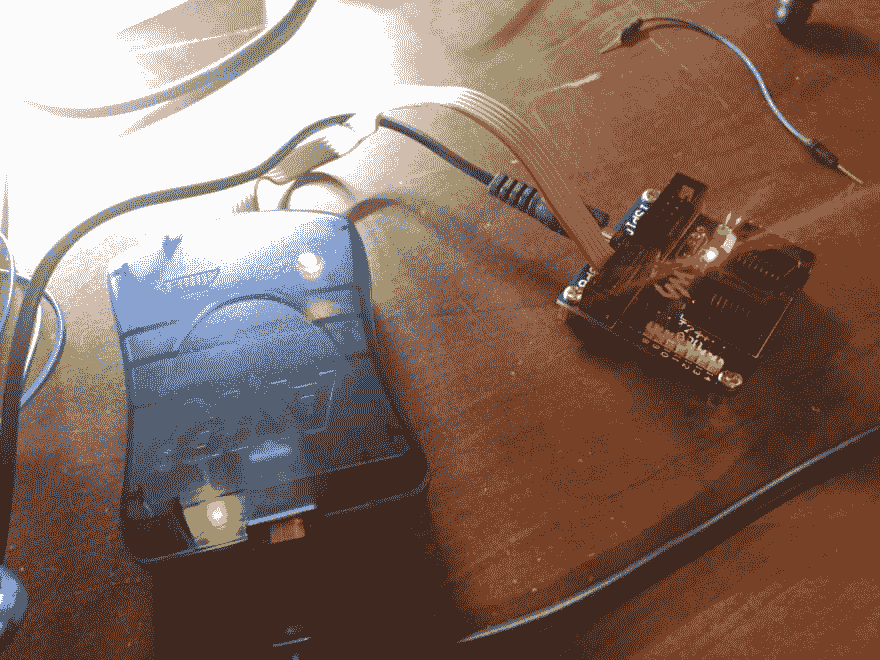
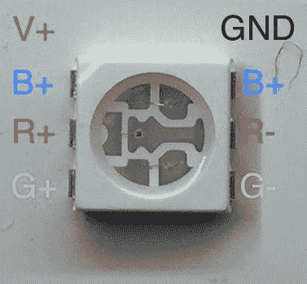
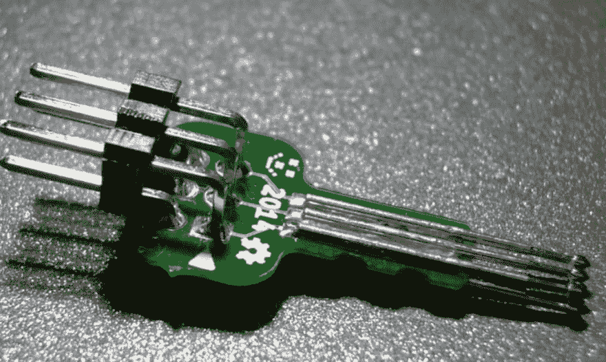

# 强盗板

> 原文:[https://dev.to/ladvien/robber-board-4h7b](https://dev.to/ladvien/robber-board-4h7b)

## 强盗板

这个板起源于一个练习 [EMDR](https://www.emdr.com/what-is-emdr/) 的 LPC 的请求，他想升级他的反馈机器。他要求它是无线的，并提供触觉和视觉反馈。当他发给我一个 NDA 时，整个事情都分崩离析了，这似乎是真正的专业水平项目的典型。然而，它会禁止我分享我发现的任何东西，而且考虑到我可以从中赚到的钱，嗯，这不值得。我想我应该完成这个项目并与每个人分享，因为分享是最大的支付形式。

以下是该板的一些特性:

1.  OTA 上传至 ATtiny84
2.  具有负载共享能力的车载充电电路([感谢 Zak Kemble](http://blog.zakkemble.co.uk/a-lithium-battery-charger-with-load-sharing/) )
3.  两个 RGB LEDs 提供视觉反馈。
4.  一个单向电机驱动器，用于控制振动电机。
5.  三个自由引脚

我完成该板的目的是继续测试我的 TinySafeBoot BLE 上传程序:

[米露(v2)](https://github.com/Ladvien/Lumi_Windows_App)

我还在重新编写上传程序以跨平台，针对 Android，iOS 和 Windows 10。这将是一个壮举，但我想我会围绕 Dropbox 的项目。消费者会:

1.  使用 Arduino、Atmel Studio 或 AVRDude 编译 AVR 二进制文件
2.  将二进制文件保存在 Dropbox 中
3.  Lumi3 然后将连接到目标设备，这可以从 Android、iOS 或 Windows 完成。
4.  Lumi3 将从 Dropbox 中提取二进制文件，并使用 TinySafeBootoader 上传。

不确定我是否能成功；祝我好运。您可以在这里随意查看代码库:

[Lumi3](https://github.com/Ladvien/Lumi3)

[T2】](https://res.cloudinary.com/practicaldev/image/fetch/s--tLd7syLQ--/c_limit%2Cf_auto%2Cfl_progressive%2Cq_auto%2Cw_880/https://ladvien.cimg/Robber_PCB_v1.jpg)

## 设计信息

[Robber_Schematic.pdf](http://ladvien.comhttps://ladvien.cimg/Robber_Schematic.pdf)

[T2】](https://res.cloudinary.com/practicaldev/image/fetch/s--b2nU5o0h--/c_limit%2Cf_auto%2Cfl_progressive%2Cq_auto%2Cw_880/https://ladvien.cimg/Robber_v01_Schematic.png)

[T2】](https://res.cloudinary.com/practicaldev/image/fetch/s--qS1T-CWY--/c_limit%2Cf_auto%2Cfl_progressive%2Cq_auto%2Cw_880/https://ladvien.cimg/Robber_v01_T_Solder_Guide.png)

[T2】](https://res.cloudinary.com/practicaldev/image/fetch/s--sei_6ILm--/c_limit%2Cf_auto%2Cfl_progressive%2Cq_auto%2Cw_880/https://ladvien.cimg/Robber_v01_B_Solder_Guide.png)

## HM-11 设置

使 OTA 过程正常工作所需的几个命令

1.  AT+AFTC3FF -该命令在连接后将所有 IO 引脚设置为高电平。OTA 不需要这样做，但由于 AVR 一连接就会被拉低，因此当 AVR 的 RESET 被拉低时，任何正在运行的草图都会立即关闭。
2.  AT+befc 3 ff——这类似于 AFTC 命令，但是，它在 HM-11 通电后将 IO 引脚设置为高电平。对于强盗，如果这不是设置的 AVR 将保持复位，直到连接。最初，我没有注意到这一点，并花了很多时间试图找出 AVR 不会响应的内容。叹气。
3.  AT+MODE2 -这使 HM-11 进入“远程”模式。这将允许 AT 命令在 HM-11 连接后通过 BLE 连接发送到 HM-11。这就是允许发送命令来远程切换连接到 AVR 复位的 PIO 的原因。

我认为几个命令使连接更加可靠:

1.  AT+BAUD2 -这将 HM-11 和 AVR 之间的通信速率设置为 38400。经过测试，这是 TSB 自动波特率的最高速度。
2.  AT+POWE3 -这提高了 HM-11 的无线电增益。电源转换不是原型的朋友。
3.  AT+GAIN1 -我认为这提高了 HM-11 的 RX 的增益？我不确定。文档有点蹩脚。

## 调试第一次迭代

板子是从奥什帕克运来的。它们看起来很锋利——但是，是时候测试一下板子，看看到底犯了什么错误。

测试的电路:

|电路抽象|测试|通过|问题描述|
|迷你 USB |是| 100% |
| MCP 73831 |是| 100% |电池充电。充电速率使用 2k 电阻。|
| MCP73831 - LED 充电指示灯|是| 100% |
|负载分担|是| 100% | Shesh，我爱这个电路。谢谢扎克。|
| LM1117 - 3.3v |是| 50% |输出电压是基于 5V 输入计算的，然而，当 USB 连接被移除时，输入电压等于 VBAT 电压。简而言之，连接 USB 时输出~3.29v，电池运行时输出 2.9v。当电池放电时，这将下降得更多。我选择了一个固定的 VREG，稍后再去( [NCP186-AMX330TAG](http://www.mouser.com/Search/ProductDetail.aspx?R=NCP186AMX330TAGvirtualkey58410000virtualkey863-NCP186AMX330TAG) )。|
|默认复位开关|是| 75% |复位线被 10k 电阻拉高。这可能会导致一些问题。它暂时被删除，如果需要，将重新添加。|
| ATtiny84 -无线 UART 连接|是| 85% |我无法让 ATtiny84 的 TSB 引导程序响应。我试过无线 TSB 你好和直接跳转到 UART。没有回应。我目前正在等待一个 [SOIC-14 ATtiny AVR 程序](http://www.ebay.com/itm/250670056425?_trksid=p2060353.m2749.l2649&ssPageName=STRK%3AMEBIDX%3AIT) r 的到来，以便更容易地排除 ATtiny84 芯片的故障。我想测试的一件事是掉电保险丝设置。看起来这个保险丝的设置和平常不一样。此外，在裸芯片上测试 UART 也很有帮助。更新:好吧，不确定芯片怎么了，但显然是我杀的？不管怎样，当一个新的程序被编程并用热风枪替换掉时，新的程序就像魔法一样工作。我在下面提供了更多的细节。|
|电池电压监控器|否| |
| RGB led |否| | |
| HM-11 重置 ATtiny84 |是| 0% |坏主意！我已经浪费了很多时间，因为我上传的程序正在发送 HM-11 复位引脚高和低。这使得重新编程变得困难，因为 HM-11 会在上传完成前失去连接。亲爱的上帝，我在想什么？|
|震动马达|是| 100% |单独用 USB 供电效果不太好。可能需要一个低功率的振动马达。另外，我不喜欢电线连接。它们会纠结在一起然后脱落。最好是安装在 PCB 上的振动电机。|

[T2】](https://res.cloudinary.com/practicaldev/image/fetch/s--4upOIzMs--/c_limit%2Cf_auto%2Cfl_progressive%2Cq_auto%2Cw_880/https://ladvien.cimg/IMG_1616_0.jpg)

[T2】](https://res.cloudinary.com/practicaldev/image/fetch/s--2cWeVaj1--/c_limit%2Cf_auto%2Cfl_progressive%2Cq_auto%2Cw_880/https://ladvien.cimg/IMG_1617_0.jpg)

## 调试无线 UART 连接

当 ATtiny84 和 HM-11 组合使用米露测试时，强盗板无法握手。令人沮丧。连接被反复检查，路由被检查，跳线被焊接，ATtiny84 保险丝被检查，甚至检查了 TSB 建立使用。没什么。坦率地说，这是一个很难解决的问题的原因是在原型设计中缺乏远见。以下是每个原型都应该具备的一些东西:

1.  跳线。如果有 UART 连接，尤其如此。他们只是乞求被误导。通过提供焊接跳线，UART 连接可以一次测试一个器件；那么，在 84 年，HM-11
2.  测试点。啊，这是显而易见的，但是不可避免地会在最危险的地方焊接引线。

回到强盗板的问题。我为了做这样的事情累坏了:

[T2】](https://res.cloudinary.com/practicaldev/image/fetch/s--RO2CKW1H--/c_limit%2Cf_auto%2Cfl_progressive%2Cq_auto%2Cw_880/https://ladvien.cimg/2017-01-22_14.16.09.jpg)

电线不断弹出关闭，他们需要重新焊接，然后再次弹出关闭。最后我崩溃了，买了一个 [SOIC-14 AVR 编程器](http://www.ebay.com/itm/ATtiny24A-SSU-ATtiny24-ATtiny44-ATtiny84-SOIC14-150-mil-AVR-Programmer-Adapter-/250670056425?hash=item3a5d1983e9:g:ijAAAOxyyFhTdw1-)。*亲爱的主啊，*这东西在我生命的哪里？我在 10 分钟内就完成了安装芯片、连接导线和编程，而不是花两个小时。如果你喜欢 SOIC 85/84 芯片，买一个吧！

这里有一个动作镜头！

[T4】](https://res.cloudinary.com/practicaldev/image/fetch/s--rYwlhd-d--/c_limit%2Cf_auto%2Cfl_progressive%2Cq_auto%2Cw_880/https://ladvien.cimg/2017-02-01_08.56.38.jpg)

## 贴片 RGB LED

测试 SMD RGB 指示灯时出现问题。在焊料脱焊过程中，绿色 LED 的电压走线脱离电路板。然而，这不应该影响第二个 LED -但出于某种原因，另一个 LED 上的绿色通道是唯一一个正常工作的。红色和蓝色似乎没有亮起。

我想我应该花一点时间来画出我所用的 SMD RGBs，因为我似乎从来没有得到正确的方向性。

[T4】](https://res.cloudinary.com/practicaldev/image/fetch/s--HZ2TWsyg--/c_limit%2Cf_auto%2Cfl_progressive%2Cq_auto%2Cw_880/https://ladvien.cimg/SMD_RGB_Closeup.jpg)

# 2017-12-24 - v3

我差不多测试完强盗板 v3 了。一些变化:

### ISP 键

我在板上加了一个特殊的 ISP 头。它与[微型 AVR-ISP 弹簧针编程适配器](https://www.tindie.com/products/madworm/tiny-avr-isp-pogo-pin-programming-adapter/)一起工作

焊接起来有点痛，但一旦安装到位，感觉非常美妙。当然，头是反的。稍后会详细介绍。

[T2】](https://res.cloudinary.com/practicaldev/image/fetch/s--ZrXb0wMo--/c_limit%2Cf_auto%2Cfl_progressive%2Cq_auto%2Cw_880/https://ladvien.cimg/isp-key.png)