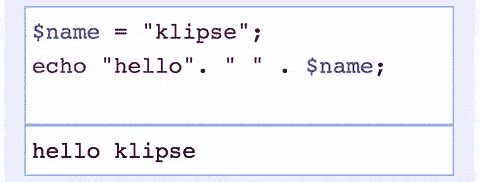

# (很可能)即将来到 dev.to:交互式代码片段。

> 原文:[https://dev . to/Ben/possible-coming-soon-to-dev to-interactive-code-snippets](https://dev.to/ben/probably-coming-soon-to-devto-interactive-code-snippets)

我目前正致力于在 dev.to 上的帖子中添加一些简洁的 REPL 支持，希望利用它。基于 [Klipse](https://github.com/viebel/klipse) 的维护者[的建议](https://github.com/thepracticaldev/dev.to/issues/9)。我花了一些时间来考虑这个问题，我喜欢这个想法，但在我可以肯定地说这将是可行的之前，我需要亲自动手。

[T2】](https://res.cloudinary.com/practicaldev/image/fetch/s--KVrMyI5g--/c_limit%2Cf_auto%2Cfl_progressive%2Cq_66%2Cw_880/https://raw.githubusercontent.com/viebel/klipse/mastimg/php-snippet.gif)

实现起来似乎并不太难，我只需要在性能方面进行尝试，并确保我们以一种保持与其他 markdown 功能兼容的方式来实现。到目前为止，这些方面一切看起来都不错。

[T2】](https://res.cloudinary.com/practicaldev/image/fetch/s--O_WcWakv--/c_limit%2Cf_auto%2Cfl_progressive%2Cq_66%2Cw_880/https://raw.githubusercontent.com/viebel/klipse/mastimg/javascript-snippet.gif)

[T2】](https://res.cloudinary.com/practicaldev/image/fetch/s--h-sjrJBX--/c_limit%2Cf_auto%2Cfl_progressive%2Cq_66%2Cw_880/https://raw.githubusercontent.com/viebel/klipse/mastimg/clojure-snippet.gif%3Fcachebuster1)

运行 REPLs 的代码只会出现在使用该行为的页面上，所以库的重量不会影响任何其他帖子。假设它能进入生产应用程序，对于任何想在开发人员帖子中使用它的人来说，它应该是一个不错的工具。该插件的现有用户似乎对此相当满意。如果您有任何其他功能想法，您可以随时在 [dev.to repo](https://github.com/thepracticaldev/dev.to/issues/9) 中创建一个问题，或者通过其他方式与我联系。