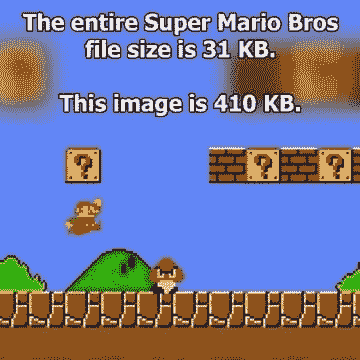
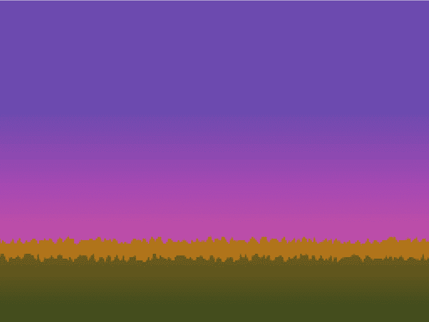
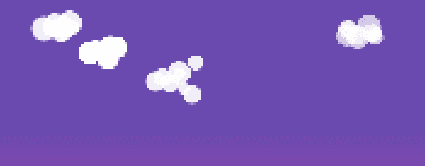

# 我从我最近的周末项目中学到的并不算少。

> 原文：<https://dev.to/k_ivanow/what-i-learned-from-my-latest-weekend-project-that-turned-not-so-small>

*作为本文基础的项目可以在[这里](http://kristiyan.quatinus.info/)找到。*

我和我的大多数软件开发朋友一样，有在下班后或周末开始小项目的习惯。事实证明，这个项目实际上并不小，或者我失去了兴趣，或者在开始之前我还没有发现类似的产品……当这个项目到来时，要么被搁置，要么接近完成，至少在我的情况下，它完成了并在一些商店、主机等地方出版。只是出于纯粹的固执。

介绍到此结束…

#### 我将从这个项目和 JS 中我喜欢的东西开始。

我不喜欢的东西比我喜欢的多得多，我的大部分项目和 JS，所以我会把它们留到最后。

#### 1 Math.rand()

这可能是我在 JS 中最喜欢的东西了。写一个在给定范围内返回随机值的东西很容易，比如:

```
randInRange = function( min, max ){
    return Math.floor(Math.random() * (max - min + 1)) + min;
} 
```

随机性可以为创建等级品种、攻击品种、敌人等节省大量时间。

randoms 牛逼的一个简单例子:

*   从屏幕的左边或右边产生敌人。x = randInRange( 0，1)？0:window . inner width；
*   玩随机攻击听起来 this . player . play(' attack '+randin range(1，3))；
*   播放随机攻击动画 this.play( 'kick' + randInRange( 1，2)；

#### 2 严重滥用 pixiJS 和 Math.random()在没有视觉资源的情况下动态创建背景和动作

这是我引以为豪的事情

通常我在制作游戏(或任何其他东西)时的创作过程是编写大部分代码，然后添加视觉资源，决定是时候完成代码编写了，测试，添加音频，测试，修复，烦恼和发布。

这一次没有什么不同(是的，我是一个固执的习惯动物)。我写了角色的基本代码，导航，暂停，恢复游戏等等。决定寻找主角的动画。幸运的是，我很快就在 OpenGameArt 中发现了一些很棒的东西。在修补了 gif、TexturePacker 和 Gimp 之后，我有了我的角色的所有动画。

厉害！

但是，有一个没有背景环境的角色很烂。所以我冒险搜索了更多的免费资源作为背景。然后我想到了这个:

<figure>[](https://res.cloudinary.com/practicaldev/image/fetch/s--jR4jL_6j--/c_limit%2Cf_auto%2Cfl_progressive%2Cq_auto%2Cw_880/https://cdn-images-1.medium.com/max/360/1%2A3NNimr7xk8anACQ1gvhSQg.jpeg) 

<figcaption>将游戏的整个代码库和一个图像进行比较是荒谬的，但在某种程度上可以证明我的观点。</figcaption>

</figure>

所以我决定完全用 JS 来生成我的背景。这减少了一般的文件大小，网络负载，跳过版权*(作为一个不错的奖励)*，这是一个很好的练习。

我开始只是想为天空创建一个简单的渐变背景。然而，pixiJS 没有为渐变提供任何东西。所以我就延长了…

```
PIXI.gradientTexture = function( width, height, colors ){
    var canvas = document.createElement( "canvas" );
    var ctx = canvas.getContext( "2d" );
    canvas.height = height;
    canvas.width = width;
    var grd = ctx.createLinearGradient(0, 0, 0, height);
    for( var i in colors ){
    grd.addColorStop( i / (colors.length - 1), colors[i] ); 
    }   

    ctx.fillStyle = grd;
    ctx.fillRect(0, 0, width, height);

    return new PIXI.Texture.fromCanvas( canvas );
}; 
```

旁注: *JS 原型继承可以成为一把可怕的枪，向挡在你道路上的一切开火，但也可以轻易打爆你的头，就像你不知道自己在做什么一样。*

回到代码——它非常简单，创建具有给定宽度和高度的画布，添加颜色停止以创建渐变，从画布制作纹理并返回它。

从这里开始创建整个场景，需要大约 100 行代码。制作天空就像创建一个宽度为 1px，高度为整个屏幕的纹理一样简单，然后用它制作一个平铺的精灵来覆盖整个屏幕。

```
var texture = new PIXI.gradientTexture( 1, window.innerHeight, ["#6a4aaf", "#6a4aaf", "#ba49b2", "#d17b55" ] );
var skyBackground = new PIXI.extras.TilingSprite( texture, window.innerWidth + this.pixelateSize, window.innerHeight + this.pixelateSize); 
```

这是 Math.random()再次发挥作用的地方。我简单地做了一个多边形，从屏幕的底角开始，顶部边界用随机高度的点填充，并用渐变纹理填充。

```
var groundPolygon = new PIXI.Graphics();
var offset = window.innerHeight - groundHeight;
var backgroundPath = [];        

backgroundPath.push( new PIXI.Point( -1 / config.ground.numberOfPoints * (window.innerWidth + this.pixelateSize), window.innerHeight ) );
for( var i = -1; i <= config.ground.numberOfPoints; i++ ){
    backgroundPath.push( new PIXI.Point( i / config.ground.numberOfPoints * (window.innerWidth + this.pixelateSize), randInRange( offset * (1 + config.ground.offsetDiff), offset * ( 1 - config.ground.offsetDiff ) ) ) );
}
backgroundPath.push( new PIXI.Point( window.innerWidth + this.pixelateSize, window.innerHeight ) );
groundPolygon.beginFill( 0 );
groundPolygon.drawPolygon( backgroundPath );
groundPolygon.endFill();        
this.groundContainer.addChild( groundPolygon );

var texture = new PIXI.gradientTexture( 1, groundHeight, colors );
var tilingSprite = new PIXI.extras.TilingSprite( texture, window.innerWidth + this.pixelateSize, groundHeight ); 
```

这样做几次，你就有层次了。

<figure>[](https://res.cloudinary.com/practicaldev/image/fetch/s--OI1fPcU7--/c_limit%2Cf_auto%2Cfl_progressive%2Cq_auto%2Cw_880/https://cdn-images-1.medium.com/max/1024/1%2A3DETlRNHocPHbeawQOcpDQ.png) 

<figcaption>如此轻松。</figcaption>

</figure>

然而，只有静态的背景是令人厌烦的。

很多像素游戏，在背景中加入微小的移动细节，使其具有动态性。这就是云发挥作用的地方，它们也是 Math.random()的直接后代。

```
Background.prototype.createCloud = function(){  
    var cloud = new PIXI.Container();
    var numberOfCircles = randInRange( config.sky.minCircles, config.sky.maxCircles );
    var cloudParts = [];
    var alpha = 1 - randInRange( 0, 4 ) / 10;
    for( var i = 0; i < numberOfCircles; i++ ){
        cloudParts[i] = new PIXI.Graphics();
        cloudParts[i].beginFill( 0xFFFFFF, alpha );
        cloudParts[i].drawCircle(0, 0, randInRange( config.sky.minCircleRadius, config.sky.maxCircleRadius ) );
        cloudParts[i].endFill();
        cloudParts[i].x = cloudParts[i - 1] ? randInRange( cloudParts[i-1].x, cloudParts[i-1].x + cloudParts[i].width / 2.2 ) : 0;
        cloudParts[i].y = cloudParts[i - 1] ? randInRange( cloudParts[i-1].y, cloudParts[i-1].y + cloudParts[i].height / 2.2 ) * (i % 2 == 0 ? 1 : -1) : 0;
        cloud.addChild( cloudParts[i] );
    }           
    cloud.x = -cloud.width;
    cloud.y = randInRange( cloud.height, cloud.height * 2);
    cloud.cacheAsBitmap = true;
    cloud.filters = [ this.filter ];    
    this.skyContainer.addChild( cloud );

    new TimelineMax().to( cloud, randInRange( config.sky.minSpeed, config.sky.maxSpeed ), { x: window.innerWidth + cloud.width, force3D:true, onComplete: function(){
        this.skyContainer.removeChild( cloud );
        cloud.destroy( true );
        this.createCloud();
    }.bind(this)});      
    cloud.cacheAsBitmap = true;
}; 
```

创建云是一个相对简单的过程:

*   制作新的容器来容纳云部件
*   使用 randInRange 决定云有多少部分
*   对于每个零件，创建一个圆，其位置由随机生成，条件是其 x 和 y 应位于其前面创建的圆的中心和半径之间
*   将其设置为从 1 到 0.6 的随机 alpha
*   将所有圆添加到它们的父容器中
*   将其展平为位图
*   将其随机放置在 y 轴上
*   应用像素化滤镜

像那样生成的云总是不同的，有时它们有相当有趣的形式。

<figure>[](https://res.cloudinary.com/practicaldev/image/fetch/s--nZy1A0HX--/c_limit%2Cf_auto%2Cfl_progressive%2Cq_auto%2Cw_880/https://cdn-images-1.medium.com/max/697/1%2AVDQvegUIi-EoHOFuO1xlpw.png) 

<figcaption>再一次</figcaption>

</figure>

免责声明:像这样随机生成的资产非常适合我的游戏，主要是因为像素过滤器。我认为它们在任何情况下都不会有用。然而，这是(ab)利用随机性节省时间的一个很好的例子。

#### 3 Object.defineProperty()

好吧，我想我撒了一点谎……我爱 Object.defineProperty 远胜于 Math.random，尽管我们的关系短得多。

我遇到的大多数渲染引擎在每次尝试使用任何容器的任何属性来更新其父容器，然后更新其父容器，然后更新其父容器，直到到达主阶段，以确保您具有正确的比例、宽度、高度、x、y 等，或者在您设置了其任何子容器或其子容器的值后更新父容器的边界，等等…

一般的例子已经够多了。快速介绍我的游戏中的主要角色是如何完成的——从视觉角度来看，它是一个容器，每个角色的动画都有一个 movieClip 子对象。将它们组合在一个容器中意味着我可以移动、着色、激活 alpha 并只破坏主容器，其子容器也会随之而来。

Object.defineProperty()发挥其魔力的部分例如是:

*   为角色定义 x 和 y 属性，这些属性有一系列检查，以确保角色没有死，游戏没有暂停，通过更新游戏不会将角色移出屏幕，等等。
*   定义色调、比例、方向和动画速度意味着每当我改变这些属性时，设置者会友好地遍历角色的所有电影剪辑并相应地改变它们。

```
Object.defineProperty( Character.prototype, 'animationSpeed', {
    get: function() { 
        return this._animationSpeed || 0; 
    },
    set: function( val ){ 
        this._animationSpeed = val;
        for( var i in this.animations ){
            this.animations[i].movieClip.animationSpeed = val;
        }           
    },  
});

Object.defineProperty( Character.prototype, 'x', {
    get: function() { 
        return this._x || 0; 
    },
    set: function( val ){ 
        if( this.isPaused() )
            return;

        if( !this.enemy && (val + this.width / 2 >= window.innerWidth || val <= this.width / 2 ) )
            return;
        if( this.dead )
            return;

        this._x = val;
        this.container.x = val;
    },  
});

Object.defineProperty( Character.prototype, 'y', {
    get: function() { 
        return this._y || 0; 
    },
    set: function( val ){
    if( this.isPaused() ) 
        return;

        this._y = val;
        this.container.y = val;
    },  
});

Object.defineProperty( Character.prototype, 'tint', {
    get: function() { 
        return this._tint || 0; 
    },
    set: function( val ){ 
        this._tint = val;
        for( var i in this.animations ){
            this.animations[i].movieClip.tint = val;
        }
    },  
});

Object.defineProperty( Character.prototype, 'scale', {
    get: function() { 
        return this._scale || 0; 
    },
    set: function( val ){ 
        this._scale = val;
        for( var i in this.animations ){
            this.animations[i].movieClip.scale.set( val );
        }
    },  
});

Object.defineProperty( Character.prototype, 'orientation', {
    get: function() { 
        return this._orientation || this.defaultOrientation; 
    },
    set: function( val ){ 
        this._orientation = val;
        for( var i in this.animations ){
            this.animations[i].movieClip.scale.x = val * this.scale;
        }
    },  
}); 
```

#### 4 移动第一

当我为 android 商店制作东西时，很容易——他们必须在 android 设备上以纵向和/或横向方式工作。

当我制作 chrome 插件时，很容易——它们必须在桌面 chrome 上工作。

这是不同的，因为它必须在移动设备和桌面上工作。正因为如此，我决定先做手机版。创建手机版有几个好处:

*   性能——如果它在移动设备上运行良好，那么它在桌面上也一定会运行良好
*   UI——一旦你在手机上安装了所有东西，就很容易把它变大，反之亦然。对于桌面，整个导航是隐藏的，因为用户可以使用键盘。

我真诚地相信，这同样适用于基于网络的游戏，也适用于网络应用和网站。

#### 现在，我不喜欢的事情

有很多事情我不喜欢我做的方式，但这次我决定暂时让它们保持原样，以突出它们。

#### 1 不断引用窗口尺寸

相反，我应该在启动时在配置中获取窗口大小，并在每次调整大小时更新我保存在配置中的纵向或横向尺寸。

#### 2 碰撞检测

不是直接来自这个项目，但它仍然有联系，因为我得到了教训。在我的一个更老的项目中——“T0”小行星 ( *只为移动设备制作，所以请模仿移动设备*)，早在我更年轻甚至*更愚蠢*的时候，我读到过碰撞检测是如何在 2D 游戏中正确完成的———通过创建多边形并检查它们是否彼此相交。当然，更年轻，更愚蠢意味着我更自大，我对自己说，我可以找到一个更好的方法来做到这一点，而不是残酷地为我的游戏的每个部分制作多边形…所以我做了下面的检查，如果两个对象/容器足够接近，通过检查它们的 x，y，宽度和高度来查看它们是否相交这是不够的，因为如果其中一个容器的视觉部分具有复杂的形式， 当被视为只有宽度、高度、x 和 y 的正方形时，它可能返回假阳性，因为上述概念不检查容器的视觉表示。 所以我更进一步。如果两个物体相交，我从它们两个的交叉点开始“走过去，看看一个的非空像素是否与另一个的非空像素相交。一开始是个不错的主意。然而，当在每个动画帧上都尝试这样做，并且屏幕上有多个对象时，情况会变得更糟。在某些时候，上述计算花费的时间比动画帧长得多，这导致了错误的结果。我试图优化它，不是逐个像素地检查，而是以 2-3-4-10 为步骤。这确实有所帮助，但远远不够。

无论如何，我用这个例子想说的是，尝试做一些人们认为不可能的事情并不是一个坏主意，但是你必须准备好放弃它，重新开始。

#### 3 使用模块加载器

可能是我最大的遗憾，也是我首先要解决的事情…

起初我相信这只是一个有背景、角色、分数、主要逻辑和配置的游戏…它逐渐增长到有将近 20 个文件。

即使我只有当初认为足够用的 4 个，我仍然应该使用像 RequireJS、Browserify 或 Webpack 这样的模块加载器。

将每个组件包装成模块要容易得多，因为您不必注意 html 文件中脚本标签的顺序，并且您可以在文件的顶部看到每个模块的依赖关系。

#### 开场白

*我猜*

我写这篇文章是为了提醒自己是什么造就了[http://kristiyan.quatinus.info/](http://kristiyan.quatinus.info/)，并把每一个阅读这篇文章的人都当成一只橡皮鸭，对此我试图解释我的部分代码。我回忆起的事情比上面解释的要多得多，但我认为它们要么太无关紧要，要么太无聊，不值得讨论。

我希望至少有些东西是你感兴趣的或者对你有用的。

* * *

*本帖最初发表于[medium.com](https://hackernoon.com/what-i-learned-from-my-latest-weekend-project-that-turned-not-so-small-ac6e350aea4c)T3】*