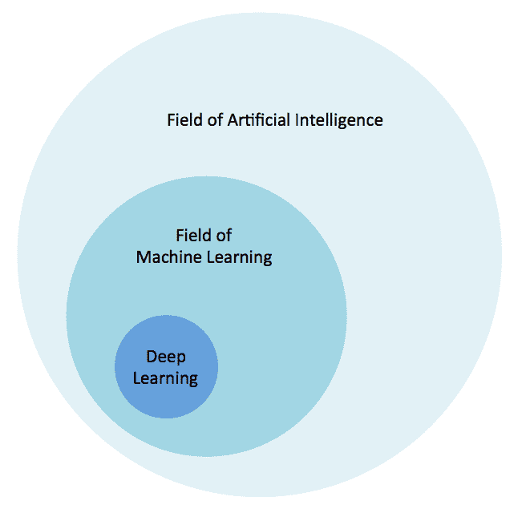
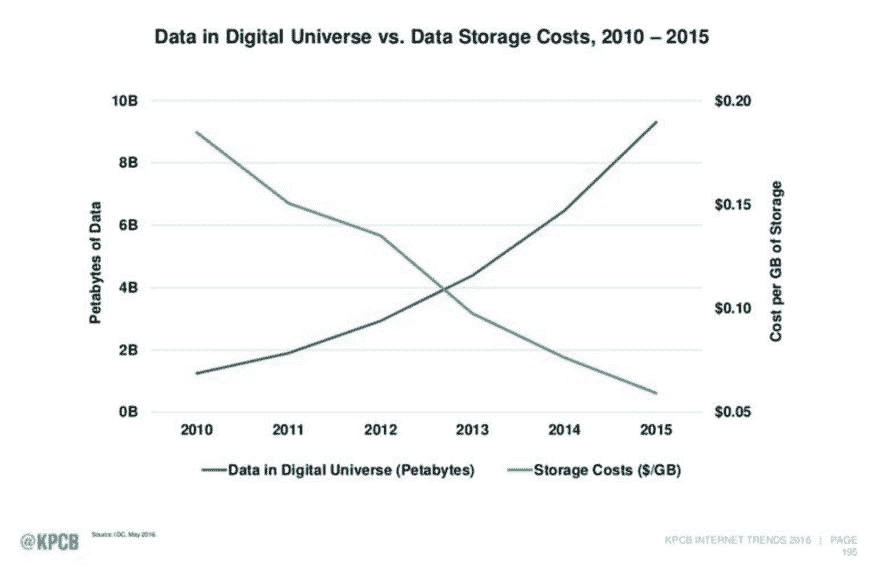
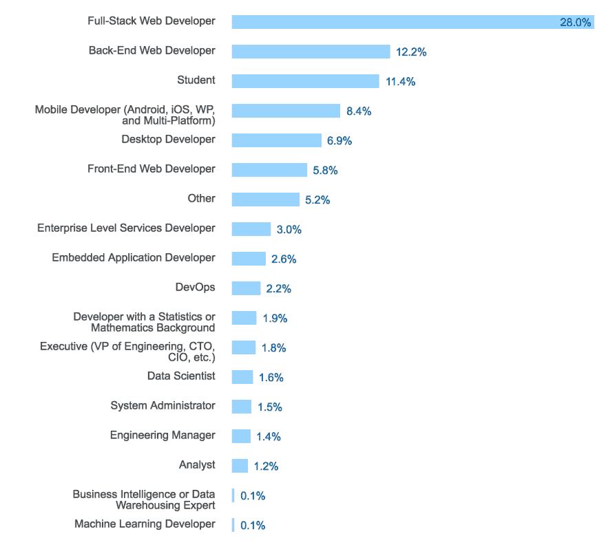
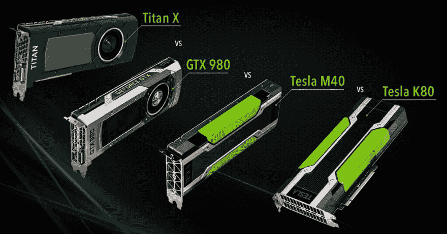
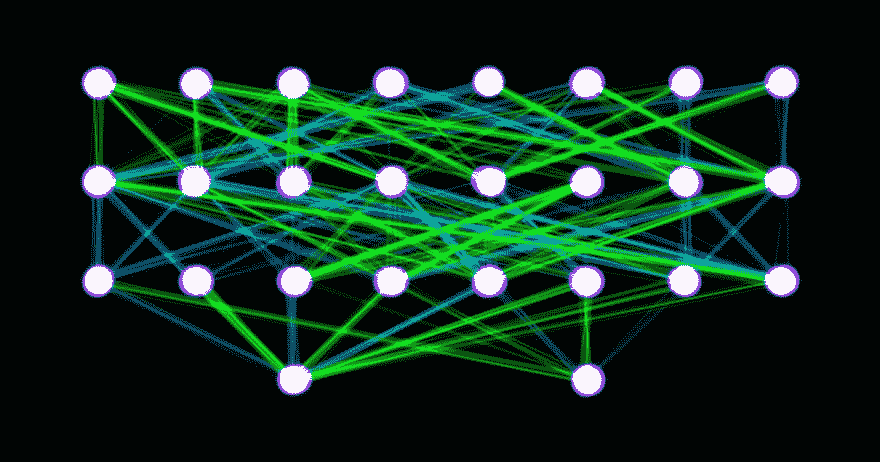

# 为什么深度学习很重要，人工智能的下一步是什么

> 原文：<https://dev.to/mattkiser/why-deep-learning-matters-and-whats-next-for-artificial-intelligence>

几乎不可能逃避前沿技术对日常生活的影响。

这种影响的核心是人工智能、机器学习和深度学习的[进步](http://blog.algorithmia.com/introduction-to-deep-learning-2016/)。

这些变革推动者正在迎来一场革命，这场革命将从根本上改变我们的生活、工作和交流方式，类似于工业革命——更具体地说， [AI 是新的工业革命](https://www.weforum.org/agenda/2016/01/the-fourth-industrial-revolution-what-it-means-and-how-to-respond)。

这些前沿技术中最令人兴奋和最有前途的是深度学习领域的进步。

虽然仍处于萌芽状态，但深度学习[渗透到你的智能手机](https://www.technologyreview.com/s/534736/deep-learning-squeezed-onto-a-phone/)，推动医疗保健的[进步，创造电网](https://medium.com/the-mission/deep-learning-in-healthcare-challenges-and-opportunities-d2eee7e2545#.ptmb2uhfo)的[效率，提高](http://www.theverge.com/2016/7/21/12246258/google-deepmind-ai-data-center-cooling)[农业产量](http://www.slideshare.net/ErikAndrejko/deep-learninginagriculture)，并帮助我们找到应对[气候变化](https://www.nextplatform.com/2016/05/18/climate-research-first-push-deep-learning-traditional-supercomputers/)的解决方案。

就在今年，一些备受瞩目的实验成为焦点，包括[微软 Tay](http://thenewstack.io/requiem-tay-reactions-microsofts-teenaged-ai-gone-bad/) ，谷歌 [DeepMind AlphaGo](https://deepmind.com/research/alphago/) ，以及[脸书 M](http://www.theverge.com/2015/10/26/9605526/facebook-m-hands-on-personal-assistant-ai) ，并凸显了深度学习和人工智能应用的多功能性。

例如，谷歌 DeepMind 已经被用来[掌握围棋](http://www.theverge.com/2016/3/9/11184362/google-alphago-go-deepmind-result)，通过[减少 15%的功耗](http://www.theverge.com/2016/7/21/12246258/google-deepmind-ai-data-center-cooling)来削减他们数据中心的能源账单，甚至与 NHS 合作[抗击失明](https://www.theguardian.com/technology/2016/jul/05/google-deepmind-nhs-machine-learning-blindness)。

百度首席科学家、Coursera 董事长兼联合创始人吴恩达说:[深度学习是一种神奇的工具，它正在帮助众多团队创造令人兴奋的人工智能应用它正在帮助我们建造无人驾驶汽车、精确的语音识别、能够理解图像的计算机等等。"](https://www.quora.com/What-does-Andrew-Ng-think-about-Deep-Learning/answer/Andrew-Ng)

这些实验都依赖于一种被称为深度学习的技术，这种技术试图模仿大脑新皮层中的神经元层。这个想法——通过模拟大脑如何工作来创建人工神经网络——自 20 世纪 50 年代以来就以这样或那样的形式出现了。

深度学习是人工智能的[子集的一个子集，它包含了大多数旨在解决问题的逻辑和基于规则的系统。在人工智能中，有机器学习，它使用一套算法来检查数据，以制定和改善决策过程。而且，在机器学习中，你会进入深度学习，它可以使用多层抽象来理解数据。](http://stackoverflow.com/questions/2620343/what-is-machine-learning)

[T2】](https://res.cloudinary.com/practicaldev/image/fetch/s--MhGRHdTz--/c_limit%2Cf_auto%2Cfl_progressive%2Cq_auto%2Cw_880/http://blog.algorithmia.com/wp-content/uploads/2016/11/ai-ml-dl-relationship.png)

在训练过程中，深度神经网络学会在数据的数字表示中发现有用的模式，如声音和图像。特别是，这就是为什么我们看到图像识别、机器翻译和自然语言处理的更多进步来自深度学习。

野外深度学习的一个例子是脸书如何自动组织照片，识别人脸，并建议给哪些朋友添加标签。或者，谷歌如何[以编程方式极其准确地翻译 103 种语言](https://research.googleblog.com/2016/09/a-neural-network-for-machine.html)。

## 数据、GPU，以及深度学习为何重要

自从深度学习背后的科学被发现以来，已经过去了半个多世纪，但为什么它现在才开始改变世界呢？

答案在于两大转变:丰富的数字数据和强大的图形处理器。

[T2】](https://res.cloudinary.com/practicaldev/image/fetch/s--5Vbpfm3f--/c_limit%2Cf_auto%2Cfl_progressive%2Cq_auto%2Cw_880/http://blog.algorithmia.com/wp-content/uploads/2016/07/Screen-Shot-2016-07-13-at-2.29.58-PM.png)

总之，我们现在能够简单地通过对问题投入足够的数据和计算来教计算机读、看和听。

有一种特殊的讽刺保留给所有这些新的突破，其实只是同一个突破:深度神经网络。

深度学习的基本概念可以追溯到 20 世纪 50 年代，但直到 20 世纪 80 年代和 90 年代才被人们所重视。然而，变化的是大量计算和数据的背景。

多亏了摩尔定律和云，我们现在基本上拥有了无限的计算能力。另一方面，由于智能手机和廉价传感器的激增，我们每天都在创造比以前更多的图像、视频、音频和文本数据。

“这是深度学习的寒武纪大爆发，[Andre essen Horowitz 的合伙人 Frank Chen 说](http://fortune.com/ai-artificial-intelligence-deep-machine-learning/)。

而且发生得很快。

四年前，谷歌只有两个深度学习项目。今天，搜索巨头[正在将深度学习注入它所涉及的一切](http://fortune.com/ai-artificial-intelligence-deep-machine-learning/):搜索、Gmail、地图、翻译、YouTube、无人驾驶汽车等等。

“我们将从移动优先转向人工智能优先的世界，谷歌首席执行官[桑德尔·皮帅今年早些时候表示。](https://googleblog.blogspot.com/2016/04/this-years-founders-letter.html)

## 机器智能的下一步是什么

从一个非常真实的意义上来说，我们在教机器自我学习。

" AI 是新电， [Ng 说](http://fortune.com/ai-artificial-intelligence-deep-machine-learning/)"正如 100 年前电力改变了一个又一个行业一样，人工智能现在也将做同样的事情。"

尽管取得了突破，深度学习算法仍然无法像人类一样推理。不过，这种情况可能很快就会改变。

脸书大学人工智能研究主任、NYU 大学教授 Yann LeCun 表示，与推理和规划相结合的深度学习是目前取得可喜进展的研究领域之一。在未来五年内解决这个问题并非不可能。

“为了让深度学习系统能够推理，我们需要修改它们，使它们不会产生单一输出，比如解释图像、翻译句子等。，但可以产生一整套可供选择的输出。例如，一个句子可以有多种翻译方式。

然而，尽管有大量的数据和丰富的计算能力，深度学习仍然非常困难。

[T2】](https://res.cloudinary.com/practicaldev/image/fetch/s--wp9Qo4PF--/c_limit%2Cf_auto%2Cfl_progressive%2Cq_auto%2Cw_880/http://blog.algorithmia.com/wp-content/uploads/2016/11/Screen-Shot-2016-11-23-at-10.06.47-AM.png)

*图片来自[栈溢出 2016 开发者调查](http://stackoverflow.com/research/developer-survey-2016)T3】*

一个瓶颈是缺乏训练有素的开发人员来使用这些深度学习技术。机器学习已经是一个高度专业化的领域，那些拥有训练深度学习模型并将其部署到生产中的知识的人甚至更有选择。

例如，谷歌无法招募足够多拥有丰富深度学习经验的开发人员。他们的解决方案是简单地[教他们的开发者](https://backchannel.com/how-google-is-remaking-itself-as-a-machine-learning-first-company-ada63defcb70)使用这些技术。

或者，当脸书的工程师努力利用机器学习时，他们创建了一个用于可视化机器和深度学习工作流的内部工具，名为 [FBLearner Flow](https://code.facebook.com/posts/1072626246134461/introducing-fblearner-flow-facebook-s-ai-backbone/) 。

但是，不在这些顶级科技公司工作的其他 99%的开发人员又该何去何从？

世界上很少有人知道如何使用这些工具。

“机器学习是一个复杂的领域， [S. Somasegar 说](https://en.wikipedia.org/wiki/S._Somasegar)，他是 Madrona Venture Group 的风险合伙人，也是微软开发者部门的前负责人。如果你查阅维基百科关于深度学习的页面，你会看到深度神经网络架构下的 18 个子类别，名称包括卷积神经网络、尖峰厚片 RBM 和 LTSM 相关的可微分记忆结构。"

"这些不是一个典型的软件开发人员能够立即理解的主题."

然而，想要处理图像或文本等非结构化数据的公司数量正在迅速增加。这一趋势将继续下去，主要是因为深度学习技术正在产生令人印象深刻的结果。

这就是为什么能够训练神经网络的人也能够与尽可能多的人分享他们的工作是很重要的。本质上，[使机器智能算法](http://blog.algorithmia.com/algorithm-development-is-broken/)、工具和技术的使用民主化。

## 面向所有人的算法智能

每个行业都需要机器智能。

[GPU 随需应变并在云中运行](http://blog.algorithmia.com/cloud-hosted-deep-learning-models/)，消除了团队和组织试验尖端、深度学习算法和模型所需的手动工作，这使他们能够以很小的成本开始工作。

[艾伦人工智能研究所](http://allenai.org/)的首席执行官柳文欢·埃齐奥尼说:“深度学习已经被证明非常强大，但它远非即插即用。”这就是 Algorithmia 的技术的用武之地——加速和简化深度学习的使用。"

[T2】](https://res.cloudinary.com/practicaldev/image/fetch/s--WIXxcYsw--/c_limit%2Cf_auto%2Cfl_progressive%2Cq_auto%2Cw_880/http://blog.algorithmia.com/wp-content/uploads/2016/11/NVIDIA-GPU-Card-Comparison.jpg)

虽然 GPU 最初用于加速图形和视频游戏，但最近它们发现了为人工智能和深度学习任务提供动力的新生命，如自然语言理解和图像识别。

Algorithmia 创始人兼首席技术官 Kenny Daniel 表示:“我们必须开发大量技术，并配置让 GPU 在云中与这些深度学习框架协同工作所需的所有组件。”GPU 从未被设计为在这样的云服务中共享。"

[由于复杂的硬件和软件依赖性，在云中托管深度学习模型](http://blog.algorithmia.com/deploying-deep-learning-cloud-services/)可能特别具有挑战性。虽然在云中使用 GPU 仍处于萌芽状态，但它们对于实现深度学习任务是必不可少的。

“对于任何试图将深度学习模型部署到生产环境中的人来说，他们很快就会遇到问题，丹尼尔说。”在容器中使用 GPU 是一个挑战。存在驱动程序问题、系统依赖性和配置挑战。这是一个尚未被充分探索的新领域。没有多少人尝试在 Docker 容器中运行多个 GPU 作业。"

“我们正在处理云提供商、硬件和依赖性之间所需的协调，以智能地调度工作和共享 GPU，这样用户就不必这样做了。”

## 深度学习如何工作

大多数商业深度学习产品使用“[监督学习](https://en.wikipedia.org/wiki/Supervised_learning)来实现他们的目标。

例如，为了识别照片中的猫，神经网络需要用一组标记数据进行训练。这告诉算法有一只“猫出现在这张照片中，或者没有一只”猫出现在这张照片中。如果你向神经网络扔足够多的图像，它确实会学习识别“图像中的猫”。

然而，产生大型、带标签的数据集是大多数深度学习项目的致命弱点。

“另一方面，无监督学习是深度学习的工作方式，它使我们能够通过在很少或根本不知道我们的结果应该是什么样的情况下处理问题来[发现新的模式](https://www.quora.com/What-is-the-difference-between-supervised-and-unsupervised-learning-algorithms)和见解。

2012 年，谷歌和斯坦福在 1000 万张 YouTube 照片上释放了一个神经网络。在没有任何人类互动的情况下，神经网络学会了从 YouTube 静止图像中识别猫的面孔，有效地识别数据中的模式，并[教会自己图像的哪些部分可能是相关的](http://static.googleusercontent.com/external_content/untrusted_dlcp/research.google.com/en/us/pubs/archive/38115.pdf)。

监督学习和无监督学习的重要区别在于无监督学习没有反馈回路。也就是说，没有人在那里纠正错误或给结果打分。

这里有一个小问题:[我们真的不知道深度学习是如何工作的](https://www.wired.com/2015/12/machine-learning-works-greatmathematicians-just-dont-know-why/)。没有人能真正给计算机编程来做这些事情。我们将大量数据输入到深度神经网络中，坐下来，让算法学习识别其中包含的各种模式。

GPU 领军企业英伟达(NVIDIA)的首席执行官黄仁勋(Jen-Hsun Huang)表示，你实际上是在编写软件。

当我们掌握了无监督学习，我们将拥有能够解开我们之前无法触及的世界的机器。

“在计算机视觉中，我们得到了深层网络实际在做什么的诱人一瞥，[谷歌研究主管彼得·诺维格说](https://www.quora.com/What-do-you-think-of-Deep-Learning-2/answer/Peter-Norvig)。我们可以在一个层次上识别行识别器，然后，比方说，在一个更高的层次上识别眼睛和鼻子识别器，接着是上面的人脸识别器，最后是整个人识别器。"

[T2】](https://res.cloudinary.com/practicaldev/image/fetch/s--ymSw9YBX--/c_limit%2Cf_auto%2Cfl_progressive%2Cq_auto%2Cw_880/http://blog.algorithmia.com/wp-content/uploads/2016/11/deep-learning-introduction.jpg)

Norvig 说，在其他研究领域，很难理解神经网络在做什么。

"在语音识别、计算机视觉物体识别、围棋游戏和其他领域，差别是巨大的，[诺维格说](https://www.quora.com/What-do-you-think-of-Deep-Learning-2/answer/Peter-Norvig)"当你使用深度学习时，错误率会下降，这两个领域在过去几年中都经历了彻底的转变。基本上所有的团队都选择了深度学习，因为它很有效。"

1950 年，艾伦·图灵写道:“我们只能看到前方很短的距离，但我们可以看到那里有很多需要做的事情。图灵的话是正确的。

"在未来十年，人工智能将改变社会， [Ng 说](https://www.quora.com/What-triggered-Andrew-Ngs-desire-to-learn-artificial-intelligence/answer/Andrew-Ng)"它将改变我们所做的和我们让计算机为我们做的。"

“深度学习已经帮助人工智能取得了巨大的进步， [Ng 说](https://www.quora.com/What-does-Andrew-Ng-think-about-Deep-Learning/answer/Andrew-Ng)，“但最好的还在后面！"

* * *

*最初发表于*【blog.algorithmia.com】