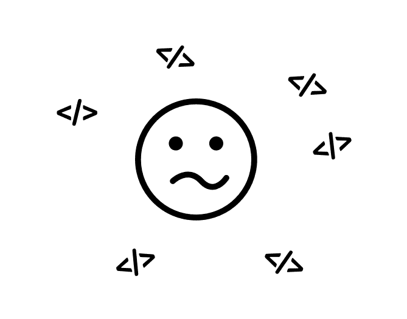
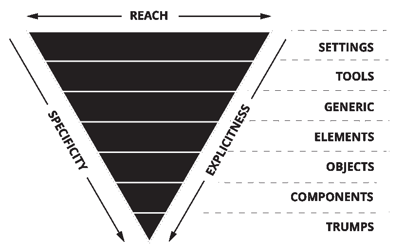

# CSS:迷失在方法论中

> 原文:[https://dev.to/digitaledawn/css-lost-in-methodologies-mng](https://dev.to/digitaledawn/css-lost-in-methodologies-mng)

[T2】](https://res.cloudinary.com/practicaldev/image/fetch/s--PZfUUjgw--/c_limit%2Cf_auto%2Cfl_progressive%2Cq_auto%2Cw_880/https://cdn-images-1.medium.com/max/669/1%2AYIEI6XWDtd04uEMtnDJH2g.png)

> 写 CSS 很容易。让它具有可伸缩性和可维护性并不容易。

多少次:

*   你有没有更新你的应用程序的 CSS，你打破了别的东西？
*   你想知道你要改变的 CSS 是从哪里来的吗？
*   你是否更新了一些 HTML，它打破了你的设计？
*   你是否写了一些 CSS，想知道为什么它没有被应用，然后发现它被其他 CSS 覆盖了？

这是当你决定有一个更好的方法，并遇到一些 CSS 方法，这似乎是一个解决所有这些头痛的好办法。

你可能听说过 SMACSS、BEM、OOCSS，但最终，它们都与适合你的项目有关。

此外，你可能认为没有他们你也很好，你可能是对的。但是你也可能会错过大的改进。你至少应该知道那里有什么，为什么你或你不使用它。

### 那么应该用什么呢？

首先，你想解决的问题是什么？**为什么**你要调查这件事？

*   防止你的 CSS 每次碰到什么东西就坏掉？
*   找到你想轻易改变的 CSS？
*   团队合作更好？
*   少写多做？

最重要的是可维护性和可重用性。

现在，你如何到达那里？

> 吃大象时，一次吃一口。
> 
> *   克赖顿·艾布拉姆斯

这里也一样。对你的 CSS 应用模块化的方法将会节省你的时间。

Web 组件是 web 的未来，现在开始将使您的生活更加轻松。

你的应用程序/设计的每一部分都有助于你构建最终的结果，你应该能够移动或替换它，而不会破坏其他任何东西。这是大多数 CSS 方法的目标。

### 如何选择符合自己需求的？

### SMACSS: CSS 组织和架构

#### **理论**

SMACSS 代表**可扩展和模块化架构 CSS** 。根据其作者 Jonathan Snook 的说法，这是一个风格指南，而不是一个严格的规范或框架。

SMACSS 是关于用 5 条规则来组织你的 CSS:

#### **基地**

这包括选择器规则。这里没有班级或 id。这是为了重置浏览器规则，并为将要保持一致和重用的元素设置基本样式。您在这里定义了元素的默认样式。这可以包括 html、body、h1、h2、h3、h4、h5、h6、img、a…

#### **布局**

这是用于布局页面的样式所在的位置。为了灵活起见，它应该根据您的模块风格进行划分。您希望能够以最灵活的方式使用您的布局样式来构建您的页面。一个模块或组件应该被添加到你的站点中独立于布局的任何地方。

使用类而不是 id 允许你在任何地方重用那些布局样式，降低你的 CSS 特异性，使之更容易控制。

#### **模块**

模块是页面的一部分或组件。你的菜单、对话框、下载列表或者你页面上的任何小部件。这取决于你的设计。

一个模块独立于你的布局，所以它可以存在于你的应用程序的任何地方。您应该能够复制/粘贴 html 并移动到其他地方，它将看起来和行为相同。

一个模块应该封装在一个文件中，并且易于访问。这将很容易找到，你可以控制你想更新什么，因为它不依赖于任何其他风格。

这是你对一个特写的唯一真实来源。

#### **州**

状态将是修改或覆盖其他规则的样式。一个很好的例子是折叠或展开元素时的折叠。使用一个`is-collapsed`类将确保你的元素是折叠的。这是一个使用的好地方！重要的(可能是唯一的)，因为您希望无论如何都应用这个状态。此外，它还可以与 javascript 的修改状态相关联。

良好的做法是给这些状态类添加前缀或名称空间，如 *is-* 或 *has-* : *is-hidden* ， *is-displayed* ， *is-collapsed* ， *has-children* 等

#### **主题**

想法是有一个名为 theme.css 的文件，您可以在其中定义所有的主题规则。

```
// box.scss

.box {
 border: 1px solid;
}

// theme.scss

.box {
 border-color: red;
} 
```

#### **在练习**

我第一次读到 SMACSS 时，我发现它很棒，但有点难以知道如何实现它。我的方法主要是通过我的文件架构。

我倾向于使用以下目录和文件结构:

```
/ **global**
\_base.scss // Base rules
\_settings.scss
\_states.scss // generic state rules
…

/ **layout**
\_grid.scss
…

/ **modules**
\_card.scss
\_menu.scss
… 
```

正如你所看到的，我有所有的层，除了主题层，因为我从来没有真正需要它。

**津贴**:

模块化

灵活

文件组织

状态是很好的可重用类。

**缺点**:

*   很难付诸实践。
*   没有类名约定，模块和子模块可能很难识别

### BEM:命名约定

#### 理论

BEM 代表块元素修改器。这是一种命名约定，它非常适合模块化 CSS。

块是一个模块或者一个组件，不管你喜欢怎么称呼它。这是**你设计的一部分，你封装了**以便在你网站的任何地方重用它。

```
**// Block**  
.button {}

**// Element**  
.button\_\_icon {}
.button\_\_text {}

**// Modifier**  
.button — red {}
.button-blue {} 
```

#### 在练功

BEM 非常灵活。我个人使用的是 SMACSS 称谓:模块。因此，块是一个模块。我每个模块都有一个不同的文件，BEM 允许我完美地封装这些模块。

当阅读 HTML 时，我确切地知道什么是模块的一部分，我不需要嵌套我的 CSS，这意味着更少的特异性和更少的麻烦。

**完整示例**

```
// Without BEM

.nav ul .item {
 color: black;
 float: left;
}

// With BEM

.nav\_\_item {
 color: black;
 float: left;
} 
```

**津贴**:

模块化

灵活

易于维护

少写 CSS

掌控你的 CSS

**缺点**:

*   长 HTML 类
*   冗长的

[更多关于边界元法的信息](http://getbem.com/introduction/)

### OOCSS:面向对象的 CSS

#### 理论上

OOCSS 代表面向对象的 CSS，目的是鼓励代码的可重用性和易于维护性。

为此，OOCSS 基于两个原则:

**从皮肤上分离结构**

你所有的元素都有某种烙印，对吗？颜色、背景、边框。此外，它们确实有一个结构，你有时可以在这些元素之间重复。

一个很好的例子可以再次是一个按钮。

之前你可能有:

```
.button {
 display: inline-box;
 width: 200px;
 height: 50px;
 color: white;
 background: black;
}

.box .button {
 color: black;
 background: red;
} 
```

现在用 OOCSS:

```
.button {
 width: 200px;
 height: 50px;
}

.button-default {
 color: white;
 background: black;
}

.button-red {
 color: black;
 background: red;
} 
```

你可以看到这一点。现在，您可以为每个按钮重用您的 CSS，并使它不那么具体。

**容器和内容物的分离**

这是为了把你的风格和它的内容分开。你可以在你的主要内容中有一个侧边菜单和一个框，将样式应用于某个段落。

```
.sidemenu p {
}

.box p {
} 
```

这将你的 HTML 和 CSS 永远联系在一起，并对这些元素中的所有 p 标签应用相同的样式。这可能不是你想要的。

此外，如果你需要在你的文章内容相同的风格，例如，你会重复一遍。

相反，为这个段落创建一个新的样式，你可以在任何时候重复使用。

像 BEM 一样，OOCSS 通过嵌套和使用 id 来避免特定性。它还允许您非常容易地应用关注点分离。

#### 在练功

直到最近我才开始用 OOCSS。我想我是通过使用 BEM 修改器来分离颜色模块的，但是我从来没有大规模的做过。

我发现这个概念真的很有趣，并开始在我目前的公司中使用。我们有一个产品，在 3 个不同的网址上有 3 种不同的皮肤。我们在 3 个网站中的大多数网站上使用相同的模块，但品牌不同。

我们创建了我们在这些网站上重复使用的对象，我们有为每个网站定义品牌的模块。

**津贴**:

高重用性

易于维护

**缺点**:

*   可能会让新开发人员感到困惑。什么是物体，什么不是？这将迫使你记录事情，并向你的代码库引入新的开发(这是很好的做法)。

### ITCSS: CSS 组织避免高特异性

#### **理论**

ITCSS 代表倒三角形 CSS。这是一种根据你的 CSS 规则的特殊性来组织你的 CSS 的方法。

*   **设置**:变量、混音、任何你设置用作设置或功能的东西
*   **工具**:外部包括
*   **通用:**重置/正常化规则
*   **元素**:元素基本样式
*   **对象**:对象和结构样式
*   **组件**:模块样式
*   **胜过**:公用事业、电网、国家

[T2】](https://res.cloudinary.com/practicaldev/image/fetch/s--TI4e2SNv--/c_limit%2Cf_auto%2Cfl_progressive%2Cq_auto%2Cw_880/https://cdn-images-1.medium.com/max/830/1%2AzDiCO9Ppxyta6aZUVQJenA.png)

这从不太具体的规则到最具体的规则。这会让你重新掌控自己的风格。

我相信我们都尝试过样式化一个元素并添加一个规则，但发现它不起作用，因为在你的样式表中定义了更具体的规则。

控制你的风格特异性将会节省你调试和憎恨你的同事的时间。

#### 在练功

```
/\* === SETTINGS === \*/

@import “global/site-settings”;
@import “global/mixins”;
@import “global/typography”;

/\* === TOOLS === \*/

@import “libs/material-icons”;

/\* === GENERIC === \*/

@import “global/normalize”;

/\* === ELEMENTS === \*/

@import “global/base”;

/\* == Modules === \*/

// Module example

@import “modules/icon”;
@import “modules/header”;
@import “modules/footer”;
@import “modules/form”;
@import “modules/buttons”;
@import “modules/menu”;
@import “modules/form”;
@import “modules/logo”;

/\* == Trumps === \*/

@import “layout/grid”;
@import “global/states”;
@import “global/utilities”; 
```

**津贴**:

较低的 CSS 特异性

清晰的组织

**缺点**:

*   对于低年级学生来说，很难决定什么该归入哪一类，但在我看来，对于更多的中级和高级学生来说，这是非常清楚的事情，他们应该帮助别人。

### 总而言之

我们都意识到了，CSS 由于其自身的特性会变得很糟糕。

归根结底，这是关于你需要什么，什么对你有意义。但是如果你从事一个大的可扩展项目，你想要的是:

*   **控制**你的特异性
*   将**模块化**并创造出**可重复使用**的风格
*   轻松**维护**
*   作为一个团队更好地工作**团队**
*   少写**达到** **多写**

以上都可以用自己的方式帮你做到。我个人认为，根据对我从事的项目有意义的东西，它们最好混合使用以满足我的需求。我保持开放的态度，而不是“这是你需要用的，因为它很流行”。

什么最适合你？你在你的项目中使用了什么？还有其他方法吗？