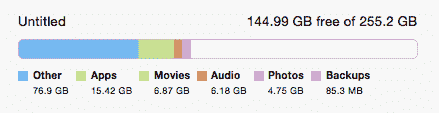

# 清理 Mac 上的其他文件

> 原文:[https://dev . to/vinitkumar/clean-up-your-MAC-from-other-files](https://dev.to/vinitkumar/clean-up-your-mac-from-other-files)

[T2】](https://res.cloudinary.com/practicaldev/image/fetch/s--DJmdweoM--/c_limit%2Cf_auto%2Cfl_progressive%2Cq_auto%2Cw_880/https://cldup.com/-iOX0p9Ob8-3000x3000.png)

有时候，你的 mac 被文件塞满了，你似乎无法理解到底是什么占用了太多空间。以下是你可以找到答案的方法。

首先找到磁盘使用情况，并将其保存到日志文件中。另外，找到那里所有的大文件。使用“G”搜索会找到所有在
GB 中的文件。

另外，将第二个列表保存到另一个文件中，这样我们只需要做一次。

```
du -h > ~/space.log
cat ~/space.log | awk '{print $1}' | grep 'G' >  ~/highspace.log 
```

接下来，打开一个分割窗口，做

```
cat ~/highspace.log 
```

现在，开始一个一个地寻找大的。

假设其中一个条目是 5.6G，让我们找出它是哪一个。

```
 cat ~/space.log | fgrep -f highspace.log

 #It will give something like this:

1.2G    ./.android/avd/Nexus_6_API_21.avd
2.7G    ./.android/avd
2.7G    ./.android 
```

现在，如果你觉得文件是不需要的，你想删除它。执行以下
操作:

```
sudo rm -rf Documents/Movie.avi 
```

瞧啊。重复这个过程，删除所有你不再需要的文件和目录。

# 免责声明:

非常耐心地做这件事，并备份所有重要的东西。这个指南是为非常高级的用户准备的，只有当你知道自己在做什么的时候，你才应该这么做。
我不对任何数据丢失负责。做这件事要自担风险。