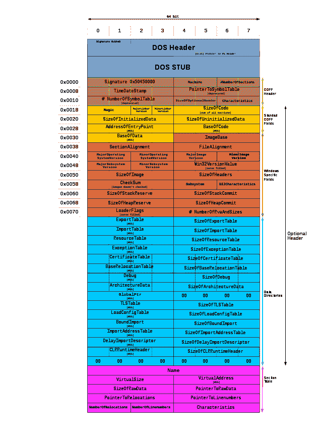
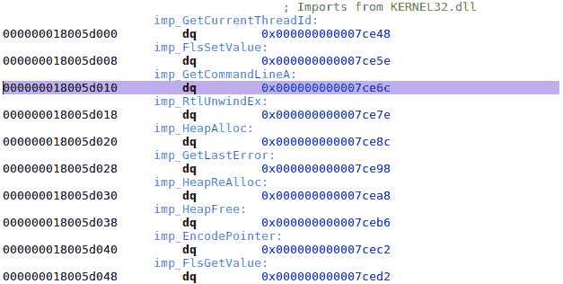

# 使用 IAT 补丁转移窗口中的功能

> 原文：<https://dev.to/garuma/diverting-functions-in-windows-with-iat-patching-p8d>

最近，我遇到了一个阻塞问题，这个问题将我正在开发的一个功能置于危险之中。总结一下这个问题，整个特性依赖于一个特定的库初始化方式，这个库提供了两个不同的函数(我们称之为`Init`和`InitExtended`)来初始化自己。

负责此初始化的代码硬编码调用其中一个变量，并且位于不可修改的 DLL 中。让事情变得更难的是，我提到的两个初始化函数有稍微不同的参数，这使事情变得复杂，因为这不可能是简单的函数指针交换。

出于开发目的，一个重要的方面是，初始化函数实际上并不直接在 DLL 中引用，而是使用标准的[LoadLibrary](https://msdn.microsoft.com/en-us/library/windows/desktop/ms684175.aspx)/[GetProcAddress](https://msdn.microsoft.com/en-us/library/windows/desktop/ms683212.aspx)组合来动态定位。

当某个东西正在使用`LoadLibrary`时，首先要做的显然是利用 DLL 加载器查找机制，提供一个修改后的 DLL 来代替原来的 DLL 进行加载。不过，在这种情况下，`LoadLibrary`与系统目录中的硬编码路径一起使用，这使得该选项无法使用。

剩下的就是试图利用`GetProcAddress`来掩饰事情。为此，有一种更奇特的技术叫做 IAT 补丁，它依赖于 PE(可移植可执行文件)格式为动态库工作的方式。

## DLL 里有什么

像大多数其他动态可加载库格式一样，DLL 不仅仅包含执行的代码。该文件被分割成不同的部分，除了代码部分之外，这些部分还引用了其他几种类型的数据。

[T2】](https://res.cloudinary.com/practicaldev/image/fetch/s--YuCW3IF0--/c_limit%2Cf_auto%2Cfl_progressive%2Cq_auto%2Cw_880/https://blog.neteril.org/wp-content/uploads/iat_patching/pe_format.png)

例如，数据部分将包含一些有趣的表，比如字符串、程序中的常量数据、线程本地存储等等。

当加载一个 DLL 时，这些表和段被映射到调用进程的内存空间中，并且可以从用户代码中访问，尽管实际上您总是使用一些系统 API，而不是自己查询内存的这些部分。

## 导入表格

这里我们将要感兴趣的表是**导入地址表**(缩写为 IAT)。此表的作用是以字典形式列出 DLL 从其他库中引用的所有外部函数，以库名(例如“user32.dll”)和值作为函数指针的关键字。

例如，下面是随机 DLL 中该表内容的一个片段(加载程序使用提示/顺序值来加快处理):

```
$ pedump -I freetype.dll 

=== IMPORTS ===

MODULE_NAME HINT ORD FUNCTION_NAME
KERNEL32.dll 1cb GetCurrentThreadId
KERNEL32.dll 15b FlsSetValue
KERNEL32.dll 18c GetCommandLineA
KERNEL32.dll 425 RtlUnwindEx
KERNEL32.dll 2d3 HeapAlloc
KERNEL32.dll 208 GetLastError
KERNEL32.dll 2da HeapReAlloc
KERNEL32.dll 2d7 HeapFree
KERNEL32.dll ee EncodePointer
KERNEL32.dll 15a FlsGetValue
KERNEL32.dll 159 FlsFree
KERNEL32.dll 480 SetLastError
KERNEL32.dll 158 FlsAlloc
KERNEL32.dll 4c0 Sleep 
```

在我们的例子中，`LoadLibrary`和`GetProcAddress`都在这个表中，它们来自库，又名 kernel32.dll**。**

 **动态库和 Windows DLL 加载程序的工作方式解释了此表的原因。当将代码编译成依赖于其他库的 DLL 时，要加载依赖项的实际内存布局事先并不知道。也许这个依赖项已经被程序加载了，也许 DLL 将会加载它，在任何情况下，所有这些函数的实际位置最终将由运行的上下文决定。

因此，当一些代码引用一个外部函数时，编译器将插入一个`call`指令，该指令并不直接指向函数的实际地址，而是从导入地址表中加载我前面提到的 thunk 所指向的地址。

通过这样做，DLL 中包含的代码总是有效的，Windows 加载程序只需修改整个加载的 DLL 的一部分(IAT thunk ),以在运行时指向正确的函数地址，而不是遍历整个代码段并逐个修补每条`call`指令。

下面是我们之前看到的同一个 DLL 如何调用包含在 kernel32 中的`GetCommandLineA` Win32 函数的例子。注意 call 指令的地址是如何从数据段(`ds`)中的某个位置检索到的(`qword`，以及反汇编器是如何聪明地用前缀`imp_`命名 thunk 的:

[T2】](https://res.cloudinary.com/practicaldev/image/fetch/s--vrf24J9h--/c_limit%2Cf_auto%2Cfl_progressive%2Cq_auto%2Cw_880/https://blog.neteril.org/wp-content/uploads/iat_patching/hopper-call.png)

下面是一个实际数组的视图，该数组包含所有 kernel32 函数的 thunks，在运行时处理 DLL 时，Windows 加载程序将对这些函数进行修补:

[T2】](https://res.cloudinary.com/practicaldev/image/fetch/s--aCvANtIQ--/c_limit%2Cf_auto%2Cfl_progressive%2Cq_auto%2Cw_880/https://blog.neteril.org/wp-content/uploads/iat_patching/hopper-datasegment.png)

## 打补丁导入地址表

*提醒:*我们正试图通过操纵`GetProcAddress`来影响一个程序的执行，这样它就不会调用一个`Init`函数，而是调用一个不同的`InitExtended`函数。

现在我们知道了外部函数是如何被调用的，很容易看出控制这个 IAT 间接方式是完成我们想要的任务的关键。通过为我们想要修改的函数修补 IAT thunk，我们确保相关代码将被重定向以使用我们的修改。

假设您已经能够通过另一种方式(如果不是查找 DLL 注入技术)在进程中加载自定义代码，劫持 IAT thunk 的方法如下:

*   在您自己的代码中创建您的定制函数，模仿真实函数的原型
*   在修补完成之前，阻止或延迟您尝试更改的代码路径访问该函数
*   检索一个指向你试图劫持的 DLL/可执行文件的模块(包含所有的表)的指针
*   找到导入地址表
*   迭代它以找到正确的 thunk
*   用您自己的自定义函数地址覆盖 DLL 加载程序给定的值

下面是使用 imagehlp 库(定义了所有正确的 C 结构来对 IAT 表布局建模)翻译和注释的 C 版本

```
// Our custom Init function that will now internally
// call the InitExtended function we wanted to use
static void MyCustomInitFunction (/* parameters */)
{
  InitExtended (/* other parameters */);
}

// Our hooked version of GetProcAddress with the
// same prototype (and same calling convention)
static FARPROC MyGetProcAddress (HMODULE hModule, LPCSTR lpProcName)
{
  if (strcmp (lpProcName, "Init") == 0)
    return (FARPROC)MyCustomInitFunction;
  return GetProcAddress (hModule, lpProcName);
}

static BOOL HackGetProcAddress ()
{
  // Get the handle to the module we want to divert 
  HMODULE module = GetModuleHandle (L"TheDllToHijack.dll");
  if (module == NULL)
    return FALSE;

  // Get a reference to the import table to locate the kernel32 entry
  ULONG size;
  PIMAGE_IMPORT_DESCRIPTOR importDescriptor = (PIMAGE_IMPORT_DESCRIPTOR)ImageDirectoryEntryToDataEx (module, TRUE, IMAGE_DIRECTORY_ENTRY_IMPORT, &size, NULL);

  // In the import table find the entry that corresponds to kernel32
  BOOL found = FALSE;
  while (importDescriptor->Characteristics && importDescriptor->Name) {
    PSTR importName = (PSTR)((PBYTE)module + importDescriptor->Name);
    if (_stricmp (importName, "kernel32.dll") == 0) {
      found = TRUE;
      break;
    }
    importDescriptor++;
  }
  if (!found)
    return FALSE;

  // We use this value as a comparison
  PROC baseGetProcAddress = (PROC)GetProcAddress (GetModuleHandle (L"kernel32.dll"), "GetProcAddress");

  // From the kernel32 import descriptor, go over its IAT thunks to
  // find the one used by the rest of the code to call GetProcAddress
  PIMAGE_THUNK_DATA thunk = (PIMAGE_THUNK_DATA)((PBYTE)module + importDescriptor->FirstThunk);
  while (thunk->u1.Function) {
    PROC* funcStorage = (PROC*)&thunk->u1.Function;
    // Found it, now let's patch it
    if (*funcStorage == baseGetProcAddress) {
      // Get the memory page where the info is stored
      MEMORY_BASIC_INFORMATION mbi;
      VirtualQuery (funcStorage, &mbi, sizeof (MEMORY_BASIC_INFORMATION));

      // Try to change the page to be writable if it's not already
      if (!VirtualProtect (mbi.BaseAddress, mbi.RegionSize, PAGE_READWRITE, &mbi.Protect))
        return FALSE;

      // Store our hook
      *funcStorage = (PROC)MyGetProcAddress;

      // Restore the old flag on the page
      DWORD dwOldProtect;
      VirtualProtect (mbi.BaseAddress, mbi.RegionSize, mbi.Protect, &dwOldProtect);

      // Profit
      return TRUE;
    }

    thunk++;
  }

  return FALSE;
} 
```

## 结论

这是一个如何使用 IAT 补丁来规避遗留代码而不必重新编译或破坏原始二进制文件的例子。

这种技术是众所周知的，所以如果你想做一些更复杂/可靠的事情，你总是可以使用一个现有的库，如 [EasyHook](https://easyhook.github.io/) 或像微软的弯路一样功能齐全的东西。

参考资料:

*   [拦截 Windows APIs 以编码为乐](http://www.dematte.org/2006/03/04/InterceptingWindowsAPIs.aspx)
*   [API 挂钩揭露-代码项目](https://www.codeproject.com/Articles/2082/API-hooking-revealed)
*   [了解导入地址表](http://sandsprite.com/CodeStuff/Understanding_imports.html)
*   [窥视 PE - Matt Pietrek 内部](https://msdn.microsoft.com/en-us/library/ms809762.aspx)**