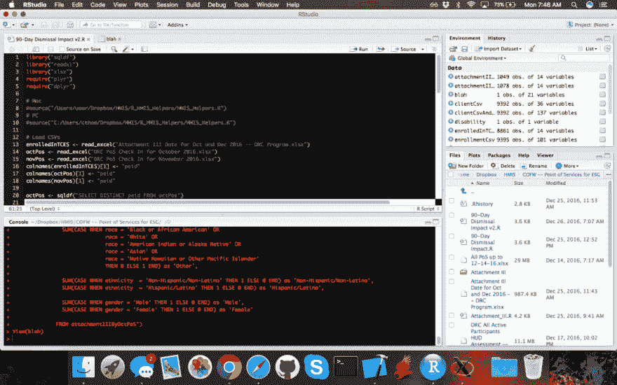

# HMIS、R 和 SQL -简介

> 原文:[https://dev.to/ladvien/hmis-r-and-sql-introduction-nek](https://dev.to/ladvien/hmis-r-and-sql-introduction-nek)

## “我爱我们的软件，我爱我们的软件。”

我以 HMIS 数据库经理为生。这是一份梦寐以求的工作——所有乏味的事情，而且，我有可能在帮助别人。目前，我们的软件真正缺乏的一个领域是快速生成复杂的报告。它有这个能力，但是服务器速度慢，经常崩溃，一个本应该 20 分钟的项目可能要花 50 分钟到 40 小时，这取决于“天气预报”这些问题可能是由基于 web 的报告平台和在服务器端完成的计算引起的。不管怎样，考虑到员工在报告项目上花费的时间，我决定探索其他系统来生成一些我们需要的报告。

幸运的是，HUD 规定了一种 HMIS 数据格式。这通常被称为“CSV 版本”HUD 的文档中概述了这些数据集的规范:

*   [HMIS 数据字典](https://www.hudexchange.info/resources/documents/HMIS-Data-Dictionary.pdf)

这些数据标准目前是 5.1 版本，然而，平视显示器每年 10 月 1 日发布这些标准的调整。关键是，如果数据是标准化的，它应该使使用本地工具操作变得容易。

以下是一些探索本地报告工具的专业人士:

*   软件供应商矛盾
*   没有因路由问题造成的瓶颈
*   更大的报告灵活性
*   没有停机问题
*   对查询优化的更多控制

缺点是:

*   向最终用户部署更加困难(集成可能通过批处理文件或 Excel-VB)

在进入备选方案之前，重要的是要指出，HUD 要求所有 HMIS 软件供应商能够导出一组 CSV 文件，其中包含所有 HUD 管理的数据元素(也称为通用数据元素)。这个导出过程是可靠的、快速的、可预测的——至少从我的经验来看是这样。随着替代工具的开发，最常使用的数据集将是这些 HMIS CSV，但是，可能会有我们 COC 本地报告的其他数据，这些数据将使用每个参与者的唯一 ID 加入到这些 CSV 中。

好吧！让我们来看看。

## R

让我兴奋。它是数据挖掘者的编程语言。它主要是在引擎盖下的 C，这可能使它快得惊人。r 应该是一个命令行界面，但是我使用 RStudio 是为了方便。R studio 有一些限制，例如在 ide 中只能查看 15 列，但是不能停止显示。

这个条目并不意味着是 R 中的一门课程，但是，我会添加一些我最喜欢的链接:

1.  Coursera 的 R 课程
2.  [约翰·霍普斯金- R 编程](https://www.coursera.org/learn/r-programming)

以下是工具链:

1.  用于下载的镜像列表(CLI)
2.  [RStudio](https://www.rstudio.com/products/rstudio/download3/) (所用的屏幕)

好了，现在我们要出发了！

[T2】](https://res.cloudinary.com/practicaldev/image/fetch/s--FP-JTEkj--/c_limit%2Cf_auto%2Cfl_progressive%2Cq_auto%2Cw_880/https://ladvien.cimg/Screenshot_2016-12-26_07.46.49.png)

好了，我们来钻研一些代码。

首先，能够读取 CSV 和 Excel 文件非常重要。r 内置了读取 CSV 文件的功能。要开始加载 Excel 文档，需要安装 [read_excel](https://cran.r-project.org/web/packages/readxl/readxl.pdf) 包。r 有一个包管理器，允许很容易地添加方法库。几乎任何软件包都可以使用 install . package(" name _ of _ package ")从 CLI 安装。比如:

```
 # Installs the readxl package, which allows Excel files to be  # read in as data-frames  install.package("readxl") 
```

<svg width="20px" height="20px" viewBox="0 0 24 24" class="highlight-action crayons-icon highlight-action--fullscreen-on"><title>Enter fullscreen mode</title></svg> <svg width="20px" height="20px" viewBox="0 0 24 24" class="highlight-action crayons-icon highlight-action--fullscreen-off"><title>Exit fullscreen mode</title></svg>

一个包只需要安装一次，但是，每个 R 会话在调用它的方法之前都需要引用这个库。例如，

```
 # Adds the readxl methods to this session.  library("readxl") 
```

<svg width="20px" height="20px" viewBox="0 0 24 24" class="highlight-action crayons-icon highlight-action--fullscreen-on"><title>Enter fullscreen mode</title></svg> <svg width="20px" height="20px" viewBox="0 0 24 24" class="highlight-action crayons-icon highlight-action--fullscreen-off"><title>Exit fullscreen mode</title></svg>

在这个包被安装并添加到会话中之后，我们应该能够使用下面的代码将各种数据导入到 R 中:

```
 # Load data  read.csv(  <-  read_excel("DRC PoS Check In for October 2016.xlsx")  csvData  <-  read.csv("My_CSV_file.csv") 
```

<svg width="20px" height="20px" viewBox="0 0 24 24" class="highlight-action crayons-icon highlight-action--fullscreen-on"><title>Enter fullscreen mode</title></svg> <svg width="20px" height="20px" viewBox="0 0 24 24" class="highlight-action crayons-icon highlight-action--fullscreen-off"><title>Exit fullscreen mode</title></svg>

这创建了两个数据帧。我发现对后面的函数来说，重命名列标题的能力是必不可少的。这可以通过以下方式完成:

```
 # Make the disability column easier to work with.  colnames(data_frame)[col_number_to_rename]  <-  "new_name"  # For example, renames the header of column 8 to "ethnicity"  colnames(client)[8]  <-  "ethnicity" 
```

<svg width="20px" height="20px" viewBox="0 0 24 24" class="highlight-action crayons-icon highlight-action--fullscreen-on"><title>Enter fullscreen mode</title></svg> <svg width="20px" height="20px" viewBox="0 0 24 24" class="highlight-action crayons-icon highlight-action--fullscreen-off"><title>Exit fullscreen mode</title></svg>

当在 R 中使用 SQL 函数时，这一点很重要，因为 SQLite 不喜欢特殊字符，并且变通方法会使 SQL 代码变得冗长。

数据人员能做的最重要的事情是合并数据集。我才开始这个旅程，但它看起来是一门艺术，需要精通才能有效。但是为了让我们继续下去，下面是如何在 R.
执行[左连接](http://www.w3schools.com/sql/sql_join_left.asp)

```
 # Join data_frame_2 to data_frame_1 where the "key" column matches.  # Do not keep any data which doesn't match the keys in data_frame_1  combined_data_frames  <-  merge(data_frame_1,  data_frame_2,  by="key")  # Here's a real example, using HUD HMIS CSVs  client  <-  read.csv("Client.csv")  enrollments  <-  read.csv("Enrollments.csv")  client_and_hud_assessments  <-  merge(client,  enrollments,  by="PersonalID") 
```

<svg width="20px" height="20px" viewBox="0 0 24 24" class="highlight-action crayons-icon highlight-action--fullscreen-on"><title>Enter fullscreen mode</title></svg> <svg width="20px" height="20px" viewBox="0 0 24 24" class="highlight-action crayons-icon highlight-action--fullscreen-off"><title>Exit fullscreen mode</title></svg>

如果你非常敏锐——或者是一名数据科学家——你可能会注意到上述合并中的缺陷。HMIS Client.csv 对于每个参与者应该只有一个记录，但是从 Client.csv 到 Enrollments.csv 的关系是一对多的。也就是说，每个客户都可以注册多个项目。这使得上面的代码有些不可预测——我没有时间去探究结果。相反，我将重点放在从 Enrollments.csv 中获取最近的条目。

## 将 SQL 改为 R

专业数据人员可能想知道为什么我选择混合使用 R 和 SQL。好吧，这可能不是最好的理由或解释，但这里去。r 是一个强大的工具，但是通常，它的语法是令人费解的。很难阅读和理解发生了什么。另一方面，SQL 非常直观。对我来说，我希望尽可能快地解决问题，我发现把两者结合起来，我能更快地找到解决方案。通常，这是一种权衡，如果一个 SQL 查询运行太慢，我会寻找 R 解决方案。如果我重读一个 R 语句二十次却没有发现一个错误，那么我找到了一个 SQL 解决方案。对我来说，这是关于尽快得到结果

混合 SQL 的第二个原因是尊重和适销性。r 似乎正在许多数据科学领域取得进展，并且似乎是经济学和统计学领域的*工具，然而，大多数数据交换的核心都是 SQL。因此，当我能以工作为借口发展一项适销对路的技能时，我就会去做。*

如果有人仍然对这些断言有疑问，请在下面的评论中尽情地憎恨吧。

好的，如何将 SQL 混合到 R 中？它以包 [sqldf](https://cran.r-project.org/web/packages/sqldf/sqldf.pdf) 为中心。该软件包可以安装并添加到一个会话中，其内容如下:

```
 # Install SQLdf package (run once)  install.package("sqldf")  # Adds sqldf to the current R session  library("sqldf") 
```

<svg width="20px" height="20px" viewBox="0 0 24 24" class="highlight-action crayons-icon highlight-action--fullscreen-on"><title>Enter fullscreen mode</title></svg> <svg width="20px" height="20px" viewBox="0 0 24 24" class="highlight-action crayons-icon highlight-action--fullscreen-off"><title>Exit fullscreen mode</title></svg>

sqldf 的底层是 [SQLite](https://sqlite.org/) ，在调试 R 中的 SQL 查询时，这一点很重要——我们马上就会看到。

但是，为了让我们开始，让我们看看 sqldf 在 r 中是如何工作的

```
 result_df  <-  sqldf("YOUR SQL QUERY HERE") 
```

<svg width="20px" height="20px" viewBox="0 0 24 24" class="highlight-action crayons-icon highlight-action--fullscreen-on"><title>Enter fullscreen mode</title></svg> <svg width="20px" height="20px" viewBox="0 0 24 24" class="highlight-action crayons-icon highlight-action--fullscreen-off"><title>Exit fullscreen mode</title></svg>

这是一个 sqldf 如何工作的示例。基本上，sqldf()进行 SQLite 查询调用并返回结果。这里，personalIDs 的所有向量都取自 Client.csv，并放入名为 PersonalIDs 的数据帧中。差不多就是这样。

这里有一个关于 HMIS CSV 数据的例子。

```
 # Add the SQLdf library  library("sqldf)
    # Load Client CSV data
    client <- read.csv("Client.csv")
    # Get a vector of the client IDs from the Client.csv
    personalIDs <- sqldf("SELECT  DISTINCT  PersonalID  FROM  client") 
```

<svg width="20px" height="20px" viewBox="0 0 24 24" class="highlight-action crayons-icon highlight-action--fullscreen-on"><title>Enter fullscreen mode</title></svg> <svg width="20px" height="20px" viewBox="0 0 24 24" class="highlight-action crayons-icon highlight-action--fullscreen-off"><title>Exit fullscreen mode</title></svg>

好了，从现在开始，我将分别概述 SQL 查询，只是要知道，SQL 查询需要插入到 sqldf(" ")调用中。

```
 SELECT DISTINCT PersonalID FROM client 
```

<svg width="20px" height="20px" viewBox="0 0 24 24" class="highlight-action crayons-icon highlight-action--fullscreen-on"><title>Enter fullscreen mode</title></svg> <svg width="20px" height="20px" viewBox="0 0 24 24" class="highlight-action crayons-icon highlight-action--fullscreen-off"><title>Exit fullscreen mode</title></svg>

好吧——我要在这里停止这篇文章，因为它似乎已经让我们前进。然而，在我编写对 HMIS 数据有用的查询时，我将继续在本系列中添加内容。