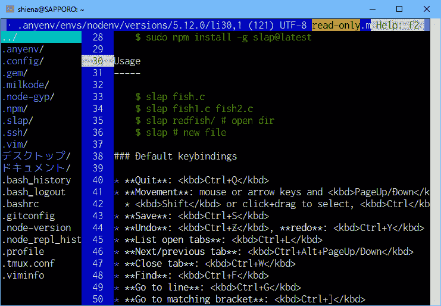

# 面向终端上 vim/emacs 困难的人的 Sublime 风编辑器 slap

> 原文:# t0]https://dev . to/shiena/vim-emacs-supreme-slap-D70

各位，终端使用的是哪个编辑器？
我专门使用 vim，但是要向不熟悉终端工作的人推荐的话会有点犹豫。
其他的候补中 nano 也不错，但是有外观很好的 slap，所以介绍一下。

# slapとは

这是在用 NodeJS 制作的 Sublime 风格的终端上工作的编辑器。
可以高亮显示 100 种以上的语言。
[https://github.com/slap-editor/slap](https://github.com/slap-editor/slap)

[T2】](https://res.cloudinary.com/practicaldev/image/fetch/s--F2xgoosw--/c_limit%2Cf_auto%2Cfl_progressive%2Cq_auto%2Cw_880/https://dev-to-uploads.s3.amazonaws.com/i/rbjlz0rghodubux1e8cm.png)

左边是文件浏览器，右边是编辑器。

## 安装

因为是 NodeJS 制造的，所以这是一枪。
没有 NodeJS 时，请用各环境的软件包等进行安装。

```
npm install -g slap@latest 
```

## 键绑定

*   End: `Ctrl+Q`
*   Move: `PageUp/PageDown`/`Home`/`End`
    *   选择:按住`Shift`移动键或鼠标拖动。 如果同时按下`Ctrl`/ `Alt`，则会高速移动。
*   Save: `Ctrl+S`
*   放弃:T0，准备:T1
*   标签一览:`Ctrl+L`
*   下一个/上一个选项卡:`Ctrl+Alt+PageUp/PageDown`
*   关闭选项卡:`Ctrl+W`
*   Suo: `Ctrl+F`
*   指定行号进行移动:`Ctrl+G`
*   对应的括号:`Ctrl+]`
*   打开文件(转到文件浏览器) :点击`Ctrl+O`或文件浏览器
*   新文件:`Ctrl+W`
*   帮助:`F2`

虽然不能置换，但是因为出现了[PR](https://github.com/slap-editor/slap/pull/374) ，所以不久可能会被吸收。

## 最低限度的设定

如果保留默认值，则文件浏览器的文件名不是 ascii 代码，而是？ 来启用 UNICODE。
另外，文件浏览器的宽度有点窄，所以展开。

```
; This is your customizable slap configuration. Defaults are located here:
; https://github.com/slap-editor/slap/blob/master/slap.ini
; https://github.com/slap-editor/editor-widget/blob/master/editor-widget.ini
; https://github.com/slap-editor/base-widget/blob/master/base-widget.ini
; https://github.com/slap-editor/slap-clipboard-plugin/blob/master/slap-clipboard-plugin.ini

[logger]
level = "info"

[screenOpts]
fullUnicode = true

[fileBrowser]
width = 15 
```

以上，你不觉得这样的话不擅长的意识也会减少吗？