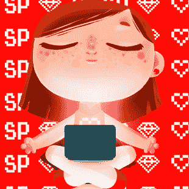

# 参加# rails RS485 2016 的感觉如何

> [https://dev . to/debborfernaness/how-was-participating-do-rails ssp 2016-115 b](https://dev.to/debborafernandess/como-foi-participar-do-railsgirlssp2016-115b)

 

<figcaption>掩护其中一个主办方</figcaption>

非常可爱

最近，我有幸参加了“t0”# railsegrsssp 2016、这一鼓励女性进入编程界的免费活动。

两天后就发生了。除了组织者之外，他们还应该自愿担任教练，帮助参与者迈出第一步，缩小寻找机会者与已经有机会者之间的差距，并在开始时看到自己。

第一天的讲座表明了在开发领域扩大多样性的重要性，作为新手和退伍军人能够而且必须为此而努力。讲座结束后，与会者得到帮助，为其机器上的开发环境做好准备。

第二天开始演讲介绍 Ruby 语法。他们组成了团队，每个团队都讨论了他们的设计理念，并开始实际上在联盟的指导下进行编程。

在一天结束时，这些项目被提出来，清楚地表明了参与者学习编程的方式:把他们的想法变成现实，有的拿出项目供日常使用！！！！太棒了！

#### 我在铁路上学到了什么，因为我已经想回去了

Rails 女孩的格式具有挑战性:在短时间内，参与者会收到大量的开发信息(Git、Agile、Ruby、Rails、REST 等)，并立即付诸实施。作为教练，我尽了最大努力来传达我所知道的，这样我团队中的每一个人都有机会把自己通过编码学到的一切尽可能的固定下来。

在介绍的时候，看到女孩子们眼中闪耀的光芒，在这么短的时间内制作出真正的东西的喜悦是非常可喜的。

经验交流也很精彩，一些联盟成员分享了他们的日常生活或开始的方式，以及继续坚持成为一名优秀程序员的重要性。

我真希望在我开始编程的时候我能参与到这样一个项目中来但是现在我能和初学者合作是我作为一个程序员最棒的时刻之一。

我希望与会者继续学习，并有资格成为开发人员，我随时准备在需要时帮助他们。

组织里的每一个人，赞助人和#Locaweb，他们鼓励我在活动中分享一些我的经历，这是我作为一个女人在发展领域的职业生涯，非常感谢！

对于要继续学习或快速记住基础知识的用户，我将在下面留下一个链接，其中包含创建项目的基本步骤。

[轨道备忘单](https://s3.amazonaws.com/ruby-thursday-pdfs/new_rails_app_cheatsheet_as_of_8_18_16.txt)