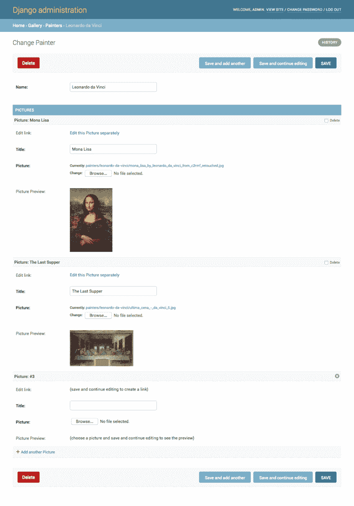
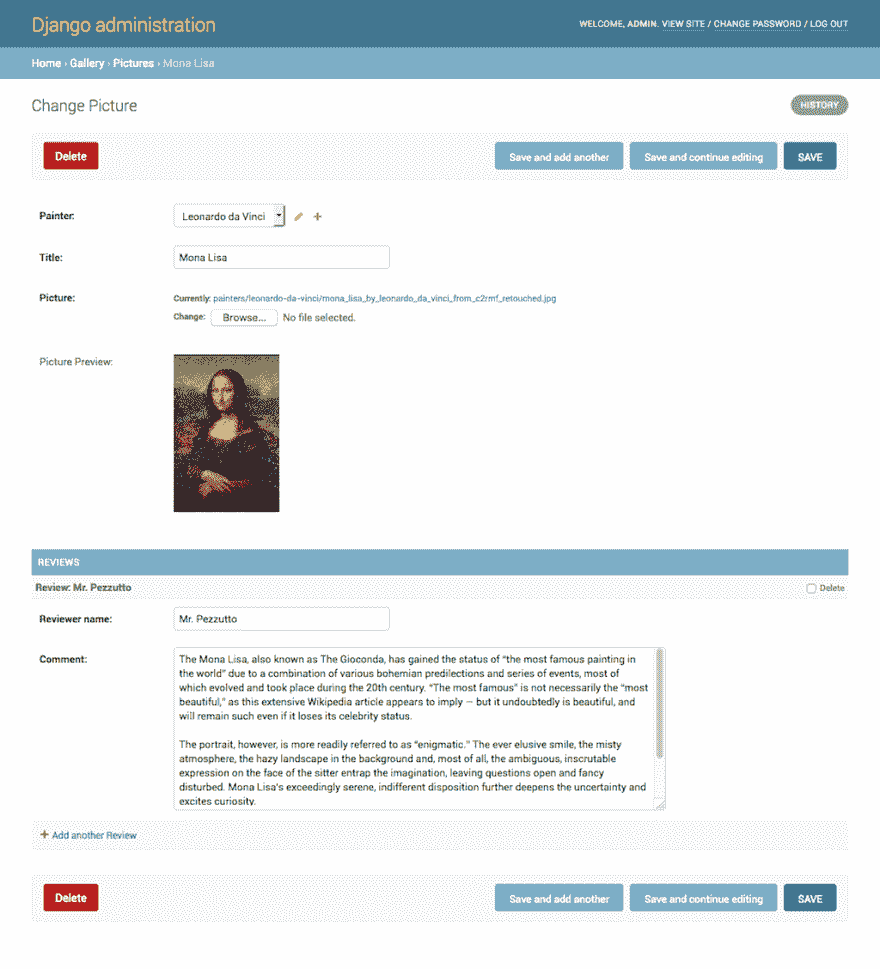

# Django 管理:内嵌的内嵌

> 原文:[https://dev . to/django tricks/django-administration-inlines-for-inlines-3hja](https://dev.to/djangotricks/django-administration-inlines-for-inlines-3hja)

[T2】](https://res.cloudinary.com/practicaldev/image/fetch/s--pyuzQNnH--/c_limit%2Cf_auto%2Cfl_progressive%2Cq_auto%2Cw_880/https://1.bp.blogspot.com/-76HnA7StJQA/WFN_Rn-JDSI/AAAAAAAABxQ/WNkXJyBjuxEv4jT3_p91b4vSP2w7x-HagCLcB/s1600/Django%252BAdministration-%252BInlines%252Bfor%252BInlines.png)

默认的 Django 模型管理带有一个[内联概念](https://docs.djangoproject.com/en/1.10/ref/contrib/admin/#inlinemodeladmin-objects)。如果有一对多关系，可以在同一表单中编辑父级及其子级。但是，您受到一种限制，即在嵌套的一对多关系中，内联下不能有内联。例如，如果一个**画家**可能画了多张**图片**并且每张**图片**可能有多张**评论**，那么你就不能在同一个表格中显示模特`Painter`、`Picture`和`Review`。

在这篇文章中，我想分享一种变通方法，它允许您快速访问内联模型的内联。这个想法是，对于每一个内联，你可以提供一个 HTML 链接，指向一个单独的表单，在那里你可以编辑相关的模型和它自己的关系。就这么简单。

例如，在`Painter`模型的形式中，列出了`Picture`的实例，并带有“单独编辑此图片”的特定链接:

[T2】](https://res.cloudinary.com/practicaldev/image/fetch/s--MdpG2Kb3--/c_limit%2Cf_auto%2Cfl_progressive%2Cq_auto%2Cw_880/https://4.bp.blogspot.com/-_dnJS_4sgVA/WFF_qUh6oeI/AAAAAAAABw8/1OvFUeVcDAM4Fdc0vu2WfLNrwnyb1XnagCLcB/s1600/painter-fullpage.png)

当点击这样的链接时，管理员转到`Picture`模型的表单，该表单显示了下面列出的`Review`模型的实例:

[T2】](https://res.cloudinary.com/practicaldev/image/fetch/s--u2SLHV8a--/c_limit%2Cf_auto%2Cfl_progressive%2Cq_auto%2Cw_880/https://1.bp.blogspot.com/-LKT31vHsjQU/WFCbSBaeb-I/AAAAAAAABv0/Bokt-STUvm0vIVRNPw-z3HNPcnYwTSYBACLcB/s1600/picture-fullpage.png)

我们来看看，这个是怎么实现的。

首先我会创建一个`gallery` app，在那里定义三个模型。这里没什么特别的。重要的是，`Picture`模型有一个到`Painter`模型的外键，而`Review`模型有一个到`Picture`模型的外键。

```
# gallery/models.py
# -*- coding: UTF-8 -*- from __future__ import unicode_literals

import os

from django.db import models
from django.utils.encoding import python_2_unicode_compatible
from django.utils.translation import ugettext_lazy as _
from django.utils.text import slugify

@python_2_unicode_compatible
class Painter(models.Model):
    name = models.CharField(_("Name"), max_length=255)

    class Meta:
        verbose_name = _("Painter")
        verbose_name_plural = _("Painters")

    def __str__ (self):
        return self.name

def upload_to(instance, filename):
    filename_base, filename_ext = os.path.splitext(filename)
    return "painters/{painter}/{filename}{extension}".format(
        painter=slugify(instance.painter.name),
        filename=slugify(filename_base),
        extension=filename_ext.lower(),
    )

@python_2_unicode_compatible
class Picture(models.Model):
    painter = models.ForeignKey(Painter, verbose_name=_("Painter"), on_delete=models.CASCADE)
    title = models.CharField(_("Title"), max_length=255)
    picture = models.ImageField(_("Picture"), upload_to=upload_to)

    class Meta:
        verbose_name = _("Picture")
        verbose_name_plural = _("Pictures")

    def __str__ (self):
        return self.title

@python_2_unicode_compatible
class Review(models.Model):
    picture = models.ForeignKey(Picture, verbose_name=_("Picture"), on_delete=models.CASCADE)
    reviewer = models.CharField(_("Reviewer name"), max_length=255)
    comment = models.TextField(_("Comment"))

    class Meta:
        verbose_name = _("Review")
        verbose_name_plural = _("Reviews")

    def __str__ (self):
        return self.reviewer 
```

<svg width="20px" height="20px" viewBox="0 0 24 24" class="highlight-action crayons-icon highlight-action--fullscreen-on"><title>Enter fullscreen mode</title></svg> <svg width="20px" height="20px" viewBox="0 0 24 24" class="highlight-action crayons-icon highlight-action--fullscreen-off"><title>Exit fullscreen mode</title></svg>

然后，我将为`gallery`应用程序的模型创建管理定义。在这里，我将为`Picture`模型设置两种管理类型:

*   通过扩展`admin.StackedInline`,我将创建内嵌的管理堆栈。
*   通过扩展`admin.ModelAdmin`,我将在一个单独的表单中创建管理。

在 Django 模型管理中，除了通常的表单字段，您还可以包含一些计算值。这可以通过引用可调用名称或方法名称的`fields`(或`fieldsets`)和`readonly_fields`属性来完成。

通过为可调用的 or 方法定义`short_description`属性，可以为这些计算值设置可翻译的标签。如果你想渲染一些 HTML，你也可以将`allow_tags`属性设置为`True`(否则你的 HTML 字符串会被转义)。

```
# gallery/admin.py
# -*- coding: UTF-8 -*- from django.contrib import admin
from django.core.urlresolvers import reverse
from django.utils.translation import ugettext_lazy as _
from django.utils.text import force_text

from .models import Painter, Picture, Review

def get_picture_preview(obj):
    if obj.pk: # if object has already been saved and has a primary key, show picture preview
        return """<a href="{src}" target="_blank"></a>""".format(
            src=obj.picture.url,
            title=obj.title,
        )
    return _("(choose a picture and save and continue editing to see the preview)")
get_picture_preview.allow_tags = True
get_picture_preview.short_description = _("Picture Preview")

class PictureInline(admin.StackedInline):
    model = Picture
    extra = 0
    fields = ["get_edit_link", "title", "picture", get_picture_preview]
    readonly_fields = ["get_edit_link", get_picture_preview]

    def get_edit_link(self, obj=None):
        if obj.pk: # if object has already been saved and has a primary key, show link to it
            url = reverse('admin:%s_%s_change' % (obj._meta.app_label, obj._meta.model_name), args=[force_text(obj.pk)])
            return """<a href="{url}">{text}</a>""".format(
                url=url,
                text=_("Edit this %s separately") % obj._meta.verbose_name,
            )
        return _("(save and continue editing to create a link)")
    get_edit_link.short_description = _("Edit link")
    get_edit_link.allow_tags = True

@admin.register(Painter)
class PainterAdmin(admin.ModelAdmin):
    save_on_top = True
    fields = ["name"]
    inlines = [PictureInline]

class ReviewInline(admin.StackedInline):
    model = Review
    extra = 0
    fields = ["reviewer", "comment"]

@admin.register(Picture)
class PictureAdmin(admin.ModelAdmin):
    save_on_top = True
    fields = ["painter", "title", "picture", get_picture_preview]
    readonly_fields = [get_picture_preview]
    inlines = [ReviewInline] 
```

<svg width="20px" height="20px" viewBox="0 0 24 24" class="highlight-action crayons-icon highlight-action--fullscreen-on"><title>Enter fullscreen mode</title></svg> <svg width="20px" height="20px" viewBox="0 0 24 24" class="highlight-action crayons-icon highlight-action--fullscreen-off"><title>Exit fullscreen mode</title></svg>

**更新！**从 Django 2.0 开始，`get_picture_preview()`函数应该使用`mark_safe()`而不是`allow_tags = True` :

```
from django.utils.safestring import mark_safe
# ...
    def get_edit_link(self, obj=None):
        if obj.pk:  # if object has already been saved and has a primary key, show link to it
            url = reverse(
                'admin:%s_%s_change' % (obj._meta.app_label, obj._meta.model_name), 
                args=[force_text(obj.pk)]
            )
            return mark_safe("""<a href="{url}">{text}</a>""".format(
                url=url,
                text=_("Edit this %s separately") % obj._meta.verbose_name,
            ))
        return _("(save and continue editing to create a link)")
    get_edit_link.short_description = _("Edit link") 
```

<svg width="20px" height="20px" viewBox="0 0 24 24" class="highlight-action crayons-icon highlight-action--fullscreen-on"><title>Enter fullscreen mode</title></svg> <svg width="20px" height="20px" viewBox="0 0 24 24" class="highlight-action crayons-icon highlight-action--fullscreen-off"><title>Exit fullscreen mode</title></svg>

在这个管理设置中，`get_edit_link()`方法为`Picture`模型在内嵌和独立的管理表单之间创建了一个 HTML 链接。如你所见，我还增加了`get_picture_preview()`功能作为奖励。它包含在`Picture`型号的两个管理定义中，其目的是在保存后显示上传图片的预览。

概括地说，Django 不支持现成的嵌套内联。但是，您可以在一个单独的页面中编辑您的内联，使表单相互链接。对于链接，您可以使用一些神奇的`readonly_fields`属性。

如果您真的需要在项目中的内联下有内联，该怎么办？在这种情况下，你可能会检查 [django-nested-admin](https://github.com/theatlantic/django-nested-admin) ，并毫不犹豫地在评论中分享你的经验。

*本帖最初发表于[djangotricks.blogspot.com](http://djangotricks.blogspot.com/2016/12/django-administration-inlines-for-inlines.html)T3】*