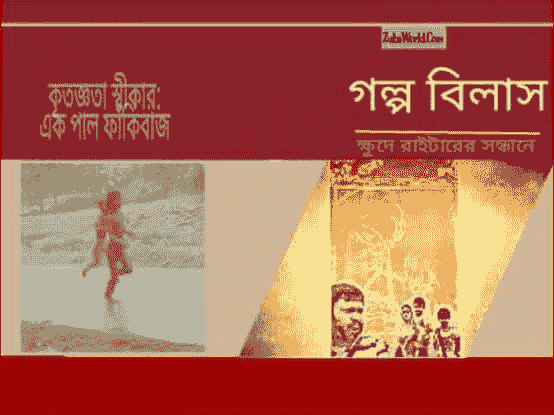
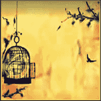

# Golpo Bilash

> 原文:[https://dev.to/armandsl/golpo-bilash-4k5k](https://dev.to/armandsl/golpo-bilash-4k5k)

অজানা অচেনা অনিয়মিত কিন্তু লিখার মান ভালো, এমন কিছু লেখক/লেখিকার খোঁজে ফেসবুকের মাধ্যমে শুরু হয় তল্লাশি। একের পর এক প্রতিযোগিতার আয়োজনের মাধ্যমে নির্বাচন করা হয় মানসম্মত কিছু লেখক/লেখিকার গল্প। এরপর কোন অনুদান ছাড়াই নিজেদের ব্যাক্তিগত অর্থব্যায়ের মাধ্যমে লিখাগুলি সকলের কাছে পৌছে দিতে ২০১৬ ইং সালের ২১ শে বই মেলায় প্রকাশিত হয় চারটি বই। নাম গুলো হচ্ছে,

১) হারানো MPSZ গ্রহের সন্ধানে

২) স্বপ্ন পূরণে জয়বিডি পরিবার

৩) শব্দ ছুঁয়ে স্বপ্ন নিয়ে

এবং

৪) কন্ঠে বিস্ময় হৃদয়ে স্বদেশ

২০১৬ ইং সালের সফল আয়োজনের উতসাহ নিয়ে আবারো হয় লেখক/লেখিকার খোঁজ। পুরো বছর চলে বিভিন্ন কার্যক্রম। অবশেষে আবারো একঝাক লেখক/লেখিকার অসাধারণ কিছু লিখা নিয়ে অনাগত ২১ শে বইমেলা ২০১৭ ইং কে কেন্দ্র করে সম্পাদনা শুরু হয় নতুন আরো কিছু বই এর। তার মধ্যে উল্লেখযোগ্য একটি বই হচ্ছে **গল্প বিলাশ (Golpo Bilash)**

[T2】](https://res.cloudinary.com/practicaldev/image/fetch/s--LbuQao2C--/c_limit%2Cf_auto%2Cfl_progressive%2Cq_auto%2Cw_880/https://cdn-images-1.medium.com/max/554/0%2ACozHp__Kyt3UulRC.)

আমাদের বিশ্বাস আমাদের মতো আরো অনেকেই একদিন এগিয়ে আসবে ক্ষুদে গানরাজের খোঁজের মতই ক্ষুদে প্রতিভাদের সন্ধানে।

[ZuhaWorld](https://zuhaworld.com/tag/zuhaworld/)2016–12–15

[**+浴场**](https://plus.google.com/117209874889840153955?rel=author)

### 查也

[T2】](https://res.cloudinary.com/practicaldev/image/fetch/s--o_il1zT1--/c_limit%2Cf_auto%2Cfl_progressive%2Cq_auto%2Cw_880/https://cdn-images-1.medium.com/max/200/0%2A8Sq4XagdomKAmWSC.)

欢迎来到祖哈世界社区祖哈世界。永远领先一步，也许你不会…

ঝড়ের পাখী হয়ে উড়ে যেতে হবে বহুদুরে জানিনা কোন ঠিকানা হারিয়েছি সীমানা

从宇宙一开始，我们就发现了一场共同的战争，那就是…

如何拯救你的未来？监控你的过去找出你最好的朋友找出他们的…

欢迎来到 RadioBangladesh24.Com 现场直播，这是最好的在线媒体中心之一…

*原载于 2016 年 12 月 15 日*[*【zuhaworld.com】*](https://zuhaworld.com/golpo-bilash)*。*