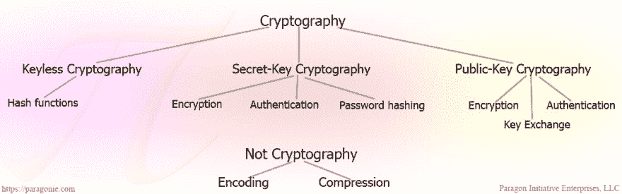
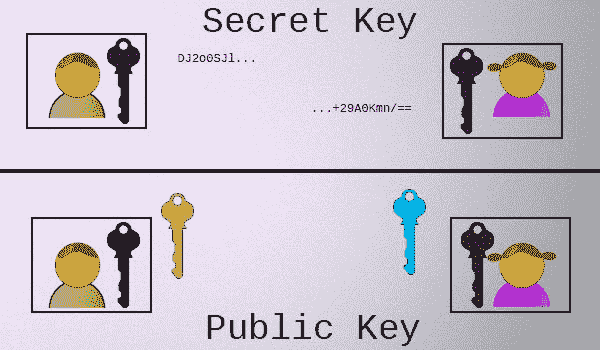

# 你不会用 64 为基数的密码！面向开发人员的加密术语和概念

> 原文:[https://dev . to/paragonie/you-would-base64-a-password-cryptography-terms-and-concepts-for-developers](https://dev.to/paragonie/you-wouldnt-base64-a-password-cryptography-terms-and-concepts-for-developers)

> 最初发布于:[你不会用 64 位密码！Paragon Initiative 企业博客](https://paragonie.com/blog/2015/08/you-wouldnt-base64-a-password-cryptography-decoded)

互联网上有大量糟糕的编程和安全建议。有些建议是不好的，因为作者被误导了，有些是因为它强调精确而不是清晰，大多数人最终迷失在术语中。

如果你觉得密码学是一个奇怪的、复杂的、有点吓人的主题，你的感觉最好被描述为不冷不热的(在一个好的日子里)，我们希望当你读完这一页时，你会清楚地理解当这个主题出现时人们使用的术语和概念。

> 警告:此页面上的示例片段仅用于说明目的。不要在你的项目中使用它们。如果你想要一个真实世界的例子来参考，看看我们首席开发官的 StackOverflow 回答中的片段。

# 面向开发者的基本密码学概念

先说一个基本问题:**到底什么是密码特征？**用最简单的术语我们可以集合起来:`Cryptographic features use math to secure an application`。

再深入一点:有太多的加密算法，它们通常可以根据两个标准进行分类:

1.  开发商必须提供多少信息？
2.  预期目标是什么？
    *   保密？
    *   正直？
    *   真实性？
    *   不可否认性？否认？(这两个是对立的。)

## 密码学概念概述

 *[T2】](https://res.cloudinary.com/practicaldev/image/fetch/s--K4LZBy3P--/c_limit%2Cf_auto%2Cfl_progressive%2Cq_auto%2Cw_880/https://paragonie.com/files/blog/crypto-categories.png)

*   无钥匙加密(0 把钥匙)
    *   哈希函数
*   密钥加密(1 个密钥)
    *   秘密密钥消息认证
    *   秘密密钥加密
    *   认证密钥加密
*   公钥加密(2 个密钥)
    *   共享密钥协议
    *   数字签名

## 密码学第一法则:不要自己实现

开发加密特性最好留给专家。无论如何，[可以随意修改](http://www.cryptofails.com/post/75204435608/write-crypto-code-dont-publish-it)，但是不要在生产中部署你的实验，或者与其他可能在生产中部署它们的开发人员分享它们。

相反，使用专家已经审核过的高级加密库。点击链接阅读我们的 [PHP 加密库推荐](https://paragonie.com/blog/2015/11/choosing-right-cryptography-library-for-your-php-project-guide)。

## 无钥匙密码术

要考虑的最简单的算法是**加密散列函数**，它接受一个输入并返回一个确定的固定大小的输出。

```
hash("sha256", "");
// e3b0c44298fc1c149afbf4c8996fb92427ae41e4649b934ca495991b7852b855

hash("sha256", "The quick brown fox jumps over the lazy dog");
// d7a8fbb307d7809469ca9abcb0082e4f8d5651e46d3cdb762d02d0bf37c9e592 
```

<svg width="20px" height="20px" viewBox="0 0 24 24" class="highlight-action crayons-icon highlight-action--fullscreen-on"><title>Enter fullscreen mode</title></svg> <svg width="20px" height="20px" viewBox="0 0 24 24" class="highlight-action crayons-icon highlight-action--fullscreen-off"><title>Exit fullscreen mode</title></svg>

当使用设计良好的加密哈希函数时，比如 **BLAKE2** 或 SHA256，对消息的任何更改都会导致完全不同的哈希输出。

```
hash("sha256", "The quick brown fox jumps over the lazy cog");
// e4c4d8f3bf76b692de791a173e05321150f7a345b46484fe427f6acc7ecc81be 
```

<svg width="20px" height="20px" viewBox="0 0 24 24" class="highlight-action crayons-icon highlight-action--fullscreen-on"><title>Enter fullscreen mode</title></svg> <svg width="20px" height="20px" viewBox="0 0 24 24" class="highlight-action crayons-icon highlight-action--fullscreen-off"><title>Exit fullscreen mode</title></svg>

简单的散列函数是快速的和确定性的；如果您有任何任意消息，您可以计算该特定消息的散列输出。就其本身而言，它们主要用于错误检查或作为其他加密原语的构建块，而大多数开发人员不需要开发这些原语。

**加密哈希函数是单向数据转换。**尽管您可以轻松地计算任意消息的散列输出(通常称为消息摘要),但是您不能轻松地从散列输出转到原始消息。

一些散列函数(如 MD5)的安全保证较弱，输出大小较小。因此，[计算两个不同的消息将产生相同的 MD5 散列](http://natmchugh.blogspot.fr/2015/02/create-your-own-md5-collisions.html)几乎是微不足道的。

## 秘密密钥密码术

大多数加密算法不像哈希函数那么简单。因此，它们更加有用，可以提供比“是的，这个输出可以从这个输入中复制出来”更多的安全保证。

因此，它们通常需要两部分输入:消息和一个**密钥**。秘密密钥应该是发送者和预定接收者都应该知道的唯一的随机字节串，而不是其他人。

### 键控散列函数-消息认证

键控散列函数，如 [HMAC](https://en.wikipedia.org/wiki/Hash-based_message_authentication_code) ，是散列函数的特殊实现，它接受消息和密钥并产生消息认证码(MAC)。

```
hash_hmac("sha256", "The quick brown fox jumps over the lazy dog", "secret key");
// 4a513ac60b4f0253d95c2687fa104691c77c9ed77e884453c6a822b7b010d36f

hash_hmac("sha256", "The quick brown fox jumps over the lazy cog", "secret key");
// ed6b9bc9d64e4c923b2cc19c15fff329f343f30884935c10e617e0fe067adef1

hash_hmac("sha256", "The quick brown fox jumps over the lazy dog", "secret kez");
// 291579f3123c3126df04a57f78768b6290df93f979b86af25fecd98a9811da5a

hash_hmac("sha256", "The quick brown fox jumps over the lazy cog", "secret kez");
// 298bb0244ebc987810de3892384bb4663742a540db2b3a875f66b09d068d1f64 
```

<svg width="20px" height="20px" viewBox="0 0 24 24" class="highlight-action crayons-icon highlight-action--fullscreen-on"><title>Enter fullscreen mode</title></svg> <svg width="20px" height="20px" viewBox="0 0 24 24" class="highlight-action crayons-icon highlight-action--fullscreen-off"><title>Exit fullscreen mode</title></svg>

键控散列函数比散列函数更有用；只有拥有密钥的人才能计算出给定消息的 MAC。因此，如果您传输一条消息和给定消息的 MAC，而从不传输密钥，则可以合理地确定该消息是可信的。

### 秘密密钥加密

> 警告:没有消息验证的加密容易受到选择密文攻击。请阅读我们关于 PHP 中[安全数据加密的白皮书。](https://paragonie.com/white-paper/2015-secure-php-data-encryption#symmetric-encryption)

从形式上来说，加密是将消息(称为`plaintext`)和**密钥**转换成看似随机的字节串(称为`ciphertext`)的可逆过程。即`encrypt($message, $key)`应该为给定的`$message`和`$key`对返回一个唯一的随机字节串。

不幸的是，[简单的密钥加密(也称为 ECB 模式)并不安全](https://filippo.io/the-ecb-penguin)。如果您在 ECB 模式下使用相同的密钥对消息中的相同(16 字节，对于流行的 AES 加密算法)块进行加密，密文将会重复。

因此，现代秘钥加密实际上接受了两条以上的信息。除了`plaintext`消息和一个**密钥**，它们还需要一个唯一的*初始化向量* (IV，用于 CBC 模式)或 *nonce* (一次使用的数字，用于 CTR 模式)。nonce 和 IV 之间的区别很微妙。

> 此页面上的所有代码都不安全；任何加密密钥都不是。

```
/**
 * This code is for example purposes only. DO NOT USE IT.
 * Use https://github.com/defuse/php-encryption instead
 * 
 * Demo: http://3v4l.org/ih8om
 */
bin2hex(
    openssl_encrypt(
      /* Message: */
        "The quick brown fox jumps over the lazy dog",
      /* Cipher algorithm and block mode: */
        'aes-128-ctr',
      /* Encryption key: (don't use weak keys like this ever, it's just an example!): */
        "\x01\x02\x03\x04" . "\x05\x06\x07\x08" . "\x09\x0a\x0b\x0c" . "\x0d\x0e\x0f\x10",
      /* Constant that means "don't encode": */
        OPENSSL_RAW_DATA,
      /* Initialization Vector or Nonce -- don't ever actually use all NULL bytes: */
        str_repeat("\0", 16) // This is a really bad way to generate a nonce or IV. 
    )
);
// 8f99e1315fcc7875325149dda085c504fc157e39c0b7f31c6c0b333136a7a8877c4971a5ce5688f94ae650

/**
 * This code is for example purposes only. DO NOT USE IT.
 * Use https://github.com/defuse/php-encryption instead
 * 
 * Demo: http://3v4l.org/ZgW38
 */
openssl_decrypt(
  /* Message: */
    hex2bin(
        "8f99e1315fcc7875325149dda085c504fc157e39c0b7f31c6c0b333136a7a8877c4971a5ce5688f94ae650"
    ),
  /* Cipher algorithm and block mode: */
    'aes-128-ctr',
  /* Encryption key: (don't use weak keys like this ever, it's just an example!): */
    "\x01\x02\x03\x04" . "\x05\x06\x07\x08" . "\x09\x0a\x0b\x0c" . "\x0d\x0e\x0f\x10",
  /* Constant that means "don't encode": */
    OPENSSL_RAW_DATA,
  /* Initialization Vector or Nonce -- don't ever actually use all NULL bytes: */
    str_repeat("\0", 16) // This is a really bad way to generate a nonce or IV.
);
// The quick brown fox jumps over the lazy dog 
```

<svg width="20px" height="20px" viewBox="0 0 24 24" class="highlight-action crayons-icon highlight-action--fullscreen-on"><title>Enter fullscreen mode</title></svg> <svg width="20px" height="20px" viewBox="0 0 24 24" class="highlight-action crayons-icon highlight-action--fullscreen-off"><title>Exit fullscreen mode</title></svg>

这里的[提供了一个更深入、更简单的示例(可以正确地生成 iv)。](https://stackoverflow.com/a/30189841/2224584)

要进一步了解 OpenSSL 的对称密钥加密，请阅读我们的白皮书。

只有使用相同的 IV/nonce 和密钥，解密才是成功的。但是，只有密钥必须保密；IV 和 nonce 甚至可以与您的加密消息一起广播。

### 认证密钥加密

 *如果你还记得我们之前的博客文章， [*正确使用加密和认证*](https://paragonie.com/blog/2015/05/using-encryption-and-authentication-correctly) ，秘密密钥加密本身很容易被篡改，除非你把它和认证结合起来。

唯一被证明是安全的策略是[使用 AEAD 模式](https://paragonie.com/blog/2015/05/using-encryption-and-authentication-correctly#title.4.1)或者总是**先加密，然后用 MAC 认证加密的数据**。

如果您遵循先加密后 MAC 的结构，您需要使用两个独立的密钥:一个用于加密，另一个用于 MAC。换句话说，将前面两个部分结合起来应用:

```
/**
 * This code is for example purposes only. DO NOT USE IT.
 * Use https://github.com/defuse/php-encryption instead
 */
$nonce = random_bytes(16);
$ciphertext = openssl_encrypt(
  /* Message: */
    "The quick brown fox jumps over the lazy dog",
  /* Cipher algorithm and block mode: */
    'aes-128-ctr',
  /* Encryption key: (don't use weak keys like this ever, it's just an example!)
   *    Instead, you want to generate 16, 24, or 32 random bytes (i.e. random_bytes(16))
   *    on your own. It's generally a bad idea to copy and paste security code.
   */
    "\x01\x02\x03\x04" . "\x05\x06\x07\x08" . "\x09\x0a\x0b\x0c" . "\x0d\x0e\x0f\x10",
  /* Constants that mean "don't encode" and "we have no padding" to the OpenSSL API: */
    OPENSSL_RAW_DATA + OPENSSL_ZERO_PADDING,
  /* Initialization Vector or Nonce: */
    $nonce
);
// You should choose a better HMAC key than we did for this article:
$mac = hash_hmac("sha256", $nonce.$ciphertext, "\xff\xfe\xfd\xfc" . "\xfb\xfa\xf9\xf8" . "\xf7\xf6\xf5\xf4" . "\xf3\xf2\xf1\xf0", true);
echo bin2hex($nonce.$ciphertext.$mac);
/*
   71b5546f 6cb857cd 0d8f8be3 f9312c74 <- Nonce (randomly chosen)
   356146df 274552c2 e98d3008 b1dfa35c <- Ciphertext
   60d6130d 9c9ca525 6c2f2f25 0b321176
   06563174 c3b073a0 5ab263
   4d1c7416 b086a316 a0474a05 84e3793c <- MAC
   a32fde09 0d82a5ef 213cb329 da3b5b06 
 */ 
```

<svg width="20px" height="20px" viewBox="0 0 24 24" class="highlight-action crayons-icon highlight-action--fullscreen-on"><title>Enter fullscreen mode</title></svg> <svg width="20px" height="20px" viewBox="0 0 24 24" class="highlight-action crayons-icon highlight-action--fullscreen-off"><title>Exit fullscreen mode</title></svg>

组合加密功能时务必小心。如上所述，我们的基本协议没有冗余特征:

*   秘密密钥加密提供了**机密性**,因此它只能用正确的秘密密钥读取。
*   带密钥的散列函数提供**认证**(并因此提供*消息完整性*)，这样任何拥有正确密钥的人都可以重新计算相同的 MAC。
*   随机 IV/nonce 用于使每个加密消息*是唯一的，即使未加密消息是相同的*。

不言而喻，当你需要认证加密时，使用双重加密或双重认证是愚蠢的。

## 公钥加密

公钥密码学对于非技术人员来说很难理解，对于技术人员来说，更难的是在不使读者陷入数学或错过关键点的情况下正确解释。最终的结果通常是很多困惑，偶尔还有一种错误的理解感。(一个 fauxreka 时刻，如果你愿意。)

[T2】](https://res.cloudinary.com/practicaldev/image/fetch/s--NmnQoyrF--/c_limit%2Cf_auto%2Cfl_progressive%2Cq_auto%2Cw_880/https://paragonie.com/files/blog/crypto_types.png)

现在你只需要知道这些:与秘密密钥加密不同，秘密密钥加密涉及一个由双方持有的秘密密钥，在公开密钥加密中，每个参与者都有两个密钥:

*   每个参与者都有一个**私钥**，他们从不共享这个私钥。
*   每个参与者也有一个**公钥**，在数学上与他们的私钥相关，他们与每个人共享私钥。

不幸的是，当公开密钥加密技术被发现时，秘密密钥加密技术中的“密钥”术语就被卡住了，因为没有多少物理系统在直觉上与这里发生的事情相似。有些人试图用颜色或[详细解释](http://crypto.stackexchange.com/q/292/24405)来[解释公钥密码。如果你对私密的细节感兴趣，我们推荐前一句中的两个链接。](https://www.youtube.com/watch?v=3QnD2c4Xovk)

对于其他人来说，如果你能接受这些前提，理解其余的就不难了:

*   要使用公钥加密，您需要生成一个密钥对，并共享公钥，但只保留私钥。(大多数情况下，每个参与者都这样做。)
*   任何给定的公钥都只有一个私钥。
*   给定密钥对中的两个密钥在数学上是相互关联的。
*   给定一个公钥，要弄清楚私钥是什么几乎是不可能的。
*   给定一个私钥，您几乎可以立即计算出相关的公钥。

明白了吗？有了这个认识，我们来建点东西吧。

### 共享密钥协议

假设您想使用秘密密钥加密(比公开密钥加密快得多)通过互联网与一位朋友交谈，但您不想让其他任何人阅读它。你和她还没有就秘密密钥达成一致。你是怎么做到的？

掩盖更好的细节(上面的彩色视频很好地解释了这一点)，这就是你要做的:

1.  你把你的公钥(黄色)发给她。
2.  她把她的公钥(浅蓝色)发给你。
3.  将您的私钥(绿色)和她的公钥(蓝色)组合起来，形成一个共享密钥。
4.  她会将自己的私钥(红色)与你的公钥(黄色)结合起来，形成**完全相同的共享密钥**。

怎么会？[模运算](https://www.khanacademy.org/computing/computer-science/cryptography/modern-crypt/v/diffie-hellman-key-exchange-part-2)(经典 Diffie Hellman)或[有限域上沿椭圆曲线的乘法](https://www.youtube.com/watch?v=l6jTFxQaUJA)(现代椭圆曲线 Diffie Hellman)。

### 数字签名

数字签名算法，如 [EdDSA](https://en.wikipedia.org/wiki/EdDSA) (Edwards-curve 数字签名算法)，是公钥加密产生的最有用的创新之一。

根据**消息**和**私钥**计算出**数字签名**。早期的算法(比如 ECDSA)也要求你为每条消息生成一个唯一的随机随机数，但是这在现实世界中被证明是容易出错的。

任何拥有你的**公钥**副本的人都可以验证特定的消息是由你的私钥签名的。与键控散列函数不同，这种验证不需要您透露您的私钥。

# 常见的误解和陷阱

## 密码存储

快速回答:[用 bcrypt](https://paragonie.com/blog/2016/02/how-safely-store-password-in-2016) 就行了。对于 PHP 开发者来说，这意味着 [`password_hash()`](https://secure.php.net/password_hash) 和 [`password_verify()`](https://secure.php.net/password_hash) 而不是`crypt()`。

很多开发者认为密码应该*加密*，但这是错误的。**密码应该*哈希** *，而不是加密。此外，不要混淆密码散列算法和简单的加密散列函数。它们不是一回事:

| 加密哈希 | 密码哈希 |
| --- | --- |
| 

*   There is only one input: the message.

 | 

*   Deliberately slow down at least three inputs:
    1.  password
    2.  One salt per user.
    3.  A cost factor (how expensive it is to calculate)

 |

与加密哈希不同，密码哈希需要多个输入参数。但与加密算法不同，密码哈希是单向的确定性陷阱门计算。与秘钥加密不同的是，盐不需要保密；它只需要对每个用户都是唯一的。每个用户一个唯一的 salt 的目的是阻止预先计算，并使从散列列表中暴力猜测密码更加昂贵。

我可以加密我的(bcrypt)密码散列吗？

是的。如果您在不同的硬件服务器上运行您的 web 应用程序和您的数据库，这实际上提供了深度防御。这就是我们的 [password_lock](https://github.com/paragonie/password_lock) 库背后的原因。

## 文件验证

数字签名可以证明真实性，而加密哈希函数不能。

有相当一部分技术用户在从网站下载可执行文件时，会重新计算文件的 MD5 或 SHA1 散列，并将其与他们下载文件的网页上显示的散列进行比较。如果匹配，他们将执行该文件，完全相信其内容是真实的。

如果文件和哈希值都存储在同一个服务器上，这完全是浪费时间:**任何可以改变你的下载的攻击者也可以替换网页上的哈希值。**(如果文件和散列在不同的服务器上，情况会有所不同，但是改进并不显著，不足以保证避免更好的解决方案。)

毕竟，正如我们上面所说的，像 MD5 和 SHA1 这样的散列函数为给定的输入产生一个确定的固定大小的输出。没有秘密可言。当一个解决方案没有增加安全性而是让人们感觉更安全时，我们称之为[安全剧场](https://en.wikipedia.org/wiki/Security_theater)。

在这种情况下，加密散列函数是一种安全手段。你想要用数字签名来代替。

为了提高安全性，软件供应商可以用他们的 EdDSA 私钥签署他们的包，并广泛共享他们的 EdDSA 公钥，而不是发布 MD5/SHA1 散列。当您下载文件时，您还应该下载签名，并使用经过验证的公钥检查它是否可信。

比如: [Minisign](https://github.com/jedisct1/minisign) 。

带密钥的散列函数在这里也不起作用，因为您需要分发密钥，以便任何人都能够验证签名。如果他们有密钥，他们可以伪造自己的签名来恶意修改消息(在本例中是可执行文件)。

数字签名是保证下载内容真实性的最佳方式。MD5/SHA1 散列在这里几乎总是无用的。

## 编码和压缩不加密

 *初学者的一个常见错误是使用编码函数，比如`base64_encode()`，试图混淆信息。考虑下面的代码，它出现在 LinkedIn 关于如何在 PHP web 应用程序中正确存储密码的讨论中:

> 这很可能是[有史以来最糟糕的密码存储函数](http://3v4l.org/BZ7rC)。

许多开发人员会对信息进行编码或压缩，并假设他们的解决方案提供了与实际加密功能相同的安全级别，只是因为输出不是人类可读的。并没有。

编码和压缩算法都是**可逆的、无钥匙的信息转换**。编码指定了信息应该如何在人类可读的文本中表示。压缩试图将输入减少到尽可能小的空间。两者都很有用，但都不是加密功能。

# 概述

*   **加密哈希算法**(如 SHA256)是确定性的单向算法，需要`zero`密钥。
*   **密钥哈希算法**(如 HMAC)用于密钥加密中的认证；需要`one`键。
*   **秘密密钥加密算法**(如 AES-CTR)用于转换消息，因此只有拥有秘密密钥的人才能逆转；需要一个`key`。
*   **共享秘密协议算法**(如 ECDH)用于协商共享秘密密钥，同时只要求公开传输双方的公开密钥。需要`four`密钥(两对私有/公共)来生成第五个。
*   **数字签名算法**(如 Ed25519)用于签署信息(用个人的私钥)，任何拥有相应公钥的人都可以验证该信息。需要`two`键。
*   **密码哈希算法**(例如 bcrypt)是一种慢速哈希算法，专门针对难以通过强力搜索进行有效攻击而设计。需要`one`秘密输入和每用户 salt。
*   **编码算法**(如 Base64)不是加密的。
*   **压缩算法**(如 gzip)不加密。

## 牢记在心

*   **不要加密密码。**取而代之的是，用密码散列算法对它们进行散列。(您可以加密哈希。)像 MD5、SHA1 和 SHA256 这样的散列函数不是加密。任何使用“密码加密”这个短语的人可能都需要仔细阅读这一整页，因为他们大错特错了。
*   没有消息认证的秘密密钥[加密](https://paragonie.com/blog/2015/05/using-encryption-and-authentication-correctly)是不安全的(容易受到选择密文攻击)。
*   对于下载:数字签名证明真实性，哈希不。您需要 Minsign 或 GPG 签名，而不是 MD5 散列。

* * *

我们希望这篇文章能很好地介绍密码学概念。我们的团队每月(通常在周五)在任何地方发布 2 到 5 次关于加密、应用程序安全和 PHP web 开发的新帖子。我们还提供[代码审查](https://paragonie.com/service/code-review)和[技术咨询](https://paragonie.com/service/technology-consulting)服务。***