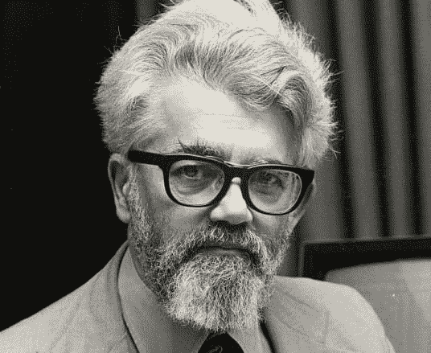

# Lisp 的想法

> 原文:[https://dev.to/ericnormand/the-idea-of-lisp](https://dev.to/ericnormand/the-idea-of-lisp)

口齿伶俐。它唤起了过去计算机时代的景象，像冰箱一样大，全是大写字母代码和括号。哦！这么多括号！那么，为什么面向对象编程的创造者如此迷恋 Lisp 的理念呢？他说编程语言是一种思想是什么意思？我应该责怪我的计算机科学教育没有教给我吗？

Lisp 是在约翰·麦卡锡写的一篇名为 [*符号表达式的递归函数及其机器解释，第一部分*](https://www.brinckerhoff.org/clements/csc530-sp09/Readings/mccarthy-1960.pdf) 的论文中首次向世界介绍的。在书中，McCarthy 介绍了许多编程的新思想。其中包括*条件表达式*(没错， *if/then/else* )以及使用不止一个字母——有时甚至是单词和短语——表示变量(就像数学中的*和*一样)。你最喜欢的编程语言将这两个特性归功于约翰·麦卡锡。但是 Lisp 本身的定义中隐藏着一个更深层次的思想。

[T2】](https://res.cloudinary.com/practicaldev/image/fetch/s--evs2D6oK--/c_limit%2Cf_auto%2Cfl_progressive%2Cq_auto%2Cw_880/https://cdn.slashgear.com/wp-content/uploads/2011/10/mccarthy.png)

他定义了 5 个基本操作(`atom`、`eq`、`cons`、`car`和`cdr`，以及一个条件表达式。它还假设有定义函数的能力。然后他用这些来定义*一个完整的编程语言*，它本身就有定义。让我再说一遍:约翰·麦卡锡用机器代码写了 6 个简单的东西，然后把它们组合成一种编程语言。在此之前，唯一一种更高级的编程语言是 Fortran，它花了 [18 个人年来开发](https://books.google.com/books?id=I79N-8QTzjwC&pg=PA226&lpg=PA226&source=bl&ots=OW8aT_7WJd&sig=GHvEmUF-UWUMwQDvvf_aPe-pW9g&hl=en&sa=X&ved=0ahUKEwjVp538__HQAhXsyVQKHYxdCkkQ6AEIIjAC#v=onepage&q&f=false)。Fortran 是一个巨大的成就，但是 Lisp 是一个伟大的想法。

让我们稍微解释一下这个惊人的想法:

## 自举材料非常小。

这 6 样东西给了你一系列可以被解释的符号。它们定义了一个非常小的“内核”,可以很容易地移植到其他系统。这是一个小的“固定点”的协议。所有其他的意义都可以用它们来定义。

## 这种语言被定义为解释者。

这从结构上证明了语言是通用的。图灵完备性的思想实际上有两个部分。首先，你可以计算任何可计算的东西。几乎所有的编程语言都满足这一点(包括 Lisp，因为它有递归函数)。不过，第二部分就特别多了。当图灵机可以解释任何其他图灵机时，它们可以被视为*通用*。嗯，Lisp 从一开始就被定义为解释器，就像通用图灵机一样。Lisp 是一种通用语言，因为它可以解释自己的代码。虽然您可以用 JavaScript 编写一个 JavaScript 解释器，但是没有任何工作是为您做的。

## 语言中表达式的意义是由解释者定义的。

您可以编写自己的解释器，为表达式赋予不同的含义。这就是艾伦·凯的“后期绑定”概念。因为我们不太了解如何编程，所以在语言的基础上建立太多的假设是错误的。因此，我们需要一个系统，当我们了解更多的时候，它可以允许我们交换假设，而不必抛弃所有假设。

## 表达式是用语言中可用的数据结构编写的。

表达式被写成递归链表。遍历这些数据结构并解释它们只需要这 5 个原语。

Lispers 喜欢使用这种高度灵活的“内核”,尽管大多数 Lisp 系统做出了实际的妥协，比如将表达式编译成机器代码，而不是每次都解释它。以下是 Lisp 的一些特性，它们直接源自 Lisp 的*思想。*

## 宏指令

宏是接受代码并返回代码的函数。他们是代码转换器。它们扩展了语言的表现力，允许你在编译时进行计算。

## 数据驱动编程

Lispers 经常用 Lisp 为他们创造的新语言编写自己的解释器。他们为自己的语言重新制定了 Lisp 的引导程序。这些可以被看作是特定领域的语言。

## 编程语言实验

因为 Lisp 是为自己编写解释器而设计的，所以它非常适合尝试语言的替代语义。

我们都太忘记我们领域的历史了。我们行业中最重要的语言经常被改变。新的热门语言将在 15 年后消失。但是 Lisp，这个想法，一直存在。目前它最有前途的化身是 Clojure，它运行在 JVM 和 JavaScript 上。

然而，Lisp 的思想实际上存在于您最喜欢的语言中:

## REPL

REPL 代表 Read-Eval-Print-Loop，这是定义它的四个 Lisp 结构的名称。如果你的语言有一个交互式提示，你可以输入代码并看到它运行，这来自 Lisp。

## 递归函数

1960 年的计算机科学家知道递归函数是可能的，但他们认为这太昂贵了。当时的另一种主要语言 Fortran 没有递归函数。现在递归函数是表桩。

## 碎片帐集

Lisp 是第一种具有垃圾收集功能的语言，主要是因为这种语言创建了许多临时对象，并且运行了很长时间。

## 条件表达式

是的，约翰·麦卡锡发明了条件表达式。他游说 Algol 委员会将它们加入 Algol 语言中，今天大多数语言都是从 Algol 语言中得到它们的。

## 多字符变量名

我以前提到过这一点，但它值得重复:在麦卡锡出现之前，程序员们正在遵循 math 的领导，使用单字母变量名。

## 文字数据结构

你能用你的语言直接用语法写数组和映射吗？Lisp 首先使用 parens `()`实现了这一点。

以下是艾伦·凯的完整引语:

> 大部分 CS 毕业的人都不明白 Lisp 的意义。Lisp 是计算机科学中最重要的思想。

我毕业的时候没有那个意义。大学毕业后，我进行了大量的阅读和探索，才觉得自己在计算机科学方面受到了良好的教育。我试着在我的简讯中分享我所学到的东西。我读得越多，学得越多，就越对四十多年前所做的事情的深度和广度着迷。

如果你对计算机科学、编程历史或 Lisp 中的伟大思想感兴趣，你应该看看 [PurelyFunctional.tv 时事通讯](https://purelyfunctional.tv/newsletter)。这是一个关于 Lisp 和函数式编程的历史、现在和未来的每周游戏。