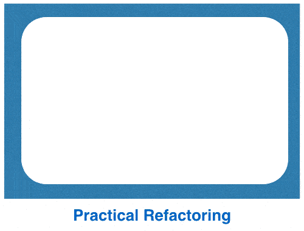

# KonMari 你的代码；重构你的生活

> 原文:[https://dev . to/corgibytes/konmari-your-code-refactor-your-life](https://dev.to/corgibytes/konmari-your-code-refactor-your-life)

你的代码很难处理吗？很有可能，是时候去掉你不需要的代码了。这可能是一个可怕的前景，但回报可能非常值得努力。

最近，我受到了一种整理物理空间的技术 [KonMari](http://tidyingup.com/) 的启发，它帮助我想象如何重构代码库，使它们更容易使用。

去年夏天，我去看望公婆，让三个月大的女儿在我膝盖上蹦蹦跳跳的时候，一个半玩笑从我的大脑和嘴巴之间溜走了。

“如果我们住在这里，会更容易些。”

让我惊讶的是，我婆婆回答说，“你知道那是一个选项，对吧？我们很乐意。

伟大的合并就这样开始了。斯科特和我都是在扬声器电路上开始我们的职业生涯的，增加的旅行要求我们越来越多地依靠他的父母来照顾孩子。幸运的是，斯科特的父母安和史蒂夫希望成为我们孩子生活中重要的一部分，经过慎重考虑，我们决定接受他们的邀请。

我们发现将两个家庭融合在一起比从一个满房子搬到一个空房子要费力得多。最大的挑战是处理所有的东西。我们试图把一栋 1700 平方英尺的房子里的东西挤进两间卧室，一间给我们，一间给孩子们。

在搬家的时候，我偶然发现了玛丽·近藤写的一本书，书名是《改变生活的整理魔法》。这本书里的建议虽然简短，却意义深远。近藤描述了她的方法，她称之为 KonMari，帮助客户消除混乱，创造一个快乐的生活环境。她的建议很简单:“有效的整理只包括两个基本动作:丢弃和决定在哪里存放东西。两者之中，丢弃必须排在第一位。”

当我经历整理房子的过程时，我不禁把这个过程看作是在数字世界中使用代码库的一个隐喻。高效开发团队的最大障碍之一是混乱的代码库，就像混乱抑制了我们生活空间的乐趣一样。

对 Kondo 来说，她的客户面临的最大障碍是克服对丢弃东西的心理反对。我发现代码也是如此。通常，我会发现自己有一种“也许当我处理一段代码时，我以后会需要这种态度”。我的大脑里正在进行一场战斗。我应该删除一些东西，因为它会使代码库整体变得更好吗？或者我应该留着它，因为这会更容易？

我还会发现，我去重构一段代码，结果却让我掉进了一个长长的兔子洞，这是我从未想过要进去的。同样的事情也发生在我的物理空间上，尤其是现在我有了约束。我将决定在我的壁橱里整理一个箱子，但是为了正确地做到这一点，我必须把几乎整个壁橱里的东西都搬走。当我试图评估整个系统时，东西散落在床上，奇怪的堆在地板上。我原本预计十分钟的项目最终会占用整个下午的时间。当我为它做计划时，这很好，但是当我被自己的期望弄得措手不及时，我最初的授权感很快就变成了泄气感。

有效清理的关键在于克服删除的心理障碍。对于物理对象和数字对象来说都是如此。对于 KonMari，这发生在两个不同的阶段:清除和维护。在净化阶段，你分阶段看你所有的物品:衣服、书、文件等等。每一项都必须通过一个试金石，不是关于它是否应该被删除，而是它是否应该被保留。用近藤的话来说，“选择保留什么和扔掉什么的最好方法是把每样东西拿在手里，问自己:这能激发快乐吗？如果有，就留着吧。如果没有，就处理掉。这不仅是最简单的，也是最准确的判断标准。"

系统地观察我的居住空间，同时用一个简单的石蕊测试来测试我需要评估的每一个项目，这被证明是一个非常强大的方法来解决我认为将两个房子合并在一起的棘手问题。当我在 Corgibytes 开始工作时，KonMari 对我来说也是一个强有力的隐喻。遗留代码通常被认为是难以处理的，因为它是杂乱无章的。我发现自己也在寻找将 KonMari 哲学应用到我的现代化代码库工作中的方法。

我发现自己在寻找一个咒语，作为决定一段代码是否应该保留的试金石。虽然我已经在脑海中测试了几个，但我还没有找到与“它能激发快乐吗？我发现自己经常想到有用性:这有用吗？它对代码质量有贡献吗？它遵循神盾局的原则吗？但我还没有找到一个问题像点燃快乐一样令人激动和深刻。我很想听听其他开发人员在工作过程中使用了什么。

至于系统，我发现最有帮助的是来自卢埃林·法尔科和 T2 的伍迪·祖尔和他们 T4 的实用重构方法。对我来说，它拥有我非常喜欢的 KonMari 的优雅和简洁。这里有一个快速的可视化:

[T2】](https://res.cloudinary.com/practicaldev/image/fetch/s--fHdg0-y9--/c_limit%2Cf_auto%2Cfl_progressive%2Cq_66%2Cw_880/http://res.cloudinary.com/dcw8nzsfg/image/upload/v1480976057/practical-refactoring_qlu01x.gif)

## 第一步:清除杂物

当你需要管理的事情越来越少时，组织就变得越来越容易。这在物理世界和数字世界都是如此。太多时候，我们害怕删除代码，但这是保持健康代码库的必要部分，就像倒垃圾是保持房子整洁的健康部分一样。在我看来，根本没有足够的代码删除工具。这个世界真的可以从更多思考如何安全删除死代码的人那里受益。

也就是说，使用现有的自动化工具之一，如 Living Social 的 [CoverBand](https://techblog.livingsocial.com/blog/2013/12/17/coverband-production-ruby-code-coverage/) ，来帮助识别和删除死代码是一个很好的第一步。此外，随着代码库的不断变化，开发人员不应该害怕删除过时的代码。利用测试驱动开发、同行代码评审和其他推荐的开发实践可以帮助确保代码库不会被新的过时代码弄得乱七八糟。

## 第二步:拆分长方法

我之前已经谈到过[初始层](http://corgibytes.com/blog/2016/04/15/inception-layers/)如何使上下文切换变得困难。当重构代码时，我经常发现我需要在头脑中保持一个长方法或代码中的动作的心理模型，以试图弄清楚代码块到底在做什么。通过拆分长方法，开发人员需要花费更少的精力来解析代码的含义。使用 [IDE](http://corgibytes.com/blog/2016/08/09/IDE-vs-Text-Editor/) 可以简化长方法的重构。JetBrains 的产品有一个特别有用的“提取方法”功能，有助于自动完成这项任务并确保准确性。

## 第三步:拆分长方法(再次)

在第一次分解长方法之后，第二次分解新创建的方法是有意义的。很可能其中一些仍然有点笨拙。为这些步骤计划额外的时间。你有很大的提升空间。

## 第四步:提取类

既然我们已经重新组织和简化了我们的方法或操作，我们希望确保我们使用的类或类别仍然有意义。如果我们用整理一个壁橱来做类比，这一步将是查看我们拥有的所有东西，并将它们放入有标签的相关物品箱中。每个垃圾箱的大小和内容可能会有争议，但最重要的是垃圾箱的标签清晰且符合逻辑。这有助于我们确保以后想要引用或查找某个对象时，会很容易。

## 第五步:创建抽象

接下来，是时候将代码库作为一个整体来看，并检查哪些元素可以从细节中提取出来，放到一个更广泛的层中，以便更容易引用。如果我在整理我的衣柜，我可能会查看我所有的箱子，发现我可以把东西按更大的类别放在架子上，比如工艺用品、工具、文件、季节性装饰品等等。对于我的衣柜，这有助于给我具体的参考点，我可以在哪里找到一个对象。我们用代码对抽象类做同样的事情。

## 第六步:添加新功能

耶！我们的代码是有组织的，更容易使用。这意味着添加新功能会容易得多。我认为这一步实际上是我在用我衣柜里的东西做一个项目，比如说给我的孩子做一床被子。有些东西我需要从衣柜里拿出来，有些东西我需要去买。我将把它们结合起来，创造一些有用的新东西。在这个阶段，记住自我清理是良好编码实践的关键部分是很有用的。不仅仅是整理一次东西然后又回到坏习惯。希望每次你做一个项目时，你都能找到一些小方法来保持你的空间整洁，并享受工作的乐趣。

值得花时间回顾一下卢埃林和伍迪深入的两小时研讨会，他们在会上深入探讨了这种方法的细节。我喜欢这个，因为它很好地映射了 KonMari 的哲学。我最喜欢的一句话是卢埃林说的，“优秀的代码与其说是关于才华，不如说是关于纪律。”

对于物理和数字空间来说，关键的一点是，我们需要遵守纪律，把删除和组织代码作为一个常规的优先事项。忽视杂乱只会使其复杂化，并使看似棘手的问题变得更糟。用一套简单的规则武装自己，努力是值得的。当你整理你的代码时，你可以将挫折转化为快乐。