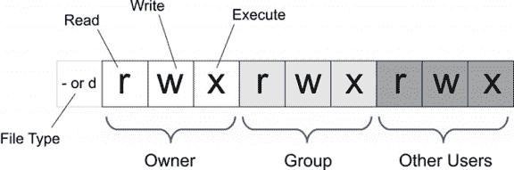
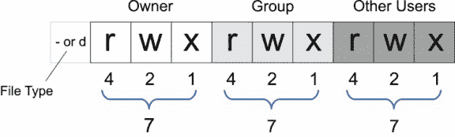

# 强化 Craft CMS 权限

> 原文：<https://dev.to/gaijinity/hardening-craft-cms-permissions-4mgj>

发布: <time>2016.12.05</time> /更新: <time>2019.06.03</time>

# 硬化飞船 CMS 权限

### 从安全的角度来看，构建 CMS 的一个重要部分是根据权限获取文件

安德鲁·韦尔奇

[T2】](https://res.cloudinary.com/practicaldev/image/fetch/s--zZRrFEl1--/c_limit%2Cf_auto%2Cfl_progressive%2Cq_auto%2Cw_880/https://nystudio107-ems2qegf7x6qiqq.netdna-ssl.com/img/blog/_1200x675_crop_center-center_82_line/security.jpg)

**更新:**本文已更新，涵盖了 Craft CMS 2.x 和 Craft CMS 3.x

加强 Craft CMS 的一部分是确保文件要求尽可能严格，同时仍然允许 Craft CMS 本身的正常功能。文件丢失只是[安全技术](https://craftcms.com/support/securing-craft)更大讨论的一部分。

我们希望 web 服务器能够向目录中写入特定的内容，以便像资产上传这样的事情能够进行，但是我们不希望 web 服务器能够修改它不应该修改的内容。如果出现安全漏洞，我们希望尽可能地限制和控制损坏。此外，还需要正确的操作才能让 CMS 正常工作。

在我们开始学习基础知识之前，让我们回顾一下 Unix 文件权限。

## Unix 文件每个 mission Primer

这是显示 Unix 文件权限的信息图:

[T2】](https://res.cloudinary.com/practicaldev/image/fetch/s--jvxhoIIb--/c_limit%2Cf_auto%2Cfl_progressive%2Cq_auto%2Cw_880/https://nystudio107-ems2qegf7x6qiqq.netdna-ssl.com/img/blog/_576x191_crop_center-center_100_line/unix_permissions.png)

使用标准的 Unix POSIX 权限，每个文件/目录对于文件`o`所有者、`g`组和`a` ll(其他所有人)都有不同的权限。因此，举例来说，文件的所有者可能能够`r`读取&T5】写入它，文件的`g`组文件中的用户可能仅仅能够`r`读取它，而其他用户可能根本不能访问它。

你不需要知道那些血淋淋的细节，但是下面是如何用数字来表达的:

[T2】](https://res.cloudinary.com/practicaldev/image/fetch/s--nWcxYfVg--/c_limit%2Cf_auto%2Cfl_progressive%2Cq_auto%2Cw_880/https://nystudio107-ems2qegf7x6qiqq.netdna-ssl.com/img/blog/_576x174_crop_center-center_100_line/unix_permissions_numbers.png)

例如，这个文件:

```
 -rw-r--r-- 1 admin nginx 9275 Nov 18 17:50 gulpfile.js 
```

……对`o`所有者`admin`是可写可读的，但只能由组`nginx`中的用户`r`读取，其他人同样只能`r`读取。没人能执行它(作为脚本或其他可执行的二进制文件运行)。用数字表示，误差为`644`。

这里有一个使用类似权限的目录:

```
 drwxr-xr-x 12 admin nginx 4096 Nov 18 18:21 public 
```

您会注意到，每个任务的执行时间是为目录所有者、`g`组和`a`其他人设置的。目录列表的`x`标志意味着拥有权限的用户可以列出该目录中的文件。用数字表示，偏差为`755`。

## Craft CMS 的一种入侵策略

还和我在一起吗？好极了。现在让我们看看如何应用这些知识来创建 CMS 版本，这样我们的手工安装是安全的，但仍能正常运行。

我们整个 Craft CMS 安装的所有者应该是一个用户，而不是网络服务器用户 T4。它可能是`admin`账号，可能是你访问服务器的用户账号，或者如果你使用的是像 [Lar avel Forge](https://forge.laravel.com/) 这样的服务器版本软件，它可能是`forge`。

<aside>The own­er should be the only user that is able to write to every file in your Craft CMS install.</aside>

我们整个 Craft CMS 安装的组应该是 web 服务器组。我们允许它读取我们的 Craft install 中的任何文件，这样它就可以服务于我们的网站，但是它只能写入几个 spe cif ic 目录。

最后，其他用户只能阅读我们手工安装的文件。如果你是真正的 para noid，你甚至可以拒绝阅读，但这似乎有点大材小用，除非你使用一个共享的主机环境(现在你真的不应该这样)。

*在我们的 Craft CMS 安装中，没有什么是需要可执行的(除了目录和你可能使用的任何 shell 脚本)。这是因为`.php`文件并没有被真正执行，它们是由`php`或`php-fpm`读入并解析的。*

Craft CMS 2.x 和 Craft CMS 3.x 都有非常相似的要求，但文件夹结构略有不同。查看[建立一个新的 Craft CMS 3 项目](https://nystudio107.com/blog/setting-up-a-craft-cms-3-project)文章，了解差异的细节。

## Craft CMS 2.x 权限

web 服务器组需要能够写入:

*   `craft/storage`对于工艺的正常操作
*   任何指定的目录，以便客户端可以上传其他资产的图像

就是这样！[安装 Craft CMS 2.x 指令](http://docs.craftcms.com/v2/installing.html#pre-flight-check)声明网络服务器也需要能够写入`craft/config`和`craft/app`，然而只需要对`craft/config`的写访问权来安装`license.key`文件，只需要对`craft/app`的写访问权来允许一键更新。

相反，我建议您在`local` dev 中安装`license.key`文件，并使用您使用的任何部署工具将其推送到您的`staging`和`live`生产服务器。简单地说，我建议你在`local`开发中更新&测试任何手工 CMS 更新，然后将它们推送到`staging`和`live`生产。然后，通过将此添加到您的`craft/config/general.php`文件:
中，禁用对`staging`和`live`产品的一键式更新

```
 'allowAutoUpdates' => false, 
```

是的，自动更新很方便；您仍然可以在`local` dev 中完成它们。但是我们真的需要一种方法，在将更新部署到`live`产品之前测试它们。向 web 服务器授予对`craft/app`和`craft/config`目录的写访问权限可能会允许一些尚未被发现的漏洞对我们的网站做坏事。

如果你提供或要求`craft/app`和`craft/config`是可写的，那很好。睁大眼睛走进去。

## Craft CMS 3.x 权限

web 服务器组需要能够写入以下目录:

*   `storage/` —适用于船舶的正常运行
*   这是 Com pos er 为你的项目放置 PHP 包的地方
*   `web/cpresources/` —这是用于管理资源的缓存目录
*   任何指定的目录，以便客户端可以上传其他资产的图像

然后，由于 Craft CMS 3 使用 Com pos er，它还需要能够写入几个 spe cif ic 文件:

*   为您的环境提供各种信息，如密码等。
*   `composer.json` —您的项目所需的 Com 组件包的列表
*   `composer.lock` —已安装的 Com 组件包的列表
*   `config/license.key` —您的 Craft CMS 3 许可文件

就是这样！如果你愿意，你可以查看 [Craft CMS 3 安装说明](http://docs.craftcms.com/v3/installation.html#step-1-download-craft)。我建议您不要通过您的`config/general.php`文件中的以下内容在`live`制作或中转服务器上进行更新:

```
 'allowUpdates' => false, 
```

这在[建立一个新的 Craft CMS 3 项目](https://nystudio107.com/blog/setting-up-a-craft-cms-3-project)的文章中有深入的介绍，但基本的前提是我们在`local`开发中进行更新和测试，一旦我们知道一切正常，我们就将更新部署到`live`生产和/或试运行中。

## 外壳脚本化繁为简！

不要担心，您不需要手工完成所有这些工作。我已经创建了一些方便的脚本[shell 脚本来使安装任务变得容易。要使用它们，您需要执行以下操作:](https://github.com/nystudio107/craft-scripts)

1.  下载或克隆 [craft-scripts](https://github.com/nystudio107/craft-scripts) git repo
2.  将文件夹复制到你的 Craft CMS 项目的根目录下
3.  复制`example.env.sh`文件，并将其重命名为`.env.sh`
4.  将`.env.sh`添加到您的`.gitignore`文件
5.  然后将`.env.sh`文件打开到您喜欢的编辑器中，并用适当的设置替换`REPLACE_ME`。

在这个`.env.sh`文件中有许多设置，但是我们只需要关注以下设置文件权限:

```
 # Local path constants; paths should always have a trailing /
LOCAL_ROOT_PATH="REPLACE_ME"
LOCAL_ASSETS_PATH=$LOCAL_ROOT_PATH"REPLACE_ME"

# Local user & group that should own the Craft CMS install
LOCAL_CHOWN_USER="admin"
LOCAL_CHOWN_GROUP="apache"

# Local directories that should be writeable by the $CHOWN_GROUP
LOCAL_WRITEABLE_DIRS=(
                "craft/storage"
                "public/assets"
                ) 
```

`LOCAL_ROOT_PATH`是到你的本地安装的根目录的*绝对*路径，在它后面有一个轨迹 ing `/`。

`LOCAL_ASSETS_PATH`是指向与`LOCAL_ROOT_PATH`相关的国家的资产的路径，后面有一条线索`/`。

如前所述，`LOCAL_CHOWN_USER`是本地用户，也就是你的整个工艺装置的所有者。

`LOCAL_CHOWN_GROUP`是本地网络服务器`g`组，通常是`nginx`或`apache`。

`LOCAL_WRITEABLE_DIRS`是一个目录列表，列出了*到`LOCAL_ROOT_PATH`的相关目录，这些目录应该可以被你的网络服务器写入。*

举个例子，这是我的`.env.sh`的一部分在这个服务器上的样子:

```
 # The path of the `craft` folder, relative to the root path; paths should always have a trailing /
GLOBAL_CRAFT_PATH="craft/"

# Local path constants; paths should always have a trailing /
LOCAL_ROOT_PATH="/home/forge/nystudio107.com/"
LOCAL_ASSETS_PATH=$LOCAL_ROOT_PATH"public/img/"

# Local user & group that should own the Craft CMS install
LOCAL_CHOWN_USER="forge"
LOCAL_CHOWN_GROUP="forge"

# Local directories relative to LOCAL_ROOT_PATH that should be writeable by the $CHOWN_GROUP
LOCAL_WRITEABLE_DIRS=(
                "${GLOBAL_CRAFT_PATH}storage"
                "public/assets"
                ) 
```

`o`所有者和`g`组都是`forge`的原因是因为在使用 Lar avel Forge 时既有一个`forge`用户，又有一个`forge`组。

您可能知道为什么所有这些都在一个`.env.sh`文件中，而不是在脚本本身中。原因是相同的脚本可以在多种环境中使用，如`local`开发、`staging`和`live`生产，而无需修改。我们只是在每个环境中创建了一个`.env.sh`文件，并通过`.gitignore`将它保存在我们的 git repo 之外。

*Tan gent:* 有关多环境的更深入讨论，请查看文章【Craft CMS 的多环境配置。

好了，现在我们已经把我们的`.env.sh`都填好了，为了设置我们的文件，我们只需要把`ssh`输入到我们的服务器上，把`cd`输入到`scripts`目录下，然后输入:

```
 ./set_perms.sh 
```

就是这样！如果出现了个人信息错误，您可能需要键入`sudo ./set_perms.sh`(并且您将需要键入您的`sudo`密码来进行认证)。

出于好奇，下面是这个脚本的样子:

```
 #!/bin/bash

# Set Permissions
#
# Set the proper, hardened permissions for an install
#
# @author nystudio107
# @copyright Copyright (c) 2017 nystudio107
# @link https://nystudio107.com/
# @package craft-scripts
# @since 1.1.0
# @license MIT

# Get the directory of the currently executing script
DIR="$(dirname "${BASH_SOURCE[0]}")"

# Include files
INCLUDE_FILES=(
            "common/defaults.sh"
            ".env.sh"
            "common/common_env.sh"
            )
for INCLUDE_FILE in "${INCLUDE_FILES[@]}"
do
    if [-f "${DIR}/${INCLUDE_FILE}"]
    then
        source "${DIR}/${INCLUDE_FILE}"
    else
        echo 'File "${DIR}/${INCLUDE_FILE}" is missing, aborting.'
        exit 1
    fi
done

# The permissions for all files & directories in the Craft CMS install
GLOBAL_DIR_PERMS=755 # `-rwxr-xr-x`
GLOBAL_FILE_PERMS=644 # `-rw-r--r--`

# The permissions for files & directories that need to be writeable
WRITEABLE_DIR_PERMS=775 # `-rwxrwxr-x`
WRITEABLE_FILE_PERMS=664 # `-rw-rw-r--`

# Set project permissions
echo "Setting base permissions for the project ${LOCAL_ROOT_PATH}"
chown -R ${LOCAL_CHOWN_USER}:${LOCAL_CHOWN_GROUP} "${LOCAL_ROOT_PATH}"
chmod -R ${GLOBAL_DIR_PERMS} "${LOCAL_ROOT_PATH}"
find "${LOCAL_ROOT_PATH}" -type f ! -name "*.sh" -exec chmod $GLOBAL_FILE_PERMS {} \;

for DIR in ${LOCAL_WRITEABLE_DIRS[@]}
    do
        FULLPATH=${LOCAL_ROOT_PATH}${DIR}
        if [-d "${FULLPATH}"]
        then
            echo "Fixing permissions for ${FULLPATH}"
            chmod -R $WRITEABLE_DIR_PERMS "${FULLPATH}"
            find "${FULLPATH}" -type f ! -name "*.sh" -exec chmod $WRITEABLE_FILE_PERMS {} \;
        else
            echo "Creating directory ${FULLPATH}"
            mkdir "${FULLPATH}"
            chmod -R $WRITEABLE_DIR_PERMS "${FULLPATH}"
        fi
    done

# Normal exit
exit 0 
```

请注意，如果您在`LOCAL_WRITEABLE_DIRS`中指定的目录不存在，它将创建这些目录，这很方便，因为例如`craft/storage`应该总是通过`.gitignore`从您的 git repo 中排除，但是 Craft 不会运行，除非它存在(并且是可写的)。

一旦你为每个环境设置了`.env.sh`，你就可以用完全相同的方式设置每个环境的精度。

因此，抓住[工艺脚本](https://github.com/nystudio107/craft-scripts)并给他们一个旋转。现在放松，享受吧。

## 根据任务和 Git

如果您使用`git`，并在您的远程服务器上更改文件分区，您可能会在尝试部署时遇到关于`overwriting existing local changes`的 git 提示。这是因为 git 将 exe cutable 标志更改为文件中的更改，所以它认为您更改了服务器上的文件(并且这些更改没有被签入 git repo)。

要解决这个问题，我们只需要告诉 git 忽略服务器上的每一个细节变化。您可以在您的服务器上更改 git 的`fileMode`设置，告诉它忽略服务器上文件的每个版本更改:

```
 git config --global core.fileMode false 
```

有关详细信息，请参见 [git-con fig 手册页](https://git-scm.com/docs/git-config#git-config-corefileMode)。

另一种解决方法是使用`local` dev 中的`set_perms.sh`设置优先级，然后将文件签入 git repo。这将使它们与您的 git repo 中的正确信息一起保存。

后一种方法的缺点是您必须在`local`开发和`live`生产中匹配用户/组。

## 进一步阅读

如果你想获得新文章的通知，请在 Twitter 上关注[纽约时报 107](https://twitter.com/nystudio107) 。

版权所有 2020 nystudio107。由 nystudio107 设计