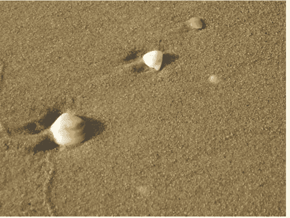
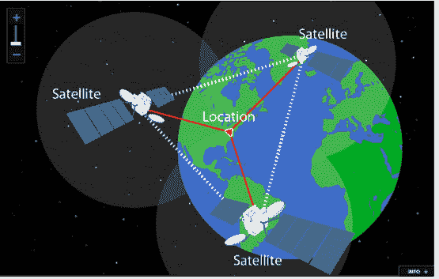
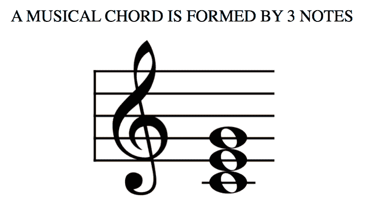
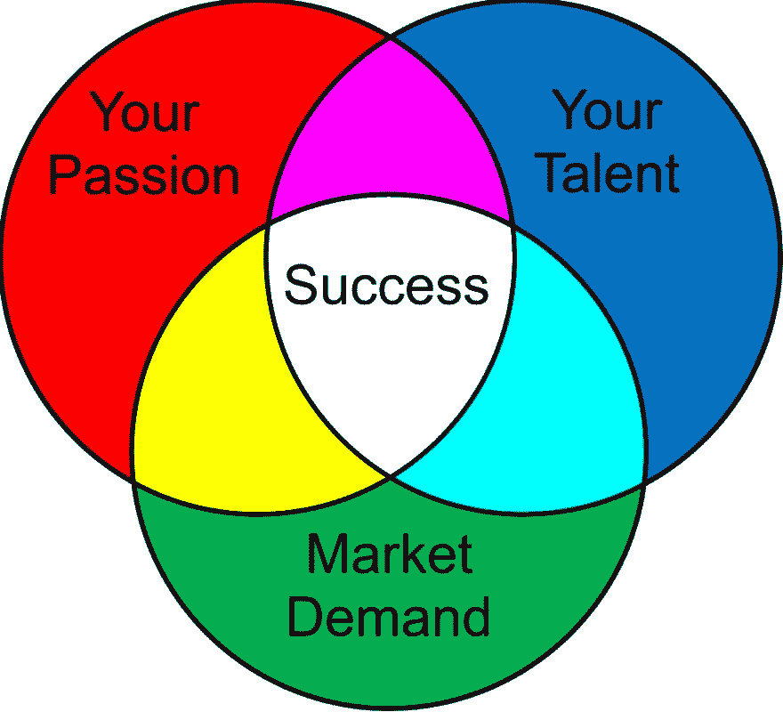
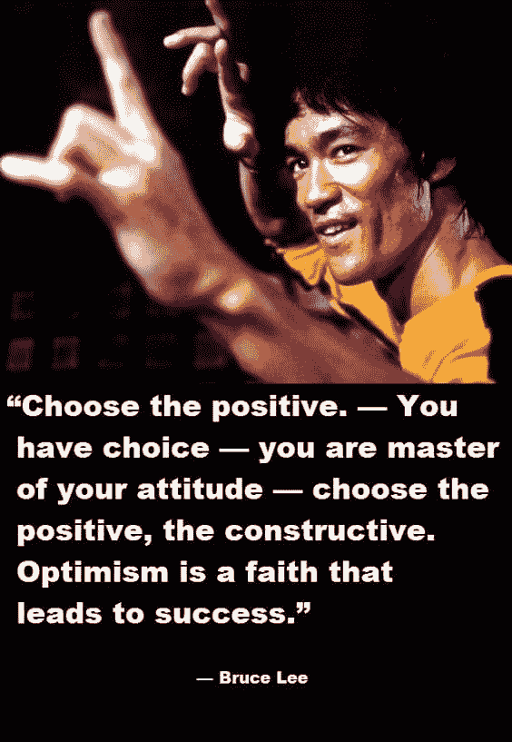
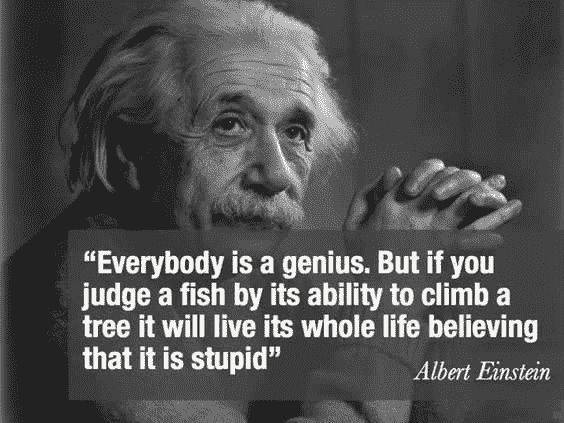

# 规则三:维基百科不会告诉你的事情

> 原文:[https://dev . to/rk revolution/the-rule of-three-what-Wikipedia-won-t-tell-you-eel](https://dev.to/rkrevolution/the-rule-of-three-what-wikipedia-won-t-tell-you-eel)

今天我想分享一个概念，我称之为三个的*法则。这是我最近在生活中注意到的一件事。当我沿着南卡罗来纳州查尔斯顿的海滩散步时，我想到了这个观察。*

当我沿着海岸线漫步时，我被散落在沙滩上的一群群贝壳所吸引。我注意到一些奇怪的事情正在发生。这些贝壳不是一大堆一大堆地躺在沙滩上，而是三个一组地散落在各处。这里一组三个贝壳，那里一组三个贝壳。

[T2】](https://res.cloudinary.com/practicaldev/image/fetch/s--KfjtpD43--/c_limit%2Cf_auto%2Cfl_progressive%2Cq_auto%2Cw_880/https://cdn-images-1.medium.com/max/580/0%2AA4vLivv7fYCJ-DO0.png)

这让我思考:关于三在自然界中的出现以及三的概念如何应用于我们周围的世界，有一些有趣的事情。意识到这一点后，我开始研究“三”在不同领域的相关性，我发现…

### 三的法则

考虑三的概念；在大多数情况下，你需要三样东西来建造一个稳定的结构。

当然，梯子有两条腿。但是三脚架如此好用的原因是因为它有另一条腿来保持稳定。但是，除了整天思考三脚架的用途之外，幽默一下，我将概述这一结构真理是如何比你想象的更深远、更普遍。

三法则发生在自然界；因此，它构成了我们周围的环境。怎么会？有三种物质:液体、固体和气体。水中有三个分子:H2O、两个氢分子和一个氧分子；二氧化碳中也只有一个碳和两个氧。三法则适用于化学，在原子水平上，这些仅由三种元素组成的简单结构告知我们的世界。

我们接下来会看看导航和技术…这些天你是怎么四处走动的？您知道 GPS 是通过使用三角测量(当然，您有一个三角形，它是一个有三个点的形状)来确定我们的位置的吗？

[T2】](https://res.cloudinary.com/practicaldev/image/fetch/s--CYcoDdVT--/c_limit%2Cf_auto%2Cfl_progressive%2Cq_auto%2Cw_880/https://cdn-images-1.medium.com/max/555/0%2A3L8BdbcVnEhQP6Wh.png)

如果你正在使用手机，你正站在大街上，太空中有三颗卫星相互通信，然后将信号传回你的手机。嘣——三的法则。

艺术和音乐也依赖于这一原则。

[T2】](https://res.cloudinary.com/practicaldev/image/fetch/s--NNYe0DS7--/c_limit%2Cf_auto%2Cfl_progressive%2Cq_auto%2Cw_880/https://cdn-images-1.medium.com/max/733/0%2ALhevvx_I68QxuPz4.png)

在音乐中，当三个音符以正确的方式结合在一起时，它们在人耳中听起来很棒，因为它们回响形成一个和弦；音乐和弦也是由三个音符组成的。

在艺术学校，你学习三原色；黄色、蓝色和红色，它们建立了所有关于颜色的理论。

故事需要三个组成部分(有人称之为行为)才能连贯。你有你开始的地方(你的起源)。然后中间有东西转移，然后你在别的地方结束。旅途中总会有一个中点。这不是巧合——这是人类大脑处理信息和推断意义的方式。一件事要引人注目，需要有开头、中间和结尾。

当然，我们有三个朋友，为什么不呢？

[T2】](https://res.cloudinary.com/practicaldev/image/fetch/s--mmhfmQBO--/c_limit%2Cf_auto%2Cfl_progressive%2Cq_auto%2Cw_880/https://cdn-images-1.medium.com/max/695/0%2AMDztSc48Qc6D-6C3.png)

**三个给我**

还在读书？太好了。所有这些文字可能过于简化了实际发生的事情，但值得探索三法则是如何以令人惊讶的方式表现出来的。让我们离开抽象的主题，转向讨论更实际的问题。我如何在我的生活中应用它，为什么我坐在这里写三个？

下面有一个文氏图，它概括了为什么人们寻求职业发展以及他们在生活中努力的方向的公式或一般假设。

它从一些基本问题开始:

你关心什么？

你喜欢什么？你的激情是什么？

你的才能是什么？

就业市场需要什么？

[T2】](https://res.cloudinary.com/practicaldev/image/fetch/s--ui7ixB9I--/c_limit%2Cf_auto%2Cfl_progressive%2Cq_auto%2Cw_880/https://cdn-images-1.medium.com/max/1024/0%2ANz4by_pb0eLAJJi-.jpg)

成功就在中间。这个甜蜜点是大多数人在工作和生活中的目标。

那么，这三条规则是如何体现并积极地为我工作的呢？

我将分享我生活中三个我认为适用于大多数人的价值观。这些原则在很大程度上塑造了我的人生观。它们是 ***、态度*和态度**。

**态度**

态度；你的心态就是一切。你的想法驱动你的行动，所以大胆一点对你最有利。大胆思考，在日常生活中运用积极的思维。

有一本经典的书叫*作为一个男人的思考*。这篇论文传递了一个简单的信息:你想什么，你就是什么。

无论你脑子里在想什么，那都会影响你的行动和你在这个世界上的表现。许多人喜欢读和写的内容和不同的技巧都是关于展示的力量。很多文献都是关于自信，相信自己的能力，积极向上，积极地与自己交谈，善待自己。

一个人只会被他或她选择的思想所限制。

李小龙说“你有选择。你是你态度的主人。选择积极的，有建设性的。乐观是通向成功的信念。”#态度。

[T2】](https://res.cloudinary.com/practicaldev/image/fetch/s--wL0neepI--/c_limit%2Cf_auto%2Cfl_progressive%2Cq_auto%2Cw_880/https://cdn-images-1.medium.com/max/564/0%2AvVMmNaSf14bdh_7o.jpg)

**感恩**

你必须有感恩之心，这是对当下时刻的感激和欣赏，微笑，对你的朋友和家人的欣赏

感恩节过后，这一点尤为重要，但是你可以心怀感激，一整年都心怀感激。

尽管所有的混乱，我们生活的时代，21 世纪是令人敬畏的。在一个第一世界国家，尽管政治、社会、技术环境都在快速变化，但这是相当惊人的。

每个人都有自己的挑战，但有时你必须停下来说，“你知道吗？这真他妈的太好了。”

当然，心怀感激，写感谢信，跟进，与你圈子里的人保持联系，分享爱，因为这是保持你的人际网络活跃和参与的全部。

查尔斯·狄更斯在《圣诞颂歌》中写道:“想想你现在的幸福，每个人都有很多幸福，而不是过去的不幸，每个人都有一些不幸。”

当然，有斗争，有考验，也有胜利，但是强调积极和美好会让你渡过难关。

玛娅·安杰洛是一位诗人，她写道“人们会忘记你说过的话。人们会忘记你的所作所为，但人们永远不会忘记你带给他们的感受。”

[T2】](https://res.cloudinary.com/practicaldev/image/fetch/s--krmsnw97--/c_limit%2Cf_auto%2Cfl_progressive%2Cq_auto%2Cw_880/https://cdn-images-1.medium.com/max/754/0%2A5z5WuiRnR4E9VjWJ.png)

这就是为什么感恩对我的生活如此重要。我也建议你去传播爱。

**半径**

现在我们有了我称之为“Raditude”的东西:这是你个人对处于该区域的概念。我不会坐在我的键盘前告诉你你擅长什么，你喜欢做什么。

传统是我们所有人都可以为之奋斗并努力融入我们的心态的东西。最基本的定义是进入状态，热爱你正在做的事情，或者享受发现真相的过程，因为我们每个人都在不同的道路上。

想知道真相吗？大多数人都很幸运，如果他们从事的工作与他们真正热爱的事情或他们想做的事情有共鸣。这是大多数人努力寻找的东西。

[T2】](https://res.cloudinary.com/practicaldev/image/fetch/s--iOIgzJ7Y--/c_limit%2Cf_auto%2Cfl_progressive%2Cq_auto%2Cw_880/https://cdn-images-1.medium.com/max/945/0%2AhksRcGjzd_dLiMaM.png)

我做的事情是设定目标，检查我的个人目标，思考我想在一年、一个月或一周内实现什么。

这是一种主动定义投资方式并不断建立自己动力的实践。这是关于知道你在关注什么，是寻找导师，管理你的时间还是做一些新的事情。

传统的纪律和美丽要求你有意识地让你所有的选择、活动和意图战略性地致力于贡献给你最好的自己，这样随着时间和实践，你可以达到你自己的个人传统感。

爱因斯坦说，“每个人都是天才，但是如果你以一条鱼爬树的能力来评价它，它会一辈子都相信自己是愚蠢的。”这句话的意思是，你天生就知道什么对你最好。我天生就知道什么对我最好。倾听内心的声音是激进的，我们都在为激进而努力。

[T2】](https://res.cloudinary.com/practicaldev/image/fetch/s--BfC3b8Mf--/c_limit%2Cf_auto%2Cfl_progressive%2Cq_auto%2Cw_880/https://cdn-images-1.medium.com/max/564/0%2ACwNi42r8tGDYIPoB.jpg)

表达你自己，赋予你自己力量，定义你的价值，大声地活出来并享受它。

因为三个原则和三的力量在我们周围应用--今天就利用它们。

请将您的反馈发送给我！