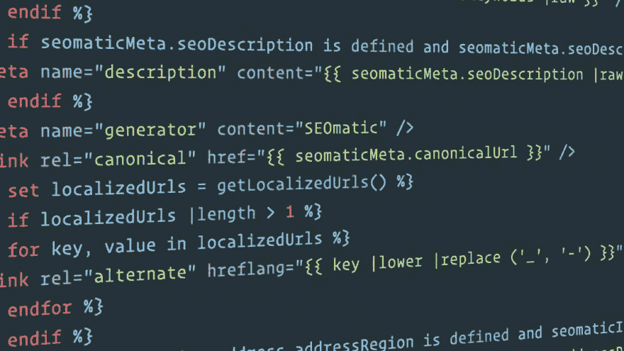

# 细枝加工顺序和范围

> 原文：<https://dev.to/gaijinity/twig-processing-order-scope-4jaj>

# 树枝加工顺序&范围

### 小枝翻译语言有一个鲜为人知的处理顺序&范围，理解这个范围很重要

安德鲁·韦尔奇

[T2】](https://res.cloudinary.com/practicaldev/image/fetch/s--AJkbwFGz--/c_limit%2Cf_auto%2Cfl_progressive%2Cq_auto%2Cw_880/https://nystudio107-ems2qegf7x6qiqq.netdna-ssl.com/img/blog/_1200x675_crop_center-center_82_line/112/twig_code.jpg)

Twig 是来自 Sen sio Labs 的一种流行的模板语言，得到了广泛的应用。我的第一次展示肯定是在 [Craft CMS](https://craftcms.com/) 中，但是它已经被用于很多 CMS 的&框架作品中，比如 Sym fony、Grav、Dru pal 8、Octo ber CMS、Bolt 等等。它甚至可以通过 [Tim ber](https://upstatement.com/timber/) 用于文字印刷。这种广泛的应用使它成为一种值得掌握的技能。

Twig 得到广泛采用的原因是它将易用性与灵活性和功能相结合。熟悉编写 HTML 和一点点 JavaScript 的开发人员可以很快学会 Twig。

在很大程度上，Twig 很容易学习和实现。我会假设你对树枝很熟悉；如果你不是，看看[小枝书](http://twig.sensiolabs.org/pdf/Twig.pdf)(跳到第三章:给模板设计师的小枝)。

然而，Twig 有两个不明显的方面:处理顺序和范围。

## 细枝加工顺序

不久前，我创建了一个关于树枝处理顺序的信息图表，在这里我将做更深入的分析。

[T2】](https://res.cloudinary.com/practicaldev/image/fetch/s--yrvfd3_T--/c_limit%2Cf_auto%2Cfl_progressive%2Cq_auto%2Cw_880/https://nystudio107-ems2qegf7x6qiqq.netdna-ssl.com/img/blog/_992x1550_crop_center-center_100_line/twig_processing_order.png)

以下是上面信息图中使用的代码测试示例:

```
{{ foo }}







    {{ foo }}







    {{ foo }}




{{ foo }} 
```

这是在树枝上搭建的一个典型的模板。我们有一个包含了 T1 的 T0 和一个扩展了 T3 模板的 T2。

这里最有趣的部分是处理这些事情的顺序:

1.  `_page.twig`中的代码是````中的**而不是**
2.  `_layout.twig`中的代码是````中的**而不是**
3.  包含在`_include.twig`中的代码
4.  `_page.twig`中的````代码
5.  `_layout.twig`中的````代码

现在，你可能会说“好吧，那很好，但是为什么有关系呢？”通常不会。但是有些情况会让你抓耳挠腮，试图去理解如果你不理解这个小树枝的处理顺序会发生什么。

上面的示例代码将输出以下内容:

```
 bar
woof
ruff
ruff 
```

这是你所期望的吗，艾德？虽然这看起来很随意，但处理顺序实际上是这样做的，因为有一个非常重要的原因:我们需要能够覆盖扩展其他模板的模板中的内容。

## 小枝范围

嘿，等一下…我们不是通过`*include.twig*`模板中的````把`foo`改成了`'woof'`吗？为什么从来没有熄灭过？让我向你介绍范围的概念。

Twig 中的变量只存在于定义它们的*上下文*中。用模板代替文本，你可能会更好地理解它。换句话说，如果我们在一个模板中定义了一个变量，它只存在于那里。

例如，如果在我们的`_include.twig` tem 板上我们做了````，变量`woof`在我们的`page.twig`或`_layout.twig` tem 板上将不可用。它仅在我们定义的`_include.twig` tem 板中可用。

啊哈，但是我们如何从`_include.twig` tem 模板中访问变量`foo`(在我们的`page.twig` tem 模板中定义)？答案是 Twig 将当前文本的一个**副本**传递给我们包含的模板。

复制是这里的关键词。虽然我们可以在`_include.twig`中访问`foo`，但是我们对它所做的任何更改都不会被适当地返回到`page.twig`或`_layout.twig`。这就是为什么我们从来没有看到`woof`在任何地方出现。

事实上，当我们在 Twig 中包含 tem 板时，我们可以向 Twig con 文本添加变量，它将像这样包含在文本中。我们甚至可以说我们不想通过````包含任何内容文本(只包含我们传入的值)。查看[树枝文档](http://twig.sensiolabs.org/doc/tags/include.html)了解详情。

事实上，延伸到其他 tem 板的 tem 板共享相同的内容，因此在这种情况下变量都是可访问和可更改的。

## 把乒包起来

就是这样。Twig 处理顺序和范围可能看起来有点保守，但是理解您的工具如何在幕后工作将会为您节省许多时间来尝试找出事情为什么不像预期的那样工作。

Hap py 模板！

## 进一步阅读

如果你想获得新文章的通知，请在 Twitter 上关注[纽约时报 107](https://twitter.com/nystudio107) 。

版权所有 2020 nystudio107。由 nystudio107 设计