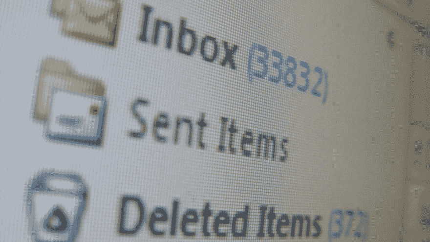
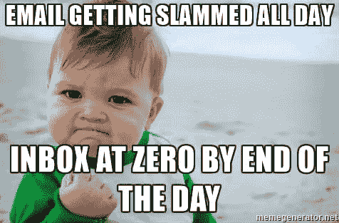

# 使用 Inbox Zero 提高工作效率

> 原文:# t0]https://dev . to/adrianantombu/amerez-your-efficiency-grace-au-principle-de-l-inbox-zero-3gbl

# 运用进厂零原则提高生产力

一天每个人都被几十个(几百个)淹没了？)的子例行程序。如果这些电子邮件中有一些来自客户或潜在客户，而他们正在等待您的快速回复，这可能会很快成为一个问题。事实上，越多的邮件背叛，我们就越有可能忘记处理最重要的邮件！错过了一个重要的商机。

[T2】](https://res.cloudinary.com/practicaldev/image/fetch/s--Qo4knybj--/c_limit%2Cf_auto%2Cfl_progressive%2Cq_auto%2Cw_880/https://blog.otso.img/2016-11-21-ameliorez-votre-productivite-grace-au-principe-de-linbox-zero/inbox-of-hell.jpg)

正因为如此，多年来我一直采用**输入法**。这是一个“T2”生产力原则在外表上很简单，但要求铁的纪律，以免重蹈复辙。这将会给那些有成百上千封电子邮件的人带来大量的上游工作，这些邮件已经在他们的收件箱里纠缠了好几年了。

目标是什么？任何电子邮件中的一个空收件箱！这是理论上的，是我们应该追求的理想。事实上，我有时会收到几封邮件，持续 2-3 周，需要时间来处理这些邮件。但是我的收件箱里很少有 5-6 封以上的邮件，而且这本身就已经是一个‘T2’漂亮的胜利[

以下是将您的邮箱大小减至最大的一些提示::

*   **取消订阅—每天发送给您的所有这些无用的简讯**，每个简讯上都必须有取消订阅的连结。如果没有，请直接向站点发送电子邮件以提出您的请求。如果他一直给你发不速之客的邮件，请记下“T2”垃圾邮件，我们就不再讨论了！

*   删除所有“T0”将不再对您有用的邮件::对过去事件的提醒，一个问题已收到答案…

*   对于所有包含 id 的邮件，**将此信息保存在密码管理器**中，并删除这些邮件。你会在清理你的收件箱的同时获得安全！

*   如果邮件能在不到 2 分钟的时间内处理完毕，不要等 3 天再处理，**直接处理**！

*   对于您无法删除的真正重要的电子邮件，请不要犹豫**创建文件夹。但是不要利用这些文件作为叉子——一切，把你的‘T2’肥胖收件箱’的问题移到‘T3’上！**

***   定期浏览您的电子邮件，删除、删除、删除(不要忘记您的垃圾邮件文件夹)……**不存档，而是删除。**你会明白为什么在我最后一段！** 

 **[T2】](https://res.cloudinary.com/practicaldev/image/fetch/s--aC4UaHNE--/c_limit%2Cf_auto%2Cfl_progressive%2Cq_auto%2Cw_880/https://blog.otso.img/2016-11-21-ameliorez-votre-productivite-grace-au-principe-de-linbox-zero/inbox-zero-meme.jpg)

对我来说，电子邮件只不过是‘t1’要完成的任务，其格式与您的任务管理器不同。如果你有很多，而你无法摆脱，那就是**你可能有一点组织上的顾虑**；-什么

关于收件箱零还有一个重要的最后一点:**生态**。是的，除了提高生产力之外，你甚至都没有意识到这一点。少发邮件=少发 CO2 =人人享有更光明的未来！

> CO2:一家 100 人的公司每年只通过电子邮件产生 13.6 吨 CO2 当量，相当于 14 次往返巴黎和纽约。(除此之外

不要犹豫浏览以下文章，以便更好地了解一下**全球变暖中的电子邮件问题**:

*   [清理邮箱可以拯救地球](http://www.lefigaro.fr/societes/2016/09/13/20005-20160913ARTFIG00097-nettoyer-votre-boite-mail-peut-sauver-la-planete.php)
*   [邮件、Web 查询和 USB 闪存盘的二氧化碳含量是多少？](http://ecologie.blog.lemonde.fr/2011/07/07/combien-de-co2-pesent-un-mail-une-requete-web-et-une-cle-usb/)
*   [一封电子邮件，对地球来说是非常昂贵的](http://rue89.nouvelobs.com/rue89-planete/2013/01/28/un-e-mail-ca-coute-tres-cher-la-planete-239062)

如您所见，这种方法只带来了的好处:安心、提高生产力、快乐的顾客，以及呼吸稍微好一点的地球！

而你，你把它当‘t0’进港零□□□□□□□□□□□□□□□□？**