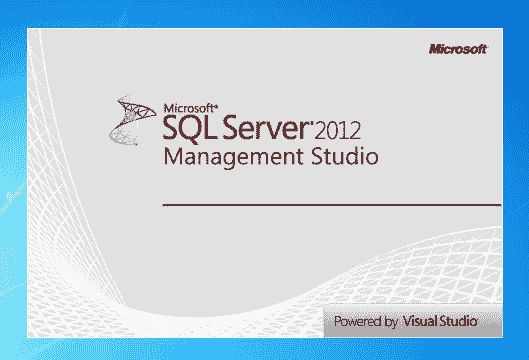

# 获得对代码库的控制

> 原文：<https://dev.to/funkysi1701/getting-control-of-a-codebase-1bci>

所以最近我开始着手一个新的代码库。老实说，当我第一次看到它的时候，它是一团糟。以下是我为了重新获得控制权而做的一些事情。

我被允许访问 Visual Studio Team Services 上的源代码。然而，这包括 3 个月前的一次提交。当我查看生产服务器上运行的内容时，很明显，这些更改是在不考虑源代码控制的情况下实时进行的。

我做的第一件事是将所有正在运行的东西提交到源代码控制中。

接下来，我创建了一个 SQL Server 数据工具(SSDT)项目来跟踪所有数据库对象。以前有一个包含一些存储过程的文件夹，但是这些存储过程与当前运行的不匹配。

[T2】](https://res.cloudinary.com/practicaldev/image/fetch/s--nd0W1iV---/c_limit%2Cf_auto%2Cfl_progressive%2Cq_auto%2Cw_880/https://storageaccountblog9f5d.blob.core.windows.net/blazor/wp-content/uploads/2015/12/sql-server-2012-management-studio-splash-screen.png%3Fresize%3D300%252C204%26ssl%3D1)

我现在在源代码控制中有了网站和数据库的当前状态，所以我知道如果我做了一些不好的更改，我可以让事情回到这个状态。

让我们从我的网站代码开始。没有解决方案文件，查看网站的唯一方法是设置我的本地 IIS 来运行网站文件夹中的内容。然后，我可以使用 Visual Studio“打开”我的本地 IIS 网站，并附加到进程以调试它。

接下来，我查看了 Default.aspx，以了解该网站是如何工作的。网站的大部分代码都存储在数据库存储过程中。在标签后面有一个包含响应的。写(RunSP。RunStoredProcedure(Parameter1，Parameter2，…)命令，该命令执行存储过程，存储过程的结果是 html 代码，包括网页需要显示的任何 javascript。老实说，我从未见过这样的代码。我的猜测是，开发人员暗地里是一名 DBA，希望通过改变存储过程的工作方式来改变任何 web 页面。

这意味着该网站不会做任何事情，没有运行的数据库备份，也意味着我的 SSDT 项目将是至关重要的。然而，数据库处于一个糟糕的状态，它由相当多的破碎对象组成，SSDT 不会建立。

使用 find，我检查了每个损坏的数据库对象，以找到它们在代码中的使用位置。幸运的是，大多数都在注释掉的代码中被引用，所以我只是删除了所有损坏的数据库对象。现在可以建立数据库了。但是，它依赖于另一个数据库的用户表。(这是开发者在网站间共享登录的解决方案)当我使用 SSDT 时，我添加了一个数据库依赖，现在问题解决了。

接下来，我尝试发布我的数据库。SQL CMD 遇到分析错误。这是因为我的 SPs 包含 javascript eg $(document)，SQL CMD 使用$(DatabaseName)作为不同数据库的变量，所以它会弄混。

我的解决方案是使用 Find and Replace 将所有的$替换为'+ CHAR(36) +'

因此，我现在有一个 SSDT 项目，建立和发布，但仍然没有网站项目。

为了让网站在 Visual Studio 中运行，我开始创建一个. Net 4 网站项目，并通过 nuget 添加了 Entity Framework 5 和 MVC 3。然后，我将所有的网站代码复制到新项目中，做了一点工作，我就完成了它的构建。大部分工作都与名称空间有关，引用正确的名称空间，并将 EF 模型从 AppCode 移动到一个定制的命名文件夹中。经过反复试验，我有了一个可以在 Visual Studio 上运行的网站版本。

我还没有部署我的新版本的网站，因为它需要进一步的测试。目前没有自动测试，甚至没有冒烟测试清单。

[T2】](https://res.cloudinary.com/practicaldev/image/fetch/s--ZNzYy1-9--/c_limit%2Cf_auto%2Cfl_progressive%2Cq_auto%2Cw_880/https://storageaccountblog9f5d.blob.core.windows.net/blazor/wp-content/uploads/2016/11/Visual-Studio-Team-Services.png%3Fw%3D960%26ssl%3D1)

由于我的源代码托管在 Visual Studio Team Services (VSTS)上，我可以让 VSTS 构建每个提交，并检查我没有破坏构建。目前这并没有多大帮助，希望有一天我也能在这里运行自动化测试。

哇，我感觉到目前为止我已经用这些代码做了很多，但是还有很多要做。我需要更多地了解代码背后的业务流程，希望了解为什么会做出一些架构决策。我想尽可能地重构代码，我想从存储过程中删除很多 html/javascript，因为我看不出运行这样的网站有任何优势。如果我错了，请纠正我。