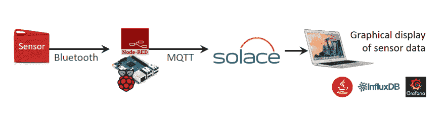

# 在 SAP TechEd Barcelona 展示物联网

> 原文:[https://dev . to/solace devs/democrating-IOT-at-sap-teched-Barcelona-31 B1](https://dev.to/solacedevs/demonstrating-iot-at-sap-teched-barcelona-31b1)

[T2】](https://res.cloudinary.com/practicaldev/image/fetch/s--bMt7Z8K1--/c_limit%2Cf_auto%2Cfl_progressive%2Cq_auto%2Cw_880/https://solace.com/wp-content/uploads/2019/08/solace-default-blog-thumbnail-600x285.jpg)

上周，我参加了在巴塞罗那举行的 SAP TechEd。作为 SAP 的战略合作伙伴，Solace 有一个展台，我在那里搭建了一个物联网演示。它由一辆载有传感器的玩具火车组成，传感器收集关于温度、方向和速度的信息，并通过 Bluebooth 将数据发送到 Raspberry Pi。Raspberry Pi 又使用 MQTT 协议将这些信息发布到伦敦 Solace 设备中的一个主题上。我在巴塞罗那的 Macbook 上本地部署的 Java 程序所代表的消费者订阅了该主题，并提供了一个流入数据库，Grafana 仪表板使用该数据库来显示传感器信息。

下面是建筑的演示:

这个简单的演示展示了 Solace 轻松提供一个健壮、可伸缩和高度可用的发布/订阅架构的能力。除此之外，Solace 作为 SAP Hana 云平台的消息传递主干是我们解决方案可靠性的另一个真实例子，已经在全球许多 SAP 数据中心得到应用。

演示的推文:

> 我们的 [#iot](https://twitter.com/hashtag/iot?src=hash&ref_src=twsrc%5Etfw) 演示已经准备好了！来到 pic.twitter.com/Vr12AC96It 的 [#solacedotcom](https://twitter.com/hashtag/solacedotcom?src=hash&ref_src=twsrc%5Etfw) 展台 [#SAPTechEd](https://twitter.com/hashtag/SAPTechEd?src=hash&ref_src=twsrc%5Etfw)
> 
> —Magali Boulet([@ Magali Boulet](https://dev.to/magaliboulet))[2016 年 11 月 8 日](https://twitter.com/MagaliBoulet/status/795948211047432192?ref_src=twsrc%5Etfw)

> 来参观我们的展位[# SAPTechEd](https://twitter.com/hashtag/SAPTechEd?src=hash&ref_src=twsrc%5Etfw)【pic.twitter.com/JOvpcRVoQF T2】
> 
> —Magali Boulet([@ Magali Boulet](https://dev.to/magaliboulet))[2016 年 11 月 8 日](https://twitter.com/MagaliBoulet/status/795942235615457280?ref_src=twsrc%5Etfw)

这是我制作的演示视频:

SAP TechEd Barcelona 展示物联网的帖子[首先出现在](https://solace.com/blog/demonstrating-iot-sap-teched-barcelona/) [Solace](https://solace.com) 上。