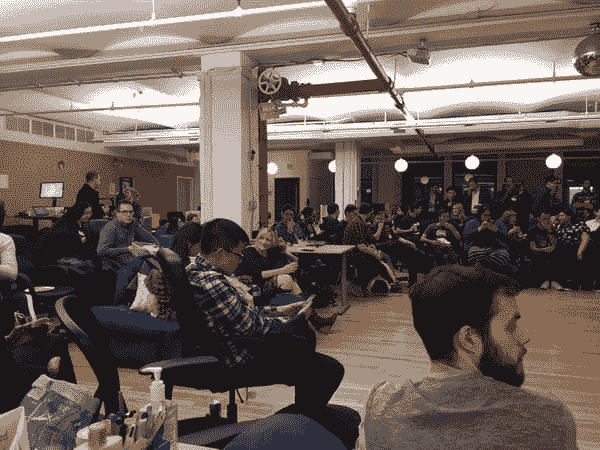
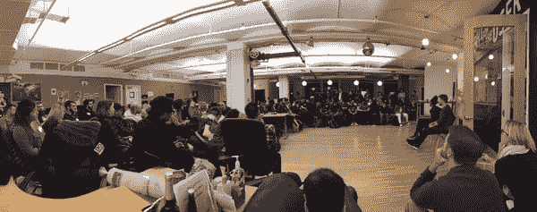

# 本周代码，11 月 14 日

> 原文：<https://dev.to/ben/this-week-in-code-november-14th>

如果你错过了其中的任何一个，这里有一些我们行业过去一周最值得关注的链接。本周影响我们所有人的明显事件是美国大选。周四晚上，纽约市的一群美国开发人员聚集在一起，表达我们对此事的感受，并集体讨论如何在这样的不确定时期，关心代码的公民能够站出来一起工作。

这里有两篇来自 meetup 的文章和活动的照片。

纽约的技术人员敲响了仍能敲响的钟

[技术人员的笔记](https://dev.to/thekevinscott/notes-from-the-tech-for-goodmeetup)

[T2】](https://res.cloudinary.com/practicaldev/image/fetch/s--EQwOxGgl--/c_limit%2Cf_auto%2Cfl_progressive%2Cq_auto%2Cw_880/https://a248.e.akamai.net/secure.meetupstatic.com/photos/event/3/9/f/9/600_455954841.jpeg)

[T2】](https://res.cloudinary.com/practicaldev/image/fetch/s--WS_UMI9T--/c_limit%2Cf_auto%2Cfl_progressive%2Cq_auto%2Cw_880/https://a248.e.akamai.net/secure.meetupstatic.com/photos/event/3/9/f/d/600_455954845.jpeg)

这不是一次性事件。我们计划创建资源和社区，以帮助有积极性的技术人员尽可能发挥最大影响。如果你在纽约，想要跟上我们的计划，你可以加入 [Meetup 群组](https://www.meetup.com/Tech-For-Good-NYC/)。如果你想知道未来国家/国际比赛的动向，现在在推特上关注我([@ bendhalpen](https://twitter.com/bendhalpern))或萨隆·伊特巴雷克([@萨隆·伊特巴雷克](https://twitter.com/saronyitbarek))是你最好的选择。

## 一周剩余时间的几个环节

初级开发人员生存指南(Survival Guide for Junior Developers)这是一份写得很好的良好实践清单，面向初级开发人员，但如果我这么说的话，也可以帮助任何开发人员。

我犯的错误(作为一个开发人员)一个开发人员列出了如果回到过去十年，他们可能会做得不同的事情。它足够具体和固执己见，以至于不是每个人都会同意每一点，但却是很好的思考素材。

[Wind Waker 图形分析](https://medium.com/@gordonnl/wind-waker-graphics-analysis-a0b575a31127#.z6oub5nz1)对一款已经成熟的游戏的图形进行有趣的探究。

## 播客

Andrea Goulet 的《遗产代码》这是一个自上而下的伟大聆听，深入到编写优秀软件的基础，并找到这样做的动机。我听过安德里亚在[的一些其他播客](https://dev.to/pod?q=Andrea+Goulet)，她总是一个伟大的客人。

[疯狂科学，WebTorrent & WebRTC 与 Feross Aboukhadijeh](https://dev.to/changelog/227-mad-science-webtorrent--webrtc-with-feross-aboukhadijeh) 一个非常有趣和有见地的 [Changelog](https://dev.to/changelog) 关于许多话题的采访ðÿ'œ

## #发展讨论

我们每周一次的 Twitter 聊天将于明天(美国东部时间周二晚上 9 点(UTC - 0500)回归。这个话题将于今晚通过推特投票进行表决。