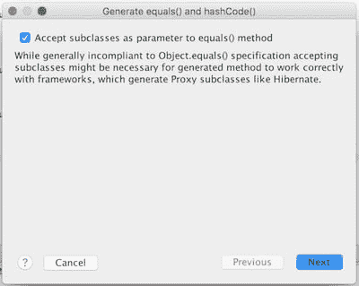

# 检查您自动生成的代码

> 原文：<https://dev.to/raulavila/review-your-auto-generated-code>

在这篇文章中，我将回顾几个错误，根据我的经验，这些错误可能是我们在用 Java 开发代码，尤其是使用 IDE 工具自动生成代码时经常犯的。

自动生成代码非常棒，它为我们节省了大量的击键次数，并且有助于关注领域问题，而不是样板代码的细微差别。然而，有时我们不会方便地反映 IDE 为我们生成的代码，我们会留下应该修复的小缺陷。在这篇文章中，我将列举其中的一些。

## 公共范围

缺省情况下，ide 认为所有的类都是公共的。所以，如果我们告诉 IntelliJ 创建一个新类，会发生什么:

```
public class MyClass {
} 
```

Enter fullscreen mode Exit fullscreen mode

在我看来，类应该默认有包范围，即:

```
class MyClass {
} 
```

Enter fullscreen mode Exit fullscreen mode

这样，它们在它们所属的包之外是不可见的。如果在某些时候，我们需要改变类的范围，我们需要思考为什么，并做出方便的设计决定。如果默认情况下该类是公共的，我们将直接使用它，增加代码的耦合度。

避免这个问题的最好方法是在我们的 IDE 中编辑模板。例如，在 IntelliJ IDEA 中，此选项位于首选项>编辑器>文件和代码模板>模板>类中。

当我们默认使用 package 作用域时，最佳实践之一是创建一个公共接口，但不公开它的实现。这样，接口的客户将不会知道他们正在使用的实现，因为他们甚至没有访问它的权限，更喜欢依赖注入这样的实践。

作为这种对公共范围的偏好的另一个例子，IntelliJ 在默认情况下将常量创建为 public:

```
public static final String CONSTANT = "value"; 
```

Enter fullscreen mode Exit fullscreen mode

大多数时候，常量只由拥有它们的类使用。请注意这一点，或者也改变你的模板。

## 不可变类

这是一个与自动生成代码没有直接联系的细节，但是我们在 99%的情况下都会跳过。一般来说，当我们想设计一个不可变的类时，结果会是这样:

```
public class MyImmutableClass {

    private final int id;
    private final String name;

    public MyImmutableClass(int id, String name) {
        this.id = id;
        this.name = name;
    }

    public int getId() {
        return id;
    }

    public String getName() {
        return name;
    }
} 
```

Enter fullscreen mode Exit fullscreen mode

Private 和 final 字段，没有 setters，由构造函数初始化。好的，这很好，但是我们遗漏了一些东西。让我们看看这样做会发生什么:

```
public class MyImmutableDerivedClass extends MyImmutableClass{

    public String address;

    public MyImmutableDerivedClass(int id, 
                                   String name, 
                                   String address) {
        super(id, name);
        this.address = address;
    }

    public String getAddress() {
        return address;
    }

    public void setAddress(String address) {
        this.address = address;
    }
} 
```

Enter fullscreen mode Exit fullscreen mode

继承自`MyImmutableClass`的第二个类的一个实例可以充当它的代理，而不会引起客户端的注意，例如:

```
MyImmutableClass myImmutableClass
                = new MyImmutableDerivedClass(1, "name", "address"); 
```

Enter fullscreen mode Exit fullscreen mode

这并不理想，因为这个派生类不是不可变的！

解决方法很简单，让我们把不可变类设为 final:

```
public final class MyImmutableClass {
    //...
} 
```

Enter fullscreen mode Exit fullscreen mode

现在也不可能创建派生类了。

## getter 和 setters

创建一个包含所有字段的类，并在自动生成的代码狂潮中为所有字段添加其构造函数、getters 和 setters 是非常常见的:

我们真的需要这么做吗？

```
public class MyClass {

    private Collaborator1 collaborator1;
    private Collaborator2 collaborator2;

    public MyClass(Collaborator1 collaborator1,
                   Collaborator2 collaborator2) {
        this.collaborator1 = collaborator1;
        this.collaborator2 = collaborator2;
    }

    public Collaborator1 getCollaborator1() {
        return collaborator1;
    }

    public void setCollaborator1(Collaborator1 collaborator1) {
        this.collaborator1 = collaborator1;
    }

    public Collaborator2 getCollaborator2() {
        return collaborator2;
    }

    public void setCollaborator2(Collaborator2 collaborator2) {
        this.collaborator2 = collaborator2;
    }
} 
```

Enter fullscreen mode Exit fullscreen mode

一个类应该公开最少数量的内部细节。因此，在第一节中已经说过，一个类应该有包范围，直到它需要成为公共的，现在我说，一个类不应该有 getters 或 setters，直到它需要。当这种情况发生时，想想这是不是最好的决定，或者你的设计中是否有不合适的地方。

## 等于法

一般来说，ide 会公开一个选项来一起生成方法`equals`和`hashCode`。这是有意义的，因为我们通常需要这两种方法的正确和一致的实现(这里我不会涉及太多细节，假设我们都知道 [equals 和 hashCode 契约](http://www.programcreek.com/2011/07/java-equals-and-hashcode-contract/))。

我对 ide 为`hashCode`生成的实现没有太多异议，它们通常是非常优化的，尽管我们可能会对它们进行更多的优化。虽然`equals`的实现有一个小问题:

```
public class MyClass {

    private final int id;
    private final String name;

    //Constructor, equals, etc

    @Override
    public boolean equals(Object o) {
        if (this == o)
            return true;

        if (o == null ||
            getClass() != o.getClass())
                return false;

        MyClass myClass = (MyClass) o;

        if (id != myClass.id)
            return false;

        if (name != null ?
            !name.equals(myClass.name) :
            myClass.name != null)
                return false;

        return true;
    }
} 
```

Enter fullscreen mode Exit fullscreen mode

这里一切似乎都是正确的，但一些严重的事情正在发生，这个类违反了[利斯科夫替代原则](https://en.wikipedia.org/wiki/Liskov_substitution_principle)。这个原则是[坚实原则](https://en.wikipedia.org/wiki/SOLID_(object-oriented_design))的一部分，简单来说就是“一个派生类可以充当它的基类而不会被客户注意到”。这是一个有点粗略的定义(这个原则需要一整篇文章)，所以我想我会用一个例子来更好地说明这个问题，这样我们就可以看到为什么我们的`equals`方法被破坏了。

让我们创建一个派生类:

```
public class MyDerivedClass extends MyClass {
    private final String address;

    public MyDerivedClass(int id, String name, String address) {
        super(id, name);
        this.address = address;
    }

    public String getAddress() {
        return address;
    }

    // equals and hashCode
} 
```

Enter fullscreen mode Exit fullscreen mode

我省略了`equals`和`hashCode`实现，因为它们对于这个例子来说不是必需的。

```
public static void main(String[] args) {
    MyClass object1 = new MyClass(1, "name");
    MyDerivedClass object2 = new MyDerivedClass(1, "name", "address");

    System.out.println(areEquals(object1, object2));
}

public static boolean areEquals(MyClass object1, MyClass object2) {
    return object1.equals(object2);
} 
```

Enter fullscreen mode Exit fullscreen mode

方法`areEquals`接收`MyClass`的两个实例。基于它们包含的信息，这两个实例是相同的，所以我们应该期待`areEquals`返回`true`。但事实并非如此，因为自动生成的`equals`方法是这样做的:

```
if (o == null ||
    getClass() != o.getClass())
        return false; 
```

Enter fullscreen mode Exit fullscreen mode

`getClass`为第一个对象返回`MyClass`，为第二个对象返回`MyDerivedClass`，所以我们的方法`equals`返回`false`。

我们可以讨论这种情况发生的便利性，因为两者都是不同类的实例。但是，当两个实例中所有字段的值完全相同时，这真的有意义吗？事实上，`areEquals`的另一个实现可以是:

```
public static boolean areEquals(MyClass object1, MyClass object2) {
    return object1.getId() == object2.getId() &&
            object1.getName().equals(object2.getName());
} 
```

Enter fullscreen mode Exit fullscreen mode

在这种情况下，结果是`true`。

这就是利斯科夫替代原理。这个原则的一个含义是，如果我们重写一个方法，它将增加一些行为，而不删除基类正在做的任何事情。戏剧性地打破这一原则的是重写一个方法使其为空的做法(我猜我们中的许多人在职业生涯的某个时候都这样做过)。

因此，我们需要一个更好的方法实现`equals`。大概是这样的:

```
@Override
public boolean equals(Object o) {
    if (this == o)
        return true;

    if (!(o instanceof MyClass))
        return false;

    MyClass myClass = (MyClass) o;

    if (id != myClass.id)
        return false;

    if (name != null ?
            !name.equals(myClass.name) :
            myClass.name != null)
                return false;

    return true;
} 
```

Enter fullscreen mode Exit fullscreen mode

我们不是使用`getClass`询问对象以了解它们的类，而是通过操作符`instanceof`询问通过参数传递给`equals`的对象是否是`equals`所在类的实例。该操作符也为该类及其派生类的实例返回`true`。现在，我们的`areEquals`方法终于按照我们想要的方式工作了。所有这些(以及更多)都在开创性的书籍 [Effective Java](https://www.amazon.com/Effective-Java-2nd-Joshua-Bloch/dp/0321356683/ref=sr_1_1) 中有完美的解释，这本书是每个 Java 开发人员都应该拥有的。

事实是 IntelliJ 公开了一种自动生成这个版本的`equals`的方法，但是我们必须小心向导的选项，因为默认情况下它是未选中的，我们必须自己检查它。它是“接受子类作为 equals()方法的参数”:

[T2】](https://res.cloudinary.com/practicaldev/image/fetch/s--BQUKTsfa--/c_limit%2Cf_auto%2Cfl_progressive%2Cq_auto%2Cw_880/http://raulavila.com/public/pictures/IntelliJ-message-equals.jpg)

对话框本身提到默认情况下实现会破坏`equals`契约。看来`instanceof`的实现可能与一些框架不兼容。在这种情况下，我们应该切换到第一个版本，但始终意识到后果。所以，我们先用正确的版本，必要的话再改用 B 计划:)