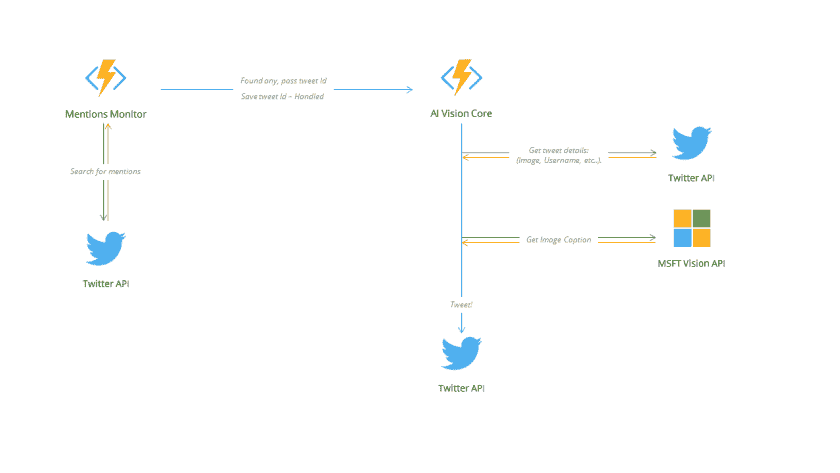

# 介绍 AI 视觉助手，这是一个帮助视觉障碍者的开源项目

> 原文:[https://dev . to/mmg/introducing-ai-vision-assistant-an-open-source-project-to-help-the-people with-visual-defenses](https://dev.to/mmg/introducing-ai-vision-assistant-an-open-source-project-to-help-people-with-visual-impairments)

三周前，我开始从事一个兼职项目，测试和体验 Azure 的一项名为 [**Azure Functions**](https://azure.microsoft.com/en-us/services/functions/) 的新服务。该项目的想法是创建一个 Twitter 帐户(bot)，它将随机从 500px.com 的获得一幅图像，并使用人工智能( **[微软认知服务](http://microsoft.com/cognitive)** )描述它*为它加标题，并在 Twitter 上发布带有标题的图像。

简单的想法！果然有效，你可以在这里查看账号: **[@aipics](http://twitter.com/aipics)** 。

## 灵感…

我的一个朋友看到了这个想法，并告诉我，他在 Twitter 上认识一个有视觉障碍的人，他要求人们描述包含图像的推文，他可以*听到*推文(使用 iPhone 辅助工具)，但他看不到图像内容，他的名字是 Mohammed。然后我想为此做一个推特机器人，**我们有技术！**

我开始在一个新的 Twitter 账户中实现这一点，我测试了它，并请 Mohammed 测试并提供可以提供更多帮助的想法，与这样的人一起工作和交谈真是太棒了！

## 结果！

我把它叫做**“AI 视觉助手”**，你可以在这里查看:**[@ aivisionsasst](http://twitter.com/aivisionasst)**。

您可以在推特上发布带有图片的标签( **#aivision** 表示英语*或***表示阿拉伯语)*或*回复包含图片(包括 Instagram 链接)的推文，在 2 分钟内，帐户将回复图片的标题或描述，它主要支持 2 种语言，英语和阿拉伯语。**

 **但不幸的是，阿拉伯语版本并不是 100%准确，因为微软认知服务 API 还不支持阿拉伯语，但我使用 Bing translator 将英语字幕翻译成阿拉伯语，然后构建推文文本。

我最喜欢的部分是，这个帐户提供了超过 150 条推文( *tweet = caption request* )，事实上，有一些用户依赖这个帐户，他们几乎每天都在使用它！

也许数字很低，但对我来说，看到一个人利用这个账户并在他需要时获得帮助，就像改变了整个世界！

## 技术细节

主要有两个组件，描述如下:

[T2】](https://i1.wp.com/res.cloudinary.com/mmgrt/image/upload/v1501203434/archt-d-aivision_j76tjw.png)

*完整构思的架构图..*

### 提及监视器:

一个每 2 分钟运行一次的计时器功能，在 Twitter 中搜索包含以下条件的推文(#aivision 或# quo；quo ):在过去 3 分钟内发布的推文&尚未处理。

如果找到了，tweet id 将被保存在本地日志文件中(*标记为已处理*)，然后它将调用第二个函数， **AI 视觉核心**。

### AI 视觉核心:

一个 Http 触发函数，需要一个参数:tweet id。

每当该函数接收到请求时，它将调用 Twitter API 从 tweet 对象获取图像，或者如果是回复，它将从 InReplyToTweet 对象获取图像，或者它将搜索 Instagram 链接(如果有)。

然后，它将准备图像，调用 Vision API 获取标题，如果使用的标签是阿拉伯语，则翻译它，构建 tweet 文本，最后回复带有任何提及的图像描述！

## 开源…

这个项目是一个**开源项目**，你可以在 Github 上浏览: **[/AIVision。](https://github.com/mmgrt/AIVision)**

请随意改变它，以您的语言/文化提供它，或者为使它变得更好做出贡献..或者至少，我希望它能激励你！

## 我们有技术

> 据世卫组织称，世界上有超过 3900 万盲人……这个项目可能对 Twitter 上的少数人有所帮助，但仍然有数百万人在那里。**想象一下**我们这些程序员能提供多少帮助和支持！

谢谢你

muhamed-**[@ mmg _ rt](http://twitter.com/mmg_rt)**。

*本帖最初发表于[devread.net](https://devread.net/2016/11/12/introducing-ai-vision/)T3】***