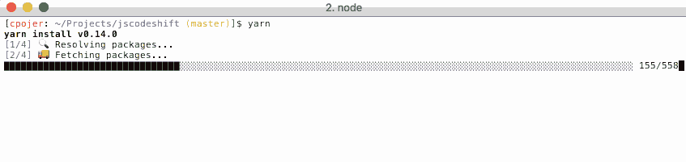
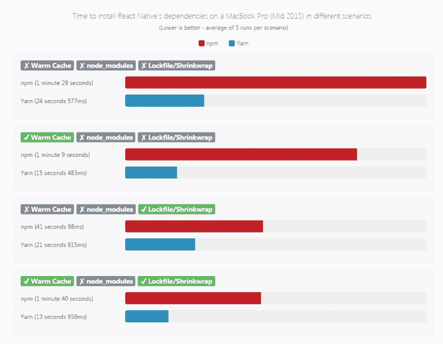
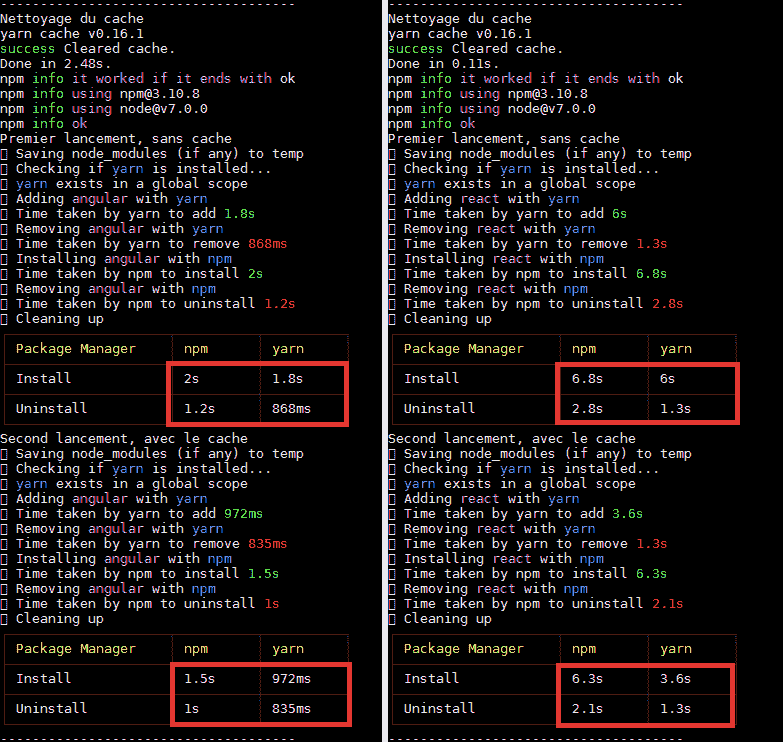
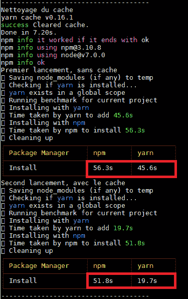

# 纱，一个 n-ième 包装经理？

> 原文:[https://dev.to/d3rwan/yarn-un-n-ieme-package-manager-hch](https://dev.to/d3rwan/yarn-un-n-ieme-package-manager-hch)

Npm、Bower、JSPM…在每个季节，他们都是 JS 生态系统中的新软件包经理。最近出生的雅伦几周前被 Facebook 的开发者宣布。那么，第 n 个软件包管理器背后到底隐藏着什么？

Yarn:一个新的 JavaScript 包管理器

第一，雅伦没有取代 npm 或 bower 的目标。它首先是一个新的命令行客户端，用于从 npm 注册表中检索相关性。

此外，它还提供了以下改进:

*   **性能**优化呼叫和最大限度地提高网络利用率，包括通过依赖树分析和查询并行机制(与 npm 的串行机制相对)
*   **决定论**对于同一项目，在所有环境中将以相同的方式安装相同的依赖项(更有效果*【it works on my machine】*
*   **离线作业**安装套装软体后，会快取该套装软体，然后可以在没有网际网路连线的情况下进行安装
*   **恢复能力**安装过程更强大，尤其是在网络中断的情况下(拒绝请求与错误的安装过程)
*   **多个登记册**从多个登记册(npm、bower、github、…)检索源的能力
*   **安全性**使用校验和验证依赖项的完整性

## 设置

要安装 yar，最简单的方法仍然是使用… npm。

```
npm install -g yarn 
```

因此，可以使用 yar 客户端代替 npm 客户端

```
# npm install
yarn

# npm init
yarn init

# npm install angular --save
yarn add angular 

# npm install gulp --global
yarn global agg gulp

# npm uninstall angular --save
yarn remove angular

# npm install angular-mocks --save-dev
yarn add angular-mocks --dev 
```

[ ](https://res.cloudinary.com/practicaldev/image/fetch/s--wNidzaGu--/c_limit%2Cf_auto%2Cfl_progressive%2Cq_66%2Cw_880/https://d3rwan.github.io/d3rwan-blog/media/yarn/yarn_loading.gif) *与 yar*一起安装

其馀部分继续使用文件“*package . JSON”*列出项目的依存关系，这些依存关系将始终存储在“*node _ modules*目录中。但是，雅伦添加了一个新文件*雅伦. lock* 。此文件将列出每个依赖项、要使用的确切版本、安装顺序等，从而确保决定性的安装。此文件将在 yar 首次安装期间创建，然后在每次更改时更新。

重要的是要注意，此文件必须“T0”存在于每个环境中，以确保安装**决定性的**，因此必须对**进行版本控制。**

这里面的资料呢？在 Yarn 网站上的基准测试(可能是超客观的)上，数据显示了这一点。在大多数情况下都是‘t1’更快。

[T2】](https://res.cloudinary.com/practicaldev/image/fetch/s--BRyzb6vM--/c_limit%2Cf_auto%2Cfl_progressive%2Cq_auto%2Cw_880/https://d3rwan.github.io/d3rwan-blog/media/yarn/bench.png)

[)](img/424a92d8f75500559304156a62cb909b.png) ](https://res.cloudinary.com/practicaldev/image/fetch/s--TDeUnGqN--/c_limit%2Cf_auto%2Cfl_progressive%2Cq_auto%2Cw_880/https://d3rwan.github.io/d3rwan-blog/media/yarn/bench2.png) *基准 NPM /纱(来源:【https://yarnpkg.com/en/compare】[)](https://yarnpkg.com/en/compare)*

实际上呢？

为了比较这两种工具之间的性能，我使用了“[npmvsyarn](https://www.npmjs.com/package/npmvsyarn)”实用程序，该实用程序可用于比较某个书店或项目(包含“*package . JSON*”)在 NPM&和 yar 之间的性能。

[ ](https://res.cloudinary.com/practicaldev/image/fetch/s--dy3a50Xp--/c_limit%2Cf_auto%2Cfl_progressive%2Cq_auto%2Cw_880/https://d3rwan.github.io/d3rwan-blog/media/yarn/ex.png) *角书店实例&反应*

在添加/删除单个自动存储塔方面，yar 的速度实际上快了 50%，尤其是在存在缓存和 yarn . lock 文件的情况下。

[T2】](https://res.cloudinary.com/practicaldev/image/fetch/s--ifKxQMjv--/c_limit%2Cf_auto%2Cfl_progressive%2Cq_auto%2Cw_880/https://d3rwan.github.io/d3rwan-blog/media/yarn/ex2.png)

[) et un projet Angular ([angular1.4-ES6-material-webpack-boilerplate](https://github.com/shprink/angular1.4-ES6-material-webpack-boilerplate))](img/6584087f9f30ff2fb9af0c98e70bde3b.png) ](https://res.cloudinary.com/practicaldev/image/fetch/s--lSErNioV--/c_limit%2Cf_auto%2Cfl_progressive%2Cq_auto%2Cw_880/https://d3rwan.github.io/d3rwan-blog/media/yarn/ex3.png) *具有反应项目([redux-webpack-es 6-boiler plate](https://github.com/nicksp/redux-webpack-es6-boilerplate)和角度项目([angular 1.4-es 6-material-webpack-boiler plate](https://github.com/shprink/angular1.4-ES6-material-webpack-boilerplate))的实例；*

在一个完整的项目中，Yarn 也做得更好(速度提高了 2.5 倍)。再一次可以看到缓存和“t0”yarn . lock 的存在进一步提高了性能。

当然，这些例子太有限，不能具有代表性。但是，网站 *berriart.com* 针对不同的持续集成环境提供了这两种工具的更全面基准。

[NPM vs 纱线基准](https://www.berriart.com/blog/2016/10/npm-yarn-benchmark/)

同样，结果也是一样的:

> *雅伦比 npm* 快 2x 至 3x]

## 结论

在使用了几个小时之后，Yarn 似乎达到了人们对它的期望:它比 npm 更快，具有同等的功能，而且迁移也很顺利。

虽然现在将其用于结构化生产项目可能为时过早，但它现在似乎是默认 npm 客户的可靠替代方案。因此，它可以很容易地用于一个新项目或一个附件项目，以确认所显示的所有良好规定。

展望未来，我们只能希望它能够改善现有的制度，无论是通过促进国家经济政策的改善还是通过成为一项标准。除非有一个小的-新的从这里来，并再次改变数据...