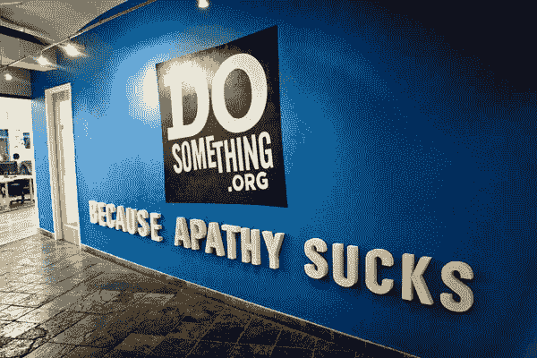

# 一次即兴的纽约聚会——把我们的头(和心)放在一起

> 原文:[https://dev.to/ben/an-impromptu-nyc-meetup——集思广益](https://dev.to/ben/an-impromptu-nyc-meetup--putting-our-heads-and-hearts-together)

我的实践开发合作伙伴李佳薇和我组织了一次即兴聚会/社区讨论，还有 [Tech For Good NYC](https://www.meetup.com/Tech-For-Good-NYC/) 。我们将在 DoSomething.org 的[办公室会面，这是一个致力于社会公益的非营利技术组织，有一个非常棒的熨斗位置。](https://dosomething.org)

将会有一些演讲和一些与小组成员分享想法和故事的机会。然而，最重要的是，我们只是想组织一个机会，让我们社区中的人们通过讨论和分享来互相帮助。

聚会将在曼哈顿的熨斗区举行。

### 星期四晚上 7 点

纽约州纽约市西 21 街 19 号 8 楼
,邮编 10010

### [这里是 meetup 页面](https://www.meetup.com/Tech-For-Good-NYC/events/235472916/)👈请回复并分享😊

[T2】](https://res.cloudinary.com/practicaldev/image/fetch/s--DRfKjuWj--/c_limit%2Cf_auto%2Cfl_progressive%2Cq_auto%2Cw_880/https://media.licdn.com/mpr/mpr/shrinknp_800_800/p/2/000/1f7/348/0599152.jpg)

这是一个仓促的通知，但我们感到了一种情绪上的紧迫感。我们不想明天就变得反动或解决问题。我们正试图组成一个团体。我们今天在这个城市看到足够多的人公开哭泣，知道社区之夜可以做得很好。

当然，这里有“党派偏见”，但重要的是尊重和帮助现在受伤的人。这不是“关于”技术，而是我们行业内的人有着共同的经历和价值观。我们也有巨大的机会通过我们的工作和项目来做巨大的好事。这很大程度上涉及到通过开源和其他途径的社区协作。

我不知道会有多少人参加。这里没有成功的衡量标准。如果你觉得你需要一个社区之夜，请过来，提供帮助，并尊重他人。