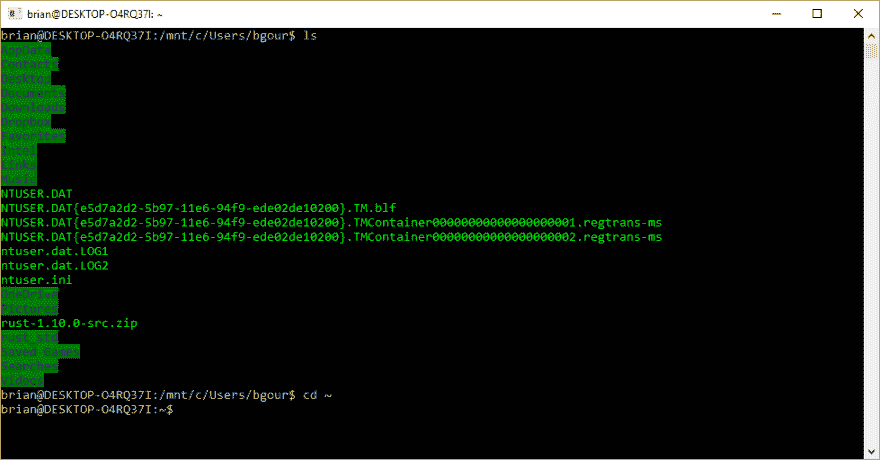
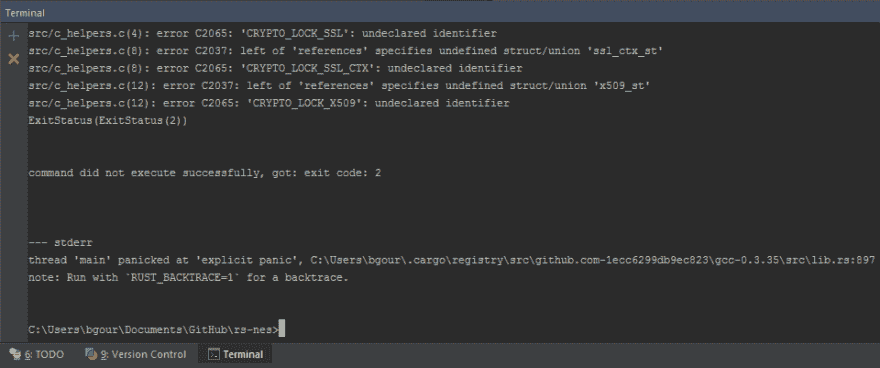
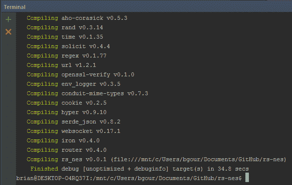

# Windows 上的跨平台开发突然变得很棒

> 原文:[https://dev . to/dubyabrian/cross-platform-development-on-windows-is-absolute-awesome](https://dev.to/dubyabrian/cross-platform-development-on-windows-is-suddenly-awesome)

任何在 Windows 上进行跨平台开发的人都知道，让东西编译可能是一件非常痛苦的事情。有时候甚至不可能。整个情况有点糟糕，直到现在。

## 进入 Windows 上的 Linux

有一个新东西叫做用于 Linux 的 Windows 子系统。不涉及太多细节，WSL 提供了一个暴露 Linux 环境的 bash shell。它也是原生的 Linux——这些是在 Windows 中运行的 ELF 二进制文件。Windows 文件系统是完全可访问的，每个驱动器都有自己的挂载点。Linux 进程可以绑定到 Windows 回送地址，并且一切正常。你可以在这里阅读技术细节，但是实际意义很简单:Windows 终于是一个进行跨平台开发的好操作系统了。

[T2】](https://res.cloudinary.com/practicaldev/image/fetch/s--IuUmDKxU--/c_limit%2Cf_auto%2Cfl_progressive%2Cq_auto%2Cw_880/https://d262ilb51hltx0.cloudfront.net/max/1600/1%2Ax5Qn3W34ZHqe0VTlng3kEg.png)

WSL 不是默认安装的，所以你需要按照这些指令开始。

## 实际例子

我在私人时间做了很多 Rust 开发。Rust 实际上有很好的 Windows 支持，然而，有一些软件包链接到了 Windows 上不太支持的 C 库。例如，我的一个项目过渡依赖于 OpenSSL。尝试在 Windows 上编译会导致以下结果:

[T2】](https://res.cloudinary.com/practicaldev/image/fetch/s--lZqP5XZb--/c_limit%2Cf_auto%2Cfl_progressive%2Cq_auto%2Cw_880/https://d262ilb51hltx0.cloudfront.net/max/2000/1%2AS54oqozA4mHXB8z4DauBow.png)

虽然这些问题中的大部分可以通过足够的坚持来解决，但这是对时间和精力的巨大浪费。我的典型反应是抛弃我结实的台式机和它的多显示器，换上一台小巧的、功能相对较弱的 MacBook，一切正常。不再是了！

首先，我需要安装 Linux Rust 工具链。我还没有提到的是，WSL 使用 Ubuntu，这意味着它使用 [apt](https://en.wikipedia.org/wiki/Advanced_Packaging_Tool) 进行包管理。在 Windows 中从 bash shell 安装东西与在任何其他 Ubuntu 安装上安装没有什么不同:

```
brian@DESKTOP-O4RQ37I:~$ sudo apt-get install build-essential
...
brian@DESKTOP-O4RQ37I:~$ curl https://sh.rustup.rs -sSf | sh
... 
```

<svg width="20px" height="20px" viewBox="0 0 24 24" class="highlight-action crayons-icon highlight-action--fullscreen-on"><title>Enter fullscreen mode</title></svg> <svg width="20px" height="20px" viewBox="0 0 24 24" class="highlight-action crayons-icon highlight-action--fullscreen-off"><title>Exit fullscreen mode</title></svg>

首先，我安装了安装 gcc 的`build-essential`包(以及其他东西)。然后我安装 rustup，Rust 的工具链管理器，通过它方便的 shell 脚本。就这样——我导航到在标准提示符下编译失败的相同代码库，并从 bash shell 中编译它:

[T2】](https://res.cloudinary.com/practicaldev/image/fetch/s--sz24nezi--/c_limit%2Cf_auto%2Cfl_progressive%2Cq_auto%2Cw_880/https://d262ilb51hltx0.cloudfront.net/max/1600/1%2AT3gmdGd6d9k5QPL0Iu9YBQ.png)

我甚至能够配置 IntelliJ IDEA 在其终端启动 bash shell，这意味着我的整个工作流保持不变。不同的是，我现在编译的是 Linux 二进制，直接在 Windows 上运行！