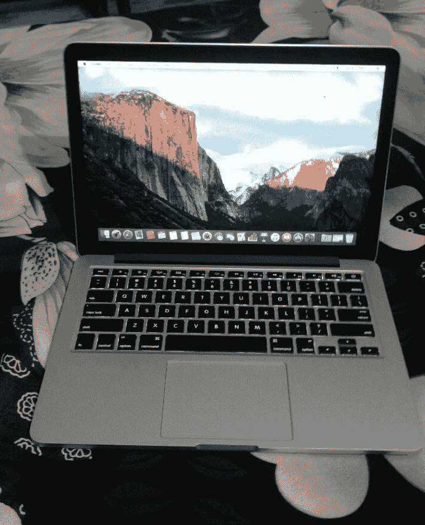
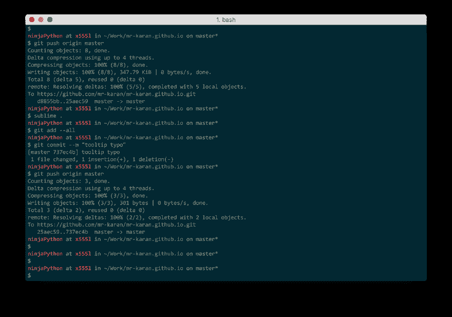
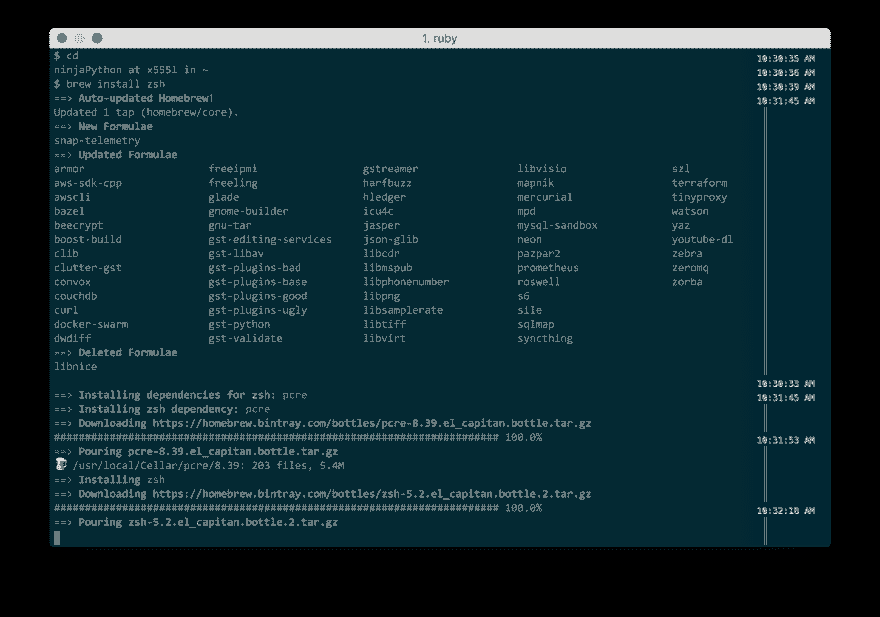
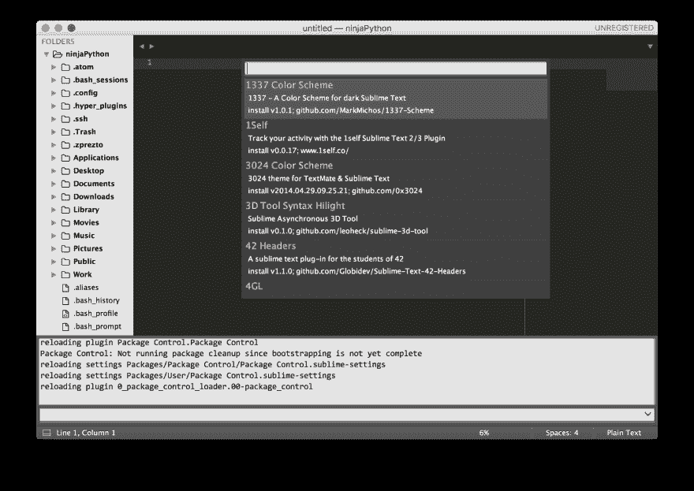
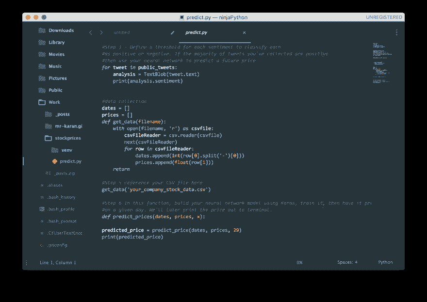

# 我在 Macbook 上的开发设置

> 原文:[https://dev.to/mrkaran/my-development-setup-on-a-macbook](https://dev.to/mrkaran/my-development-setup-on-a-macbook)

我最近购买了一台新的 13 英寸 Macbook Pro 2015(在苹果精彩的 keynote 之后),到目前为止非常喜欢它。这是我第一次体验 macOS。在严格使用 GNU/Linux 发行版大约 4 年后(Fedora、Ubuntu、Mint、Arch、Elementary OS)，我最终决定冒险使用 macOS。电池续航时间，出色的键盘和触控板，漂亮的显示屏让在上面编码成为一种真正享受的体验。这是我在笨重的惠普 Pavilion G6 上肯定缺少的东西。

[T2】](https://res.cloudinary.com/practicaldev/image/fetch/s--TmbBGX6h--/c_limit%2Cf_auto%2Cfl_progressive%2Cq_auto%2Cw_880/https://cdn-images-1.medium.com/max/1600/1%2A4cK7ZH4hBqLJvecS9e02EA.png)

在开始我的开发设置之前，我想说有很多这样的博客文章和指南可以让你的机器成为#ultimatedevmachine。这篇文章的目的不是这个，只是分享一些工具，我相信这些工具会让你的 macOS 体验更加完整。我个人将这个视为圣杯，但我将为你分解它，只包括最相关的东西，一个多面手开发者可以安装在她的笔记本电脑上，也不会使它变得臃肿。

## iTerm2

由于开发人员大部分时间都在修补终端上的东西，所以您应该做的第一件事就是用 iTerm2 替换 macOS 默认的终端。它有很多很棒的功能，你可以在这里阅读更多的内容。
我用的是日晒黑暗主题，可以在[这里](http://ethanschoonover.com/solarized)轻松下载。除此之外，还有一些其他的定制，我只是从这个[指南](https://github.com/nicolashery/mac-dev-setup#beautiful-terminal)中摘录的。

## 自制

这是每个开发人员都应该使用的基本包管理器。它通过下载最新的稳定版本，创建一个到`/usr/local`的符号链接和一些非常酷的功能，如直接从 PR 安装，使得安装其他软件包非常方便。你可以在这里阅读更多关于这些功能的信息。作为对我自己的一个学习练习，我将尝试为 [coala](https://coala.readthedocs.org/) 创建一个公式。

## zsh

如果不提到 zsh，任何关于终端的讨论都是不完整的。我已经使用 zsh 两年了，再也不能回到老学校了。我已经太习惯 zsh 了，以至于觉得几乎不可能再在 bash 上工作了。可以通过
`brew install zsh`
 安装 zsh

我也将`Prezto`与 zsh 一起使用，而不是流行的`Oh My Zsh!`,因为它在几个插件之后会非常慢。您可以遵循官方文档中的安装细节。
要更改默认主题，你需要在`~./zpreztorc`中编辑下面一行

`zstyle ‘:prezto:module:prompt' theme ‘powerline'`

主题名为。您可以使用查找所有主题名称

`prompt -l`

你可以在这里找到一个关于 zsh 所有事情的综合列表。

## 崇高的文字

作为一名开发人员，你还会花大量的时间和编辑在一起，因为他们是魔法发生的地方。我已经设置了我的崇高的文本，以最大限度地提高我的生产力，而编码。我使用下面的插件，但是首先为了安装它们中的任何一个，你需要[安装](https://packagecontrol.io/installation) Package Control，它是 Sublime Text 的包管理器。
在您设置了包控制之后，您可以验证它应该看起来像:

[T2】](https://res.cloudinary.com/practicaldev/image/fetch/s--_6wPOiSm--/c_limit%2Cf_auto%2Cfl_progressive%2Cq_auto%2Cw_880/https://cdn-images-1.medium.com/max/1600/1%2AngOH3TNldmqJk418wsInMA.png)

我使用的一些插件:

*   [侧边增强](https://github.com/SideBarEnhancements-org/SideBarEnhancements/tree/st3)
*   Emmet (一个伟大的时间节省者！)
*   [升华线](http://www.sublimelinter.com/en/latest/)
*   [颜色选择器](https://packagecontrol.io/packages/ColorPicker)
*   [支架打火机](https://packagecontrol.io/packages/BracketHighlighter)

我使用了[材质主题](https://github.com/equinusocio/material-theme),这真的在一定程度上美化了它。
T3T5】

# Vim

这些天我正在学习使用越来越多的 Vim，所以我将把这一部分作为一个 TBA，并将很快更新。

# macOS 应用程序

这些是我认为应该预装在任何 macOS 中的一些应用程序。

*   阿尔弗烈德
*   失眠
*   CleanmyMac3
*   全聚焦
*   尤利塞斯探测器
*   Android 文件传输
*   Cheatsheetapp
*   istat 菜单

到目前为止，我真的很高兴，但会继续添加工具或插件，我发现在去。我和我的 Mac 还在蜜月期，所以如果你认为我没有把你最喜欢的工具包括进来，对这篇文章不公平，发推特给我，我一定会检查的。
到那时，编码快乐！

这篇文章最初发表在我的博客上[这里](https://medium.com/@mrkaran/my-development-setup-7e767d33fc41#.epefeqil5)