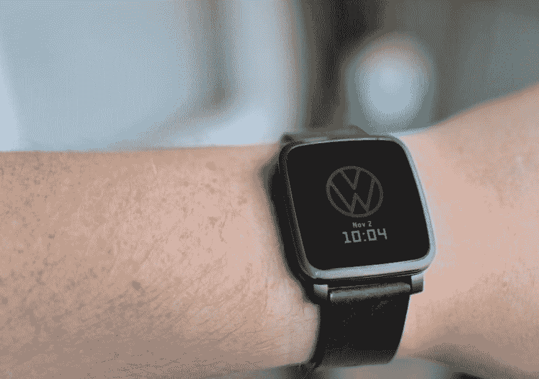
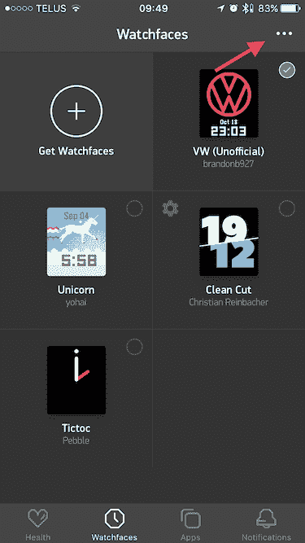
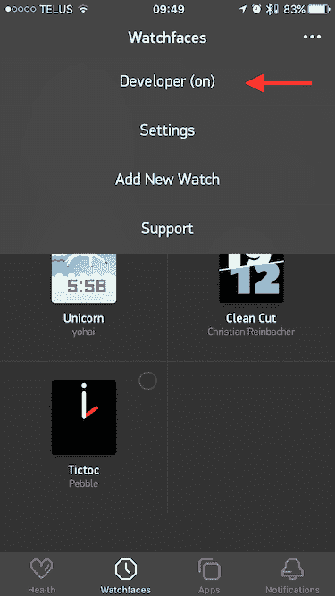
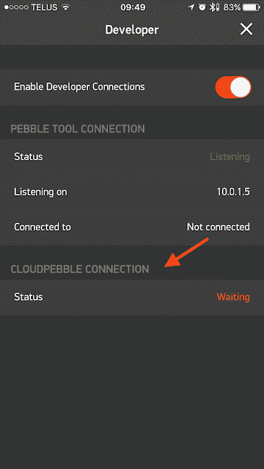

# Pebble SDK 和 Rocky.js 入门

> 原文:[https://dev . to/Brandon 927/getting-started-with-pebble-SDK-and-rocky js-2849](https://dev.to/brandonb927/getting-started-with-pebble-sdk-and-rockyjs-2849)

最后更新时间:2017 年 1 月 6 日

发表这篇文章一个月后， [Pebble 被 Fitbit](https://www.bloomberg.com/news/articles/2016-12-07/pebble-said-to-discuss-selling-software-assets-to-fitbit) 收购，如果你没有看到[我在 Twitter 上的反应](https://twitter.com/brandonb927/status/806518072970383361)，我会让你知道我对此很不高兴。Fitbit 发誓要确保[所有活跃的 Pebble 设备将在 2017 年](https://developer.pebble.com/blog/2016/12/14/first-steps-forward-with-fitbit/)继续运行，然而我对此持怀疑态度。

从 2016 年 12 月 8 日起，龙在这里。

————

**TL；博士**:我用 RockyJS 构建并发布了我的第一个 watchface，可以在 [Pebble 应用商店](https://apps.getpebble.com/en_US/application/58070ba89392ff32cf0002ce)上买到！我不介意你去那里给它一个大的老❤😁

该源代码也可以在 github 上找到。

* * *

我有一个 Fitbit Charge HR，但后来就不用了。想要别的东西，Pebble Time 设备似乎符合我的“想要和需要”清单。Pebble 的可攻击性、社区和生态系统吸引了我。我对最初使用黑白电子墨水显示屏的设备并不感冒，但当彩色电子墨水显示屏发布时，我开始喜欢上了它。

<source>
[](https://res.cloudinary.com/practicaldev/image/fetch/s--_kbj66gm--/c_limit%2Cf_auto%2Cfl_progressive%2Cq_auto%2Cw_880/https://dc1r9kxqg42ml.cloudfront.net/brandonb.ca/posts/my-pebble-time-steel.jpg) 

在得到我的 Pebble 之后，我开始寻找我能做些什么来开发它。通读文档时，我意识到我不愿意学习`C`语言来编写应用程序。`C`应用程序确实使用了一点点 Javascript，通过`PebbleKit`将其粘贴到手机应用程序上，但那只是一小块代码。幸运的是，你可以使用 [RockyJS](https://pebble.github.io/rockyjs/) 完全用 Javascript 编写 watchfaces。RockyJS 是一个用于构建嵌入式 [Javascript watchapps](https://developer.pebble.com/blog/2016/08/15/introducing-rockyjs-watchfaces/) 的开发框架。从最新的主要 Pebble 固件更新开始，现在有了一个在设备上运行 Javascript 的嵌入式引擎。这使得 RockyJS 构建的 watchapps 可以在 Pebble watch 上原生运行，而无需编译成 c。

## 先决条件

开始开发 RockyJS watchfaces 的唯一先决条件是对 Javascript 和 [Canvas API](https://developer.mozilla.org/en-US/docs/Web/API/Canvas_API) 有一点了解。您需要知道的其他一切都是额外的收获，您将在接下来的几节中看到原因。

RockyJS 背后的基本概念是:它抽象出了`canvas`的概念(因为你要渲染到一个固定的屏幕大小),而是为你提供了一个`context`对象来使用，这个对象填充了可用的 API 方法。然后从`context`对象中调用类似`ctx.arc`、`ctx.rect`等绘图命令。

正如你在下面的例子中看到的，RockyJS 是基于事件的，所以当某些事件触发时，比如`minutechange`或`hourchange`(在分钟和整点)时，它是最高效的。)

```
// The draw event is called when the watchface is initialized
rocky.on('draw', function (event) {
  // The draw event contains the context object that you use to draw to
  var ctx = event.context
  // Do stuff with the ctx object at this point
  ...
})

// When the minutechange event fires (every minute on the minute)
// request that rocky draws to the screen
rocky.on('minutechange', function (event) {
  rocky.requestDraw()
}) 
```

<svg width="20px" height="20px" viewBox="0 0 24 24" class="highlight-action crayons-icon highlight-action--fullscreen-on"><title>Enter fullscreen mode</title></svg> <svg width="20px" height="20px" viewBox="0 0 24 24" class="highlight-action crayons-icon highlight-action--fullscreen-off"><title>Exit fullscreen mode</title></svg>

## 入门

开发 watchfaces 有几条途径:

### 云卵石

如果你是新手， [CloudPebble](https://cloudpebble.net) 是一个很好的起点。这是目前唯一一款为所有 Pebble SDK 和平台内置仿真器支持的 Pebble IDE/编辑器。您甚至可以将您的*物理 Pebble 设备*连接到您的 CloudPebble 帐户，并在**实时将项目构建推送到您的手表上**。

[T2】](https://i.giphy.com/media/5XqGhjDB48YqA/giphy.gif)

在 iOS Pebble 应用程序中设置 CloudPebble 支持的过程如下:

<source>
[](https://res.cloudinary.com/practicaldev/image/fetch/s--L4sN6l0T--/c_limit%2Cf_auto%2Cfl_progressive%2Cq_auto%2Cw_880/https://dc1r9kxqg42ml.cloudfront.net/brandonb.ca/posts/pebble-app-1.png)

<source>
[](https://res.cloudinary.com/practicaldev/image/fetch/s--LC5elwm4--/c_limit%2Cf_auto%2Cfl_progressive%2Cq_auto%2Cw_880/https://dc1r9kxqg42ml.cloudfront.net/brandonb.ca/posts/pebble-app-2.png)

<source>
[](https://res.cloudinary.com/practicaldev/image/fetch/s--GXbGCG9B--/c_limit%2Cf_auto%2Cfl_progressive%2Cq_auto%2Cw_880/https://dc1r9kxqg42ml.cloudfront.net/brandonb.ca/posts/pebble-app-3.png)

一旦开启开发者模式，`CloudPebble Connection`将保持“等待”状态，直到您将它连接到您的 CloudPebble 帐户并将您的第一个项目通过手机推送到您的 Pebble 设备。

为此，前往 CloudPebble 和[创建一个账户](https://auth.getpebble.com/users/sign_up)。设置完成后，您可以创建新项目。确保`Project Type`被设置为`Rocky.js`。现在您可以在编辑器中开始编码了！

当您开始一个项目并在模拟器中正确构建后，您可以将构建文件部署到您的 Pebble 设备上。转到侧边栏中的`Compilation`，然后确保选择了`Phone`而不是`Emulator`。如果您已经正确配置了所有这些，您应该能够点击`Install and Run`。观看您的 pebble 设备加载您的 watchface，然后显示它！

### 局部发展

Pebble 有一个 SDK，你可以通过运行
用 [`brew`](http://brew.sh/) 下载

```
brew update && brew upgrade pebble-sdk && pebble sdk install latest 
```

<svg width="20px" height="20px" viewBox="0 0 24 24" class="highlight-action crayons-icon highlight-action--fullscreen-on"><title>Enter fullscreen mode</title></svg> <svg width="20px" height="20px" viewBox="0 0 24 24" class="highlight-action crayons-icon highlight-action--fullscreen-off"><title>Exit fullscreen mode</title></svg>

通过允许开发者使用 SDK 进行本地开发，你可以在本地计算机上做 CloudPebble 提供的同样的事情。SDK 附带一个仿真器，并允许您部署到您的物理 Pebble 设备上。您还有机会构建自己的构建步骤/过程，并在浏览器中使用 [pEmulator](https://github.com/blendsoul/pemulator) 。

在实体 Pebble 装置上安装 watchface 很简单:

```
pebble build
pebble install [--phone <IP ADDR>] 
```

<svg width="20px" height="20px" viewBox="0 0 24 24" class="highlight-action crayons-icon highlight-action--fullscreen-on"><title>Enter fullscreen mode</title></svg> <svg width="20px" height="20px" viewBox="0 0 24 24" class="highlight-action crayons-icon highlight-action--fullscreen-off"><title>Exit fullscreen mode</title></svg>

## 臭虫&问题

在撰写本文时，使用 RockyJS for watchfaces 存在一些错误/问题:

*   不支持的 web APIs，并且不是所有的`canvas`渲染上下文方法都可以在 RockyJS watchface 中使用，[检查这里的 API 奇偶校验](https://developer.pebble.com/docs/rockyjs/)
*   无法编写真正的“应用”，目前只支持 watchface 应用
*   现在使用 ECMAScript 是不可行的，transpiling 可能可行，但我还没有测试过

## 资源

目前还没有太多的资源可供 RockyJS 开发，所以选择余地很小。然而，这里有一些我发现非常有用的资源:

*   这个社区是一个加入和学习的好地方-[https://developer.pebble.com/community/online/](https://developer.pebble.com/community/online/)
*   [RockyJS watchface 教程](https://github.com/pebble-examples/rocky-watchface-tutorial-part1)
*   使用名为 [pEmulator](https://github.com/blendsoul/pemulator) 的浏览器内置 Pebble 设备仿真器(虽然不是真正的仿真器)进行本地开发