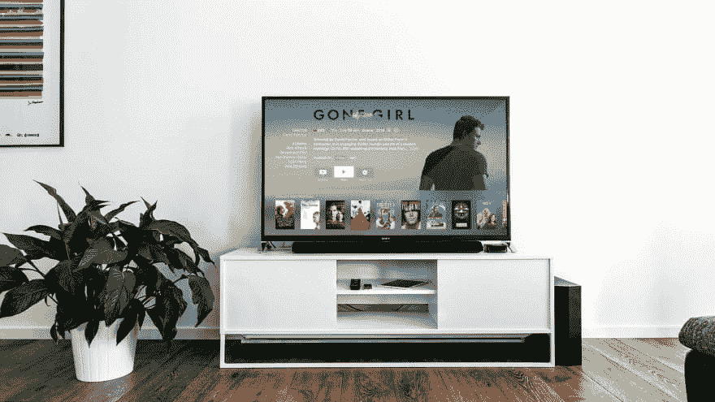

# 研究家庭服务器

> 原文:[https://dev . to/roelofjanelsinga/research-home-servers-a2f](https://dev.to/roelofjanelsinga/researching-home-servers-a2f)

[T2】](https://res.cloudinary.com/practicaldev/image/fetch/s--6zYyEe6p--/c_limit%2Cf_auto%2Cfl_progressive%2Cq_auto%2Cw_880/https://thepracticaldev.s3.amazonaws.com/i/onjbhinyqqzww9wc7396.jpg)

研究家庭服务器自从我在 2015 年 12 月得到一台 Raspberry Pi 2 以来，我一直对设置一台家庭服务器非常感兴趣，以便能够保存我所有的文件，并从我想去的任何地方访问它们。除了文件存储，我一直在寻找将它与我的 web 开发项目集成的方法。为此使用 Pi 2 是很棒的，尤其是能够使用 SSH 远程访问它，并使用 Git 在上面加载所有最新的文件。

因此，一个理想的家庭服务器应该能够为我做这两件事，文件存储和本地网站托管。此外，我将能够使用这个家庭服务器的视频流的目的。最初我是用我的 Raspberry Pi 来做这个的，这个在虚拟主机上工作得很好，但是在文件存储上就不那么好了。把我的外置硬盘连接到它上面，管理所有的文件夹并保持有序是一件很麻烦的事情。

一个解决方案以 FreeBSD 的形式出现在我面前，特别是 FreeNAS。这样，我可以简单地在闪存驱动器上安装操作系统(OS ),并从闪存驱动器启动整个系统，同时使用多个硬盘驱动器存储文件。看着 YouTube 上的指南和视频，我认为 4 个硬盘是这种设置的理想选择。我还需要足够的 RAM 内存和 CPU 能力，以便能够在 FreeNAS 上使用 ZFS 文件系统。这样，硬盘上的数据是安全的，以防 1 或 2 个硬盘停止工作。

不利的一面是，这个系统可能意味着它不如树莓派节能，但是哪个系统节能呢？我将不得不研究如何确保这个由 FreeNAS 构建的新系统快速、可靠，而且非常节能和低功耗。更多的帖子将会跟进，希望到那时，我对系统规格、我想使用的具体组件以及整个项目的估计成本有了更具体的想法。