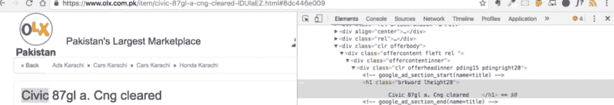

# 用 Python 和 Beautifulsoup 编写你的第一个 web scraper

> 原文：<https://dev.to/kadnan/write-your-first-web-scraper-in-python-with-beautifulsoup-p2b>

好了，我将在像[请求](http://docs.python-requests.org/en/master/)和[美丽组](https://www.crummy.com/software/BeautifulSoup/)这样的库的帮助下，用 Python 写一个最简单的网页抓取器。在我继续之前，请允许我讨论一下什么是 web/HTML 抓取。

## 什么是网页抓取？

据[维基百科](https://en.wikipedia.org/wiki/Web_scraping):

> web 抓取(web 收割或 Web 数据提取)是一种从网站中提取信息的计算机软件技术。这是通过直接实现超文本传输协议(网络的基础)或嵌入网络浏览器来实现的。

因此，使用抓取技术来访问网页中的数据，并使其用于各种目的(*例如:分析、聚合等*)。抓取并不是从网站或 web 应用程序中提取数据的唯一方法，还有其他方法可以达到目的，例如，使用应用程序提供的 API/SDK、RSS/Atom feeds 等。如果已经提供了这样的设施，刮擦应该是最后的手段，特别是当这个活动的[合法性](https://www.quora.com/What-is-the-legality-of-web-scraping/answer/Pablo-Hoffman?srid=CtoY)有问题的时候。

好了，所以我要用 Python 写刮刀了。Python 不是唯一可用于此目的的语言，几乎所有语言都提供了访问网页和解析 HTML 的方法。我使用 Python 的原因是我个人的选择，由于语言本身和可用库的简单性。

现在，我必须选择一些网页来获取所需的信息。我特意选了 OLX，我要刮的页面是广告的详情页之一，一个[汽车广告这里](https://www.olx.com.pk/item/civic-87gl-a-cng-cleared-IDUIaEZ.html#8dc446e009) ( *一个已经不存在的页面现在*)。

假设我要为 OLX 上的二手车建立一个价格比较系统。为此，我需要在我的数据库中有可用的数据。为此，我需要在本地数据库中定期提供数据。为了完成这项任务，我必须进入每个汽车广告的页面，解析数据并放入本地数据库。为了简单起见，我没有分别讨论抓取列表页面和每个条目的转储数据。

在[页面](https://www.olx.com.pk/item/civic-87gl-a-cng-cleared-IDUIaEZ.html#8dc446e009)上有一些对我的比价系统有用的信息:*标题*、*价格*、*位置*、*图片*、*所有者名称*和*描述*。

先抢标题吧。编写 web scrapper 的先决条件之一是你应该足够好地使用 web 浏览器中提供的 HTML Inspector，因为如果你不知道哪些标记或标签需要挑选，你就无法获得所需的数据。这个 Chrome [教程](https://www.youtube.com/watch?v=cnWL2d9bGPk)如果你之前没有用过 inspectors 应该会有帮助。好了，下面是广告标题的 HTML:

[](http://blog.adnansiddiqi.me/wp-content/uploads/2016/10/Screen-Shot-2016-10-10-at-1.55.40-PM.png)

<figcaption>*T6】*</figcaption>

 *正如你所看到的，这很简单，广告的标题是用 **H1** 标签和使用 css 类* *brkword lheight28 编写的。** 一件重要的事情:确保你可以尽可能缩小选择范围，尤其是当你选择单个条目时，因为如果你只是选择一个通用的 HTML 标签，那么这种标签很可能在页面上出现不止一次。H1 标签并不常见，但是因为我发现它们也指定了类名，所以我也选择了它，在这个特定的场景中，只有一个 H1 标签的实例，所以即使我选择了没有类的 H1 标签，我也能得到我需要的信息。

好了，现在我要写代码了。第一个任务是访问页面，检查它是否可用，然后访问它的 html。

```
import requests
from bs4 import BeautifulSoup

url = 'https://www.olx.com.pk/item/civic-87gl-a-cng-cleared-IDUIaEZ.html#8dc446e009'
headers = {
    'user-agent': 'Mozilla/5.0 (Macintosh; Intel Mac OS X 10_11_6) AppleWebKit/537.36 (KHTML, like Gecko) Chrome/53.0.2785.143 Safari/537.36'}

r = requests.get(url, headers=headers)

# make sure that the page exist

if r.status_code == 200:
    html = r.text
    soup = BeautifulSoup(html, 'lxml')
    title = soup.find('h1')
    if title is not None:
        title_text = title.text.strip() 
```

在这里，我通过使用 Python 的请求库来访问页面，你也可以使用其他像 [urllib](https://docs.python.org/3/howto/urllib2.html) 这样的库，但是因为我喜欢请求提供的简单性，所以我根本不寻找任何其他库。

页面被访问，我也在头中传递了 UserAgent。这不是强制性的，但经常发生的情况是，如果某些头没有与 Http 请求一起发送，站点就不会让您访问该页面。除此之外，坦白地让服务器知道你提供了一个用户代理，这也很好。

创建了 BeautifulSoup 对象后，我访问了 H1 标签。有多种方法可以做到这一点，但我主要依赖于`select()`方法，因为它允许你使用 CSS 选择器。这个很简单，所以我只使用了`find()`方法。更多细节请见 BS 文档网站。

你可能会想，为什么我要验证 H1 是否标记，而它明明就在那里。原因是，你对别人的网站没有控制权。他们可能会因为任何原因更改标记或站点结构，从而导致您的代码停止工作。因此，最佳实践是检查每个元素的存在性，如果存在，则进一步处理。它还可以帮助您记录错误，并向网站管理员或日志管理系统发送通知，以便尽快纠正问题。

一旦发现标题对象，我就获取它的文本，并使用 *strip()* 删除所有空白。永远不要相信从网站上获取的数据。你应该根据自己的需要经常清洗和改造它。接下来，我得到了位置，这类似于我对标题和价格所做的。

```
location = soup.find('strong', {'class': 'c2b small'})
    if location is not None:
        location_text = location.text.strip()

price = soup.select('div > .xxxx-large')
    if price is not None:
        price_text = price[0].text.strip('Rs').strip() 
```

在这里你可以看到我使用了 *select()* 方法，它被 CSS 选择器用来查找元素。我可以通过使用 *find()* 得到同样的结果，但是仅仅为了多样化，我选择了这个。select 返回一个列表元素，因为在选择器的情况下，多个元素可以满足标准。我挑选了唯一符合标准的元素并提取了价格。接下来，我选择了图片和描述的 URL

```
 images = soup.select('#bigGallery > li > a')
    img = [image['href'].strip() for image in images]

    description = soup.select('#textContent > p')
    if description is not None:
        description_text = description[0].text.strip()

# Creating a dictionary Object
item = {}
item['title'] = title_text
item['description'] = description_text
item['location'] = location_text
item['price'] = price_text
item['images'] = img 
```

最后我创建了一个字典对象。它不是抓取的一部分，只是为了以标准格式产生数据以供进一步处理，我创建了它。你也可以转换成 XML，CSV 格式。

该代码可在 [Github](https://github.com/kadnan/olxcar) 上获得

*本文原载[此处](http://blog.adnansiddiqi.me/write-your-first-web-scraper-in-python-with-beautifulsoup/?utm_source=dev_to_py_bs4&utm_medium=dev_to&utm_campaign=c_dev_to_py_bs4)T3】*

如果你喜欢这篇文章，那么你应该[订阅](http://eepurl.com/TZynf)我的时事通讯。*