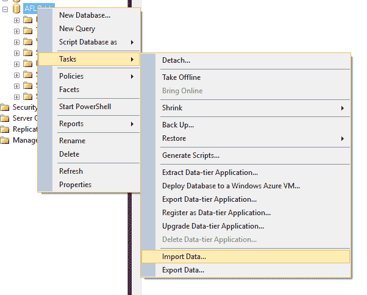
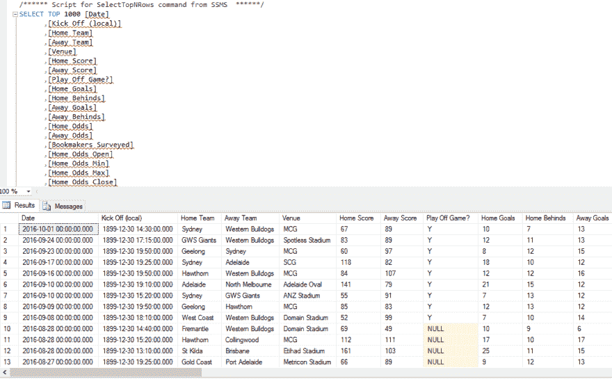
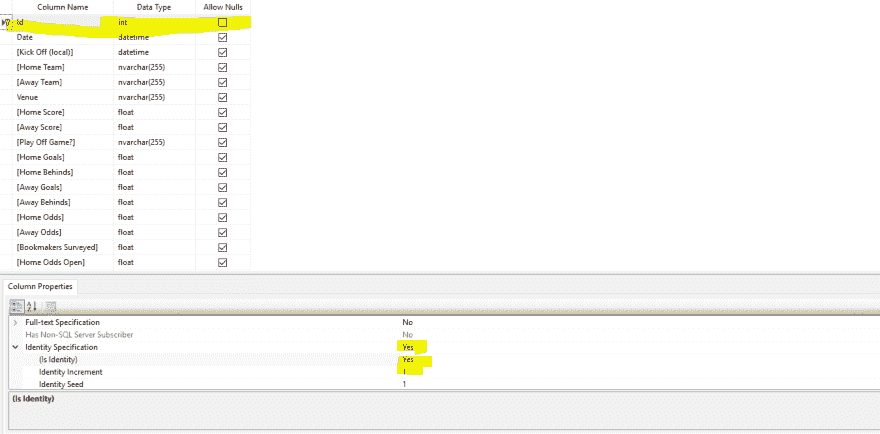
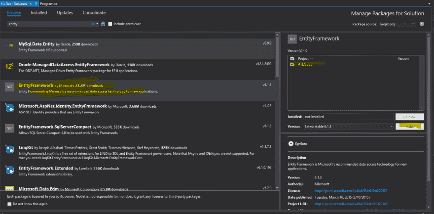
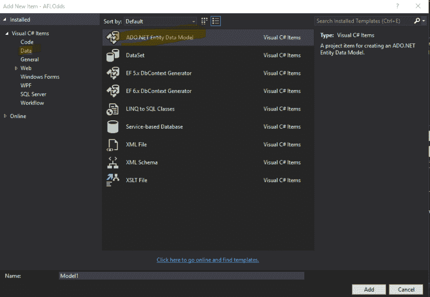
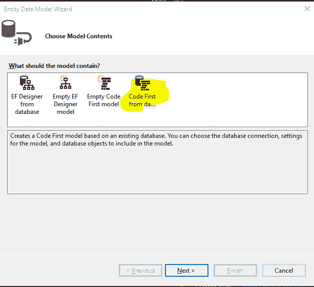
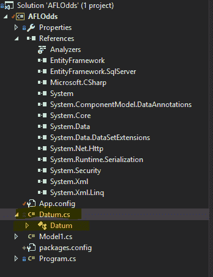
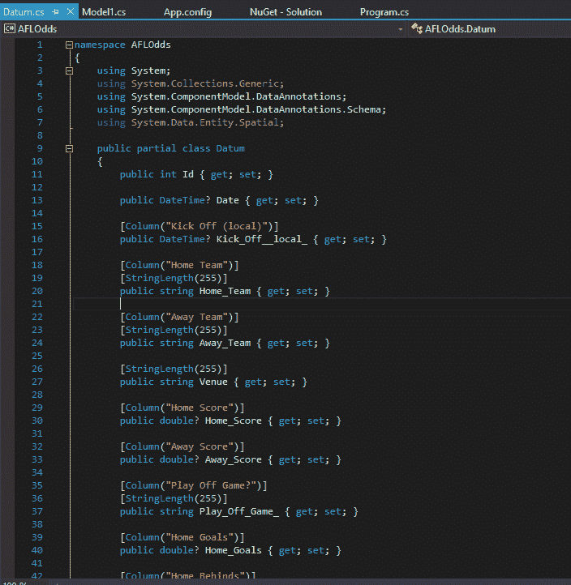

# 如何将 Excel 电子表格转换为实体框架解决方案的分步说明

> 原文：<https://dev.to/diskdrive/step-by-step-instructions-on-how-to-convert-excel-spreadsheet-to-entity-framework-solution-2i8j>

有时你有一些 Excel 数据，你想做的只是快速分析它。本文详细介绍了如何将数据快速导入到 SQL 数据库中，并获得一个映射到该数据库的实体框架模型，以便您可以按照自己喜欢的方式快速处理数据。

对于这个例子，我有一个自 2009 年以来所有 AFL 比赛及其各自赔率的电子表格。我是从这个链接得到这个数据的([http://www . aussports betting . com/data/historical-AFL-results-and-odds-data/](http://www.aussportsbetting.com/data/historical-afl-results-and-odds-data/))。

根据 excel 电子表格的不同，您可能需要稍微清理一下。在这个数据集的例子中，我必须删除第一行，因为它是一个额外的标题，使我的导入工具感到困惑。

1.  首先，使用 sql 导入数据工具将数据导入到 SQL 表中(如果表没有主键，您需要创建一个)

a.打开 SQL Server 并创建一个新数据库。我的将被称为一场赌博。

b.右键单击属性并选择导入数据

[T2】](https://2.bp.blogspot.com/-fClD5pQa_As/V_oxpKx927I/AAAAAAAApxg/vD4QSOiBaKwmIS81Q5n0Bk5lDOjYAJ0WACLcB/s1600/pic1.png)

c.在选择数据源中，选择 Excel 文件

d.在选择目的地中，找到您的数据库

e.在指定表复制或查询中–选择从一个或多个表或视图中复制数据

f.选择要复制的工作表

g.完成这个过程后，您应该会成功地看到创建了一个表。检查表中是否有数据。

[T2】](https://res.cloudinary.com/practicaldev/image/fetch/s--4TNYmWZM--/c_limit%2Cf_auto%2Cfl_progressive%2Cq_auto%2Cw_880/https://1.bp.blogspot.com/-oAC00jBJt_0/V_ox5yEkxjI/AAAAAAAApxk/GvB6vcMwTsw75dYw3Cm5hGaxOZmt4T6OgCLcB/s1600/pic2.png)

h.(可选)您可能需要实际添加一个主键。

[T2】](https://2.bp.blogspot.com/-Xw2JrGQiNzQ/V_oyTl5zrvI/AAAAAAAApxs/IQ1ILPjJ6Q005rHRBqvG4sRilH6-5rqOwCLcB/s1600/pic3.png)

1.  ```
     Create new visual studio solution 
    ```

2.  ```
     Add entity framework from nuget 
    ```

[T2】](https://4.bp.blogspot.com/-SPpXc7tekH8/V_oym3l-KLI/AAAAAAAApxw/ervbOH0TidIud3E0M8ua9hGr2A-5V5NPwCLcB/s1600/pic4.png)

1.  添加新文件-> ADO 实体数据对象

[T2】](https://2.bp.blogspot.com/-YQimEQeensM/V_ozNAO6flI/AAAAAAAApx4/LhnxEXe2SrkvMpgKtOd_eRmid6SMkSUEACLcB/s1600/pic5.png)

1.  首先从数据库中选择代码

[T2】](https://1.bp.blogspot.com/-HYws9Ke20Z8/V_ozW8NouCI/AAAAAAAApyA/nAO6EV9baHEsoHrLcxmgrviwWk9f7KNdwCLcB/s1600/pic6.png)

注意-如果它没有出现，您可能需要安装它[http://stack overflow . com/questions/22647674/code-first-from-database-template-not-showing-in-visual-studio-entity-data-mod](http://stackoverflow.com/questions/22647674/code-first-from-database-template-not-showing-in-visual-studio-entity-data-mod)

1.  找到您的数据库并选择您需要的所有表和视图。应该生成模型

[T2】](https://3.bp.blogspot.com/-xm6JkMsCKjQ/V_ozl0xV1HI/AAAAAAAApyI/Nus3Z0Dkmfw3re7QWqTlN13QRPFP8I8QACLcB/s1600/pic7.png)

[T2】](https://1.bp.blogspot.com/-XEorM9meiM8/V_ozmh92DMI/AAAAAAAApyM/jHhki9ftuH8bsV5OhSQEO3zdk-G0FzXxQCLcB/s1600/pic8.png)

7.您的解决方案现在可以连接到数据库。你可以粘贴一些类似下面的东西来测试它的工作。

静态 void Main(string[] args)

```
 {

        using (var db = new Model1())

        {

            var datums = db.Data.ToList();

            foreach (var rows in datums)

            {

                Console.WriteLine(String.Format("{0} vs {1}", rows.Home\_Team, rows.Away\_Team));

            }

        }

        Console.ReadLine();

    } 
```

Enter fullscreen mode Exit fullscreen mode

现在你可以使用实体框架和 LINQ 查询的能力来分析你喜欢的数据。