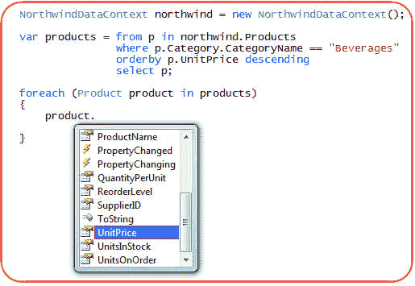

# LINQ

> 原文:[https://dev.to/funkysi1701/linq-5g67](https://dev.to/funkysi1701/linq-5g67)

[T2】](https://res.cloudinary.com/practicaldev/image/fetch/s--Yu2vxtlr--/c_limit%2Cf_auto%2Cfl_progressive%2Cq_auto%2Cw_880/https://storageaccountblog9f5d.blob.core.windows.net/blazor/wp-content/uploads/2016/10/step30.jpg%3Fw%3D515%26ssl%3D1)

### 什么是 LINQ？

**LINQ** 是语言集成查询的首字母缩写，描述了它的使用场合和用途。语言集成部分意味着 LINQ 是编程语言语法的一部分。特别是，C#和 VB 都是附带的语言。NET 并具有 LINQ 功能。

### 如何在我的 C#代码中使用 LINQ？

要使用 LINQ，您需要做的第一件事是添加 LINQ using 语句。

```
using System.Linq; 
```

<svg width="20px" height="20px" viewBox="0 0 24 24" class="highlight-action crayons-icon highlight-action--fullscreen-on"><title>Enter fullscreen mode</title></svg> <svg width="20px" height="20px" viewBox="0 0 24 24" class="highlight-action crayons-icon highlight-action--fullscreen-off"><title>Exit fullscreen mode</title></svg>

在你的代码中，你需要一个数据源，在这个例子中，我将使用一个简单的数组，但它可以是任何东西，如 SQL，XML 等

```
int[] data = new int[10] { 0, 1, 2, 3, 4, 5, 6, 7, 8, 9 }; 
```

<svg width="20px" height="20px" viewBox="0 0 24 24" class="highlight-action crayons-icon highlight-action--fullscreen-on"><title>Enter fullscreen mode</title></svg> <svg width="20px" height="20px" viewBox="0 0 24 24" class="highlight-action crayons-icon highlight-action--fullscreen-off"><title>Exit fullscreen mode</title></svg>

接下来，您需要一个 LINQ 查询。(注意，我知道 Q 在 LINQ 的意思是查询，所以我刚刚写了查询查询，如果你是那些讨厌看到密码的人之一，你可能不喜欢这篇博文。)LINQ 查询非常类似于 T-SQL 查询，所以如果你像我一样擅长数据库，这应该对你有意义。

在 T-SQL 中，可以有:

```
SELECT num
FROM data
WHERE num = 1 
```

<svg width="20px" height="20px" viewBox="0 0 24 24" class="highlight-action crayons-icon highlight-action--fullscreen-on"><title>Enter fullscreen mode</title></svg> <svg width="20px" height="20px" viewBox="0 0 24 24" class="highlight-action crayons-icon highlight-action--fullscreen-off"><title>Exit fullscreen mode</title></svg>

在 LINQ，这变成了:

```
var query =
from num in data
where num == 1
select num; 
```

<svg width="20px" height="20px" viewBox="0 0 24 24" class="highlight-action crayons-icon highlight-action--fullscreen-on"><title>Enter fullscreen mode</title></svg> <svg width="20px" height="20px" viewBox="0 0 24 24" class="highlight-action crayons-icon highlight-action--fullscreen-off"><title>Exit fullscreen mode</title></svg>

最后，您需要对您编写的查询做一些事情。我将把我的查询结果打印到控制台。

```
foreach (var num in query)
{
  Console.Write(num);
} 
```

<svg width="20px" height="20px" viewBox="0 0 24 24" class="highlight-action crayons-icon highlight-action--fullscreen-on"><title>Enter fullscreen mode</title></svg> <svg width="20px" height="20px" viewBox="0 0 24 24" class="highlight-action crayons-icon highlight-action--fullscreen-off"><title>Exit fullscreen mode</title></svg>

### 我还可以使用什么类似 SQL 的语法？

在 T-SQL 中，您可以使用 ORDER BY 来控制排序，LINQ 也有类似的语法 orderby

```
orderby num descending 
```

<svg width="20px" height="20px" viewBox="0 0 24 24" class="highlight-action crayons-icon highlight-action--fullscreen-on"><title>Enter fullscreen mode</title></svg> <svg width="20px" height="20px" viewBox="0 0 24 24" class="highlight-action crayons-icon highlight-action--fullscreen-off"><title>Exit fullscreen mode</title></svg>

在 T-SQL 中，你可以使用 GROUP BY，对 LINQ 做类似的事情

```
group num by num.Type into type
select type

foreach (var type in query)
{
  Console.Write(type.Key);
  foreach (var num in type)
  {
    Console.Write(num);
  }
} 
```

<svg width="20px" height="20px" viewBox="0 0 24 24" class="highlight-action crayons-icon highlight-action--fullscreen-on"><title>Enter fullscreen mode</title></svg> <svg width="20px" height="20px" viewBox="0 0 24 24" class="highlight-action crayons-icon highlight-action--fullscreen-off"><title>Exit fullscreen mode</title></svg>

### 归附

所以您认为连接表是 SQL Server 独有的功能。再想想你能在 LINQ 做这个

```
var joinquery =
from cust in customers
join prod in products on prod.CustomerId equals cust.Id
select new { ProductName = prod.Name, CustomerName = cust.CompanyName }; 
```

<svg width="20px" height="20px" viewBox="0 0 24 24" class="highlight-action crayons-icon highlight-action--fullscreen-on"><title>Enter fullscreen mode</title></svg> <svg width="20px" height="20px" viewBox="0 0 24 24" class="highlight-action crayons-icon highlight-action--fullscreen-off"><title>Exit fullscreen mode</title></svg>

### 结论

您可以使用更多的 LINQ 功能。在写这篇博客的时候，我找到了 https://code.msdn.microsoft.com/101-LINQ-Samples-3fb9811b，里面有很多你可以用 LINQ 写的不同查询的例子。

这启发了我在我的代码中更多地使用 LINQ，并学习更多关于可以编写的不同查询。