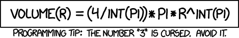

# 放在哪里。常数

> 原文:[https://dev.to/bmuskalla/wheretoput-constants-4obe](https://dev.to/bmuskalla/wheretoput-constants-4obe)

写软件的时候，有些对话会反复发生。多年来，我看到了解决同一个问题的不同方法，我想和你分享一下。其中一个对话是这样的，尽管答案可能会因团队或组件的不同而不同。

> 嘿，我这里有一些字符串文字，在代码评审中我被告知我应该把它们提取成常量。但是我该把它们放在哪里呢？

爱丽丝:啊，当然。只需将它们放入我们的 MyModuleConstants 类中。我们把所有的常量都放在那个类中，这样就很容易找到它们。

```
public class MyConstants {

  public static final String V0 = "v0";

  public static final String LABEL_STATUS_OPEN = "Open";

  public static final String UNUSED = "butNobodyWillKnow";

  public static final Long MAX_SIZE = 13498368L;

} 
```

<svg width="20px" height="20px" viewBox="0 0 24 24" class="highlight-action crayons-icon highlight-action--fullscreen-on"><title>Enter fullscreen mode</title></svg> <svg width="20px" height="20px" viewBox="0 0 24 24" class="highlight-action crayons-icon highlight-action--fullscreen-off"><title>Exit fullscreen mode</title></svg>

哦哦。固定课程，嗯？让我来分享一些我多年来发现的(和我自己使用的)模式，看看我们是否能以某种方式适应或改进现有的模式，何时以及如何使用常数…以及何时不使用。这有点像“远离常量的重构”。首先，我不会在这里谈论常量接口。请参考[第 17 项:只使用接口来定义类型](https://www.amazon.com/Effective-Java-2nd-Joshua-Bloch/dp/0321356683)为什么这是个坏主意。

首先，命名常数。很简单，对吧？一点也不。这就像命名类和方法一样困难，很难真正清楚地表达意图。否则，坏事就会发生。让我们来看看我们的第一个常数。

```
public static final String V0 = "v0"; 
```

<svg width="20px" height="20px" viewBox="0 0 24 24" class="highlight-action crayons-icon highlight-action--fullscreen-on"><title>Enter fullscreen mode</title></svg> <svg width="20px" height="20px" viewBox="0 0 24 24" class="highlight-action crayons-icon highlight-action--fullscreen-off"><title>Exit fullscreen mode</title></svg>

它似乎在定义某种版本号。假设我们的项目正在与第三方 API 交互，这似乎是他们 REST API 的版本号。现在，退一步说，为什么我们首先要提取常量？通常有两个原因:

*   为了使一个值的意图清晰([幻数](https://en.wikipedia.org/wiki/Magic_number_(programming)#Unnamed_numerical_constants)就是一个例子)
*   通过分解公共常量使代码更容易维护，以便将来可以轻松地更改它们

[T2】](https://res.cloudinary.com/practicaldev/image/fetch/s--jH2cI7Ws--/c_limit%2Cf_auto%2Cfl_progressive%2Cq_auto%2Cw_880/http://imgs.xkcd.com/comics/int_pi.png)

对于上面的例子，意图一点也不清楚。虽然我们可以猜测它是一个版本字符串，但我们不知道它应该如何使用。是不是所有的 API 调用都用同一个版本的 REST API？或者是为了确定我们是否正在使用需要一些特殊处理的 v0 版本？如果我们现在想升级到 REST API 的 v1，这并不像仅仅改变常量那么简单，因为其他代码可能依赖于这个确切的版本。如果没有正确的命名，人们倾向于在不同的场景中重用常量，而这些场景实际上需要两种不同的构造(目前可能恰好具有相同的值)。假设我们有上面的两个场景，我们稍微好一点的方法会是

```
public static final String REST_API_V0 = "v0";

public static final String REST_API_CURRENT = V0; 
```

<svg width="20px" height="20px" viewBox="0 0 24 24" class="highlight-action crayons-icon highlight-action--fullscreen-on"><title>Enter fullscreen mode</title></svg> <svg width="20px" height="20px" viewBox="0 0 24 24" class="highlight-action crayons-icon highlight-action--fullscreen-off"><title>Exit fullscreen mode</title></svg>

也不是很好。我们仍然试图使用一个公共前缀(REST_API)将常量组合在一起。通常，当你开始使用通用前缀时，这个群体通常会分担某种责任(参见这篇[论文](http://www.cse.ohio-state.edu/~rountev/presto/pubs/icsm07.pdf)和一个[研究原型](https://github.com/khatchad/Constants-to-Enum-Eclipse-Plugin)中的自动重构)。让我们试着把这些常数提取到它们自己的实体中。

```
public enum RestApiVersion {

  V0("v0"),

  V1("v1");

  private String apiPath;

  public static RestApiVersion getCurrentApiVersion() {
    return V1;
  }

  private RestApiVersion(String version) {
    this.apiPath = version;
  }

  private String getApiPath() {
    return apiPath;
  }

} 
```

<svg width="20px" height="20px" viewBox="0 0 24 24" class="highlight-action crayons-icon highlight-action--fullscreen-on"><title>Enter fullscreen mode</title></svg> <svg width="20px" height="20px" viewBox="0 0 24 24" class="highlight-action crayons-icon highlight-action--fullscreen-off"><title>Exit fullscreen mode</title></svg>

我认为主要的收获是人们倾向于混淆文字和幻数。虽然每个人都试图遵循“将幻数提取为常数”的重构，但他们倾向于将每个字面值都视为“幻数”。请注意，常量通常没有上下文，因此可能在不存在上下文的地方形成内聚。不过，这个例子并没有涵盖整个故事。一个好的副作用是，我们通过使用适当的类型(无论是 enum 还是具有 strategy 模式的类)获得了编译安全性。虽然枚举通常比常量更受欢迎，但是后退一步，看看是否需要一个“常量列表”,或者更高级的抽象是否更有意义。例如，如果需要动态地影响当前版本(例如，为了测试/模仿)或者如果需要处理不同的版本，我建议查看一下[策略设计模式](https://en.wikipedia.org/wiki/Strategy_pattern)，我将把它作为一个练习留给读者。

* * *

用常量定义常量是我见过很多次的另一种模式。以上面的 RestApiVersion 为例。下面是一个我见过很多次的稍微不同的化身:

```
public enum RestApiVersion {

  V0(MyConstants.REST_VERSION_V0), // no, no, no

  ....
} 
```

<svg width="20px" height="20px" viewBox="0 0 24 24" class="highlight-action crayons-icon highlight-action--fullscreen-on"><title>Enter fullscreen mode</title></svg> <svg width="20px" height="20px" viewBox="0 0 24 24" class="highlight-action crayons-icon highlight-action--fullscreen-off"><title>Exit fullscreen mode</title></svg>

这又回到了把每一个文字都当作一个神奇的字符串。将`REST_VERSION_V0`定义为一个单独的常量并没有额外的价值。事实恰恰相反。消费者如何通过仅仅使用`REST_VERSION_V0`常量本身来决定何时使用像`RestApiVersion`一样的适当的正面，何时使用“后门”。由于常量被公开为常量值，RestApiVersion 的维护者也没有机会动态地适应未来的需求。有了用适当的 API 建模的整个概念，我们就有机会在不破坏消费者的情况下改变实现。

* * *

每当你要创建一个*Constants 类的时候，后退一步，去散散步，或者和一个工程师同事喝杯咖啡。试着解释你为什么想要创建这样一个类，这是否真的是正确的抽象，或者你的组件的下一个工程师是否能够通过另一个抽象更容易地看到模式。有许多话题我们还没有触及。我们什么时候应该使用常量？带占位符的文字呢(我看着你 [MessageFormat](https://docs.oracle.com/javase/8/docs/api/java/text/MessageFormat.html) )。还有有什么工具可以检测未使用的常量吗？请在评论中告诉我。 <sup id="fnref:1">[1](#fn:1)</sup>

* * *

1.  最初发表于 [Tasktop 博客](https://www.tasktop.com/blog/where_to_put-constants/) [↩︎](#fnref:1)